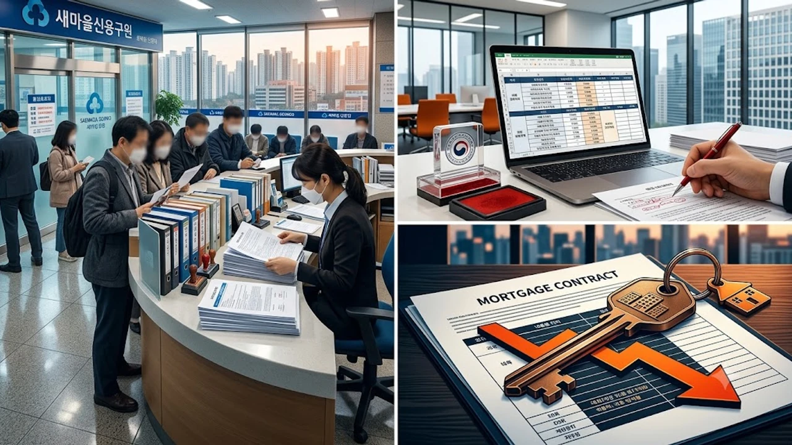

시중은행이 가계대출 총량을 억죄면서 2금융권 주담대로 수요가 쏠리는 풍선효과가 수치로 드러나고 있습니다. 1금융권 심사에서 탈락한 차주들이 상호금융과 보험사 창구로 몰려들자 금융당국도 2금융권 가계여신 전반에 대한 고강도 현장 점검에 돌입했습니다. 자금 조달 창구가 급격히 얼어붙는 현시점에서 실수요자가 직면한 실질적인 변화를 짚어봅니다.

## 은행 문턱 막히자 제2금융권으로 쏠린 대출 풍선효과의 실체

시중은행의 주택담보대출 한도 축소와 금리 인상이 맞물리면서 자금줄을 찾아 상호금융과 보험사로 향하는 발길이 폭증했습니다. 매매 잔금일이 정해진 상태에서 1금융권 대출이 가로막히자 대체 창구로 수요가 몰리는 현상이 가속화된 셈입니다.

### 1금융권 대출 중단 조치와 상호금융·보험사 창구 쏠림 현상

주요 시중은행들이 조건부 전세자금대출과 다주택자 생활안정자금대출을 닫아걸자 대출 대기자들은 농협, 신협, 새마을금고, 삼성화재 등 주요 2금융권으로 발걸음을 돌렸습니다. 은행권에서 산정 한도가 수천만 원 깎인 실수요자들까지 가세하면서 2금융권 상담 창구는 연일 대기 인원으로 북새통을 이루었습니다.

### 금융당국 가계부채 긴급 점검회의와 2금융권 관리 기조

금융위원회와 금융감독원은 가계부채 점검회의를 소집해 2금융권의 여신 증가세를 정조준했습니다. 1금융권을 틀어막아 발생한 대출 풍선효과를 그대로 방치할 경우 연간 총량 목표 관리가 완전히 실패한다는 판단이 깔려 있습니다. 금융당국은 2금융권에도 1금융권과 동일한 수준의 엄격한 자율 관리 지침을 요구하기 시작했습니다.

### 주요 단위농협·새마을금고의 취급 한도 조기 소진 현황

지방 및 수도권 주요 단위농협과 새마을금고 지점들은 이미 자체 배정된 월별·분기별 대출 총량 한도를 속속 소진하고 있습니다. 일부 조합은 신규 주택담보대출 접수를 잠정 중단하거나 타 지역 거주민 대상 여신 취급을 제한하며 방어벽을 세우기 시작했습니다.

## 제2금융권 주택담보대출 심사에서 당장 바뀌는 핵심 규제

2금융권이 여신 건전성 관리에 착수하면서 기존에 작동하던 완충 지대 역시 급속도로 축소되고 있습니다. 

### 다주택자 및 1주택자 생활안정자금 대출 한도 축소

2금융권 창구에서 가장 먼저 칼질이 들어간 항목은 주택담보대출을 활용한 생활안정자금입니다. 1주택자의 생활안정자금 연간 취급 한도를 기존 2억 원에서 1억 원 이하로 대폭 깎거나, 다주택자의 추가 주택 구입 목적 대출은 전면 유보하는 지침이 지점 현장에 전달되었습니다.

### 제2금융권 차주 단위 DSR 산정 기준과 만기 단축 압박

그동안 2금융권은 차주 단위 DSR 기준이 50%로 적용되어 1금융권(40%)보다 대출 한도에서 상대적 우위를 점했습니다. 그러나 DSR 산정 시 적용되는 대출 만기를 최장 40년에서 30년 이하로 축소하도록 유도하면서 체감 한도가 20% 이상 증발하는 상황이 현실화되었습니다. 자금 조달 계획을 다시 짜야 하는 실수요자라면 [2030 영끌 재점화, 전세 폭등 속 진짜 살까?](/posts/kr-realestate/young-generation-panic-buying-jeonse-spike-2026/)와 같은 시장 분석을 병행해 매수 시점을 냉정하게 재검토해야 합니다.

### 사업자 주택담보대출 우회 취급 방지 전수 조사 착수

개인사업자 주담대를 활용해 LTV 한도를 우회하던 관행에도 철퇴가 내려졌습니다. 금융당국은 사업자 등록 후 실질적인 매출이나 사업 영위 실적이 없는 차주에게 취급된 부동산 담보대출 전수 조사에 착수했습니다. 용도 외 유용이 적발될 경우 대출금 즉각 회수와 신용 제재가 뒤따릅니다.

## 시중은행 vs 제2금융권 주담대 조건 및 금리 현실 비교

창구를 옮기기 전 금리와 부대조건의 실질적인 득실을 면밀히 따져보아야 합니다.

### 1금융권과 상호금융·보험사의 금리 역전 및 실부담액 차이

시중은행의 인위적인 가산금리 인상으로 한때 보험사 주담대 하단 금리가 은행권보다 낮아지는 기현상이 발생했습니다. 하지만 2금융권 역시 조달 비용 증가와 총량 압박으로 가산금리를 즉각 올리면서 현재는 연 4%대 중후반에서 5%대 초반에 고착되었습니다. 표면 금리가 0.3%p 차이나더라도 대출 원금이 4억 원을 넘어가면 매월 수십만 원의 이자 격차가 발생합니다.

### 중도상환수수료 조건과 거치 기간 운영 방식의 차이점

상호금융과 보험사 상품은 1금융권 대비 중도상환수수료 부과 기간과 요율이 엄격한 편입니다. 은행권이 거치 기간을 사실상 폐지한 데 이어 2금융권 역시 원금 분할상환을 원칙으로 삼고 있어, 대출 실행 첫 달부터 원금과 이자를 함께 갚아야 하는 현금 흐름 압박을 사전에 계산해 두어야 합니다.

### 신용점수 하락 리스크와 향후 대환대출 가능 여부

2금융권에서 신규 주담대를 일으킬 경우 신용평가사(KCB·NICE) 점수가 은행권 대출 대비 30~50점가량 추가 하락할 위험이 존재합니다. 하락한 평점은 향후 1금융권으로 갈아타기를 시도할 때 금리 불이익으로 이어지므로, 브릿지 자금으로 2금융권을 쓴 뒤 대환하겠다는 구상은 한층 보수적으로 접근해야 합니다.

## 가계대출 총량 규제 속 실수요자를 위한 실전 대응 가이드

금융권 전반의 대출 창구가 동시에 닫히는 형국에서는 서류 검토 순서와 대체 수단 확보가 승패를 가릅니다.

### 입주 잔금 마련을 위한 분양권 잔금대출 사전 확인 체크리스트

신축 입주 단지의 경우 조합과 협약을 맺은 집단대출 은행의 한도 소진 속도를 일 단위로 체크해야 합니다. 특정 은행이 분양권 잔금대출 접수를 닫으면 2금융권 주관사로 신청이 급격히 쏠려 심사가 지연될 수 있습니다. 필요 서류는 발급일 기준 7일 이내 원본으로 사전에 3세트 이상 확보해 두는 편이 안전합니다.

### 정책모기지(디딤돌·보금자리론) 자격 재검토 및 대체 경로

일반 시중 자금이 막힐수록 주택금융공사와 HUG의 정책자금 자격 충족 여부를 재점검하는 것이 기본입니다. 소득 기준과 담보 주택 평가액 요건을 면밀히 대조해 정책모기지 편입 가능성을 따져보고, 빌라나 소형 주택 매수를 고려한다면 [청년미래보금자리론 4억 빌라 숨은 조건](/posts/kr-realestate/youth-future-bogeumjari-loan-villa-2026/)을 참고해 대출 실행 가능성을 교차 검증해야 합니다.

### 금융사별 여신 한도 소진 일정 파악과 차주별 자금 조달 순서

대출 접수 순서는 반드시 취급 한도가 살아있는 금융사부터 우선순위를 두고 병행 접수해야 합니다. 계약서 특약에 '대출 불가 시 계약 무효 및 계약금 반환' 조항을 관철하는 것이 계약금 몰취를 막는 핵심 방어선입니다.

대출 신청에 필요한 소득증빙 및 부동산 권리관계 서류를 분실 없이 보관하려면 [부동산 계약 서류 및 금융 바인더 기획전](https://www.coupang.com/np/search?q=%EC%84%9C%EB%A5%98%EB%B0%94%EC%9D%B8%EB%8D%94&sourceType=affiliate&trackingCode=AF8691300)을 확인해 잔금 전까지 단계별 서류를 체계적으로 편철해 두는 것이 권장됩니다.

#2금융권주담대 #주택담보대출규제 #상호금융대출 #DSR계산 #가계부채풍선효과 #새마을금고주담대 #보험사아파트대출