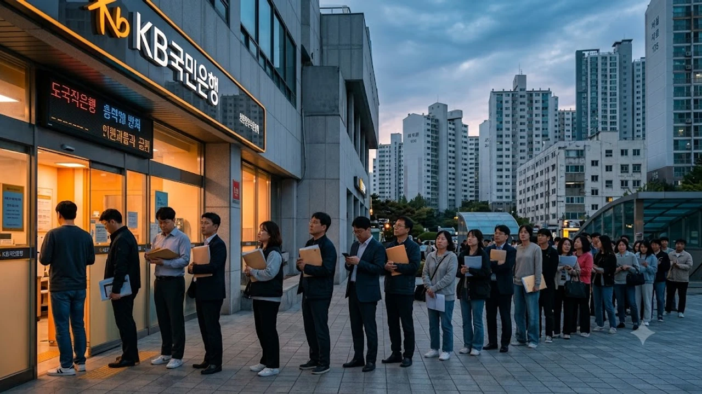

금융 당국의 강력한 가계대출 옥죄기와 고금리 기조 속에서도 **서울아파트** 매매가격이 83주 연속 상승세를 기록하며 시장의 예상을 완전히 깨뜨리고 있습니다. 유동성 규제 장벽을 둘렀는데도 수도권 주택 매수 심리가 좀처럼 꺾이지 않으면서 실수요자들의 내 집 마련 문턱은 한층 더 높아졌습니다.

## 대출 조여도 83주 연속 오른 서울 아파트값 실태

### 고강도 규제 속 주간 0.20%대 상승세 지속 현황
한국부동산원 통계에 따르면 9월 둘째 주 기준 서울 주간 아파트 매매가격 변동률은 0.23%를 기록하며 83주 연속 우상향 곡선을 그렸습니다. 대출 한도가 수천만 원 단위로 잘려 나가는 규제 폭탄 속에서도 강남 3구와 마용성(마포·용산·성동) 주요 대단지에서는 신고가 계약서 작성이 멈추지 않고 있습니다.

> "은행 창구 문턱을 높였지만 현금 여력이 풍부한 자산가와 갈아타기 대기 수요는 흔들리지 않고 있으며, 매물 품귀 현상까지 겹쳐 호가가 떨어지지 않는 기현상이 굳어졌다."

### 스트레스 DSR 확대에도 꺾이지 않는 거래 패턴
2금융권까지 죄어드는 스트레스 DSR 가산금리를 본격 적용했음에도 '거래 절벽 속 신고가' 흐름은 굳건합니다. 거래 건수는 직전 분기 대비 25% 이상 줄어들며 썰렁해졌지만, 집주인들이 매물을 급하게 던지지 않고 버티기에 돌입해 매도 우위 판세가 유지되고 있습니다.

- **거래량 축소**: 대출 한도 규제 직격탄을 맞은 중저가 단지의 거래 회전율 급감
- **신고가 유지**: 한강변 신축 및 핵심지 준신축을 축으로 수억 원 뛴 실거래 등장
- **매물 잠김**: 양도세 부담과 매수 대기층 대비 부족한 매도 물량으로 호가 고수

### 외곽 저가 단지와 중심지 고가 단지의 가격 동조화
중심부에서 시작된 가격 상승 열기는 노도강(노원·도봉·강북) 및 금관구(금천·관악·구로) 등 서울 외곽 지역으로 고스란히 옮겨붙었습니다. 마포래미안푸르지오 전용 84㎡ 실거래가가 치솟자, 자금력이 부족한 실수요층이 노원구 상계주공 재건축 단지나 성북구 길음뉴타운 일대로 밀려나며 외곽 아파트 가격의 하방 지지선을 끌어올렸습니다.

## 금리 인상조차 무력화된 진짜 원인은 무엇인가

### 시중에 누적된 풍부한 부동 자금 유입 구조
금리를 조여도 시중 M2(광의통화) 통화량이 4,000조 원을 웃돌며 갈 곳 잃은 유동성이 핵심 자산으로 쏠리고 있습니다. 주식 시장의 극심한 널뛰기에 지친 뭉칫돈과 법인 유보 자금이 '가장 안전한 실물자산'으로 꼽히는 서울 상급지 아파트로 지속 유입되는 구조입니다.

### 전세보증금과 갭투자 자본의 지속적 가격 하방 지지
빌라 기피 현상이 이어지며 임차 수요가 아파트로 쏠렸고, 그 결과 서울 아파트 전세가율이 60% 안팎까지 올라섰습니다. 치솟은 전세보증금이 대출 한도 축소분을 메워주는 완충재 역할을 하면서, 갭투자를 활용한 진입 통로가 완전히 차단되지 않았습니다.

보다 구조적인 수급 불안과 전세 시장 파급력은 [공급절벽 2026 아파트 시장, 진짜 전세가 매매가 밀어 올릴까](/posts/kr작성할 주제나 원문 내용을 알려주시면 요청하신 마크다운 코드블록 형식에 맞춰 작성해 드리겠습니다. 어떤 내용으로 작성을 원하시나요?