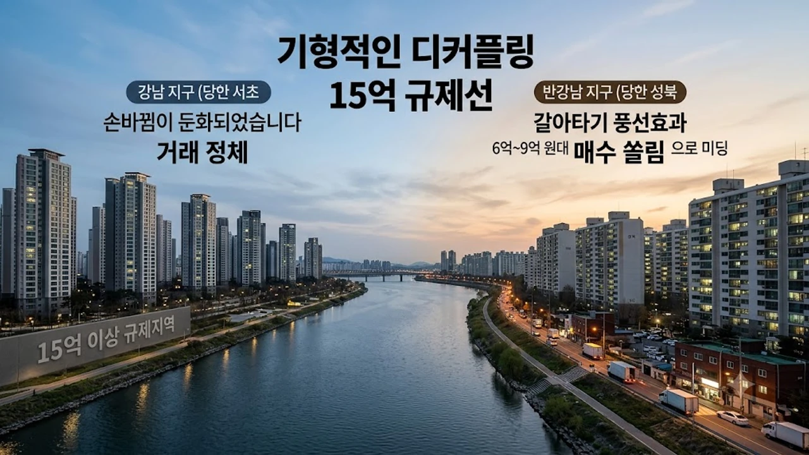

서울 아파트 시장이 역대 최장 상승 기록과 맞물려 기형적인 디커플링 국면에 진입했습니다. 고가 단지가 밀집한 강남권의 거래가 멈칫하는 사이 비강남권 중저가 단지가 시세를 끌어올리며 **서울 아파트값 양극화** 현상이 정점으로 치닫는 모양새입니다. 전세 매물 품귀에 따른 전세가율 상승 압박과 대출 규제가 맞물리면서 실수요자들의 매수 지도가 완전히 재편되었습니다.

## 15억 규제선과 대출 절벽이 가른 매수 쏠림

### 스트레스 DSR 여파와 한도 축소
금융권 가계부채 관리 기조로 가산금리가 상향 반영되면서 연 소득 8,000만 원 직장인의 주택담보대출 한도가 수천만 원씩 깎여 나갔습니다. 주담대 축소 충격을 자력으로 흡수하지 못하는 매수 대기자들은 자연스럽게 대출 문턱이 낮은 가격대로 눈높이를 낮췄습니다.

### 중저가 단지로 번진 갈아타기 풍선효과
대출 문턱이 높아지자 자금 여력이 빠듯한 수요층이 6억~9억 원대 단지로 선회했습니다. [2030 영끌 재점화, 전세 폭등 속 진짜 살까?](/posts/kr-realestate/young-generation-panic-buying-jeonse-spike-2026/) 분석에서 나타났듯, 전세금 폭등에 떠밀린 무주택자들이 노원·도봉·강북과 성북·동대문 일대 중저가 매물을 매수하면서 외곽 상승률이 상급지를 자극하는 형국입니다.

### 토지거래허가구역 묶인 초고가의 거래 정체
초고가 단지가 밀집한 강남 3구는 토지거래허가구역 규제와 고강도 자금출처 조사로 인해 손바뀜이 둔화되었습니다. 전세를 끼고 집을 매수하는 갭투자가 차단된 상태에서 세제 부담과 추가 규제 가능성을 저울질하는 관망세가 짙어졌습니다.

## 도심 신축 희소성과 공급 절벽이 부른 가격 격차

### 공사비 급등과 정비사업 일정 지연
원자잿값과 인건비가 가파르게 상승하면서 3.3㎡당 정비사업 공사비가 1,000만 원 안팎으로 치솟았습니다. 분담금 부담을 맞닥뜨린 주요 재건축 단지들이 시공사 선정 및 본계약 체결을 미루며 도심 공급 시계가 멈춰 섰습니다.

### 신축 선호 현상이 빚어낸 준신축 프리미엄
정비사업이 차질을 빚자 준공 5년 안팎의 준신축 단지로 매수세가 거세게 몰렸습니다. 주차난과 노후 배관 리스크가 있는 구축보다 즉시 실거주가 가능한 준신축 단지가 안전 자산으로 자리매김하면서 가격 방어력을 입증하고 있습니다.

### 인허가 착공 급감에 따른 2~3년 뒤 입주 가뭄
서울 시내 아파트 인허가와 착공 물량이 동반 감소세를 나타내면서 향후 2~3년 뒤 입주 가뭄이 가시화되었습니다. 신축 아파트의 공급 부족 우려가 커질수록 기축 준신축의 희소가치는 매매가 상승 압력으로 직결됩니다.

## 전세 시장 불안이 자극한 비강남 매수 불길

### 계약갱신청구권 만료와 전세보증금 폭등
임대차 2법 시행 4년 차가 지나면서 갱신계약이 만료된 전세 매물이 시세대로 풀려 전세 보증금이 급등했습니다. 보증금 증액분을 감당하기 어려워진 세입자들은 월세로 밀려나거나 차라리 매매로 돌아서는 선택을 내렸습니다.

### 빌라 전세 기피와 아파트 쏠림
전세사기 여파로 빌라·다세대 기피 현상이 이어지며 전세 수요가 아파트 시장으로만 쏠리고 있습니다. 아파트 전세 물량이 소진되자 전세가율이 60~70%를 웃도는 비강남권 구축 아파트부터 매매 전환이 빠르게 이뤄졌습니다.

### 임대차 불안이 촉발한 패닉바잉
전세 품귀가 이어지자 실수요자들은 전세 보증금에 일부 신용대출을 보태 내 집 마련을 결정하고 있습니다. 무주택 실수요자들의 불안 심리가 외곽 지역 아파트 거래량을 떠받치는 버팀목 역할을 하는 셈입니다.

## 양극화 장세에서 실수요자가 챙겨야 할 생존 전략

### DSR 상환 능력 중심의 자금 계획
대출 한도가 지속적으로 조여지는 국면에서는 무리한 차입보다 본인의 월 소득 범위 내 원리금 상환 여력을 먼저 점검해야 합니다. 상급지 추격 매수보다는 확실하게 감당 가능한 원리금 규모 안에서 실거주 가치를 따지는 냉정함이 요구됩니다.

### 입지와 연식의 압축 선택
가격 상승 국면에서는 인프라가 갖춰진 역세권 단지와 신축 위주로 선별 매수하는 안목이 필요합니다. 양극화가 심화될수록 하락장 방어력은 입지와 상품성에서 확연히 갈립니다.

부동산 자산 전략을 세울 때는 실거래가 데이터 확인과 함께 실내 주거 가치를 높이는 인테리어 정비도 실거주 만족도를 높이는 실질적인 방안입니다.

* [관련상품 쿠팡에서 보기](https://www.coupang.com/np/search?q=%EC%9D%B8%ED%85%8C%EB%A6%AC%EC%96%B4%20%ED%99%88%EA%B0%80%EA%B5%AC&sourceType=affiliate&trackingCode=AF8691300)

#서울아파트 #아파트값양극화 #스트레스DSR #신축아파트 #도심공급절벽 #전세시장 #부동산전략 #내집마련