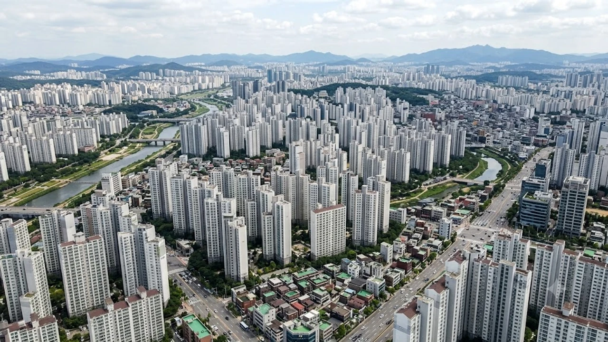

2026년 8월 1주 차 한국부동산원 조사 결과, **서울 아파트값 중구 중랑구**의 매매가격 상승률이 급등하며 강남권을 제치고 수도권 상승세를 이끄는 중입니다. 강남3구(강남·서초·송파)의 매수세가 소강 상태에 접어든 반면, 상대적으로 저평가되었던 강북권 중심의 **서울 아파트 매매 시장**으로 실거주 수요가 빠르게 이동하는 양상입니다. 대출 규제 강화와 세제 개편 움직임 속에서 나타난 이 단기 순환매 현상은 내 집 마련을 노리는 실매수자의 선택지를 전면 수정하게 만듭니다.

## 8월 1주 서울 집값 변동 추이와 강북권 반전 현황

### 강남3구 상승세 둔화와 비강남권 전이 흐름
한국부동산원이 발표한 8월 1주(8월 3일 기준) 주간 아파트 가격 동향을 보면, 서울 전체 매매가격 상승률은 0.26%로 전주(0.25%) 대비 폭을 넓혔습니다. 눈여겨볼 대목은 상승세를 주도하던 송파구(0.31%), 서초구(0.28%), 강남구(0.25%)의 오름세가 완만해졌다는 점입니다. 반면 그간 가격 반영이 더뎠던 비강남권 중저가 단지로 매수 온기가 급격히 번지고 있습니다.

### 중구·중랑구 주간 상승률 0.5%대 돌파 배경
이번 조사에서 서울 아파트값 중구(0.54%)와 중랑구(0.52%)는 서울 평균을 두 배 이상 웃도는 상승률을 기록했습니다. 중구는 신당동과 만리동 일대 준신축 대단지를 중심으로 키맞추기 거래가 터졌습니다. 중랑구 역시 묵동, 상봉동 등 역세권 대단지 아파트가 시세를 이끌며 강북권 전체 매매가를 밀어 올리는 동력이 되었습니다.

### 매매가격 지수 및 실거래 환산액으로 본 변화
국토교통부 실거래가 시스템을 확인하면 중구 신당동 'e편한세상신당' 전용 84㎡는 지난주 15억 2천만 원에 신고가를 찍으며 직전 최고가 대비 8,000만 원 이상 뛴 가격에 거래를 마쳤습니다. 중랑구 묵동 '브라운스톤' 전용 84㎡ 역시 9억 3천만 원에 계약서를 쓰며 9억 원 선을 가볍게 넘어섰습니다. 전세가격 상승이 매매가를 밑받침하면서 가격 하한선이 촘촘해진 결과입니다.

## 강남이 주춤한 사이 중구·중랑구가 뛴 진짜 이유

### 강남권 가격 피로감과 대출 규제 관망세
강남권 아파트값은 전고점을 넘어 사상 최고가를 바꿔 쓰며 단기 고점에 도달했다는 피로감이 쌓였습니다. 여기에 [바뀌는 스트레스 DSR 3단계 대출 한도 완전 정리](/posts/kr-realestate/stress-dsr-stage3-loan-limit-2026/) 정책에 따라 총부채원리금상환비율(DSR) 한도가 조여지면서, 고가 주택 매수를 위한 추가 자금 조달에 제동이 걸린 점이 결정타로 작용했습니다.

### 실수요가 집중되는 중저가 대단지 역세권 형성
금융 규제의 타격을 조율할 수 있는 9억~15억 원 사이 중저가 구간 아파트가 밀집된 중구와 중랑구가 대안으로 부상했습니다. 
- **중구:** 직주근접성이 뛰어난 도심권 업무지구(CBD) 배후 주거지로 실거주 편의성이 높습니다.
- **중랑구:** 동부간선도로 지하화 사업과 GTX-B 노선 착공 등 굵직한 교통 호재가 맞물려 투자 체감도가 급상승했습니다.

### 매매가와 전셋값 동반 상승이 만든 시너지 효과
서울 전역의 전세 품귀 현상이 장기화되면서 전세보증금 상승분이 매매가격과의 격차를 크게 좁혔습니다. 세입자의 주거 불안감이 한계에 달하자 [2030 영끌 재점화, 전세 폭등 속 진짜 살까?](/posts/kr-realestate/young-generation-panic-buying-jeonse-spike-2026/)를 고민하던 무주택 실수요자들이 전세가율이 높은 중구와 중랑구 일대 매매로 선회했습니다.

## 세제 개편 및 대출 환경이 중저가 아파트에 미치는 영향

### 실거주 중심 과세 체계 전환에 따른 매수세 이동
정부의 8·3 세제개편안 발표 이후 다주택자의 보유세 부담이 커지는 반면, 1주택 실거주자에 대한 혜택이 강화되는 방향으로 제도가 정비되었습니다. 이에 따라 불필요한 외곽 매물을 정리하고 알짜 1채에 집중하려는 '똘똘한 한 채' 선호 현상이 강북권 핵심 역세권 단지로 쏠리는 촉매가 되었습니다.

### 수도권 대출 한도 축소 이후의 자금 조달 현실
시중은행들이 주택담보대출 가산금리를 올리고 대출 문턱을 높이면서 무주택자가 조달 가능한 자금 한계선이 명확해졌습니다.
> **현장 중개업소 관계자 제언** > "대출 6억~7억 원을 안고 강남권에 진입하는 것은 상환 부담이 크지만, 중구·중랑구 일대 9억~12억 원대 아파트는 실거주 자금 계획을 세우기 수월해 문의가 쏟아집니다."

### 갭투자 축소 및 실거주 내 집 마련 수요 확산
전세 끼고 집을 사는 갭투자는 대출 규제와 실거주 의무 요건 탓에 입지가 좁아졌습니다. 그 결과 현재 시장을 이끄는 주체는 투기 수요가 아닌, 전세 만기를 앞두고 실거주 목적으로 주택을 매수하려는 실구매자들로 세대교체되었습니다.

## 향후 서울 아파트 시장 전망과 매수 대기자 대응 전략

### 강북권 상승세의 단기 순환매 여부 판단 기준
이번 **서울 아파트값 중구 중랑구** 급등세는 상반기 강남권 폭등에 따른 전형적인 '갭 메우기' 순환매 장세로 풀이됩니다. 거래량이 추세적으로 늘어나는지, 아니면 신고가 몇 건에 의존한 일시적 매물 잠김 현상인지 최소 2~3개월간 매매거래량 데이터를 계속 추적해야 합니다.

### 전세가율 상승에 따른 하방 지지력 검증
입주 물량 가뭄이 본격화된 2026년 하반기 부동산 시장 구조상, 전셋값 상승이 매매가를 밀어 올리는 현상이 지속될 확률이 큽니다. 매매가 대비 전세가 비율(전세가율)이 60~70% 이상을 유지하는 중랑구 및 중구 일대 단지들은 시장 변동성 속에서도 가격 하락 폭을 단단히 방어할 전망입니다.

### 실수요자를 위한 주택 유형별 매수 타이밍 안내
- **무주택 실수요자:** 대출 규제가 추가로 죄어오기 전, 도심 접근성이 우수한 10억 원 안팎의 역세권 대단지 위주로 급매물을 노리는 편이 유리합니다.
- **갈아타기 수요자:** 기존 주택 처분 조건과 양도소득세 비과세 요건을 점검한 뒤, 상급지 순환매가 넓어지기 전에 속도감 있게 움직여야 자금 부담을 낮춥니다.

#서울아파트값 #중구아파트 #중랑구아파트 #서울집값전망 #8월부동산시장 #강북권아파트 #서울아파트매매 #부동산대출규제 #전세가율 #실거주내집마련