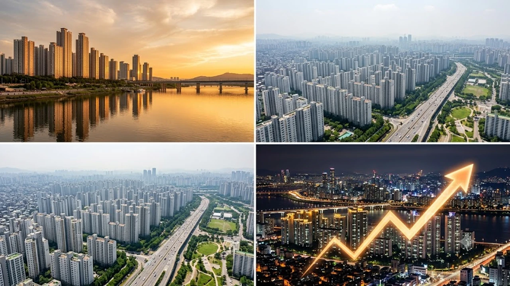

서울 아파트값이 대출 규제와 세제 개편안 논의 속에서도 관망세를 뚫고 다시 한번 오름폭을 키웠습니다. 한국부동산원이 발표한 2026년 8월 1주차 주간 동향에 따르면 서울 아파트 매매가격은 지난주보다 상승폭이 확대되어 시장의 매수 심리가 여전히 견고함을 입증했습니다. 특히 강남3구의 숨고르기 양상 속에서 상대적으로 진입 장벽이 낮거나 개발 호재가 있는 외곽 지역 및 강북권 주요 자치구가 상승세를 강력하게 견인하고 있습니다.

## 8월 1주차 서울 아파트값 매매 동향 및 특징

### 한국부동산원 주간 동향 분석 (0.26% 상승)

한국부동산원이 2026년 8월 6일 발표한 '2026년 8월 1주(8월 3일 기준) 주간 아파트 가격동향' 조사에 따르면, 서울 아파트 매매가격 변동률은 **0.26%**를 기록했습니다. 이는 지난주(0.25%) 대비 0.01%포인트 상승폭이 확대된 수치로, 2주 연속 상승세가 가팔라지는 흐름을 보이고 있습니다.

전국 평균 매매가격 상승률이 0.09%, 수도권이 0.17%인 점과 비교하면 서울의 집값 상승 에너지 수준이 확연히 높다는 것을 알 수 있습니다. 세제 개편 등 정책적 불확실성으로 인해 전체 거래량 자체가 폭발적으로 늘지는 않았으나, 선호도 높은 대단지와 재건축 추진 단지 위주로 신고가 거래가 이어지는 중입니다.

### 강남권 숨고르기와 강북·한강벨트 상승세

이번 주 서울 집값 흐름에서 가장 눈에 띄는 대목은 **강북권 14개 구의 평균 상승률(0.36%)이 강남권 11개 구(0.17%)를 두 배 이상 앞질렀다**는 점입니다. 서초구(0.02%), 강남구(0.01%), 송파구(0.15%) 등 강남 3구는 최근 급등에 따른 피로감과 단기 시세 부담으로 상승폭이 다소 둔화된 반면, 그동안 상대적으로 저평가되었던 지역으로 매수세가 가파르게 이동했습니다.

> **한국부동산원 관계자 총평:**
> "국지적인 관망 분위기 속에서도 재건축 추진 호재가 있거나 정주 여건이 우수한 대단지·역세권을 중심으로 매수 문의가 지속되며 전체적인 가격 상승폭을 확대했습니다."

### 전세 가격 지속 상승이 매매가에 미친 영향

서울 아파트 전세가격 역시 이번 주 **0.25%** 상승하며 매매가 못지않은 강세를 유지하고 있습니다. 신규 입주 물량의 가뭄과 매매 관망 수요의 전세 전환이 맞물리면서 전셋값이 끊임없이 올라 매매가격을 밑에서 받쳐주는 '갭 메우기' 장세가 본격화되었습니다. 

고금리와 둔화된 대출 여건에도 불구하고 전세보증금 상승이 매매 하한선 자체를 끌어올리는 구조가 만들어졌습니다. 이러한 수급 불균형에 따른 전세가율 상승은 [공급절벽 2026 아파트 시장, 진짜 전세가 매매가 밀어 올릴까](/posts/kr-realestate/supply-shortage-jeonse-caps-property-2026/) 분석 내용과 매우 유사한 궤적을 그리며 진행되고 있습니다.

---

## 서울 아파트값 상승폭 확대를 이끈 핵심 지역 3곳

### 중구·중랑구 등 15억 이하 단지의 급등세

이번 주 서울 전체 자치구 중 가장 높은 상승률을 기록한 곳은 **중구(0.54%)**와 **중랑구(0.52%)**입니다. 중구는 신당동과 황학동 일대의 교통 접근성이 우수한 대단지 위주로 매물이 소진되며 전주 대비 오름폭을 크게 늘렸습니다. 

중랑구 역시 신내동, 묵동 등 15억 원 이하 중저가 아파트 단지를 중심으로 실거주 목적의 거래가 몰렸습니다. 실수요자들이 고가 주택에 대한 대출 제한 및 세금 부담을 피해 대출 집행이 비교적 용이한 6억~12억 원 대 중저가 단지로 시선을 돌린 결과로 풀이됩니다.

### 성북구·노원구 중소형 아파트 거래 현황

강북권의 대표적인 주거 밀집 지역인 **성북구(0.49%)**와 **노원구(0.46%)**도 강한 상승 모멘텀을 형성했습니다. 성북구는 돈암동과 하월곡동 일대의 중소형 평형대를 중심으로 호가가 수천만 원씩 올라 거래가 이뤄지고 있습니다.

노원구는 상계동, 월계동의 노후 단지를 중심으로 재건축 기대감과 더불어 전세가율 상승에 따른 갭투자 성격의 매수세가 유입되었습니다. 서울 내에서 내 집 마련을 노리는 젊은 층의 매수 타깃이 이들 지역으로 몰리고 있는 모양새입니다.

| 자치구 | 8월 1주차 매매 변동률 | 주요 상승 주도 지역 및 특이사항 |
| :--- | :--- | :--- |
| **서울 중구** | **+0.54%** | 신당동·황학동 도심 접근성 우수 대단지 위주 상승 |
| **서울 중랑구** | **+0.52%** | 신내동·묵동 15억 이하 중저가 아파트 실수요 유입 |
| **서울 성북구** | **+0.49%** | 돈암동·하월곡동 중소형 평형대 위주 매물 소진 |
| **서울 노원구** | **+0.46%** | 상계동·월계동 재건축 추진 단지 및 갭투자 매수세 |

### 용산·마포 한강벨트 정비사업 기대감

한강변 핵심 입지인 **용산구(0.35%)**와 **마포구(0.31%)** 역시 단기 조정 없이 견조한 호가를 고수하고 있습니다. 용산구는 한남뉴타운 정비사업의 가시화 및 용산정비창 개발 이슈가 계속해서 상방 압력을 더하고 있으며, 마포구는 아현동·공덕동 일대의 준신축 대단지가 시세를 견인 중입니다.

이들 한강벨트 지역은 단순한 실거주 수요뿐만 아니라 자산 가치의 방어력이 뛰어나다는 평가를 받으며 자산가들의 대기 매수세가 촘촘히 얹혀 있는 구간입니다.

---

## 세제 개편안 관망세 속 매수 심리 자극 원인

### 정부 8.3 세제 개편안 발표와 시장의 실제 반응

최근 정부가 보유세 및 양도소득세 개편을 골자로 하는 종합 대책을 내놓았으나, 시장에서는 이를 '예상 범위 내의 조치'로 받아들이는 분위기입니다. 다주택자에 대한 일부 규제 완화와 1주택자 실수요 보호 방침이 동시에 나오면서, 시장의 불확실성이 해소되는 계기로 작용했습니다.

오히려 세제 불확실성으로 관망하던 대기 매수자들이 "더 이상의 파격적인 규제 강화는 없다"는 시그널로 해석하여 적극적으로 계약 체결에 나서는 반작용을 불러일으켰습니다. 보유세 산정 방식 개편에 대한 세부 내역은 [초고가주택 종부세 3배? 바뀌는 세법 핵심만](/posts/kr-realestate/ultra-expensive-home-jongbuse-tax-reform-2026/) 포스팅을 통해 구체적인 과세 기준을 점검해 보는 것이 좋습니다.

### 신규 주택 공급 부족 우려와 실거주 수요 쏠림

매수 심리를 극도로 자극하는 가장 근본적인 요인은 **향후 2~3년간 지속될 공급 가뭄**입니다. 서울 주요 재개발·재건축 현장의 공사비 갈등으로 인한 분양 연기와 착공 실적 감소가 가시화되면서 "지금 안 사면 신축 공급이 끊겨 더 오른다"는 불안 심리가 확산되었습니다.

- **인허가 및 착공 감소:** 건설자재 가격 및 인건비 급등으로 인한 사업 지연
- **청약 가점 인상:** 신규 분양 시장의 극심한 경쟁으로 인한 기축 아파트 전환
- **입주 물량 부족:** 서울 핵심권역의 2026~2027년 입주 예정 물량이 기형적으로 축소

### 대출 규제 속에서도 매매가가 오르는 자금 흐름

DSR 3단계 대출 한도 제한 등 금융 당국의 강력한 가계부채 관리 정책이 시행 중임에도 집값이 오르는 배경에는 자금의 양극화 현상이 자리 잡고 있습니다. 현금 동원력이 충분한 상급지 수요자들은 대출에 의존하지 않고 주택을 매수하는 반면, 중저가 지역에서는 신용대출과 기존 자산을 총동원한 실거주 매수가 활발합니다.

특히 금융권의 대출 문턱이 높아질수록 소득과 자산 기반이 탄탄한 매수자 위주로 시장이 재편되면서 거래량 대비 매매 단가 자체가 높아지는 기현상이 이어지고 있습니다. 대출 한도 계산법은 [바뀌는 스트레스 DSR 3단계 대출 한도 완전 정리](/posts/kr-realestate/stress-dsr-stage3-loan-limit-2026/)에서 세부 적용 기준을 확인할 수 있습니다.

---

## 향후 서울 부동산 시장 전망 및 매수자 대응 전략

### 하반기 금리 변화와 주택담보대출 변수

2026년 하반기 부동산 시장의 최대 변수는 **한국은행의 기준금리 인하 시점과 폭**입니다. 시장에서는 금리 인하 기대감이 이미 선반영되고 있으나, 실제 시중은행의 주택담보대출 금리가 내려갈 경우 미뤄졌던 3040세대의 매수세가 대거 유입될 가능성이 높습니다.

다만, 금융당국의 가계부채 총량 관리 기조가 서슬 퍼런 상태이므로 가산금리 조정을 통해 실질 대출 금리 하락 폭은 제한적일 수 있다는 점을 항상 염두에 두어야 합니다.

### 무주택자와 1주택자의 실질적인 매수 타이밍

현재 시장 상황에서 무주택자와 상급지 갈아타기를 노리는 1주택자의 접근 방식은 달라야 합니다. 

> **전문가 가이드:**
> 무주택자는 상승폭이 둔화된 강남권 반사이익 지역이나 이제 막 오름세를 탄 강북권 대단지 중 15억 이하 구간을 우선적으로 정조준하는 것이 유리합니다. 1주택자의 경우 기존 주택 매도가 先行되지 않으면 대출 한도 차질로 계약금을 날릴 위험이 있으므로 반드시 선매도 후매수 원칙을 준수해야 합니다.

실제로 최근 전세가율 상승을 발판 삼아 내 집 마련에 나선 청년층의 움직임에 대해서는 [2030 영끌 재점화, 전세 폭등 속 진짜 살까?](/posts/kr-realestate/young-generation-panic-buying-jeonse-spike-2026/) 글에서 시장 충격 여부를 상세히 다루고 있습니다.

### 지역별 양극화 현상에 따른 위험 관리 방법

서울 아파트 시장 전체가 오르는 것처럼 보이지만, 내면을 들여다보면 단지별·입지별 격차가 극심해지는 **양극화 장세**입니다. 나홀로 아파트나 입지가 떨어지는 노후 빌라, 나홀로 재건축 추진 구역은 하락장에서 환금성에 큰 문제가 생길 수 있습니다.

따라서 매수를 고려할 때는 반드시 역세권 도보 10분 이내, 500세대 이상 대단지, 학군 및 생활 인프라가 갖춰진 '핵심 자산' 위주로 포트폴리오를 구성하여 하방 리스크를 사전에 차단하는 전략이 시급합니다.

#서울아파트값 #한국부동산원 #부동산동향 #8월1주차집값 #강북구아파트 #중구아파트 #중랑구아파트 #전셋값상승 #부동산전망 #내집마련전략