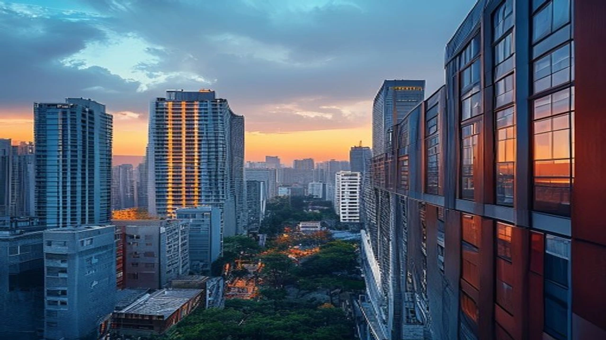

최근 수도권 분양가가 급격히 솟구치면서 **서울 아파트 청약** 당첨자 표정이 어두워졌습니다. 공사비 증액에 따른 분양가 인상과 강화된 가계대출 총량 규제가 맞물려 가점만 높아서는 계약서에 도장 찍기조차 불가능해진 탓입니다. 현금 동원력을 미리 따져보지 않았다가 당첨권을 날릴 수 있어, 무주택자들의 자금 조달 계산법도 바빠지고 있습니다.

## 서울 아파트 청약, 왜 지금 현금 7억~13억이 필요한가

### 최근 서울 주요 분양 단지 분양가와 대출 한도 비교
서울 주요 입지의 전용면적 84㎡ 분양가는 이미 15억~20억 원 선을 훌쩍 넘겼습니다. 반면 주택담보대출 규제와 총부채원리금상환비율(DSR) 한도는 단단히 죄어져 있어 실수요자가 손에 쥐는 대출금은 턱없이 부족합니다. 분양가 18억 원 단지를 예로 들면, 대출 가능액이 5억 원 안팎에 불과해 최소 13억 원의 순수 현금을 쥐고 있어야 입주까지 완주할 수 있습니다.

> **분양가 대비 필요 현금 체감 예시 (전용 84㎡ 기준)**
> * **총 분양가:** 18억 원
> * **최대 대출 한도:** 약 5억 원 (LTV 및 DSR 규제 적용)
> * **실제 필요한 순수 자본:** 약 13억 원 (취득세 및 옵션 비용 별도)

### 분양가 상한제 미적용 단지 분양가 급등과 현금 부족 사태
강남 3구와 용산구를 뺀 서울 대부분이 분양가 상한제 투기과열지구에서 묶임 해제되면서 분양가 고삐가 풀렸습니다. 원자재값과 인건비 인상분이 분양가에 그대로 전가돼 인근 구축 시세를 뛰어넘는 일도 흔합니다. 결과적으로 초기 계약금 10~20%와 중도금 자력 납부 부담이 눈덩이처럼 커졌습니다.

### 15억 초과 주택 대출 제한 규제가 실수요자에게 미친 영향
15억 원 초과 주택에 대한 시중은행의 대출 관리가 깐깐해지면서 고가 분양 단지의 대출 문턱은 더 높아졌습니다. 입주 시점에 집값 LTV를 꽉 채워 잔금을 치르려던 구상이 막히면서, 자산 기반이 취약한 2030 세대의 진입 장벽은 그 어느 때보다 견고해졌습니다. 세부적인 대출 구조는 [바뀌는 스트레스 DSR 3단계 대출 한도 완전 정리](/posts/kr-realestate/stress-dsr-stage3-loan-limit-2026/) 글에서 바로 파악할 수 있습니다.

## 청약 가점 높아도 포기하는 무주택자의 현실적 장단점

### 고가점 무주택 청약 당첨 시 확보되는 장기 시세 차익 이점
수년간 통장을 묵히며 어렵게 가점을 쌓은 무주택자에게 서울 입성 청약은 단연 강력한 자산 형성 사다리입니다. 입지 뛰어난 신축에 입주해 누리는 주거 쾌적성과 입주 후 형성될 시세 차익은 무시하기 힘든 매력입니다.

### 과도한 고금리 신용대출 및 영끌 자금 조달의 치명적 위험성
부족한 자금을 메우려 2금융권 신용대출이나 무리한 사채성 자금까지 끌어 쓰는 방식은 부작용이 크습니다. 고금리 환경에서 매달 돌아오는 원리금 상환액이 늘어나면 입주 후에도 견디지 못하고 급매물로 던져야 하는 부메랑으로 돌아옵니다.

### 현금 동원력 부족으로 인한 청약 통장 해지 및 전략 선회 추세
당첨 후 계약금을 내지 못해 자격을 박탈당하고 통장까지 날리는 허탈한 상황이 잇따르자, 차라리 통장을 깨고 기존 구축 매매나 전세로 선회하는 이들이 급증했습니다. 불확실성이 큰 시장일수록 [2026년 서울·수도권 부동산 전망, 지금 사야 하나 기다려야 하나](/posts/kr-realestate/seoul-realestate-outlook-2026/) 분석을 함께 검토하며 실질적인 매수 시점을 가늠할 필요가 있습니다.

## 현금 부족 실수요자가 선택한 실제 자금 조달 및 우회 경험

### 증여세 한도 내 부모님 차용증 작성 및 자금 출처 대비 사례
현장 수분양자들 사이에서는 법 테두리 안에서 부모 자금을 활용하는 방식이 보편화되었습니다. 성인 자녀 기본 공제 5,000만 원(혼인·출산 공제 별도)을 넘는 금액에 대해서는 적정 이자율(연 4.6%)을 적용해 정식 차용증을 쓰고 매달 이자를 계좌 이체해 세무서의 자금출처조사에 철저히 대비하는 양상입니다.

### 중도금 대출 연체 후 잔금 대출 전환 시 시세 감정가 활용법
일부 당첨자들은 중도금 납부 시 자금이 막힐 때 연체 이율을 감수하고 연체로 버틴 뒤, 입주 시점의 KB시세나 감정평가액을 높게 받아 잔금 대출로 한 번에 상환하는 배수진 전략을 쓰기도 합니다. 다만 이는 입주 시점 집값이 상승세여야만 작동하며, 하락장에서는 잔금 대출 한도가 줄어들어 계약 해지 위기로 직행할 수 있습니다.

### 서울 외곽 및 경기 수도권 신축 줍줍(무순위) 청약으로 선회한 실제 전략
서울 중심부의 높은 현금 벽을 확인한 이들은 무순위 청약이나 실거주 의무가 완화된 수도권 핵심 교통축(GTX 노선 인근)으로 시선을 빠르게 돌리고 있습니다. 자금 부담은 덜면서도 출퇴근이 용이한 신축을 선점하는 실용적인 우회로입니다.

## 내 현금 여력에 맞춘 2026년 하반기 청약 자금 계획 가이드

### Step 1: 분양가 대비 필요한 최소 순수 현금 비중 계산하기
청약 단지에 통장을 넣기 전, 보유한 순자산 중 즉시 현금화할 수 있는 실질 자금을 정확히 셈해야 합니다.

- **계약금(10~20%):** 당첨 후 2~3주 이내 즉시 납부할 수 있어야 함
- **중도금(60%):** 대출 실행 가능 여부와 자력 납부 회차 사전 점검
- **잔금(20~30%):** 입주 시점 주택담보대출 전환 예상액 산출
- **기타 비용:** 취득세(1.1~3.5%), 발코니 확장 및 옵션 비용 등 분양가의 약 5% 추가 확보

### Step 2: DSR 40% 적용 시 나의 실제 대출 가능 한도 조회 법
1금융권 DSR 40% 규제 체제에서는 연 소득 대비 연간 원리금 상환액 한도를 정확히 따져야 합니다. 이미 보유한 신용대출, 자동차 할부, 마이너스 통장이 있다면 주담대 한도가 대폭 깎이므로 청약 신청 전 기존 대출 정리나 단축 작업이 필수입니다.

### Step 3: 입주 시점 전세 퇴거 자금 및 잔금 조달 플랜 작성법
실거주 의무가 없는 단지는 전세를 놓아 보증금으로 잔금을 처리하려는 구상을 많이 합니다. 하지만 입주 물량이 한꺼번에 쏠리는 신축 단지 특성상 전세가가 일시 폭락하는 역전세난이 터질 수 있습니다. 보수적으로 예상 전세가의 70% 수준만 잡고, 모자란 금액을 채울 보완책을 반드시 세워두어야 안전합니다.

#서울아파트청약 #청약자금계획 #대출규제 #스트레스DSR #부동산청약 #분양가상한제 #내집마련 #실수요자대출