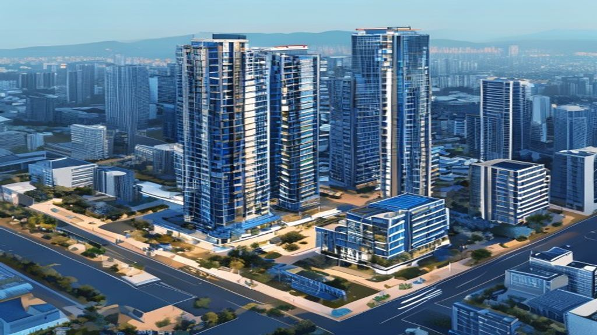

지금 사야 하나, 더 기다려야 하나. 서울 아파트를 놓고 이 질문을 반복하는 사람들이 2026년에도 여전히 많습니다. 금리가 조금씩 내려오고 있고, 공급은 여전히 부족하다는 말이 나오는 동시에, 경기 불확실성도 사라지지 않았습니다. 실수요자 관점에서 현재 시장을 냉정하게 읽어봤습니다.

## 2026년 서울 아파트 시장 현황

2024\~2025년 급격한 금리 인상 사이클이 마무리되고, 2026년 들어 한국은행이 기준금리를 단계적으로 인하하면서 부동산 시장에 변화의 기운이 감지되고 있습니다. 서울 핵심 지역을 중심으로 가격 회복세가 나타나고 있는 반면, 외곽 지역과 수도권 일부는 여전히 조정 국면이 이어지고 있습니다.

### 금리 인하와 매수 심리 변화

기준금리가 내려오면 대출 이자 부담이 줄어들고, 이는 잠재 매수자들의 심리에 긍정적으로 작용합니다. 2025년 말부터 주택담보대출 금리가 소폭 하락하면서 실수요자들의 문의가 늘어나고 있다는 게 현장 중개사들의 공통된 이야기입니다. 다만 금리 하락이 곧바로 가격 급등으로 이어지는 것은 아닙니다. 가계부채 관리 정책, 스트레스 DSR 등 대출 규제가 여전히 강하게 작동하고 있기 때문입니다.

### 서울 핵심 지역 vs 외곽의 양극화

강남, 서초, 송파, 용산, 마포 등 입지 프리미엄이 높은 지역은 수요가 견고해 가격 하방 경직성이 강합니다. 반면 경기도 외곽이나 서울 외곽 지역은 가격 회복이 더디게 진행 중입니다. 2026년 부동산 시장의 핵심 키워드는 양극화입니다.

## 공급은 부족한가, 충분한가

서울 아파트 가격이 수십 년째 우상향하는 가장 큰 이유 중 하나는 공급 부족입니다. 서울이라는 도시 자체의 물리적 한계, 재건축·재개발 규제, 건설 원가 상승 등 복합적인 요인으로 신규 공급이 수요를 따라가지 못하는 구조가 오래 지속되어 왔습니다.

### 2026\~2027년 입주 물량 점검

부동산 정보 분석 시 중요한 지표 중 하나가 향후 2\~3년의 입주 예정 물량입니다. 서울 내 입주 물량이 줄어드는 시기와 시장 회복이 겹치면 가격 상승 압력이 커집니다. 2026년 현재 서울 입주 예정 물량은 직전 호황기에 비해 감소한 수준으로, 중장기적으로 핵심 지역 공급 부족이 이어질 가능성을 시사합니다.

### 재건축 속도가 관건

강남권 주요 재건축 단지들의 사업 진행 속도가 시장 공급량을 크게 좌우합니다. 정비 사업 관련 규제 완화 여부, 공사비 협상 난항, 조합원 분쟁 등 여러 변수가 공급 타이밍에 영향을 미칩니다. 재건축이 빠르게 진행되는 단지와 지연되는 단지를 구분해 보는 눈이 필요합니다.

## 실수요자를 위한 2026년 접근 전략

투자 목적이 아닌 실거주 목적의 내 집 마련을 고민 중이라면 시장 타이밍보다 본인의 재무 상황과 생활 반경이 더 중요합니다.

### 대출 한도와 DSR 시뮬레이션 먼저

2026년 현재 스트레스 DSR이 적용되어 실제로 받을 수 있는 대출 한도가 과거보다 줄어들어 있습니다. 부동산 계약 전에 반드시 거래 은행에서 대출 가심사를 받아 자신의 한도를 파악해야 합니다. 예상 대출 한도, 이자 부담, 총 보유 비용을 합산한 월 지출이 소득의 40\~45%를 넘지 않는 선에서 예산을 설정하는 것이 안전합니다.

### 급매물과 경매를 노리는 전략

가격 조정 국면이 완전히 끝나지 않은 지금, 일부 지역에서는 아직 급매물이 나오고 있습니다. 경매 시장도 낙찰 경쟁률이 높아지기 전에 접근하면 시세 대비 합리적인 가격에 취득 기회를 얻을 수 있습니다. 다만 경매는 법적 리스크와 명도 문제가 있어 전문가의 도움을 받는 것이 좋습니다.

## 부동산 투자, 지금 이 시대의 원칙

부동산 시장의 완벽한 타이밍은 없습니다. 실수요자라면 자신의 거주 필요, 재정 여력, 생활 동선을 중심으로 결정하는 것이 장기적으로 후회 없는 선택이 됩니다. 단기 시세 차익보다 장기 거주 안정성을 우선에 두는 접근이 2026년 현재 가장 합리적인 전략입니다.

> [저출생 주거 정책과 청년 주거 지원](/posts/society/low-birth-housing-2026/)도 함께 읽어보세요.

**함께 읽으면 좋은 글**
- [2026년 전세 월세, 정부 정책 숨은 핵심 3가지](/posts/kr-realestate/2026-jeonse-wolse-policy-key/)
- [8월 세제개편 실거주 유예 조건 진짜 바뀌나?](/posts/kr-realestate/august-tax-reform-residence-exemption-extension-2026/)

#서울아파트2026 #부동산시장 #내집마련 #아파트매매 #한국부동산 #부동산전망 #서울부동산 #DSR대출