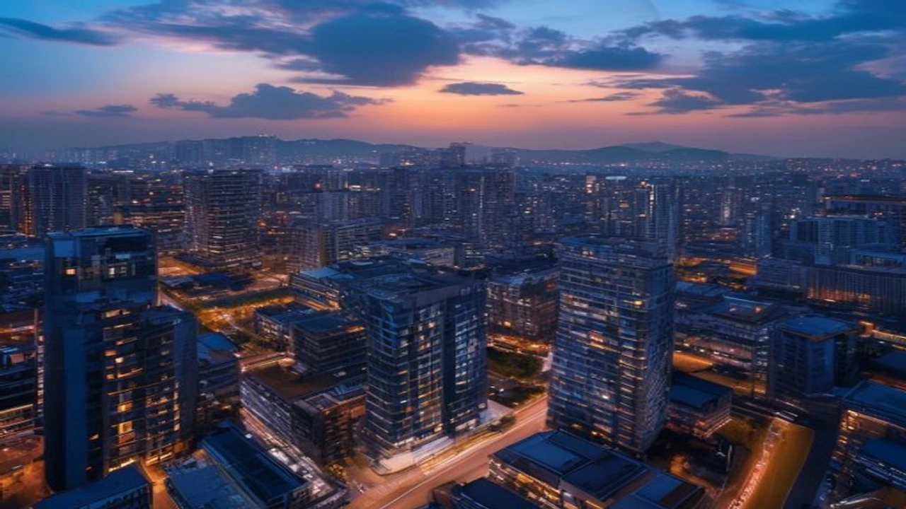

최근 **서울 아파트** 시장의 매매가, 전세가, 월세가 동시에 급등하는 트리플 강세가 장기화되면서 서민과 무주택자들의 주거비 부담이 한계에 다다르고 있습니다. 특히 평균 월세가 급격히 치솟는 임대차 시장의 대격변 속에서 각 개인의 자산 상황에 맞는 영리한 생존 전략이 필요한 시점입니다.

## 서울 아파트 '트리플 폭등'의 진짜 원인

### 매매·전세·월세 동시 상승을 이끄는 3대 공급 쇼크
부동산 시장의 공급 지표는 향후 가격을 결정하는 가장 확실한 잣대입니다. 서울 지역의 신규 입주 물량이 예년 평균 대비 반토막 난 상황에서 고금리 기조가 장기화되자 건축 원가가 급등했고, 이는 곧바로 신규 분양가 상승과 기존 주택 가격 밀어 올리기로 이어졌습니다. 수요는 여전한데 시장에 나오는 매물이 잠기면서 세 가지 지표가 동시에 치솟는 기현상이 발생한 것입니다.

### 빌라 포기와 아파트 쏠림 현상이 만든 임대차 시장의 왜곡
최근 수년부터 이어진 빌라 전세 사기 여파는 임대차 시장의 생태계를 완전히 파괴했습니다. 비아파트 주거 기피 현상이 심화되면서 아파트 임대차 수요가 비정상적으로 폭증했습니다. 

> "과거에는 보증금 보호가 상대적으로 용이한 빌라나 오피스텔로 분산되던 청년·신혼부부 수요가 이제는 무조건 외곽의 소형 아파트라도 가겠다는 기조로 바뀌었습니다. 이 쏠림이 아파트 전월세를 밀어 올리는 핵심 불쏘시개입니다." (부동산 리서치 센터 분석)

### 하반기 입주 물량 지표로 본 추가 상승 가능성
국토교통부의 주택 통계에 따르면 올해 하반기 서울 아파트 예정 입주 물량은 평년 기준치에 한참 못 미치는 수준입니다. 정비사업 규제 완화 효과가 실제 입주로 이어지기까지 최소 3~5년이 걸린다는 점을 감안하면, 당장 눈앞에 닥친 공급 가뭄은 하반기에도 임대차 가격을 추가로 자극할 가능성이 큽니다.

## 월세 150만 원 시대, 월세 전환과 전세 유지의 득실 계산

### '월세살이'의 장단점: 기회비용 확보 vs 전세 자금 잠김
월세 선호 현상이 강해지면서 서울 주요 입지의 전용 59㎡ 아파트 월세가 150만 원을 훌륭히 넘어섰습니다. 매달 생돈이 나간다는 치명적인 단점이 존재하지만, 보증금을 크게 낮춤으로써 확보한 여유 자금을 주식이나 금융 상품에 투자해 자산 유동성을 확보할 수 있다는 이점도 있습니다. 기회비용을 굴릴 능력이 있다면 월세가 자산 형성의 징검다리가 되기도 합니다.

### '전세 유지'의 위험과 기회: 보증금 미반환 리스크 vs 주거 안정성
반면 전세 계약은 매달 고정적으로 지출되는 주거비가 적어 자산 축적 속도를 높이는 데 유리합니다. 하지만 매매가 대비 전세가 비율인 전세가율이 70%를 돌파하는 단지가 늘어나면서, 향후 집값 하락 시 보증금을 제때 돌려받지 못하는 역전세나 깡통전세 위험성을 늘 염두에 두어야 합니다. [관련 글 보기](/posts/kr-realestate/)

### 전월세 전환율 5.5% 돌파에 따른 세입자 유형별 유리한 선택 가이드
한국부동산원 집계 결과 서울 아파트의 평균 전월세전환율이 5.5%를 넘어섰습니다. 시중 은행의 전세대출 금리가 이보다 낮다면 전세를 유지하는 것이 비용 측면에서 이득입니다. 반면 신용대출까지 끌어 써야 하거나 고금리 다중채무를 지고 있다면, 차라리 보증금을 낮추고 월세로 전환해 이자 부담의 변동성을 차단하는 편이 현명합니다.

## 폭등장에서 살아남기 위한 무주택자 맞춤형 주거 사다리 전략

### 단계별 주거 상향 가이드: 청약 홈 개편 활용부터 생애최초 대출까지
무주택자가 주거 안정을 이룰 최선의 통로는 여전히 분양 시장입니다. 최근 개편된 청약 제도는 맞벌이 부부의 소득 기준을 완화하고 신혼부부 특별공급 기회를 넓혔습니다. 이와 함께 디딤돌대출이나 생애최초 주택구입자 자금 지원 제도의 LTV 80% 한도를 적극 활용해 진입 장벽을 낮추는 절차를 숙지해야 합니다.

* **1단계:** 청약 홈 개편 사항 확인 및 가점 계산
* **2단계:** 소득 기준에 맞는 정부 정책 금융 상품(디딤돌·보금자리론) 매칭
* **3단계:** 자금 조달 계획서 작성을 위한 최소 현금 비중 확보

### 주목해야 할 서울 및 수도권 중저가 대체 주거지 분석
가용 자금이 부족하다면 강남권이나 마용성 등 초고가 지역만 바라볼 필요가 없습니다. 서울 외곽 지역인 노도강(노원·도봉·강북)이나 금관구(금천·관악·구로) 지역의 20평대 구축 아파트 중에서 역세권 입지를 갖춘 매물들은 전세가율이 높아 갭투자나 실거주 목적의 매수 진입 장벽이 상대적으로 낮습니다. 경기 성남, 하남, 고양 등 서울 접근성이 우수한 신축 단지들도 훌륭한 대안입니다.

### 고정 주거비를 줄이고 자산을 증식하는 자금 배분 포트폴리오 설계
소득의 30% 이상을 주거비로 지출하는 것은 장기적인 자산 형성에 치명적입니다. 월세나 대출 이자로 나가는 고정비를 줄이기 위해 중소기업 청년 전세대출이나 버팀목 자금 같은 저리 상품을 우선 조회해야 합니다. 아낀 주거비는 반드시 미국 배당주나 국내 우량주 등 정기적인 현금흐름을 창출하는 자산에 재투자하여 자산 성장 속도를 집값 상승세와 맞추어야 합니다.

## 실제 서울 아파트 갈아타기 및 계약 현장 속사정

### "전세금 올려주느니 월세로" 현장에서 만난 30대 직장인의 선택
마포구의 한 전세 아파트에 거주하던 30대 중반 직장인 김 씨는 최근 재계약을 앞두고 집주인으로부터 전세금 8,000만 원 증액 요구를 받았습니다. 추가 대출 이자를 계산해 본 김 씨는 결국 보증금을 동결하는 대신 차액을 월세로 전환하는 반전세 계약을 맺었습니다. 목돈을 추가로 대출받아 은행에 이자가 내느니, 깔끔하게 매달 고정 비용을 통제하겠다는 판단이었습니다.

### 마포·성동구 중개업소가 전하는 임대인과 임차인의 치열한 눈치싸움
성동구 옥수동의 공인중개사 대표는 최근 임대차 시장 분위기를 '폭풍 전야의 눈치싸움'으로 요약합니다. 임대인들은 임대차 2법의 계약갱신청구권 만료 시점이 도래함에 따라 향후 4년간 올리지 못할 비용을 감안해 첫 계약 시 시세보다 높은 가격을 고수합니다. 반면 임차인들은 급등한 가격에 기겁하며 외곽으로 밀려나거나 아예 반전세를 역제안하는 양상이 매일 벌어집니다.

### 계약서 쓰기 전 반드시 확인해야 할 독소 조항 방어 팁
계약서 서명 전 특약사항을 정교하게 작성하는 일은 주거 자산을 지키는 핵심 방어선입니다. 최근에는 임대인의 세금 체납으로 인한 압류 리스크가 빈번하므로, '계약 체결 후 잔금 지급 다음 날까지 등기부등본상 어떠한 권리 변동도 없는 상태를 유지한다'는 조항을 반드시 명시해야 합니다. 전세보증보험 가입이 거절될 경우 계약을 무효로 하고 전액 반환한다는 문구를 포함하는 것도 필수적인 절차입니다.

#서울아파트 #부동산트렌드 #월세시대 #임대차시장 #전세가폭등 #주거비부담 #부동산전략 #내집마련 #부동산재테크