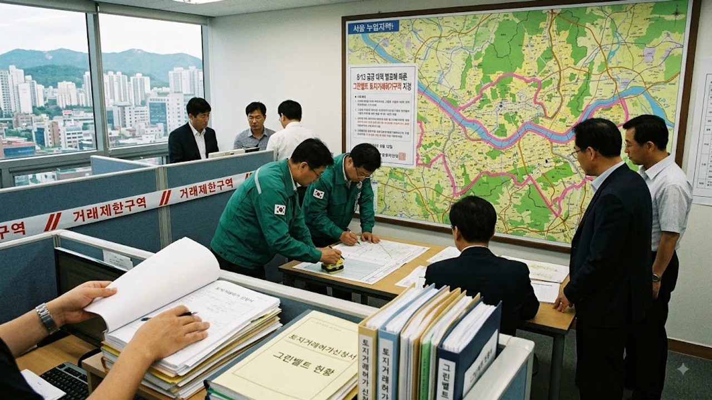

정부가 대규모 수도권 주택 공급을 목표로 **서울 그린벨트 해제** 카드를 꺼내 들면서 부동산 시장이 요동치고 있습니다. 국토교통부는 서울시 내 개발제한구역 전역을 토지거래허가구역으로 묶으며 속도전을 예고했으나, 서울시가 공식 합의 사실을 부인하며 8·13 대책 발표 직후 정책 혼선이 빚어지는 양상입니다. 수도권 주택난 해소라는 명분과 환경 보호 및 녹지 축 보전이라는 지자체 명분이 정면으로 충돌하면서 투자자와 실수요자 모두 정책 실현 가능성에 촉각을 곤두세우고 있습니다.

## 8·13 공급 대책 발표와 그린벨트 토지거래허가구역 묶기

### 전격적인 규제 지정 배경
국토교통부는 2026년 8월 13일, 수도권 선호 입지에 주택 공급 물량을 확보하기 위해 서울 시내 개발제한구역 전역(약 149.09㎢)을 토지거래허가구역으로 지정했습니다. 택지 후보지 발표 전부터 나타날 수 있는 기획부동산의 지분 쪼개기 투기와 토지 가격 급등을 사전에 차단하겠다는 조치입니다.

- **대상 지역**: 서울 내 19개 구에 걸친 개발제한구역 전체
- **규제 강도**: 일정 면적을 초과하는 토지 거래 시 관할 구청장의 허가 필수, 실거주·실경작 의무 부여
- **적용 목적**: 대규모 공공택지 후보지 지정 전 투기 세력 유입 원천 차단

### 유력 후보지로 거론되는 강남권 일대
시장에서는 주택 수요가 집중된 강남권(서초·강남·송파)의 보전가치가 낮은 3등급 이하 그린벨트가 우선 해제 대상이 될 것으로 내다보고 있습니다.

> "수요가 집중된 서울 핵심 입지에 주택을 공급하지 않고서는 수도권 집값 안정을 달성하기 어렵다." — 국토교통부 관계자 브리핑

서초구 내곡동, 강남구 세곡동·자곡동 일대 등 과거 보금자리주택지구로 개발된 전력이 있는 인근 훼손지나 비닐하우스 밀집 구역이 주요 타깃으로 꼽힙니다.

### 투기 차단 조치의 시장 파급력
토지거래허가구역 지정 즉시 해당 구역 내 토지 매매는 사실상 동결 수준에 들어갔습니다. 허가 기준이 엄격해지면서 실수요 목적이 아닌 법인이나 외지인의 단기 차익형 매수는 전면 차단되었습니다. 다만 보상금을 노린 알박기 형태의 농작물 식재나 가설 건축물 설치 등 음성적 투기 시도에 대한 현장 단속 부담은 크게 늘어났습니다.

## 국토부와 서울시의 정면 충돌과 정책 엇박자

### 사전 조율 여부를 둘러싼 진실 공방
8월 13일 대책 발표 직후 국토교통부는 서울시 등 관계 지자체와 충분한 협의를 거쳤다고 밝혔습니다. 그러나 몇 시간 지나지 않아 서울시 측은 그린벨트 해제 자체에 대해 최종 합의한 바 없다고 공식 입장을 내놓으며 정면 충돌했습니다.

- **국토교통부 입장**: 주택 공급 절벽 해소를 위한 불가피한 선택이자 중앙정부의 직권 해제 가능성 시사
- **서울시 입장**: 미래 세대를 위한 녹지 축 보전 원칙 고수, 도심 재건축·재개발 활성화를 통한 공급이 우선

현재 도심 내 주택 공급을 둘러싼 논쟁은 [공급절벽 2026 아파트 시장, 진짜 전세가 매매가 밀어 올릴까](/posts/kr-realestate/supply-shortage-jeonse-caps-property-2026/)와 맞물리며 정책 실행 속도에 대한 의문을 키우고 있습니다.

### 그린벨트 해제 권한과 법적 쟁점
현행 개발제한구역의 지정 및 관리에 관한 특별조치법상 30만㎡ 이하의 그린벨트 해제 권한은 시·도지사에게 위임되어 있습니다. 서울시가 반대할 경우 국토부가 국가 정책적 목적을 이유로 직권 해제를 추진할 수는 있지만, 도시계획 심의 및 인허가 과정에서 서울시의 행정 협조 없이는 실질적인 사업 진행이 어렵습니다.

### 지방자치단체 반발이 초래할 사업 지연
지자체와의 갈등은 택지 지구 지정부터 토지 보상, 기반시설 인허가까지 전 과정의 발목을 잡는 요인입니다. 서울시가 협조하지 않는다면 지구계획 수립과 환경영향평가 등 후속 절차마다 심의가 지연되어 당초 정부가 내세운 조기 공급 계획이 수년 이상 표류할 가능성이 큽니다.

## 역대 그린벨트 해제 사례로 보는 득과 실

### 이명박 정부 보금자리주택의 명암
과거 2009년 이명박 정부 당시 서초 내곡, 강남 세곡 등 강남권 그린벨트를 풀어 시세의 반값 수준으로 보금자리주택을 공급했습니다.

- **성과**: 단기적으로 강남권 주택 공급량을 늘리고 무주택 서민의 내집 마련 기회 제공
- **한계**: 시간이 흐른 뒤 분양가 대비 시세가 3~4배 이상 폭등하며 로또 분양 논란 촉발, 강남 집중 심화

### 노무현 정부와 문재인 정부의 그린벨트 방어 기조
노무현 정부와 문재인 정부는 집값 상승기마다 제기된 서울 그린벨트 해제 요구에 대해 녹지 훼손 불가 원칙을 지켰습니다. 주택 공급을 위해 환경 인프라를 훼손하는 것은 미래 세대에 부담을 전가하는 행위라는 명분을 내세웠으며, 대신 3기 신도시 등 서울 외곽 공공택지 개발로 방향을 선회했습니다.

### 택지 개발 vs 환경 보전의 딜레마
그린벨트를 해제해 짓는 주택은 수도권 연담화를 가속하고 도시 열섬 현상을 심화시킵니다. 반면, 서울 도심 내 가용 토지가 바닥난 상황에서 외곽이 아닌 직주근접 입지에 대규모 부지를 확보할 현실적인 대안이라는 주장도 팽팽히 맞섭니다.

## 향후 시장 영향과 청약·투자자가 체크할 관전 포인트

### 실질 입주까지 걸리는 시차와 공급 공백
대규모 택지 지구는 개발제한구역 해제 발표부터 실제 주민 입주까지 통상 7~10년이 걸립니다. 토지 보상 협의와 문화재 발굴, 지자체 인허가 지연이 겹치면 사업 기간은 더 늘어납니다.

| 단계 | 통상 소요 기간 | 주요 리스크 |
|---|---|---|
| 지구 지정 및 해제 | 1~2년 | 지자체 갈등 및 환경단체 소송 |
| 토지 보상 협의 | 2~3년 | 보상가 이견 및 수용 재결 분쟁 |
| 착공 및 분양 | 2~3년 | 공사비 상승 및 기반시설 확충 지연 |
| 준공 및 입주 | 2~3년 | 잔여 공정 및 입주 점검 |

지금 그린벨트를 풀어도 2030년대 초반 이전에는 실제 입주 물량으로 이어지기 어려운 구조입니다.

### 실수요자 청약 전략과 가점 커트라인
강남권 그린벨트 해제 지역에 공공주택이 들어설 경우 역대급 청약 경쟁률이 예상됩니다.

- **공공분양**: 특별공급(신혼부부·생애최초·신생아) 배정 비중과 소득·자산 기준 충족 여부 확인
- **일반공급**: 청약저축 납입 인정액 순위 경쟁 치열 예상
- **규제 환경**: 전매제한 최대 10년, 실거주 의무 5년 등 강력한 제약 수반

자금 조달 계획을 세울 때는 대출 규제 환경도 함께 살펴야 하므로 [바뀌는 스트레스 DSR 3단계 대출 한도 완전 정리](/posts/kr-realestate/stress-dsr-stage3-loan-limit-2026/) 기준을 미리 확인해 두는 것이 안전합니다.

### 인근 기개발지 및 대체 주거지 풍선효과
그린벨트 토지 매수가 묶이면서 개발 예정지 인접 지역의 기존 주택이나 빌라, 다세대 매물로 투자 수요가 이동하는 풍선효과가 나타날 수 있습니다. 하지만 대규모 토지보상금이 풀리기 시작하면 주변 부동산 시장으로 유동성이 재유입되어 지가를 다시 자극하는 악순환이 발생할 위험도 존재합니다. 정부와 서울시의 후속 협상 결과에 따라 후보지 윤곽이 드러날 때까지는 섣부른 추격 매수를 자제하고 인허가 일정을 면밀히 모니터링해야 합니다.

#서울그린벨트해제 #813부동산대책 #토지거래허가구역 #국토교통부 #서울시부동산 #강남그린벨트 #공공택지개발 #로또청약 #수도권주택공급