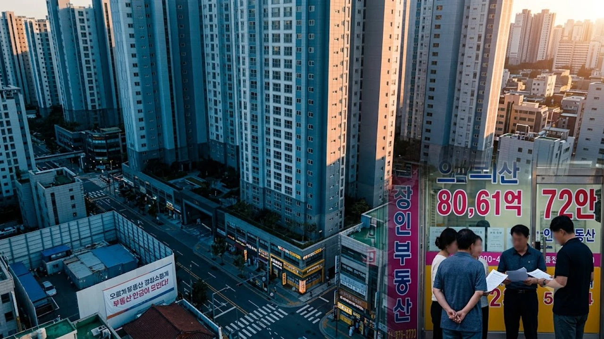

2026년 8월 넷째 주 들어 수도권 주거 시장에서 **서울 전세 급등** 현상이 뚜렷한 가속 페달을 밟고 있습니다. 가을 이사철을 앞두고 정주 여건이 우수한 대단지와 역세권을 중심으로 **전세 매물 품귀**가 이어지면서 세입자들의 주거비 부담이 가중되는 양상입니다. 매매 시장의 관망세 속에서 전세 수요가 집중되는 만큼, 무주택 실수요자라면 현재의 시장 구조와 실질적인 방어 전략을 명확히 파악해야 합니다.

## 8월 4주 서울 아파트 전세가격 급등 현황과 시장 배경

### 서울 주간 전세상승률 0.22% 확대와 동북권 중심 상승세
한국부동산원이 발표한 2026년 8월 4주(8월 24일 기준) 주간 아파트가격 동향을 보면, 서울 아파트 전세가격지수 변동률은 전주 0.19%에서 0.22%로 상승 폭을 키웠습니다. 특히 강북 벨트의 오름세가 두드러집니다.

- **성북구(+0.37%)**: 길음뉴타운과 정릉동 일대 대단지 역세권 중심으로 임차 수요 집중
- **강북구(+0.37%)**: 미아뉴타운 신축 및 번동 일대 구축 단지 매물 소진 속도 가속화
- **노원구(+0.35%)**: 중계동 학군지와 상계동 소형 평형 중심으로 직장인·학부모 계약 증가

실제 현장에서는 계절적 이사 수요에 전세 물량 잠김 현상까지 맞물리며 선호 단지의 보증금이 빠르게 치솟고 있습니다.

### 가을 이사철 수요 유입과 역세권 신축 매물 품귀 현상
9~10월 가을 이사 성수기를 앞두고 학군 이동과 직주근접 수요가 한 달가량 일찍 쏟아져 나왔습니다. 지하철 주요 노선과 맞닿은 신축 단지는 세입자가 집을 비우기도 전에 기존 실거래가보다 2,000만~3,000만 원 높은 호가로 당일 계약을 마치는 사례가 흔합니다. 신규 입주 물량이 말라버린 상황에서 대기자가 줄을 서면서 집주인이 부르는 가격이 곧 시세가 되는 구조가 굳어졌습니다.

### 매매 관망세와 전세 수요 쏠림이 만든 수급 불균형
대출 한도 규제와 금리 변동성에 대한 경계감 탓에 매매 전환을 망설이는 실수요층이 대거 전세 시장에 머물고 있습니다. [공급절벽 2026 아파트 시장, 진짜 전세가 매매가 밀어 올릴까](/posts/kr-realestate/supply-shortage-jeonse-caps-property-2026/) 분석에서 짚었듯, 신축 공급 감소가 임대차 시장의 가격 밀어올림을 주도하는 형국입니다.

---

## 권역별 전세가 상승 양상 및 매물 현황 비교

### 성북·강북·노원 등 중저가 밀집 지역의 전세가 급등
서울 동북권은 상대적으로 전세 진입 장벽이 낮아 신혼부부와 청년 직장인 수요가 집중됩니다. 

> 노원구 중계동 은행사거리 인근 전용 59㎡ 아파트는 8월 초 대비 전세 실거래가가 2,500만 원 상승한 4억 3,000만 원에 거래되며 최고가를 갈아치웠습니다.

가성비 좋은 매물이 순식간에 계약되면서 남아 있는 매물의 호가가 계단식으로 뛰고 있어 세입자들의 발걸음이 한층 분주해졌습니다.

### 강남3구 및 마용성 지역의 고가 전세 거래 추이
강남·서초·송파와 마포·용산·성동 일대는 고액 보증금 부담에도 불구하고 상승세가 꺾이지 않고 있습니다. 송파구 가락동 헬리오시티 전용 84㎡ 전세가는 10억 원 선을 굳건히 지키고 있으며, 마포구 아현동 래미안푸르지오 역시 매물 부족으로 기존 세입자의 재계약 비중이 급증했습니다. 이동에 드는 중개수수료와 취득세, 인테리어 비용을 감안해 현재 집에서 버티려는 임차인이 늘어난 결과입니다.

### 빌라·다세대 전세 기피와 아파트 선호 현상 심화
비아파트 시장의 보증금 미반환 우려가 지속되면서 다세대·연립 주택에 대한 전세 기피는 여전합니다. 빌라 시장은 월세나 반전세로 빠르게 재편되는 반면, 안전자산으로 인식되는 아파트 전세로는 버팀목 대출 등을 활용하려는 수요가 몰려 두 시장 간 양극화가 한층 심해졌습니다.

---

## 가을 이사철 실수요자가 반드시 확인해야 할 3가지 핵심 대책

### 버팀목·디딤돌 등 저금리 정책 대출 자격 및 한도 사전 점검
주거비 지출을 줄이려면 주택도시기금의 정책 대출 상품을 가장 먼저 확인해야 합니다. 시중은행 일반 전세대출 금리가 4%대 초중반을 맴도는 데 반해, 정부 정책 자금은 조건을 맞출 경우 연 2%대 고정·변동 금리를 제공합니다.

- **청년전용 버팀목**: 만 19세~34세 이하, 보증금 3억 원 이하 주택 대상 (최대 2억 원 한도)
- **신혼부부 전용 버팀목**: 혼인기간 7년 이내, 부부합산 소득 기준 충족 시 우대금리 적용

대출 한도 심사와 현장 실사에 최소 3~4주가 걸리므로 이사 예정일 두 달 전부터 은행 상담 창구를 찾아 사전 심사를 마쳐야 잔금 대란을 피할 수 있습니다.

### 계약갱신청구권 활용 전략과 5% 증액 상한선 활용법
임대차 2법에 따른 계약갱신청구권은 임대차 기간 만료 6개월 전부터 2개월 전까지 행사할 수 있습니다. 주변 전세 시세가 10~20% 뛰었더라도 갱신청구권을 가동하면 보증금 인상 폭은 직전 금액의 **5% 이내**로 묶입니다.

- 집주인이 실거주를 이유로 갱신을 거절할 경우, 거절 통지 내역(문자, 통화 녹취, 내용증명)을 명확한 근거로 보관
- 집주인이 실거주 없이 제3자에게 새로 임대할 경우 주택임대차보호법에 따라 전 세입자가 손해배상 청구 가능

무리하게 이사 비용을 쓰며 외곽으로 밀려나기보다 갱신권을 통해 2년의 거주 안정성을 확보하는 것이 현명한 처세입니다.

### 보증보험 가입 요건 점검 및 반전세·월세 전환 셈법 비교
내 보증금을 지키려면 HUG(주택도시보증공사)와 SGI서울보증의 전세보증금반환보증 가입 가능 여부를 계약 전 검증해야 합니다. 공시가격 적용 비율(126% 기준)을 넘어서면 가입 자체가 불가능해 보증금을 돌려받지 못할 위험에 노출됩니다.

또한 치솟은 보증금 전액을 대출로 메우기보다 일부를 월세로 돌리는 **반전세 전환율**을 꼼꼼히 따져봐야 합니다. 전세대출 금리가 법정 전월세전환율(4.5~5.0% 수준)보다 높거나 비슷하다면, 무리한 대출 대신 반전세를 택해 월 현금 흐름을 지키는 편이 유리합니다. 극심한 전세가 상승에 피로감을 느낀 일부 임차인들은 [2030 영끌 재점화, 전세 폭등 속 진짜 살까?](/posts/kr-realestate/young-generation-panic-buying-jeonse-spike-2026/)처럼 실거주 매수로 방향을 선회하기도 합니다.

---

## 향후 하반기 전세 시장 전망 및 무주택자 행동 전략

### 하반기 서울 입주 물량 분석과 추가 상승 압력 진단
2026년 하반기 서울 아파트 입주 예정 물량은 일부 소규모 정비사업장을 제외하면 사실상 단절된 상태입니다. 신규 아파트 준공에 따른 전세가 안정 효과를 기대하기 어렵기 때문에 가을 이사철이 끝나는 11월까지는 매물 부족에 따른 상승 압력이 유지될 가능성이 높습니다.

### 매수 전환 타이밍 vs 전세 재계약 선택 기준
무주택자가 전세 연장과 내 집 마련 사이에서 고민할 때는 **가계 DSR 한도**와 **순수 자기자본 비율**을 냉정하게 계산해야 합니다.

- **전세 갱신 권장**: 부채 원리금 상환액이 월 소득의 35%를 넘거나 유동성 비상금이 부족한 가구
- **실거주 매수 검토**: 순자산 비중이 매매가의 50% 이상이며 디딤돌·신생아 특례 등 정책 모기지 적용이 가능한 가구

조급한 마음에 영끌 신용대출까지 끌어다 쓰는 무리한 추격 매수는 하락장에서 큰 리스크를 부를 수 있습니다.

### 허위 매물 방지와 안전한 계약을 위한 체크리스트
시세보다 유난히 저렴한 매물은 국토교통부 실거래가 공개시스템과 복수의 인근 중개업소를 통해 미끼 매물 여부를 가려내야 합니다.

1. **등기부등본 확인**: 을구 근저당권 및 선순위 채권 합산액이 매매 시세의 70%를 넘지 않는지 점검
2. **필수 특약 기재**: "전세대출 미승인 시 계약금 전액 즉시 반환", "잔금 지급일 익일까지 근저당권 등 신규 권리 설정 금지" 명시
3. **권리자 신분 대조**: 집주인 본인 명의 계좌 입금 원칙 및 대리인 계약 시 위임장·인감증명서 실물 확인

[이사 필수품 및 수납 정리용품 쿠팡에서 보기](https://www.coupang.com/np/search?q=%EC%9D%B4%EC%82%AC%20%EC%A0%95%EB%A6%AC%20%EC%88%98%EB%82%A9%EC%9A%A9%ED%92%88&sourceType=affiliate&trackingCode=AF8691300)

#서울전세 #아파트전세가격 #가을이사철 #전세대출 #계약갱신청구권 #전세보증보험 #전세매물부족 #주택임대차보호법 #부동산시장전망