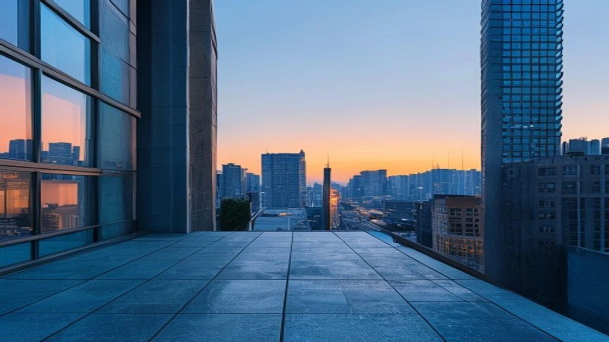
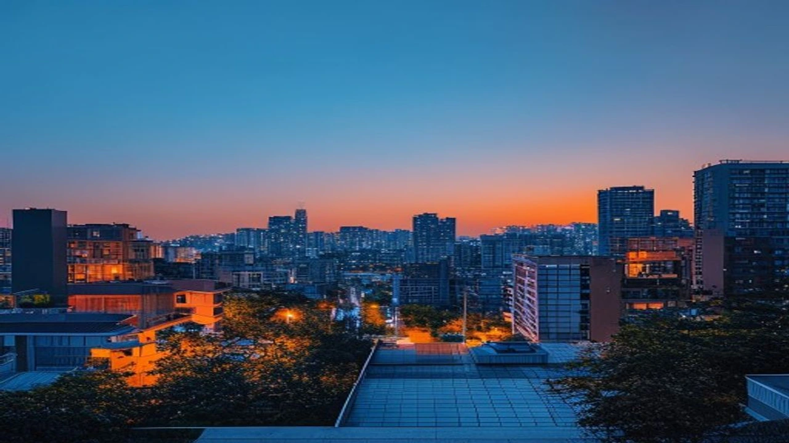

최근 강남권에서 시작된 매수 열기가 중저가 주택 밀집 지역으로 빠르게 번지면서 **서울 외곽 아파트 신고가** 행진이 본격화하고 있습니다. 특히 관악구 봉천동과 성북구 길음동을 중심으로 수억 원씩 급등한 실거래가가 찍히자, 시장에서는 수도권 부동산 양극화가 해소되는 신호탄이라는 분석과 일시적인 풍선효과라는 진단이 팽팽히 맞섭니다. 전세 기포 현상과 매물 잠김이 맞물린 현재, 실수요자들이 자금을 동원할 수 있는 마지노선 단지들을 중심으로 패닉 바잉 심리가 다시 고개를 드는 양상입니다.

## 강남 재건축 부럽지 않다? 서울 외곽 아파트 신고가 현황 폭발

### 2026년 7월 18일 새벽 속보, 관악·성북 아파트가 움직였다
동아일보를 비롯한 주요 부동산 매체들의 7월 18일 자 보도에 따르면, 관악구 봉천동 'e편한세상서울대입구' 전용면적 84㎡가 최근 13억 8,000만 원에 거래되며 반년 전보다 2억 원 이상 올라 신고가를 경신했습니다. 성북구 길음동의 '래미안길음센터피스' 역시 동일 평형이 14억 7,000만 원에 실거래 도장을 찍으며 불과 수개월 사이에 3억 원에 가까운 수직 상승을 기록했습니다. 토지거래허가구역 묶인 강남3구와 달리 갭투자와 실거주 진입 장벽이 낮다는 점이 매수세를 자극했습니다.

### 강남권 초고가 아파트 vs 서울 외곽 중저가 아파트 상승률 대조
7월 들어 강남구 압구정동이나 서초구 반포동의 초고가 단지들은 주택담보대출 제한과 강력한 세무조사 압박으로 인해 거래량이 다소 주춤한 상태입니다. 반면 노원구, 도봉구, 강북구(노·도·강) 및 금천구, 관악구, 구로구(금·관·구) 등 외곽 지역의 9억~15억 원 사이 단지들은 거래량이 전월 대비 40% 이상 폭증했습니다. 고가 시장이 다지기에 들어간 사이 중저가 시장이 빠르게 격차를 좁히는 전형적인 갭 메우기 장세가 수치로 증명됩니다.

### 실수요자가 체감하는 매물 잠김과 호가 상승 실태
> 현장 중개업소 관계자는 "집을 보지도 않고 계약금부터 쏘겠다는 대기자가 줄을 섰지만, 매도인들이 일방적으로 가계약금을 배액 배상하고 매물을 거둬들이는 상황"이라고 전합니다.

실제 실거래가 포털에 등록되는 거래 건수보다 매물 축소 속도가 훨씬 빠릅니다. 양도소득세 및 종합부동산세 완화 기대감으로 다주택자들이 버티기에 돌입한 데다, 집값이 더 오를 것이라는 심리가 확산되면서 호가는 일주일 단위로 5,000만 원씩 뛰고 있습니다.

## 왜 지금 봉천·길음인가? 외곽 지역 폭등을 부른 3가지 핵심 원인

### 15억 이하 '대출 가능'선에 걸친 단지들의 희소성
현재 가계부채 억제를 위해 강력한 대출 규제가 시행 중이지만, 15억 이하 아파트의 경우 상대적으로 담보인정비율(LTV)과 총부채원리금상환비율(DSR) 한도를 최대한 활용할 수 있는 메리트가 존재합니다. [바뀌는 스트레스 DSR 3단계 대출 한도 완전 정리](/posts/kr-realestate/stress-dsr-stage3-loan-limit-2026/) 내용을 보면 가산금리 규제가 옥죄어올수록 대출 턱밑에 걸린 12억~14억 원대 외곽 대단지 아파트로 수요가 몰릴 수밖에 없는 구조적 원인이 명확히 드러납니다.

### 서울 도심 및 강남 접근성 개선 교통 호재의 명과 암
관악구 봉천동은 여의도를 잇는 신림선과 향후 개통될 서부선 경전철 호재를 업고 있으며, 성북구 길음동은 동북선 경전철과 GTX-C 노선 연계성 덕분에 직주근접성이 획기적으로 개선되는 지역입니다. 다만 이러한 교통 호재는 이미 수년 전부터 시세에 선반영되었다는 지적도 많습니다. 착공 지연이나 공사비 상승으로 인한 개통 연기 리스크를 고려하지 않고 상꼭지에 진입할 경우 long-term 금융 비용 부담을 고스란히 떠안아야 합니다.

### 전세 사기 포비아와 아파트 전세가 고공행진이 밀어 올린 매매 수요
연립·다세대 주택에 대한 불신이 극에 달하면서 비아파트 기피 현상이 장기화하고 있습니다. 서울 아파트 전세가격이 60주 연속 상승하는 기현상이 벌어지자 매매가와 전세가의 차이가 좁혀졌고, 세입자들이 대거 매수 주체로 전환되는 추세입니다. [2030 영끌 재점화, 전세 폭등 속 진짜 살까?](/posts/kr-realestate/young-generation-panic-buying-jeonse-spike-2026/)라는 시장의 우려처럼 월세를 사느니 무리해서라도 외곽 아파트를 선점하겠다는 심리가 매매가를 밀어 올리는 주된 땔감이 되었습니다.

## 현장 임장 전문가가 말하는 "지금 진입해도 괜찮을까?"

### "상담 전화만 수십 통" 봉천·길음 현장 공인중개사들의 생생한 목소리
성북구 길음뉴타운 인근의 한 중개업소 대표는 최근 72시간 동안 겪은 상황을 "비이성적 과열"이라고 정의합니다. 과거 영끌 장세와 다른 점은 무조건적인 투기가 아니라 실거주 목적의 30대 부부들이 자금 계획을 꼼꼼히 들고 찾아온다는 점입니다. 매물이 나올 때마다 즉각 거래가 체결되다 보니 중개사들조차 다음 달 시세를 예측하기 어렵다고 털어놓습니다.

### 20~30대 실수요자들의 내 집 마련 성공 및 실패 스토리가 주는 교훈
대기업 대리급인 80년대 후반생 A씨는 올해 초 세종시 아파트를 처분한 자금과 주담대를 보태 봉천동 단지를 11억 원대에 매수했습니다. 현재 호가가 13억 원을 넘어서며 자산 방어에는 성공했으나, 매달 나가는 원리금 상환액이 가구 소득의 40%를 넘겨 극심한 생활고를 겪고 있습니다. 반면 자금 여력이 부족함에도 무리하게 강남권 진입만 고집하다 계약 타이밍을 놓치고 외곽까지 놓친 대다수 무주택자는 심각한 벼락거지 포비아에 시달리는 중입니다.

### 추격 매수 vs 7월 말 공급 대책 관망, 전문가들의 엇갈리는 시선
시장 전문가들의 의견은 극명하게 갈립니다. 매수 우위 지수가 최고치를 기록한 만큼 지금이 상승 랠리의 초입이라는 의견이 있는 반면, 다가오는 7월 23일 부동산 국민 대토론회에서 정부와 서울시가 전격적인 재건축 규제 완화 및 대규모 공급 카드를 꺼내 들 경우 외곽 지역부터 거품이 빠르게 빠질 수 있다는 경고도 나옵니다. 단기 폭등에 따른 피로감이 축적된 상태이므로 무차별적 추격 매수는 지양해야 한다는 목소리에 힘이 실립니다.

## 내 예산에 맞는 서울 외곽 가성비 아파트 찾는 법

### 국토교통부 실거래가 공개시스템 및 네이버 부동산 활용 꿀팁
호가 위주의 네이버 부동산 화면에 매몰되지 않으려면 반드시 국토교통부 실거래가 시스템의 계약일 기준 데이터를 대조해야 합니다. 특히 취소된 거래나 등기 미기재 건을 걸러내고 일주일 이내의 확정 실거래를 기반으로 평균 매매가를 산출하는 작업이 선행되어야 합니다. 단지 규모가 1,000세대 이상이고 전세가율이 60% 이상을 유지하는 외곽 단지 위주로 필터링하는 것이 안전핀 역할을 합니다.

### DSR 규제 속에서 내 대출 한도 및 월 상환액 모의 계산하기
소득 증빙이 확실하더라도 변동금리 선택 시 가산금리가 붙는 스트레스 DSR 환경에서는 실제 대출 실행액이 예상보다 5% 이상 줄어들 수 있습니다. 13억 원짜리 아파트를 매수할 때 본인 순자산이 최소 6억 원 이상 확보되지 않는다면 연간 원리금 균등상환 부담으로 인해 하우스푸어로 전락하기 십상입니다. 제1금융권의 모바일 시뮬레이터를 통해 거치 기간 없는 원리금 상환액을 보수적으로 책정해야 합니다.

### 계약 전 반드시 확인해야 할 단지별 대지분율과 정비사업 가능성 검토
> 외곽 지역 아파트일수록 용적률이 이미 250%를 초과해 재건축 사업성이 제로에 가까운 단지들이 수두룩하므로 주의가 필요합니다.

단순히 가성비가 좋고 가격이 저렴하다는 이유로 90년대 구축 단지를 매수했다가 리모델링조차 불가능해 자산 가치가 고착화되는 낭패를 볼 수 있습니다. 계약서 날인 전 반드시 등기부등본과 토지대장을 발급받아 가구당 평균 대지분율이 최소 15평 이상을 확보하고 있는지 파악하는 것이 향후 자산 가치 증대 가능성을 담보하는 핵심 척도입니다.

#서울외곽아파트신고가 #봉천동아파트시세 #길음뉴타운매매 #15억이하아파트 #스트레스DSR규제 #전세가상승풍선효과 #부동산대토론회공급대책 #내집마련자금계획