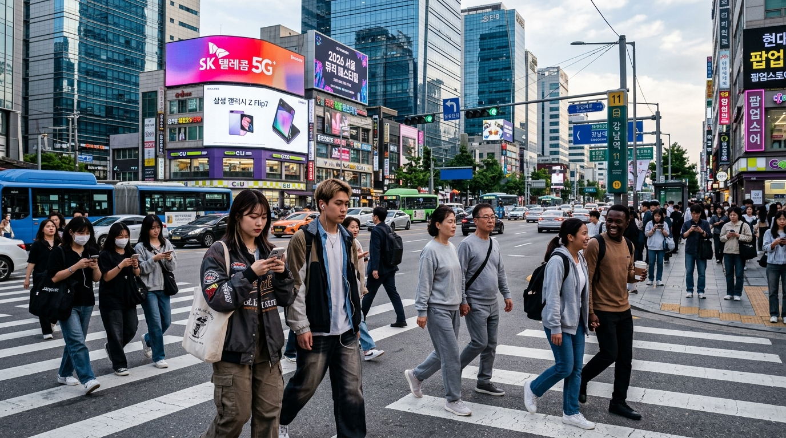
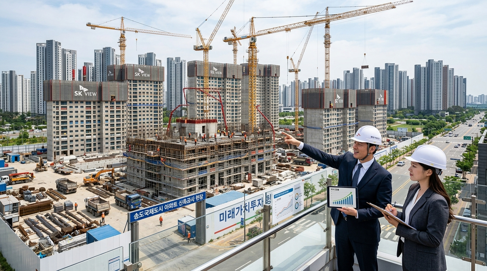

2025년 하반기 잠시 숨을 고르던 서울 아파트 시장이 2026년 들어 다시 상승 조짐을 보이고 있습니다. 한국은행의 기준금리 인하 사이클 진입, 입주 물량 감소, 재건축·재개발 규제 완화가 한꺼번에 겹치면서 **공급 절벽**과 **수요 반등**이 동시에 찾아오는 구조입니다. 지금 이 시장에서 실수요자와 투자자가 어떤 판단을 내려야 하는지 짚어볼게요.

## 2026년 서울 부동산 시장을 움직이는 4가지 힘

### 금리 인하 사이클 — 집값 상승의 방아쇠

한국은행은 2025년 4분기부터 기준금리 인하를 시작해 2026년 중반 현재 3.0% 수준에 도달했습니다. 주택담보대출 변동금리가 4~4.5%대로 내려오면서 '버텼던' 실수요자들이 시장에 다시 진입하기 시작했어요. 금리 1%포인트 인하는 5억 원 대출 기준 월 이자 부담을 약 40만 원 줄여주는 효과가 있습니다.

### 입주 물량 급감 — 공급 절벽 현실화

2024~2025년 인허가·착공 급감이 2026~2027년 입주 물량 절벽으로 이어지고 있습니다. 서울 기준 2026년 아파트 입주 예정 물량은 2023년 대비 40% 이상 감소한 수준이에요. 수요는 유지되는데 공급이 줄면 결과는 하나입니다.

### 재건축·재개발 규제 완화

정부의 1기 신도시 특별법 후속 조치와 서울 내 정비구역 용적률 상향이 맞물리면서 노후 아파트 단지에 재건축 기대가 다시 살아났습니다. 강남 3구, 목동, 상계, 노원 등 대규모 노후 단지들이 실질적 사업 속도를 내고 있어요.

### 수도권 광역급행철도(GTX) 효과

GTX-A(수서-동탄) 개통 이후 동탄·수서 인근 집값이 먼저 반응했습니다. GTX-B·C 구간 착공이 본격화되면서 경기 외곽 지역 중에서도 노선 역세권은 독립적인 상승세를 이어가고 있어요.

## 지역별 온도 차이 — 어디가 뜨겁고 어디가 조용한가

### 강남·서초·송파 — 여전히 독자적 시장

강남 3구는 전국 집값 하락기에도 상대적 방어력이 강합니다. 2026년에는 압구정·대치·잠실 등 핵심 재건축 단지들이 관리처분 단계에 진입하면서 이주 수요와 전세 공급 감소가 동시에 발생하고 있어요. 신축 대비 구축 단지의 가격 회복이 두드러집니다.

### 용산·마포·성동 — 젊은 수요가 이끄는 비강남 강자

용산 국제업무지구 개발 기대와 마포·성동의 직주근접 수요가 꾸준합니다. 30~40대 실수요자가 선호하는 환경 때문에 거래량 회복 속도가 비교적 빠른 편이에요.

### 경기 외곽 — GTX 역세권은 별개, 그 외는 신중하게

GTX 역에서 도보 15분 이내 단지와 나머지의 격차가 벌어지고 있습니다. 역세권 외 구역은 인구 감소와 공급 부담이 겹쳐 단기 반등을 기대하기 어렵습니다.

## 실수요자 vs 투자자, 지금의 판단 기준

### 실수요자 — 금리 부담 계산이 먼저

지금 매수를 결정할 때 핵심 기준은 '월 이자 감당 가능성'입니다. 대출 원리금이 월 세후 소득의 30% 이하인 범위에서 선택해야 불확실성에 버틸 수 있어요. 조급하게 상급지를 狙するより 청약·직주근접 중소형 실거주를 우선으로 접근하는 게 2026년 전략에 맞습니다.

### 투자 목적 — 단기 시세 차익보다 임대 수익률

단기 갭투자는 2023~2024년 전세가 급락의 교훈이 있습니다. 임대 수익률 3~4%를 확보할 수 있는 가격대와 위치인지 먼저 따져야 해요. 오피스텔·소형 아파트 전월세 전환 시 수익성이 양호한 지역을 선별하는 전략이 안전합니다.

## 2026년 부동산 시장, 놓치지 말아야 할 변수들

### DSR 규제와 대출 한도의 벽

금리가 내려가도 DSR(총부채원리금상환비율) 40% 규제는 여전히 작동합니다. 연 소득 6,000만 원이면 연간 원리금 상환 한도가 2,400만 원으로 묶여요. 집값이 오른다고 해서 대출이 그만큼 더 나오지 않는 구조입니다.

### 미분양 증가 지역의 신호

지방 광역시 일부와 경기 외곽에서 미분양 물량이 여전히 쌓이고 있습니다. 수도권 인기 지역의 회복이 전국적 부동산 호황을 의미하지 않아요. 지역별로 시장 상황이 완전히 다르게 전개되고 있습니다.

[2026년 가계부채 분석](/posts/economy/)에서 다룬 것처럼 가계부채 총량 관리 기조가 계속되는 한 부동산 가격 급등을 무한정 방치하지는 않을 것이에요. 실수요 기반의 보수적 접근이 2026년 부동산 시장에서 가장 안전한 전략입니다.

#서울부동산2026 #아파트전망 #부동산시장 #수도권부동산 #GTX역세권 #재건축 #실수요자전략
