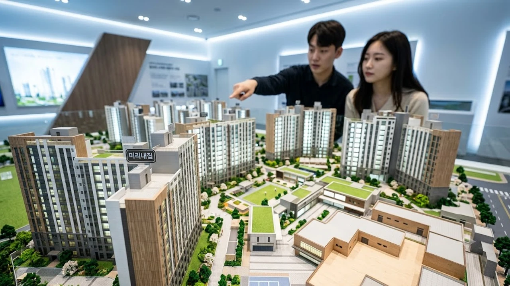

2007년 오세훈 1기 서울시정에서 첫선을 보인 시프트(SHIFT) 제도가 도입 20년 차를 맞으면서 주거 시장의 뇌관으로 터져 나왔다. **서울 장기전세 20년 만기**가 눈앞에 닥치며 수억 원의 전세 시세 차액을 감당하기 어려운 장기 입주자와 "원칙대로 비워줘야 다음 청년·신혼부부에게 기회가 간다"는 공공임대 반환 원칙이 정면 충돌한다. 서울시가 예외 없는 퇴거 기조를 재확인한 가운데, 공공 주거 사다리의 방향을 둘러싼 혼란이 커지고 있다.

## 20년 채운 서울 장기전세, 왜 갑자기 강제 퇴거 논란이 불붙었나

장기전세주택은 주변 전세 시세의 80% 이하로 최장 20년간 이사 걱정 없이 거주하도록 설계한 임대 모델이다. 장기 거주 안정성을 무기로 도입 초기 서울 중산층 무주택자들의 폭발적인 지지를 얻었다. 하지만 2027년을 기점으로 첫 20년 만기 도래 단지가 줄줄이 나오기 시작하면서 상황은 180도 달라졌다.

### 2007년 도입 첫 만기 도래와 입주자 연장·분양전환 요구
강서 발산, 송파 장지 등 초기 입주 단지 거주자들은 입주자협의회를 꾸려 계약 연장이나 일반 분양주택 전환을 요구하고 나섰다. 20년간 한 동네에서 자녀를 키우며 살아온 생활 터전을 한순간에 잃게 된다는 호소다. 특히 10년 공공임대처럼 시세 대비 저렴한 가격에 분양권을 우선 공급해 달라는 목소리가 커졌다.

### 오세훈 시장의 단호한 선 긋기: "예외 없는 퇴거 원칙"
서울시는 이러한 요구에 즉각 선을 그었다. 장기전세는 태생부터 분양전환 조건이 없는 순수 임대주택으로 공고되었으며, 계약서에도 20년 만기 시 퇴거 조건이 명시되어 있었다는 입장이다. 한 가구가 공공임대 자산을 영구히 독점하는 것은 공공 자원의 형평성에 위배되며, 20년을 채운 가구는 원칙대로 물러나는 것이 사회적 합의에 부합한다고 못 박았다.

### 서울시민 여론과 퇴거 찬반 대립 핵심 쟁점
시민 여론은 팽팽하게 맞선다. 한쪽에서는 20년간 시세보다 저렴한 전세 혜택을 누리며 자산을 형성할 기회를 충분히 얻었으니 반환하는 게 당연하다고 주장한다. 반면 고령화로 인해 마땅한 은퇴 소득이 없는 1세대 입주자들은 당장 길거리에 나앉게 생겼다며 주거 기본권을 보장하라는 항변을 쏟아낸다.

## 2031년까지 쏟아지는 9,300호, 어디로 어떻게 재공급되나

서울시는 만기 회수 물량을 쥐고 있지 않고 다음 세대를 위해 전면 재배치한다는 청사진을 내놓았다. 2027년부터 2031년까지 5년간 순차적으로 쏟아지는 반환 물량만 총 9,300호 안팎에 달한다.

### 2027년 310호를 시작으로 단계적 반환 일정
반환 시계는 2027년 상반기 발산지구 310가구를 기점으로 돌아간다. 이후 은평뉴타운, 상암, 강남 세곡 등 대규모 단지의 20년 계약 만료가 해마다 이어지며 연간 1,500~2,500가구씩 회수 절차가 진행된다. SH서울주택도시공사는 시설 개보수를 거쳐 즉각 신규 입주자 모집 공고를 띄울 방침이다.

### 청년·신혼부부 대상 '미리내집' 전환 공급 기준
회수 주택의 핵심 공급 대상은 청년과 신혼부부다. 서울시의 저출생 대책인 '미리내집(장기전세주택Ⅱ)' 트랙을 대거 접목한다. 혼인 기간 7년 이내 신혼부부나 예비 신혼부부에게 우선 공급하며, 입주 후 자녀를 출산할 때마다 거주 기간을 연장하고 분양전환 우선권까지 주는 강력한 인센티브 구조다. 기존 세대의 퇴거 물량이 다음 세대의 출산 유인 자원으로 탈바꿈하는 셈이다.

### 기존 장기전세 대비 줄어드는 보증금·월세 혜택 차이점
초기 시프트는 소득 기준이 비교적 헐거웠고 전세금 인상률도 2년당 5% 이내로 엄격히 제한되었다. 새로 도입되는 미리내집 체계는 소득 구간별 차등 보증금 책정과 맞춤형 대출 연계가 붙지만, 입주자의 자산 변동과 출산 여부를 주기적으로 검증해 자격 유지 요건을 한층 깐깐하게 관리한다.

## 장기전세 20년 거주자의 출구 전략: 현실적 퇴거 대안 분석

> "20년 전 들어갈 때는 주변 아파트 전세가 1억 원 안팎이었는데, 지금은 7억~8억 원을 줘도 못 구합니다. 돌려받는 보증금 2억~3억 원으로 서울 어디로 가란 말입니까?" — 강서구 장기전세 입주민 인터뷰 중

### 퇴거 가구 72%의 내 집 마련 성공 데이터와 남은 28%의 현실
SH공사의 자체 추작성할 주제나 본문 내용이 전달되지 않았습니다. 어떤 주제나 내용으로 마크다운 문서를 작성할지 알려주시면 요청하신 형식에 맞춰 바로 출력해 드리겠습니다.