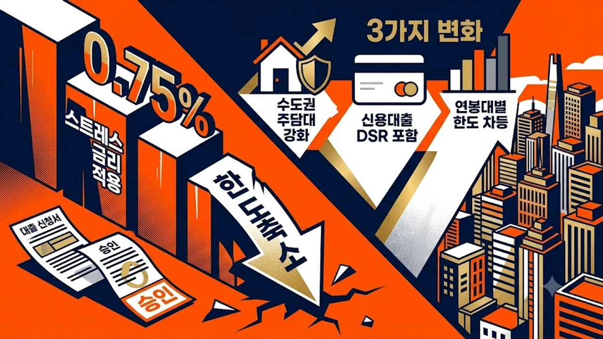

2026년 9월 1일부터 금융권의 주택담보대출 문턱을 대폭 높이는 **스트레스 DSR 2단계**가 전면 시행된다. 가계부채 억제를 위해 도입된 이번 제도는 수도권 주택담보대출에 한층 강화된 스트레스 금리를 차등 부과하여 대출 한도 축소 폭이 역대 최대 수준에 이른다. 가을 이사철을 앞두고 내 집 마련이나 갈아타기를 계획 중인 실수요자라면 변화된 규제 세부 조항과 은행별 막차 대출 조건을 즉시 확인해야 한다.


## 스트레스 DSR 2단계 도입과 주요 변경 사항

### 스트레스 DSR 2단계 가산금리 적용 기준과 수도권 차등 규제
스트레스 DSR(총부채원리금상환비율)은 향후 금리 인상 위험을 반영해 대출 심사 시 실제 금리에 일정 수준의 '가산금리(스트레스 금리)'를 덧붙여 대출 한도를 산정하는 제도다. 

- **비수도권 주택담보대출:** 기본 2단계 스트레스 금리인 **0.75%p** 부과
- **서울·경기·인천 등 수도권 주택담보대출:** 부동산 가격 상승세 및 가계대출 쏠림 억제를 위해 **1.20%p**로 상향 가산
- **적용 대상:** 은행권 주택담보대출 및 신용대출, 제2금융권 주택담보대출

### 신규 주담대와 신용대출 한도 축소 시뮬레이션 비교
소득이 동일하더라도 대출 한도는 이전보다 수천만 원 단위로 줄어든다. 연소득 6,000만 원인 차주가 30년 만기 원리금균등분할상환(변동금리 4.0% 가정)으로 수도권 아파트 담보대출을 받을 경우, 기존 대출 가능 금액 약 4억 원에서 9월 이후에는 약 3억 4,000만 원 선으로 약 6,000만 원 가까이 대출 총액이 감소한다. 신용대출 역시 잔액이 1억 원을 초과할 경우 스트레스 금리가 합산 적용되므로 추가 한도 확보가 사실상 차단된다.

### 8월 말 막차 대출 접수 마감일과 은행별 창구 운영 현황
주요 5대 시중은행은 규제 시행 직전 대출 쏠림을 방지하기 위해 8월 마지막 주 접수분에 대해 엄격한 기준을 적용 중이다. 이미 일부 은행은 온라인 비대면 주담대 접수를 조기 마감했으며, 다주택자 대상 생활안정자금 대출 취급을 중단했다. 8월 31일까지 대출 신청 및 전산 등록이 완료되지 않은 건은 9월 1일 자 기준의 축소된 한도를 적용받는다.

## 연봉대별 대출 가능 한도 축소 폭 정밀 비교


### 연소득 5,000만 원~1억 원 구간별 대출 한도 차이 분석
차주의 연간 소득 수준에 따라 체감하는 대출 축소 규모는 더 벌어진다.

| 연간 소득 | 기존 한도 (1단계 기준) | 수도권 2단계 적용 후 | 예상 한도 감소액 |
| :--- | :--- | :--- | :--- |
| **5,000만 원** | 약 3억 3,000만 원 | 약 2억 8,500만 원 | **-4,500만 원** |
| **7,000만 원** | 약 4억 6,500만 원 | 약 4억 0,000만 원 | **-6,500만 원** |
| **1억 원** | 약 6억 6,000만 원 | 약 5억 7,000만 원 | **-9,000만 원** |

고소득자일수록 수도권 가산금리(1.20%p) 반영에 따른 한도 삭감 절대액이 커지므로, 자기자본 비중이 부족한 매수자는 자금 조달 계획에 차질을 빚게 된다. 최근 전세가 상승에 따른 불안감으로 자금 계획을 무리하게 세운 매수층의 타격이 불가피하다. [2030 영끌 재점화, 전세 폭등 속 진짜 살까?](/posts/kr-realestate/young-generation-panic-buying-jeonse-spike-2026/) 글에서 다룬 매수 심리와 대출 규제 사이의 간극을 면밀히 따져봐야 한다.

### 주기형·혼합형·변동금리 상품별 스트레스 금리 차등 적용률
금리 유형에 따라 스트레스 금리 반영 비중이 크게 달라진다.

- **변동금리형:** 스트레스 금리 100% 반영 (수도권 +1.20%p)
- **혼합형 (5년 고정 후 변동):** 스트레스 금리 60% 반영 (수도권 +0.72%p)
- **주기형 (5년마다 금리 변동):** 스트레스 금리 30% 반영 (수도권 +0.36%p)

한도를 최대한 많이 확보해야 하는 차주라면 변동금리 대신 가산율이 가장 낮은 **주기형 고정금리 상품**을 선택하는 것이 유리하다.

### 제2금융권 풍선효과 및 추가 대출 제한 여부
1금융권 대출 한도가 줄어들면서 보험사나 상호금융 등 제2금융권으로 수요가 이동하는 풍선효과가 나타나고 있다. 그러나 제2금융권 주택담보대출에도 2단계 기본 스트레스 금리(0.75%p)가 동일하게 적용되며, 금융당국의 가계부채 총량 관리 지침에 따라 2금융권 역시 심사 문턱을 높이고 금리를 인상하는 추세다.

## 실수요자가 꼭 알아야 할 예외 적용 및 보호 조치

### 8월 31일 이전 입주자모집공고 및 매매계약 체결 건 적용 기준
금융당국은 시장 혼란을 최소화하기 위해 명확한 경과 규정을 마련했다.

> **핵심 경과 규정 체크포인트**  
> 2026년 8월 31일까지 부동산 매매계약을 체결하고 계약금을 납부한 사실을 증명(영수증 및 계좌이체 내역)하거나, 입주자모집공고가 게시된 집단대출(중도금·잔금)은 종전 규정(1단계 스트레스 DSR)을 적용받는다.

계약일자가 8월 31일 이전이라도 계약금 지급 증빙이 불명확하거나 전산 입력이 지연될 경우 분쟁이 발생할 수 있으므로 증빙 서류를 철저히 구비해야 한다.

### 전세자금대출 및 정책 모기지 영향 여부
- **정책 서민금융 상품:** 디딤돌대출, 버팀목전세자금대출, 보금자리론 등 정책 모기지는 이번 스트레스 DSR 산정 대상에서 제외된다. 
- **전세자금대출:** 현재 전세대출 원금은 DSR 산정에 포함되지 않아 당장 전세보증금 대출 한도가 깎이지는 않는다. 단, 은행권 자체 심사 강화로 소유권 이전 조건부 전세대출 등 갭투자 연계 대출은 엄격히 차단된다. 

청년층의 경우 대상 주택 요건에 부합한다면 정책 금융을 우선 검토하는 편이 합리적이다. 세부 지원 조건은 [청년미래보금자리론 4억 빌라 숨은 조건](/posts/kr-realestate/youth-future-bogeumjari-loan-villa-2026/)을 참고하면 도움이 된다.

### 중도금·잔금대출 연계 시 주의해야 할 금융 규제 체크포인트
신규 분양 아파트의 중도금 대출은 DSR 규제를 직접 적용받지 않지만, 입주 시점에 집단 잔금대출로 전환할 때는 DSR 규제가 전면 적용된다. 2026년 9월 1일 이후 입주자모집공고가 나는 사업장의 분양을 계획한다면, 입주 시점의 축소된 잔금대출 한도를 미리 역산해 자금 조달 계획을 수립해야 잔금 미납 사태를 피할 수 있다.

## 스트레스 DSR 2단계 시행 직전 자금 마련 실전 가이드

### 본인 DSR 자가 진단 및 한도 최대화 금리 상품 선택법
대출 한도가 부족한 상황이라면 다음 3가지 전략을 즉시 실행해야 한다.

- 대출 만기를 가능한 최장 기간(30년~40년)으로 설정해 연간 원리금 상환액을 낮춘다.
- 스트레스 금리 반영률이 가장 낮은 **5년 주기형 고정금리 상품**을 선택한다.
- 부부 합산 소득을 증빙해 총 소득 모수를 키운다.

### 불필요한 마이너스통장 및 기존 신용대출 정리 전략
마이너스통장은 실제 사용하지 않고 개설만 해두었더라도 약정 한도 전액이 DSR 부채로 잡힌다. 한도 5,000만 원짜리 마이너스통장을 해지하거나 한도를 1,000만 원 수준으로 감액하는 것만으로도 주담대 한도를 수천만 원 추가로 확보할 수 있다. 분산된 단기 카드론이나 현금서비스는 주담대 실행 전 전액 상환하고 부채 계좌를 정리해야 한다.

### 가을 이사철 내 집 마련을 위한 단계별 대출 플랜 수립
9월 규제 이후 수도권 부동산 매수를 고려한다면 자금 조달 계획서를 현실에 맞게 전면 재수정해야 한다. 은행 창구를 방문하기 전 본인의 정확한 원리금 상환 부담과 가산금리 적용 여부를 모의 계산하고, 매도인과의 잔금 일정 협의 시 대출 심사 소요 기간을 최소```markdown
작성할 주제나 내용을 알려주시면 요청하신 형식에 맞춰 마크다운 본문을 완성해 드리겠습니다.