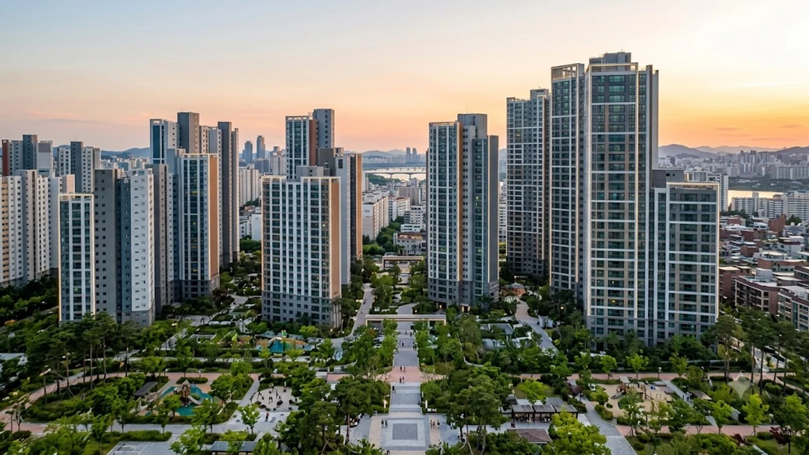

서울 서초구 잠원동 재건축 대어로 꼽히는 신반포22차가 일반분양을 앞두고 시장의 시선을 집중시키고 있다. 최근 시공사 하이엔드 브랜드인 '디에이치 신반포 에스테라'로 단지명을 확정하며 본격적인 분양 채비에 들어섰으나, **신반포22차 분양가**가 전용 84㎡ 기준 40억 원 안팎에 책정될 것이라는 관측이 나오며 실수요자들 사이에 거센 파장이 일었다. 분양가상한제 규제지역인 서초구 한복판에서 평당 1억 3,000만 원 안팎의 전례 없는 가격이 책정된 배경에는 주택법 규정의 허점을 파고든 '28가구 쪼개기 분양' 전략이 자리 잡고 있다.

## 신반포22차 28가구 일반분양과 40억 분양가 논란의 전말

### '디에이치 신반포 에스테라' 확정과 일반분양 28가구의 의미
신반포22차 재건축 정비사업조합은 최근 단지명을 현대건설의 하이엔드 브랜드인 '디에이치 신반포 에스테라'로 결정하고 10월 본격적인 분양 절차에 돌입했다. 전체 규모는 지하 3층~지상 35층, 2개 동, 총 160가구 규모의 소단지다. 이 중 조합원 몫을 뺀 일반공급 물량은 정확히 28가구로 확정되었다. 당초 계획보다 일반분양 물량을 줄여 잡은 결정적 이유는 바로 '30가구'라는 법적 규제 경계선에 맞추기 위함이다. 

### 3.3㎡당 1.3억 돌파 전망… 국평 40억 원 책정 배경
신반포22차의 공사비는 3.3㎡당 약 1,300만 원 선으로 강남권 재건축 정비사업장 가운데서도 최고 수준에 달한다. 자잿값과 인건비 폭등으로 늘어난 금융 비용을 털어내고자 조합 측은 일반분양가를 3.3㎡당 최소 1억 2,000만 원에서 최대 1억 3,000만 원 안팎으로 저울질하고 있다. 
- 전용 84㎡(국민평형) 기준: **분양가 약 40억~42억 원선**
- 전용 107㎡ 대형 평형: **분양가 50억 원 돌파 유력**
공사비 증액에 따른 조합원 추가 분담금 폭탄을 피하고자 일반분양가를 한계치까지 밀어붙인 결과가 분양가 숫자에 그대로 찍힌 셈이다.

### 잠원동 일대 시세 대비 분양가 수준과 주변 반응
인근 잠원·반포동 준신축 대장 아파트의 실거래가를 짚어보면 '아크로리버파크' 전용 84㎡가 약 42억~44억 원, 2023년 입주한 '메이플자이' 입주권이 약 38억~40억 원 선에서 손바뀜되고 있다. 신반포22차의 예상 분양가는 인근 대단지 시세와 맞먹거나 일부 호가를 뛰어넘는다. 청약 당첨 즉시 수억 원에서 10억 원 안팎의 차익을 안겨주던 강남권 특유의 '로또 청약' 공식이 깨져버리자, 청약 대기자들 사이에서는 "이 가격이면 굳이 160가구짜리 나홀로 소단지에 들어갈 이유가 없다"는 냉소적 반응이 쏟아져 나온다.

## 주택법 30가구 룰: 분상제 패싱의 원리와 실태

### 주택법 제54조: '30가구 미만' 분양가상한제 제외 규정 해설
현행 주택법 제54조와 주택공급에 관한 규칙에 따르면 사업계획승인 대상이 되는 30가구 이상 공동주택만 분양가상한제 심사와 청약홈 공개 청약 의무를 진다. 
> "일반분양 물량이 30가구 미만인 경우 지자체의 분양가 심의위원회를 거치지 않고 사업주체가 자율적으로 분양가를 책정할 수 있다."

신반포22차는 이 규정을 정밀하게 파고들어 일반공급 물량을 28가구로 맞췄다. 서초구가 투기과열지구로 묶여 있음에도 불구하고 법률 규정상 분상제 분양가 통제망을 완벽히 비켜간 셈이다.

### 서초·강남 규제지역에서 임의분양 방식을 선택하는 이유
분상제를 고스란히 적용받을 경우 3.3㎡당 분양가는 6,000만~7,000만 원 선에 발이 묶인다. 평당 1,300만 원 공사비를 이 액수로 감당하면 고스란히 조합원당 수억 원대 추가 분담금 고지서로 되돌아온다. 규제를 벗어나 평당 가격을 두 배 가까이 올려 일반분양 수입을 극대화하고, 조합원의 자금 부담을 덜어내기 위해 임의분양이라는 우회로를 과감히 선택했다.

### HUG 고분양가 심사 및 청약홈 의무 배제의 법적 근거
30가구 미만 사업장은 주택도시보증공사(HUG)의 고분양가 관리 대상에서 빠지고 한국부동산원 청약홈 전산망 사용 의무도 없다. 시공사나 조합 자체 홈페이지, 또는 별도 현장 접수로 공고를 내고 계약자를 임의 추첨으로 뽑을 수 있어 까다로운 행정 간섭과 심사 지연을 한 번에 건너뛴다.

## 청약통장 미사용 청약의 기회와 자금 조달 리스크

### 만 19세 이상 유주택자도 참여 가능한 무순위·임의분양 조건
청약홈 시스템을 타지 않는 만큼 문턱 자체는 턱없이 낮다.
- 청약통장 가입 기간 및 납입 인정 금액 무관
- 전국 거주 만 19세 이상 성인이면 세대원 누구나 접수 가능
- 다주택자 신청 허용
- 재당첨 제한 및 과거 당첨 이력 규제 미적용

가점이 낮아 강남 입성을 포기했던 현금 부유층에게는 별다른 자격 증명 없이 진입할 수 있는 통로가 열린 셈이다.

### 계약금 20% 및 중도금 대출 불가 시 자금 조달 시나리오
진입 장벽은 낮지만 지갑 문턱은 가혹하다. 40억 원 기준 계약금 20%만 따져도 당첨 즉시 손에 쥐고 있어야 할 현금이 8억 원에 달한다. 소규모 임의분양 사업장은 금융기관 집단대출(중도금 대출) 보증 협약이 어렵고, 대출 주선이 되더라도 깐깐한 DSR(총부채원리금상환비율) 규제 탓에 개인별 한도가 바닥을 친다. 대부분의 대금을 순수 자력으로 조달해야 하므로 자금 흐름을 착오했다가는 계약금 몰취라는 치명타를 입을 수 있다.

현재 금융당국이 가계부채 관리를 빌미로 대출 총량을 강하게 조이는 기조도 눈여겨봐야 한다. 대출 총량 규제와 금융권 한도 추이에 대해서는 [15억 이하 대출규제 6억 축소될까?](/posts/kr-realestate/under-1500m-mortgage-loan-cap-tightening-2026/) 분석을 대조해보면 개인별 자금 조달 여력을 가늠하는 데 도움이 된다.

### 15억 초과 초고가 주택 DSR 규제와 실입주 전매제한 팩트체크
스트레스 DSR 2단계가 정밀하게 작동하는 상황에서 초고소득 전문직이나 대기업 임원급이 아니라면 15억 원을 훌쩍 넘는 고가 아파트 주담대 한도는 턱없이 부족하다. 분상제 적용 단지가 아니라 실거주 의무나 전매제한 족쇄는 느슨하지만, 입주 시점에 세입자를 받아 전세보증금으로 잔금을 치르려 해도 수도권 전세대출 억제책 탓에 세입자 유치가 쉽지 않을 수 있다.

## 강남권 꼼수 소규모 분양 확산과 실수요자 대응 전략

### 방배·반포·압구정 소규모 정비사업장의 연쇄 도입 가능성
신반포22차의 40억 임의분양이 완판이라는 성적표를 쥐게 된다면 방배동이나 압구정, 송파 일대의 소규모 정비사업장들도 뒤따라 분양 물량을 29가구 이하로 깎아낼 가능성이 짙다. 펜트하우스나 대형 평형 위주로 평면을 묶어 일반분양을 30가구 미만으로 쪼개고 분양가를 폭등시키는 기형적인 공급 관행이 강남권 전반으로 번질 수 있다.

### '로또 청약' 사라진 강남… 현금 부자만의 리그인가
청약 가점 70~80점대를 채우며 반포 입성을 손꼽아 기다리던 무주택 서민들은 일반공급 기회 자체를 송두리째 빼앗겼다. 분상제 회피 단지들의 공급가가 인근 시세를 넘어서면서 서울 분양 시장은 '현금 수십억 원을 즉시 꽂아 넣을 수 있는 극소수 자산가'들만의 폐쇄된 전유물로 굳어지고 있다. 청년층의 내 집 마련 불안과 무리한 매수 심리의 이면은 [2030 영끌 재점화, 전세 폭등 속 진짜 살까?](/posts/kr-realestate/young-generation-panic-buying-jeonse-spike-2026/) 글에서 다룬 시장 흐름과도 직결된다.

### 현시점 고분양가 단지 청약 전 반드시 따져볼 자금 점검표
- **순수 현금 동원력**: 분양대금의 최소 80% 이상을 대출 없이 순수 현금 및 즉시 처분 가능한 금융자산으로 확보했는가?
- **공사비 증액 및 공기 지연 리스크**: 2개 동 소단지 특성상 시공사와의 마감재 갈등이나 추가 분쟁 발생 시 입주 지연 변수를 견딜 여력이 있는가?
- **대단지 인프라 격차와 환금성**: 아크로리버파크나 래미안 원베일리 같은 대단지 커뮤니티와 조경 인프라가 부재한 160가구 단지가 훗날 매도시장에서 제값을 받을 수 있는가?

초고가 주거지에 발을 들일 때는 공간의 품격을 살려줄 내부 가구 세팅도 사전에 세밀히 계산해 두어야 한다. 입주 전 동선과 인테리어 설계를 구체화하고 싶다면 [프리미엄 인테리어 홈가구 쿠팡에서 보기](https://www.coupang.com/np/search?q=%ED%94%84%EB%A6%AC%EB%AF%B8%EC%97%84%20%EC%9D%B8%ED%85%8C%EB%A6%AC%EC%96%B4%20%ED%99%88%EA%B0%80%EA%B5%AC&sourceType=affiliate&trackingCode=AF8691300)를 둘러보며 실내 마감에 맞는 품목을 미리 가늠해보는 편이 낫다.

#신반포22차분양가 #디에이치신반포에스테라 #분양가상한제제외 #30가구미만분양 #잠원동재건축 #강남아파트청약 #초고가아파트DSR #서초구아파트시세