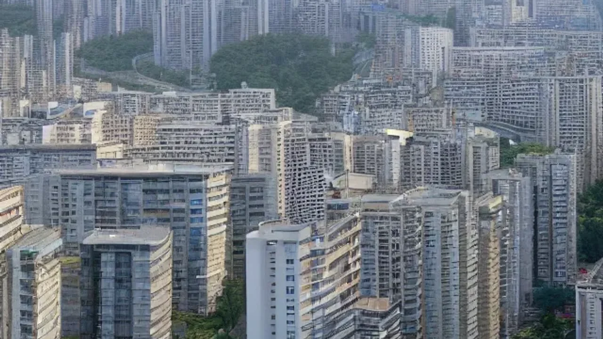

공급절벽이 현실화된 **2026 아파트 시장**은 과거의 하락장이나 상승장과는 전혀 다른 양상을 보이고 있습니다. 고금리와 대출 규제로 매수 심리는 크게 위축되었지만, 역대급으로 줄어든 입주 물량이 전세가를 밀어 올리며 매매가를 지탱하는 기현상이 발생 중입니다. 지금 임차인과 실수요자가 어떤 선택을 하느냐에 따라 향후 자산 격차가 크게 벌어질 수 있습니다.

## 2026 아파트 시장의 기현상: 매수 위축 속 매매가 지지선 구축

### 고금리·DSR 규제 압박과 엇박자 내는 매매가
현재 시장은 정책 금융의 축소와 스트레스 DSR 2단계 적용으로 인해 겉보기에는 극도로 침체된 것처럼 보입니다. 매수자들은 선뜻 지갑을 열지 못하고 관망세를 유지하는 중입니다. 하지만 시장 현장에서는 급매물이 소화된 후 매매 가격이 아래로 떨어지지 않고 단단하게 버티는 현상이 관측됩니다. 매수세가 붙지 않는데도 가격이 내려가지 않는 이유는 매도인들이 공급 부족을 인지하고 매물을 거둬들이거나 호가를 낮추지 않기 때문입니다.

### 한국부동산원 지표로 보는 6월 수도권 매매 동향
한국부동산원이 발표한 2026년 6월 첫째 주 주간 아파트 가격동향을 보면, 서울 아파트 매매가격지수는 전주 대비 **0.25% 상승**하며 16주 연속 우상향을 기록했습니다. 

> **한국부동산원 관계자 분석 요약**
> "매수자들의 관망세 속에서도 선호 지역의 신축 및 역세권 단지를 중심으로 대기 수요가 꾸준히 유입되며 상승 폭을 유지하고 있다."

특히 성동구(0.32%)와 마포구(0.28%) 등 도심 접근성이 좋은 지역의 가파른 지표 상승은 현재의 시장이 단순한 착시가 아님을 증명합니다.

### 과거 하락장과 무엇이 다른가: '버티기' 장세의 서막
2008년 금융위기나 2022년 금리 인상기에는 매매가와 전세가가 동반 폭락하며 하락 장세를 이끌었습니다. 반면 현재 장세는 전세가가 먼저 치고 나가며 매매가를 강제로 떠받치는 구조입니다. 자산가치 폭락에 대한 공포로 투매가 나왔던 과거와 달리, 집주인들이 "보증금을 올려 받아 대출을 갚으면 그만"이라는 전략으로 선회하면서 하방 지지선이 견고하게 형성되었습니다.

## 전세 품귀와 공급 절벽: 시장을 뒤흔드는 2대 핵심 동력

### 2026년 상반기 입주 물량 급감 현황과 지역별 파급력
부동산R114 자료에 따르면 2026년 서울 아파트 입주 예정 물량은 약 2만 2,000가구로, 적정 수요량인 4만 가구의 절반 수준에 불과합니다. 특히 강남권을 제외한 강북권 및 경기 외곽 지역의 입주 물량은 전년 대비 **40% 이상 감소**했습니다. 이러한 전례 없는 공급 절벽은 전세 시장의 매물 고갈로 곧바로 직결되며 임대차 시장의 수급 불균형을 극대화하는 주원인이 되었습니다.

### 전세가 상승이 매매가 하방을 받쳐주는 구조적 매커니즘
전세 가격이 오르면 매매 가격과의 차이(갭)가 줄어듭니다. 이는 두 가지 연쇄 반응을 일으킵니다. 
- 첫째, 전세금 인상분에 부담을 느낀 임차인들이 "이럴 바에는 차라리 돈을 더 보태서 집을 사자"며 매매 수요로 전환됩니다.
- 둘째, 갭이 좁혀짐에 따라 적은 자본으로 주택을 매수하려는 투자 수요가 다시 자극받습니다. 

실제로 서울 일부 단지의 전세가율은 60%를 돌파하며 매매가를 위로 밀어 올리는 강한 동력으로 작용하고 있습니다.

### 전세 대란 장기화가 무주택 임차인에게 미치는 치명적 영향
임대차 2법 도입 이후 계약갱신청구권을 이미 소진한 만기 매물들이 올해 시장에 대거 쏟아지고 있습니다. 4년 전 시세로 거주하던 임차인들은 현재 폭등한 전세 시세와의 차액을 감당해야 하는 처지입니다. 전세자금대출 금리마저 높은 상황에서 이 주거 비용 지출의 증가는 서민 가계의 가처분 소득을 감소시키고, 주거 안정성을 심각하게 훼손하는 부작용을 낳고 있습니다.

## 실수요자의 딜레마: 전세 재계약 vs 매매 전환 실전 손익 계산

### "계약갱신권을 쓸까, 매수할까?" 3040 영끌족의 실제 고민 사례
마포구 소재 24평형 아파트에 전세로 거주 중인 40대 직장인 A씨는 오는 8월 만기를 앞두고 깊은 고민에 빠졌습니다. 집주인은 전세보증금 1억 5,000만 원 인상을 요구했습니다. A씨가 계약갱신청구권을 사용하면 2년간은 5% 상한 내에서 버틸 수 있지만, 2년 뒤에는 시세대로 수억 원을 올려주거나 외곽으로 밀려나야 합니다. 현장에서는 차라리 외곽의 중저가 신축 아파트를 매수하겠다는 움직임이 서서히 포착됩니다.

### 대환대출 플랫폼과 시중은행 주담대 금리 비교 및 자금 조달 한계선
현재 시중은행의 주택담보대출 변동금리는 상단이 5%대에 머물러 있어 차주들의 이자 부담이 상당합니다. 다만 모바일 대환대출 플랫폼을 적극적으로 활용하면 조건에 따라 3% 후반에서 4% 초반의 혼합형(고정) 금리로 갈아타기가 가능합니다. 실수요자들은 단순히 대출 총액만 볼 것이 아니라, 자신의 월 실수령액 대비 원리금 상환 비율(DSR)이 **40%를 넘지 않는 선**에서 자금 계획을 수립해야 안전합니다.

### 매매 전환 시 반드시 피해야 할 고점 인식 지역과 선별 기준
전세가가 오른다고 해서 모든 지역의 아파트를 묻지마 매수하는 행위는 위험합니다. 최근 1년 사이 급매물이 소화되며 전고점의 95% 이상 회복한 단지는 단기 고점일 확률이 높으므로 진입에 신중해야 합니다. [관련 글 보기](/posts/kr-realestate/) 반면 전세가는 꾸준히 오르는데 매매가는 전고점 대비 80% 수준에 머물러 있는 교통 호재 지역(예: gtx 노선 개통 예정지 인근)은 하방 경직성이 확보된 비교적 안전한 선택지가 됩니다.

## 상반기 생존 가이드: 공급 부족 장세에서 이기는 내 집 마련 튜토리얼

### 단계별 매수 타이밍 포착: 전세가율 60% 이상 단지 필터링하기
실수요자가 리스크를 최소화하며 매수 타이밍을 잡는 구체적인 단계별 행동 요령입니다.
1. 부동산 현황 분석 사이트를 통해 관심 지역의 평형별 전세가율을 전수 조사합니다.
2. 전세가율이 60%를 넘어섰고, 최근 3개월간 전세 매물 수량이 지속해서 감소한 단지를 선별합니다.
3. 해당 단지의 매매 호가와 전세 호가의 격차가 역대 평균 수준으로 좁혀졌을 때를 진입 적기로 판단합니다.

### 네이버 부동산 및 아실 앱을 활용한 급매물·무갭 투자 매물 모니터링법
스마트폰 어플리케이션을 활용하면 현장에 가지 않고도 알짜 매물을 선별할 수 있습니다. '아실' 앱의 '갭투자 현황' 메뉴를 활용해 최근 6개월간 갭이 가장 많이 줄어든 지역과 단지를 추려냅니다. 이후 '네이버 부동산'에서 매물 정렬 조건을 '가격 낮은 순'으로 설정한 뒤, 저층이나 향이 불리한 매물을 제외하고 집주인의 사정으로 급하게 나온 '계약금 포기' 또는 '세고정(전세를 안고 매매)' 매물의 가격 추이를 매일 오전 10시에 체크합니다.

### 2026년 하반기 리스크 요인: 추가 금리 변동과 공급 대책 체크리스트
현재의 공급 부족 장세 속에서도 하반기 시장을 뒤흔들 변수는 명확하게 존재합니다. 미 연방준비제도(Fed)의 기준금리 인하 시점 지연 가능성과 국내 가계부채 관리를 위한 금융당국의 추가적인 대출 규제 강화 여부를 반드시 확인해야 합니다. 정부가 발표할 예정인 수도권 3기 신도시 사전청약 물량과 토지보상금 유입 규모 역시 매수 심리를 꺾거나 자극할 수 있는 핵심 변수이므로 관련 뉴스를 실시간으로 추적해야 합니다.

#2026아파트시장 #공급절벽 #전세품귀 #부동산트렌드 #한국부동산원 #내집마련 #주택담보대출 #갭투자 #수도권아파트