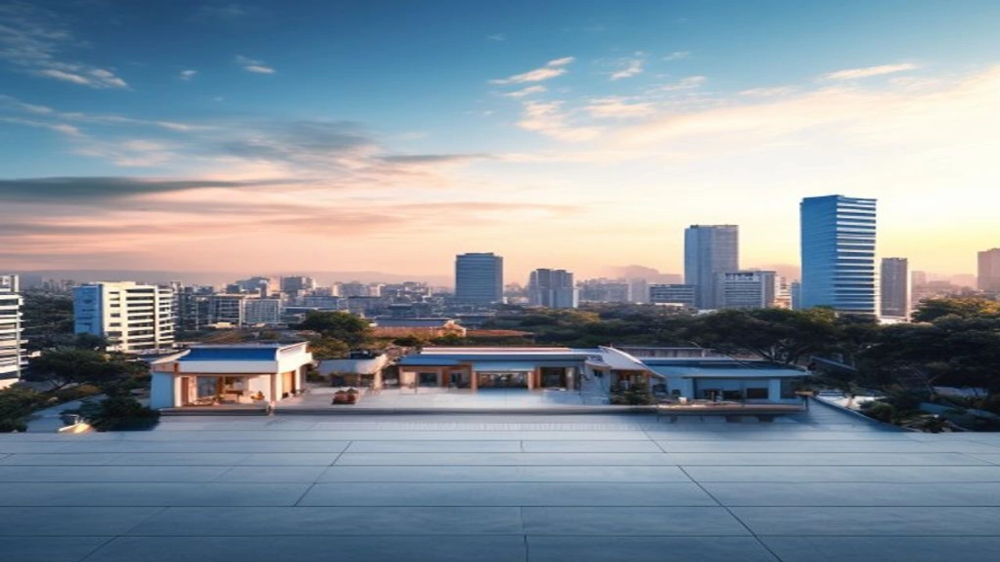

2026년 7월 30일 국회에서 열린 당정협의를 통해 공시가격 30억 원을 초과하는 고가 주택 보유자를 겨냥한 핀셋 증세 방안이 본격적인 윤곽을 드러냈습니다. 이번 세제개편 논의에서 핵심 타깃이 된 **초고가주택 종부세 세법개정안**은 강남 3구와 용산 등 핵심 입지의 매수 심리를 즉각 위축시키며 부동산 보유세 및 종합부동산세 과세 표준 개편에 대한 시장의 긴장감을 높이고 있습니다. 세 부담 변화 수치와 실제 현장에서의 매물 출회 가능성을 종합 정리했습니다.

## 2026 세법개정안 당정협의 개요와 초고가 주택 핀셋 증세안

### 공시가격 30억 초과 1주택자 대상 종부세 개편 방향
정부와 여당은 7월 30일 세제개편 당정협의를 열고, 초고가 1주택자 대상 종합부동산세 누진세율 구조를 세분화하는 안을 집중 논의했습니다. 개편안의 핵심은 공시가격 30억 원(시세 약 40~42억 원 수준)을 초과하는 주택에 대해 구간별 최고 세율을 대폭 끌어올리는 방식입니다. 기존 1주택자 기본 공제액 12억 원 체계는 유지하여 중저가 1주택자의 세 부담 증가는 차단하되, Super-Rich 대상 핀셋 증세로 세수 기반을 확보하겠다는 구상입니다.

### 당정협의에서 논의된 조세 저항 최소화 및 세율 재설계
과거 전방위적 종부세 중과에 따른 조세 저항을 타산지석 삼아, 이번 개편안은 대상 범위를 전체 주택 보유자의 0.1% 수준으로 대폭 축소했습니다. 공시가 30억 원 이하 보유자에게는 세율 변동이 없거나 고령자·장기보유 세액공제(최대 80%)를 유지해 반발을 최소화합니다. 반면, 공시가 50억 원을 초과하는 초대형 팬트하우스 및 고가 단독주택 보유자는 세 부담이 최고 2~3배까지 솟구치는 구조로 설계되었습니다.

## 보유세 강화vs거래세 완화: 시장 유동성에 미치는 영향

### 공정시장가액비율 및 장기보유특별공제(장특공제) 개편 시나리오
종부세 과세기준인 공정시장가액비율을 현행 60%에서 초고가 구간에 한해 70~80%로 단계적 상향하는 방안이 검토 중입니다. 이와 동시에 양도소득세의 장기보유특별공제(최대 80%) 거주 요건을 더 까다롭게 죄는 방식이 병행됩니다. 세법 개정이 확정될 경우 실거주하지 않고 과천이나 강남권 고가 아파트를 보유했던 자산가들의 세금 방정식이 크게 복잡해집니다.

### 강남3구·용산 등 고가주택 밀집 지역의 거래절벽과 관망세
세제 개편 논의가 수면 위로 올라오면서 서울 서초구 반포동, 강남구 대치동, 용산구 한남동 일대 매수 문의는 즉시 급감했습니다. 국토교통부 실거래가 시스템에 따르면, 7월 넷째 주 강남 3구의 아파트 거래량은 전주 대비 35% 이상 하락하며 짙은 관망세를 보이고 있습니다. 매도자와 매수자 모두 세법개정안의 최종 국회 통과 수위를 확인한 뒤 움직이겠다는 분위기가 형성되었습니다.

> **시장의 핵심 변수**
> 보유세 부담이 커지는 상위 0.1% 자산가들이 매물을 던질 것인가, 아니면 증여와 법인 전환을 통해 버티기에 들어갈 것인가가 하반기 초고가 시장의 가격을 결정짓는 분수령입니다.

## 실수요자와 다주택자별 2026 하반기 절세 전략 비교

### 실거주 1주택자의 세 부담 변화와 체크포인트
공시가격 30억 원 이하 1주택자는 이번 개편으로 인한 직격탄을 피했습니다. 그러나 대출 규제 압박과 연계된 주택 보유 비용을 지속 계산해야 합니다. 내 집 마련 시 대출 한도가 궁금하다면 [바뀌는 스트레스 DSR 3단계 대출 한도 완전 정리](/posts/kr-realestate/stress-dsr-stage3-loan-limit-2026/)를 통해 사전에 체계적인 자금 계획을 세워두는 것이 안전합니다.

### 비거주·다주택 보유자의 매도 통로 및 세후 기대수익률 계산법
공시가격 30억 원을 넘어서는 고가 주택을 여러 채 가지고 있거나 실거주하지 않는 다주택자는 세후 수익률이 대폭 낮아집니다. 
- **1단계:** 보유 주택의 공시가격 합산액 확인 및 최고 세율 적용 구간 산정
- **2단계:** 증여세율과 종부세 보유 비용의 5개년 누적액 비교
- **3단계:** 연말 과세기준일(6월 1일) 이전 과감한 매도 처리 여부 결정

중저가 입지 아파트나 전세를 낀 Gap 투자 자산의 과도한 유지비용은 신속히 정리하고 수익성이 높은 핵심 자산 1채로 압축하는 '똘똘한 한 채' 재편이 한층 빨라질 전망입니다.

## 하반기 수도권 부동산 매수 타이밍 분석 및 주의사항

### 종부세 고지서 발행 전 시장 매물 출회 가능성
이번 당정협의안이 국회를 통과하면, 올 11월 종부세 고지서 발송 시점과 맞물려 과세 부담을 느낀 자산가들의 절세 매물이 시장에 풀릴 수 있습니다. 특히 법인 명의로 보유 중인 초고가 주택 및 비거주 고가 자산이 우선 매도 타깃이 될 확률이 높습니다. 전체적인 시장 방향성은 [2026년 서울·수도권 부동산 전망, 지금 사야 하나 기다려야 하나](/posts/kr-realestate/seoul-realestate-outlook-2026/) 포스팅에서 다룬 입지별 양극화 흐름과 궤를 같이합니다.

### 대출 규제(스트레스 DSR)와 세금 정책이 맞물린 시장 전망
2026년 하반기 부동산 시장은 세제 강화와 대출 규제라는 양대 악재를 맞물고 움직입니다. 초고가 시장은 핀셋 증세로 상승세가 꺾인 반면, 중저가 아파트 단지는 여전한 공급 부족과 전셋값 상승 여파로 상방 압력을 받는 극단적 양극화가 이어질 가능성이 높습니다. 현금 동원력을 철저히 계산한 후 시장 접근이 요구되는 시점입니다.

#종부세개편안 #2026세법개정안 #초고가주택종부세 #부동산세제개편 #종합부동산세세율 #강남부동산전망 #부동산절세전략