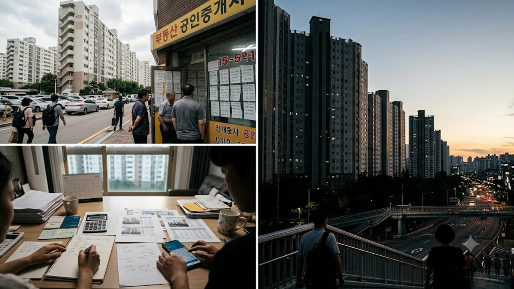

수도권 중저가 아파트 시장을 중심으로 **15억 이하 대출규제** 불씨가 다시 지펴지며 내 집 마련을 준비하던 실수요자들의 자금 계획에 비상이 걸렸습니다. 금융당국의 가계부채 억제 기조 속에서 6억 원 대출 한도 축소 가능성이 수면 위로 떠오르자, 주택담보대출 실행을 앞둔 실수요자와 1주택 갈아타기 계층의 셈법이 복잡해졌습니다. [2030 영끌 재점화, 전세 폭등 속 진짜 살까?](/posts/kr-realestate/young-generation-panic-buying-jeonse-spike-2026/)를 고민하던 3040 세대에게 직접적인 자금 조달 장벽으로 작동하는 형국입니다.

## 15억 이하 아파트 대출 규제 강화 논란의 배경

### LH 사장 발언과 주담대 6억 한도 축소 불씨
국정감사를 앞둔 10월 초, 주택 공급 및 금융 관리 기관 고위 관계자들의 발언이 연쇄적으로 전해지면서 시장이 요동쳤습니다. 집값 15억 원 이하 구간에 여전히 과도한 레버리지가 유입된다는 지적이 제기되며, 일반 시중은행 주택담보대출 상한선을 6억 원 수준으로 묶는 방안이 유력하게 거론되었습니다. 가계대출 총량 목표치 준수를 압박받는 시중은행들 역시 자율 관리라는 명목으로 비가격 규제를 확대하던 터라, 6억 한도 캡(Cap) 적용 여부는 매수 심리에 즉각적인 냉각 효과를 낳았습니다.

### 서울 15억원 이하 중저가 거래 쏠림 현상
스트레스 DSR 2단계 전면 시행 이후 강남 3구와 마·용·성 등 초고가 지역 거래가 숨고르기에 들어간 반면, 규제선 밑에 위치한 서울 외곽 및 경기 역세권 10억~14억 원대 매물로 매수세가 집중되었습니다.
* 서울 노원구 상계동 및 성북구 길음동 일대 준신축 84㎡
* 마포·성동 외곽의 13억~15억 원 턱걸이 매물
* 성남 분당·용인 수지 역세권 구축 단지

이들 지역은 LTV 70%와 주담대 상한선 경계에 맞물려 거래량이 가파르게 늘었고, 금융당국은 이를 부채 팽창의 뇌관으로 지목했습니다.

### 가계부채 관리와 주택공급 엇박자 국정감사 쟁점
국회 국토교통위원회와 정무위원회에서는 금융위원회의 가계대출 조이기와 국토교통부의 주택공급 확대 기조 간 불협화음이 정면으로 충돌했습니다. 대출 문턱만 무리하게 높여 무주택 실수요자의 주거 이동 사다리를 걷어찬다는 비판과, GDP 대비 가계부채 비율을 낮추기 위해 중저가 주택 레버리지 차단이 불가피하다는 정부 입장이 팽팽하게 맞서고 있습니다.

## 기존 대출 한도 체계와 규제 강화 시뮬레이션

### 현행 수도권 주담대 한도 및 LTV·DSR 산정 방식
현재 무주택자 기준 비규제지역 주택담보대출비율(LTV)은 최대 70%까지 허용됩니다. 연소득 1억 원 차주가 수도권 스트레스 금리(1.2%p 가산)를 적용받아 30년 만기 원리금균등상환 대출을 실행할 경우, DSR 40% 한도 내에서 약 6억 5,000만~6억 8,000만 원 수준까지 대출이 나옵니다. 집값 14억 원 아파트를 매입할 때 수치상 LTV 70%(9억 8,000만 원)가 가능해 보여도 실제로는 DSR이 대출 상한을 틀어쥐는 구조입니다.

### 6억원 한도 축소 시 매수 가능 금액 변화 비교
만약 15억 원 이하 주택에 주택담보대출 절대 한도(6억 원)가 일괄 씌워질 경우 실수요자가 직접 마련해야 하는 종잣돈 규모는 급격히 불어납니다.

| 매매가 | 현행 DSR 기준 가능 대출액(연소득 1억 기준) | 6억 원 규제 캡 도입 시 대출액 | 필요 자기자본 차액 |
| :--- | :--- | :--- | :--- |
| **9억 원** | 약 6억 3,000만 원 (LTV 70% 적용) | 6억 원 | +3,000만 원 |
| **12억 원** | 약 6억 8,000만 원 (소득 DSR 한도) | 6억 원 | +8,000만 원 |
| **14억 5,000만 원** | 약 6억 8,000만 원 (소득 DSR 한도) | 6억 원 | +8,000만 원 |

> 실질 대출 한도가 6억 원으로 못 박히면, 14억 원 아파트 매수 시 차주는 취득세와 복비 등 부대비용을 빼고도 최소 8억 5,000만 원 이상의 순수 현금을 쥐고 있어야 거래를 완주할 수 있습니다.

### 노·도·강 및 수도권 중저가 밀집지 타격 분석
이 같은 조치는 강남 고가 주택보다 서민·중산층 밀집 지역에 치명타를 입힙니다. 매매가 8억~12억 원 사이에 포진한 서울 도봉구 창동, 강북구 미아동, 경기 구리·광명 일대는 자기자본 3억~4억 원에 신용대출과 주담대를 합쳐 진입하던 30대 비중이 높습니다. 절대 한도가 묶이면 매수세가 즉각 얼어붙으며 호가를 낮춘 급매물이 쏟아질 가능성이 큽니다.

## 실수요자 갈아타기와 무주택 청약자의 현실적 파장

### 1주택 갈아타기 수요의 자기자본 조달 한계
기존 주택을 매도하고 상급지로 이동하려는 1주택자의 이동 사다리가 사실상 단절됩니다. 경기 남부 6억 원대 아파트를 정리하고 서울 12억 원대 아파트로 갈아타려는 가구는 매도 차익 3억 원에 신규 대출 6억 원을 보태도 3억 원의 자금 공백이 생깁니다. 은행권의 1주택자 처분조건부 대출 취급 기피 현상까지 겹치면서 갈아타기 거래 사슬 전체가 멈춰서는 병목 현상이 깊어지고 있습니다.

### 전세 끼고 매수하는 갭투자 차단과 전월세 시장 전이
주담대 문턱이 높아지자 매수를 포기한 대기 수요가 임대차 시장에 주저앉으면서 수도권 전세 보증금을 밀어 올리는 풍선효과가 발생합니다. 매매 진입이 막힌 세입자가 재계약을 선택하거나 전세로 회귀하면서 전세 매물 잠김이 심화되고, 이는 고스란히 월세 전환 속도를 가속화하는 요인으로 작용합니다.

### 분양단지 잔금대출 규제 연계 시 예상되는 혼란
입주를 앞둔 수도권 대단지 아파트 분양권 시장 역시 직격탄을 피하기 어렵습니다. 분양가 11억~13억 원대 단지의 경우 시세 기준 감정평가액이 15억 원 이하로 잡히더라도, 잔금대출에 6억 원 캡이 씌워지면 수분양자는 수억 원대의 현금을 단기간에 추가 수혈해야 합니다. 자금을 맞추지 못한 계약자들의 분양권 급매물이 출현하거나 입주 지연 사태가 벌어질 위험이 도사립니다.

## 강화되는 대출 규제 속 실수요자 자금 마련 전략

### 정책 모기지 적용 요건 점검
까다로워진 금융 환경에서는 정책 금융상품의 지원 요건을 꼼꼼히 대조해야 합니다. 소득과 자산 기준이 촘촘한 [청년미래보금자리론 4억 빌라 숨은 조건](/posts/kr-realestate/youth-future-bogeumjari-loan-villa-2026/)처럼 저리 대출의 문턱을 면밀히 분석하고, 자격 요건을 충족하지 못한다면 시중은행 고정금리 혼합형 상품의 가산금리 추이를 실시간으로 추적하는 전략이 필요합니다.

### 2금융권 풍선효과 차단 대비 및 자금 조달 계획서 작성 팁
시중은행 한도가 막힌 차주들이 새마을금고, 농협, 보험사 등 2금융권으로 눈을 돌리고 있으나, 금융당국이 2금융권 DSR 한도 축소(현행 50%에서 40%로 하향)를 예고한 상태입니다. 신용대출을 엮은 무리한 추가 차입은 자금조달계획서 검증 과정에서 정밀 타깃이 됩니다. 가족 간 차용증 작성 시 법정 이자율(연 4.6%) 준수 및 계좌 이체 내역 등 객관적 증빙을 미리 갖춰야 자금출처 조사 리스크를 털어낼 수 있습니다.

### 추가 규제 발표 전 선제적 금융 포트폴리오 재편법
매매계약서에 도장을 찍기 전 거래 은행 지점에서 탁상감정가와 본인 DSR 기준 대출 승인 확약 범위를 문서로 확인하는 절차가 필수입니다. 구두 상담만 믿고 가계약금을 넣었다가 대출 한도 삭감으로 위약금을 물지 않으려면 **"금융권 대출 불가 시 계약 무효 및 계약금 전액 반환"** 특약을 계약서에 명시해야 안전합니다. 자산 포트폴리오 내 비유동성 자산을 신속히 현금화하고 단기 유동성 파킹통장을 확보해 갑작스러운 한도 축소에 대응해야 합니다.

[부동산 매매 계약 서류 및 자금 증빙 보관용 파일철 쿠팡에서 보기](https://www.coupang.com/np/search?q=%EB%B6%80%EB%8F%99%EC%82%B0+%EC%84%9C%EB%A5%98%EC%B2%A0+%EB%AC%B8%EC%84%9C%ED%8F%B4%EB%8D%94&sourceType=affiliate&trackingCode=AF8691300)

#15억이하대출규제 #주택담보대출한도축소 #수도권아파트매매 #DSR스트레스금리 #실수요자자금조달 #1주택갈아타기 #부동산대출규제 #아파트잔금대출