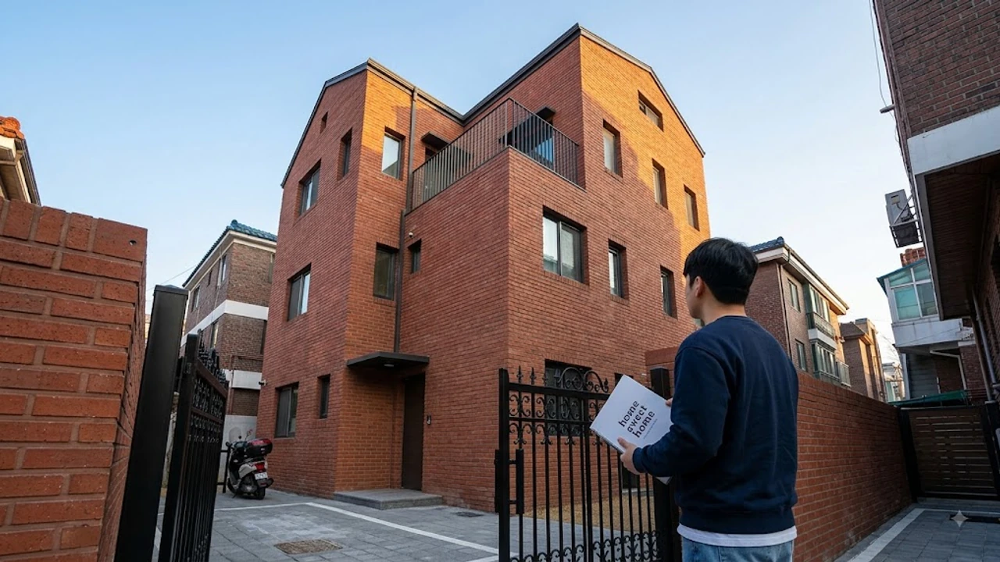

정부가 2026년 하반기 서민·청년 주거 안정을 목표로 신설한 **청년미래보금자리론** 세부 가이드라인이 확정되면서 실수요자들의 셈법이 복잡해졌습니다. 매매가 4억 원 이하의 빌라와 주거용 오피스텔 등 비(非)아파트만을 콕 집어 지원 대상으로 정하자, 전세 불안을 피해 내 집 마련을 노리는 2030 세대 사이에서 실효성과 역차별 논란이 동시에 터져 나왔습니다.

## 청년미래보금자리론 도입 배경과 핵심 지원 자격

### 4억 이하 비(非)아파트 대상 한정의 의미
이번 정책의 핵심 타깃은 전세 사기 여파로 거래가 얼어붙은 연립·다세대 주택과 소형 주거용 오피스텔입니다. 매매가 4억 원 이하 주택으로 대상을 못 박아 아파트 쏠림을 막고 비아파트 시장에 숨통을 틔우겠다는 계산입니다. 전용면적 85㎡ 이하(읍·면 지역 100㎡ 이하) 규격이 함께 묶입니다.

### 연령·소득 요건 및 무주택 세대주 기준
신청 자격은 만 19세 이상 39세 이하의 무주택 세대주로 한정됩니다.
- **연소득 기준**: 미혼 청년 연 6,000만 원 이하, 신혼부부 합산 연 8,500만 원 이하
- **순자산 기준**: 2026년 기준 3억 4,500만 원 이하
- **주택 보유 이력**: 생애최초 주택구입자에게 전체 공급 물량의 60%를 우선 배정

### 기존 정책모기지(디딤돌·보금자리론)와의 차이점
기존 정책모기지가 아파트를 포함해 5억~6억 원 이하 주택까지 폭넓게 품었던 것과 달리, 청년미래보금자리론은 아파트 매수를 완전히 배제합니다. 대신 비아파트 매입 시 발목을 잡던 까다로운 감정평가 방식을 걷어내고, 한국부동산원 시세와 국토교통부 공시가격 현실화율을 바탕으로 대출 한도를 산정합니다. 수도권 주거비 부담 속에서 갈피를 잡지 못하는 상황이라면 [2030 영끌 재점화, 전세 폭등 속 진짜 살까?](/posts/kr-realestate/young-generation-panic-buying-jeonse-spike-2026/) 분석을 통해 자산 전략을 점검할 필요가 있습니다.

## 대출 한도와 고정금리 혜택 및 LTV·DSR 적용 기준

### 최대 3억 원 한도와 LTV 80% 적용 방식
대출 한도는 주택가격의 최대 80%(생애최초 기준, 일반 무주택자 70%) 범위 안에서 최대 3억 원까지 나옵니다.
> **실제 매수 시뮬레이션**: 매매가 3억 5,000만 원 상당의 서울 관악구 신축 빌라를 생애최초로 매입할 경우, LTV 80%를 적용받아 최대 2억 8,000만 원까지 대출을 일으킬 수 있어 실투자금 7,000만 원으로 소유권을 넘겨받습니다.

### 청년 전용 우대금리 산정 체계
기본 금리는 연 3.2% 수준의 장기 고정금리로 설계됐습니다. 우대금리 조건을 채우면 최저 연 2.8%까지 내려갑니다.
- 우대금리 항목: 청약저축 납입 3년 이상(0.2%p), 중소기업 재직(0.1%p), 전자약정 체결(0.1%p)
- 만기 설정: 최장 40년(만 39세 이하) 및 50년(만 34세 이하 또는 신혼부부) 만기 선택 가능

### 스트레스 DSR 3단계 예외 인정 범위
일반 시중은행 대출에 적용되는 깐깐한 한도 규제와 달리, 청년미래보금자리론은 정책모기지 특례를 인정받습니다. 구체적인 금융권 규제 변동 내역은 [바뀌는 스트레스 DSR 3단계 대출 한도 완전 정리](/posts/kr-realestate/stress-dsr-stage3-loan-limit-2026/) 포스팅에서 확인할 수 있듯, 3단계 가산금리 적용을 피하고 고정금리형 정책 상품 기준(DSR 대신 DTI 60% 적용)을 그대로 누립니다.

## 실수요자가 체감하는 현실적 장점과 기대 효과

### 수도권 역세권 빌라·오피스텔 진입 장벽 완화
서울 마포, 영등포, 관악 등 지하철역 인근 투룸형 빌라 및 주거용 오피스텔은 매매가가 3억 후반대에 걸쳐 있습니다. 이들 물건을 LTV 80% 고정금리로 매수할 수 있어, 치솟는 월세 부담에 시달리던 1인 가구와 신혼부부의 주거 안착 비용을 덜어줍니다.

### 청년층 전세 사기 불안에 따른 매매 전환 유도
보증금을 떼일지 모른다는 공포로 전세 기피가 극심한 빌라 시장에서, 불안한 보증금 대신 저금리 분할상환을 통해 자가 점유를 확정 짓는 출구가 됩니다.

### 초기 주거비용 절감을 위한 중도상환수수료 면제 혜택
대출 실행 후 3년 안에 집을 팔거나 다른 저금리 상품으로 갈아타더라도 중도상환수수료가 붙지 않습니다. 향후 자금을 모아 아파트로 갈아타려는 청년층의 징검다리 전략에 유리합니다.

## 역차별 논란과 신청 전 반드시 체크할 리스크

### 아파트 제외에 따른 자산 형성 사다리 단절 비판
청년층 사이에서 가장 큰 반발을 부르는 대목은 '아파트 사다리 차단'입니다. 가격 상승 여력이 있고 환금성이 좋은 아파트는 빼두고 감가상각이 빠른 빌라 매수만 유도하는 것은 비선호 악성 재고를 청년에게 떠넘기는 꼴이라는 비판이 나옵니다.

### 비아파트 환금성 저하 및 매매가 하락 위험성
빌라와 나홀로 오피스텔은 상승장에서 매매가 상승 폭이 둔한 반면, 하락장에서는 거래 절벽과 함께 가격이 주저앉을 위험이 큽니다. 추후 상급지로 이동하려 할 때 집이 팔리지 않아 자금이 묶이는 '환금성 덫'을 반드시 계산해야 합니다.

### 실거주 의무 및 전매 제한 관련 주의사항
대출을 받으면 소유권 이전 등기일로부터 1개월 이내에 전입신고를 마치고 최소 1년 이상 실거주를 유지해야 합니다. 정당한 사유 없이 실거주 요건을 어기면 대출금이 즉시 회수되고 향후 3년 동안 정책 금융 이용이 막히므로 갭투자 목적의 진입은 차단됩니다.

#청년미래보금자리론 #4억이하빌라대출 #청년정책모기지 #빌라매매대출 #스트레스DSR제외 #청년내집마련 #고정금리주택담보대출 #2026부동산정책