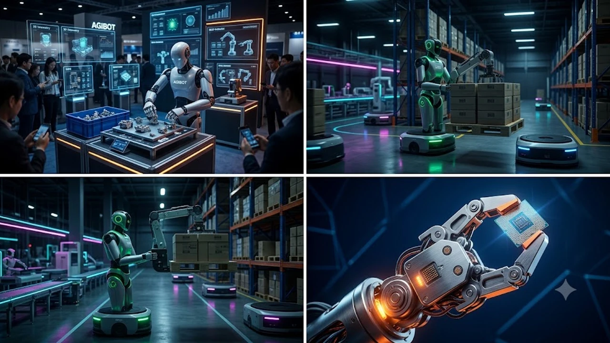

2026년 8월 19일 서울 코엑스에서 공식 개막한 **AISE 2026(AI 서밋 서울 & 엑스포)** 현장은 소프트웨어 화면 속에 머물던 인공지능이 물리적 실체를 갖춘 **피지컬 AI(Physical AI)**로 완전히 전환되었음을 증명했습니다. 텍스트와 이미지를 생성하던 거대언어모델(LLM) 경쟁을 넘어, 이제는 산업 현장에 직접 투입되어 하드웨어를 제어하는 산업용 로보틱스 생태계가 비즈니스의 핵심 축으로 부상했습니다. 이번 행사에서 공개된 최신 산업용 로봇과 자율 제어 시스템의 실증 사례를 바탕으로 기업들이 주목해야 할 실질적인 변화를 짚어봅니다.

## AISE 2026 코엑스 개막: 피지컬 AI가 주도하는 현장 격변

### 7개국 118개사 격돌, 역대 최대 규모로 열린 AI 비즈니스 무대
코엑스 전관 307개 부스 규모로 열린 이번 전시는 한국을 비롯해 미국, 중국, 일본 등 7개국 118개 글로벌 테크 기업이 집결했습니다. 과거 개념 증명(PoC) 수준의 데모 전시와 달리, 즉시 공장 라인과 물류 거점에 배치 가능한 상용화 솔루션들이 전면에 배치되었습니다. 현장을 찾은 수천 명의 엔터프라이즈 구매 결정권자들은 단순 관람을 넘어 실제 도입 견적과 납기 일정을 조율하며 뜨거운 분위기를 연출했습니다.

### 소프트웨어 LLM을 넘어 하드웨어 '피지컬 AI'로 이동한 무게중심
오라클, 어도비 등 전통적인 엔터프라이즈 소프트웨어 기업들도 하드웨어 디바이스와의 실시간 통신 인터페이스를 핵심 전시 테마로 내세웠습니다. 
* **비전-언어-행동 모델(VLA, Vision-Language-Action):** 작업자의 음성 지시나 시각 데이터를 로봇의 모터 토크 및 관절 제어 명령으로 직결하는 아키텍처 시연
* **실시간 공간 연산(Spatial Computing):** 정밀 센서와 라이다(LiDAR)를 결합해 복잡한 비정형 장애물을 0.05초 내에 우회하는 자율 경로 탐색 기술 탑재

### 2026년 B2B 제조·물류 기업들이 현장 부스로 몰려든 이유
제조업계의 생산 인구 감소와 고령화가 심화되면서 비정형 공정에 투입할 자동화 솔루션 확보가 기업 생존의 필수 과제로 자리잡았습니다. 특히 정해진 레일 위만 달리던 전통 무인운반차(AGV)의 한계를 극복하고, 현장 작업자와 유기적으로 협업하는 다목적 로봇의 수요가 급증한 점이 B2B 바이어들을 전시관으로 결집시켰습니다.

## 산업용 휴머노이드 로봇의 실전 투입: 연구실을 벗어난 기기들

### 애지봇(AGIBOT)과 푸두로보틱스가 시연한 제조·물류 자동화 시나리오
글로벌 로보틱스 시장에서 두각을 나타내는 애지봇(AGIBOT)과 푸두로보틱스는 실제 물류 팔레트 하역과 정밀 부품 피킹 시연을 완벽하게 수행했습니다.
* **애지봇 양팔형 휴머노이드:** 5kg 이상의 전자 부품 박스를 규격 오차 없이 분류선반에 적재하며, 충격 감지 시 즉각 동작을 감속하는 충돌 회피 알고리즘 구동
* **푸두로보틱스 산업용 복합 플랫폼:** 좁은 통로를 자유롭게 이동하며 바코드 인식과 제품 수량 검수를 동시에 처리하는 다기능 매니퓰레이터 작동

### 단순 반복 작업을 넘어 정밀 조립과 위험 구역 투입의 경제성 분석
인간형 로봇은 볼트 체결, 배선 삽입 등 고도의 촉각 피드백이 요구되는 공정에서 오차율을 획기적으로 낮췄습니다. 
> 고열·유독가스가 발생하는 특수 도장 공정 및 야간 물류 하역장에 휴머노이드 로봇을 배치할 경우, 초기 하드웨어 감가상각비를 고려하더라도 도입 18개월 시점에 작업장 산업재해 리스크를 90% 이상 차단하며 손익분기점(BEP)을 달성하는 것으로 분석되었습니다.

### 기존 다관절 산업용 로봇 vs 인간형 피지컬 AI 로봇 전면 비교
고정식 펜스 안에서 지정된 코드만 반복하던 기존 6축 다관절 로봇과 달리, 피지컬 AI 기반 휴머노이드는 작업 공간 자체를 재설계할 필요가 없습니다.

| 구분 | 기존 고정식 산업용 로봇 | 차세대 인간형 피지컬 AI 로봇 |
| :--- | :--- | :--- |
| **설치 환경** | 전용 안전 펜스 및 고정 앵커 볼트 필수 | 인간과 동일한 통로 및 작업대 즉시 공유 |
| **작업 유연성** | 특정 단일 공정 반복 수행 | 작업 툴 변경 및 음성 프롬프트로 다목적 전환 |
| **프로그래밍** | 전문 엔지니어의 티칭 펜던트 코딩 | 자연어 기반 작업 지시 및 모방 학습 |
| **비정형 대응** | 부품 위치 변경 시 작업 중단(에러 발생) | 비전 AI 실시간 보정으로 오차 자동 수정 |

## 엔터프라이즈 AI 에이전트와 로봇 관제 플랫폼의 통합

### 클라우드 인프라와 피지컬 AI를 잇는 실시간 오케스트레이션
개별 로봇의 두뇌는 현장 온디바이스 칩셋과 클라우드 백본 시스템이 분담 처리합니다. 밀리초(ms) 단위의 즉각적인 균형 제어와 충돌 방지는 로봇 내부의 NPU가 담당하고, 공장 전체의 물동량 예측과 최적 동선 스케줄링은 클라우드 오케스트레이터가 총괄하는 하이브리드 컴퓨팅 아키텍처가 표준으로 자리잡았습니다.

### 현장 작업 지시를 스스로 추론·실행하는 자율 에이전틱 워크플로우
공장 관리자가 "3라인에 A타입 부품이 부족하니 채워 넣어라"라는 자연어 지시를 내리면, 관제 시스템의 에이전트가 이를 인지합니다.
- 부품 재고 위치 검색 및 최단 경로 산출
- 유휴 상태인 물류 로봇에 작업 우선순위 자동 할당
- 적재함 도킹 및 이동 중 돌발 작업자와의 간격 자동 유지

### 데이터 보안 및 제로 트러스트 기반의 디바이스 통제 전략
수많은 엣지 디바이스가 사내 네트워크에 직접 연결되면서 센서 탈취 및 원격 하이재킹 위협에 대응하는 강력한 보안 프로토콜이 필수적입니다. 안전한 공장망 유지를 위해 [제로 트러스트 보안, AI 시대 바뀌는 핵심은?](/posts/latest-tech/zero-trust-ai-security-future-2026/) 포스팅에서 다룬 상시 인증 및 권한 격리 체계를 로봇 관제망에 그대로 적용하는 기업이 급증했습니다.

## 기업 실무자를 위한 2026 하반기 피지컬 AI 도입 가이드

### PoC(개념 검증) 단계에서 놓치기 쉬운 실증 비용과 하드웨어 유지보수
소프트웨어 구독 모델(SaaS)과 달리 피지컬 로봇은 구동 모터 마모, 배터리 충방전 효율 저하, 센서 캘리브레이션 등 하드웨어 유지보수 비용(Opex)이 고정적으로 발생합니다. 도입 검토 시 단순 소프트웨어 라이선스 외에 연간 소모품 교체 패키지와 현장 기술 지원 SLA(서비스 수준 협약) 조건을 면밀히 검증해야 합니다.

### 기존 ERP 및 MES 시스템과의 데이터 연동 필수 체크리스트
신규 로봇 관제 플랫폼이 사내 전사적자원관리(ERP) 및 제조실행시스템(MES)과 표준 API로 통신하는지 점검해야 합니다.
- **실시간 재고 상태 동기화:** 로봇이 부품을 이동시키는 즉시 ERP 상의 재고 수량이 자동 차감되는지 확인
- **설비 이상 알림 연동:** 로봇에 장착된 진동·온도 센서 데이터를 공장 설비 모니터링 대시보드와 통합 연계
- **표준 프로토콜 호환성:** OPC-UA 및 MQTT 등 표준 산업용 프로토콜 지원 여부 확인

### 현장 인력 재교육과 협동 로봇 안전 가이드라인 수립 단계
기술 도입의 성패는 현장 작업자와 로봇의 상호작용 신뢰도에 달려 있습니다. 비상 정지 버튼의 접근성 확보는 물론, 작업자가 로봇의 의도를 직관적으로 파악할 수 있는 상태 표시등 및 음성 신호 체계를 작업장에 표준화해야 합니다. 더 폭넓은 글로벌 기술 변화 흐름은 [최신기술동향 전체 글 보기](/posts/latest-tech/)를 통해 지속적으로 점검할 수 있습니다.

#AISE2026 #피지컬AI #산업용로봇 #휴머노이드 #애지봇 #푸두로보틱스 #스마트팩토리 #로봇공학