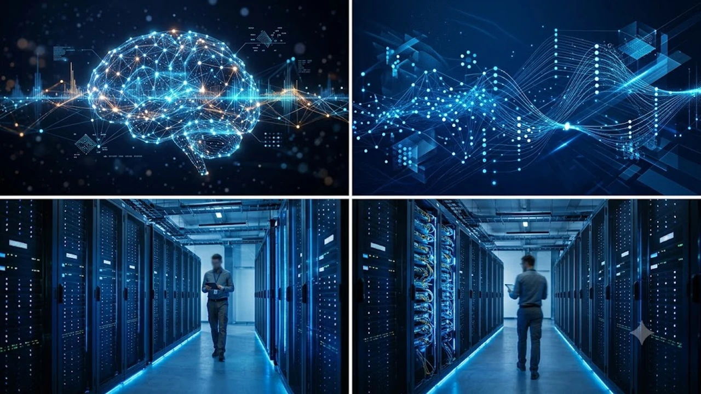

인공지능 모델 개발의 선두 주자 앤트로픽과 글로벌 콘텐츠 전송 네트워크(CDN) 강자 아카마이의 전략적 제휴는 클라우드 컴퓨팅 업계 전반에 거대한 파고를 일으키고 있습니다. 중앙 집중식 대규모 데이터센터 중심이던 생성형 AI 추론 환경이 엣지 컴퓨팅 인프라와 결합하면서 초저지연 서비스 구현의 새 전기가 마련되었습니다. 빅테크 3사가 독점하던 클라우드 시장 판도는 물론 기업용 AI 인프라 구축 방식까지 단번에 뒤흔드는 모양새입니다.

## 엣지 컴퓨팅과 결합한 클로드 모델의 초저지연 혁신

### 중앙 서버 의존도를 낮춘 분산 추론 아키텍처
기존 거대언어모델(LLM) 환경에서는 사용자가 프롬프트를 입력할 때마다 오레곤이나 버지니아에 위치한 초대형 데이터센터로 패킷을 전송해 연산을 마쳤습니다. 이번 제휴를 통해 앤트로픽의 최신 경량화 모델군은 전 세계 4,000개 이상의 접속 거점(PoP)을 확보한 아카마이의 분산 엣지 서버에 직접 안착합니다. 물리적 왕복 시간(RTT)을 획기적으로 줄여 사용자의 바로 코앞에서 연산을 끝마치는 구조입니다.

### 실시간 데이터 처리 속도의 비약적 도약
자율주행 원격 제어나 찰나의 순간에 호가가 갈리는 고빈도 알고리즘 매매 환경에서는 1밀리초(ms) 단위의 지연 시간 차이가 시스템 신뢰도를 판가름합니다.
- API 왕복 지연 시간을 기존 대비 절반 이하 수준으로 압축
- 로컬 캐싱 엔진과 소형 언어모델(SLM)을 연계해 트래픽 병목 완벽 차단
- 기지국 및 로컬 망 단절 상황에서도 독립 작동하는 엣지 자율성 확보

### 네트워크 대역폭 비용 절감과 경제성
기업의 클라우드 운영 비용(OpEx) 중 가장 큰 골칫거리였던 데이터 송출(Egress) 수수료를 극적으로 덜어냅니다. 방대한 원시 데이터를 본사 중앙 데이터센터로 전부 전송하는 대신, 엣지 노드에서 전처리와 필터링을 즉시 수행하므로 백본 네트워크 대역폭 소모를 최소화합니다.

## 빅테크 3사 중심 클라우드 과점 구도의 균열

### AWS·애저·GCP 종속성 탈피의 신호탄
앤트로픽은 아마존 웹 서비스(AWS)와 구글 클라우드로부터 천문학적인 자금을 수혈받으며 동맹 관계를 맺어왔습니다. 그러나 아카마이 인프라를 전면에 끌어들인 행보는 특정 하이퍼스케일러의 폐쇄적 생태계에 갇히지 않겠다는 명백한 독립 선언입니다. 독자 인프라를 다변화해 향후 가격 협상 주도권을 쥐고, 중앙 데이터센터의 대규모 먹통 사태에 대비한 이중 안전장치를 마련한 셈입니다.

### 독립형 AI 진영의 생태계 확장 가속화
마이크로소프트의 클라우드 정책에 묶인 오픈AI와 달리, 앤트로픽은 분산 네트워크 사업자와 손잡고 독자 노선을 개척하고 있습니다.
> 특정 하이퍼스케일러의 독점적 울타리를 벗어난 AI 서비스는 기업들에게 훨씬 유연한 인프라 선택권을 제공하며 가격 경쟁을 촉발합니다.
이로 인해 중견 IT 기업과 B2B 소프트웨어 공급사들도 고비용 장기 약정의 덫에 걸리지 않고 고성능 추론 API를 유연하게 채택할 환경이 갖춰졌습니다.

### 하이브리드 인프라 전환 흐름
많은 기업이 전산실 온프레미스 장비와 프라이빗 클라우드를 혼용하는 하이브리드 체제를 택합니다. 아카마이 커넥티드 클라우드는 기존 레거시 전산망과 앤트로픽 모델을 마찰 없이 엮어주는 핵심 완충지대 역할을 도맡습니다. 이러한 분산 인프라 전환에서 필수적으로 대두되는 보안 위협과 방어 체계는 [제로 트러스트 보안, AI 시대 바뀌는 핵심은?](/posts/latest-tech/zero-trust-ai-security-future-2026/) 글에서 다룬 핵심 원칙들과 맥을 같이합니다.

## 분산 네트워크 기반 AI 보안 체계의 진화

### 로컬 데이터 처리와 개인정보 보호 규제 대응
유럽연합의 인공지능법(EU AI Act)과 각국의 데이터 주권 규제는 사용자 데이터가 국경을 넘어 외부 서버로 빠져나가는 행위를 엄격히 규제합니다.
- 데이터 생성 국가 내부에서 즉각 분석을 완료하는 데이터 주권(Data Sovereignty) 충족
- 민감 정보의 중앙 집중화로 인한 대규모 해킹 피해 원천 봉쇄
- 엄격한 컴플라이언스가 요구되는 금융·원격의료·공공 인프라 영역으로의 안착 가속

### 엣지 레벨의 실시간 악성 트래픽 및 프롬프트 인젝션 방어
해커들의 악의적인 프롬프트 탈취 시도나 인프라 마비를 노린 디도스(DDoS) 공격은 상용 AI 모델의 최대 골칫거리입니다. 아카마이가 수십 년간 다져온 웹 애플리케이션 방화벽(WAF) 체계가 추론 엔진 앞단에 결합되어 악성 패킷을 엣지 단계에서 즉각 걸러냅니다. 모델 본체에 가해지는 보안 연산 과부하를 덜어내는 기술적 실익도 확실합니다.

### 무결성 검증을 통한 공급망 보안 강화
모델 가중치와 소프트웨어 패키지가 전 세계 노드로 전파되는 과정에서 일어날 수 있는 중간자 공격(MITM)을 암호화 서명 방식으로 차단합니다. 기업들이 앤트로픽 기반 설루션을 사내 핵심 시스템에 믿고 도입할 수 있는 기술적 보증 수표를 쥔 셈입니다.

## 차세대 온디바이스 및 IoT 시장으로의 침투력 강화

### 스마트 팩토리와 산업 현장의 실시간 비전 AI
제조업 공정 라인에서 불량을 잡아내는 머신비전 시스템은 지연 없는 판독이 필수입니다. 아카마이 노드를 거쳐 배포되는 앤트로픽 비전 파이프라인은 고해상도 산업용 카메라와 초근접 거리에서 맞물려 불량 판정 속도를 수 밀리초 단위로 단축합니다. 라인 가동 중단율을 낮추고 생산 효율을 끌어올리는 직접적인 원동력입니다.

### 스마트 모빌리티 및 로보틱스 시스템과의 시너지
로봇 공학과 무인 모빌리티 제어 시스템은 통신 환경이 흔들리는 야외에서도 끊김 없는 추론 성능을 보장받아야 합니다.
- 근거리 엣지 노드와 자율주행 차량 간 초고속 데이터 셔틀 구축
- 라이다(LiDAR)와 레이더 복합 데이터를 엣지에서 지체 없이 병합 연산
- 중앙 클라우드 네트워크 단절 시에도 엣지 백업을 통한 긴급 안전 정지 시퀀스 실행

하드웨어 장비와 지능형 인프라의 융합이 급물살을 타는 현시점, 실무 환경에 걸맞은 시스템 도입을 구상 중이라면 [스마트 디바이스 및 고성능 AI 장비 쿠팡에서 확인하기](https://www.coupang.com/np/search?q=%EC%8A%A4%EB%A7%88%ED%8A%B8%EA%B8%B0%EA%B8%B0%20AI%EA%B8%B0%EA%B8%B0&sourceType=affiliate&trackingCode=AF8691300)를 통해 최신 하드웨어 제원을 직접 대조해 보는 것도 현명한 접근입니다.

#앤트로픽 #아카마이 #엣지AI #클라우드컴퓨팅 #인공지능동향 #초저지연추론 #엔터프라이즈AI #사물인터넷인프라