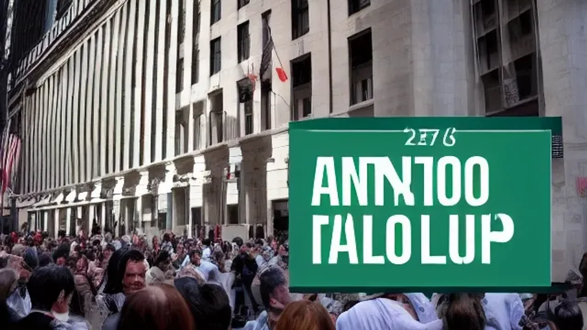
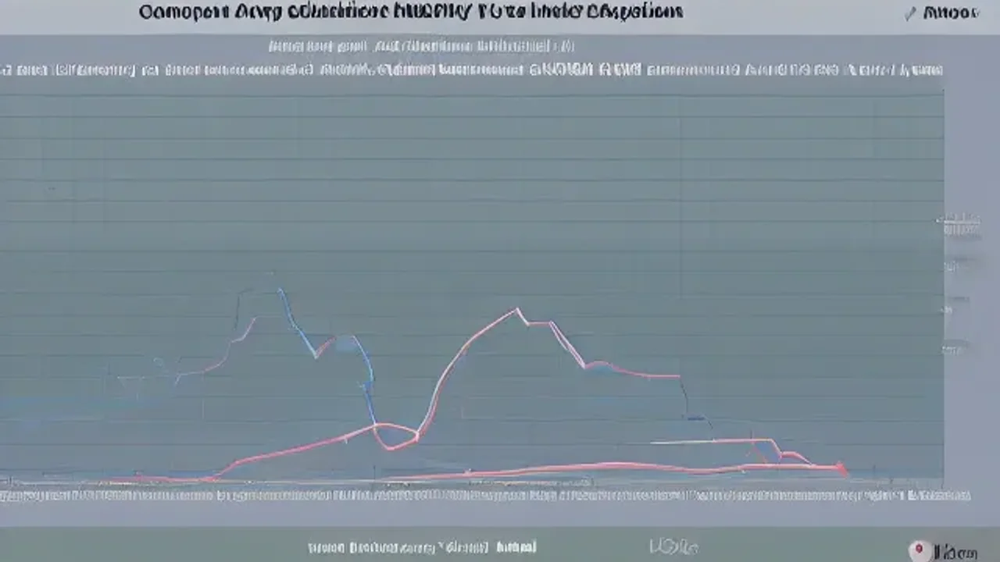

앤스로픽 IPO 기습 신청 소식은 실리콘밸리를 넘어 전 세계 금융권을 뒤흔드는 메가톤급 폭탄입니다. 생성형 AI 시장의 패권을 두고 벌어지는 앤스로픽 IPO 경쟁은 단순한 기업 상장을 넘어 기술 주도권의 거대한 축 이동을 의미합니다. 지금부터 월스트리트 머니 게임의 막전막후와 투자자들이 반드시 쥐어야 할 핵심 전략을 명확하게 짚어냅니다.

## 앤스로픽 IPO 기습 신청의 막전막후와 시장의 충격

### 오픈AI 독주 막는다: 앤스로픽이 '비밀 카드'를 꺼낸 진짜 이유
앤스로픽은 미국 증권거래위원회(SEC)에 비밀리에 상장 서류를 제출하며 정면 돌파를 선택했습니다. 업계 선두 주자인 오픈AI가 비상장 상태에서 대규모 자금을 독식하는 구조를 깨뜨리겠다는 명확한 계산이 깔려 있습니다. 막대한 인프라 비용을 감당하기 위해 제도권 자본시장의 공적 자금을 수혈받는 이 전략은 생성형 AI 진영의 자금 조달 패러다임을 바꿀 변곡점입니다.

### 밸류에이션 거품인가, 기회인가? 월스트리트 투자 전문가들의 초기 평가
뉴욕 증시 전문가들 사이에서는 기대와 우려가 팽팽하게 대립하는 양상입니다. 앤스로픽의 기업 가치가 수백억 달러로 치솟은 것을 두고 '닷컴버블의 재림'이라는 경고가 나오는 반면, 실질적인 B2B 매출 성장세를 근거로 든 합리적 평가라는 분석도 힘을 얻고 있습니다. 
> "현재 생성형 AI 기업들의 가치 평가는 단순한 현재 매출이 아닌, 향후 5년 내 하이퍼스케일러 시장을 누가 장악할 것인가에 대한 베팅이다." - 월스트리트 저널 투자 분석 리포트

### 마이크로소프트 vs 구글·아마존: 거대 테크 공룡들의 대리전 양상
이번 상장은 빅테크 기업들의 자존심 대결이기도 합니다. 오픈AI의 최대 투자자인 마이크로소프트에 맞서, 구글과 아마존은 앤스로픽에 각각 수십억 달러를 투자하며 강력한 우군 역할을 해왔습니다. 앤스로픽의 상장은 이들 백커(Backer) 클라우드 기업들의 인프라 매출 다각화와 직결되므로 빅테크 간의 대리전은 더욱 격화될 전망입니다.

## 오픈AI의 맞대응 시나리오와 생성형 AI 주식 투자 지형도

### 오픈AI도 결국 상장할까? 샘 올트먼의 고뇌와 예상 타임라인
경쟁사의 기습적인 상장 행보는 영리 법인 전환과 자금 조달을 고민하던 오픈AI의 샘 올트먼 최고경영자(CEO)를 강하게 자극했습니다. 비영리 이사회와의 갈등 구조를 정리 중인 오픈AI 역시 투자자들에게 자금 회수(Exit) 기회를 제공하고 천문학적인 컴퓨팅 비용을 조달하기 위해 상장 타임라인을 대폭 앞당길 가능성이 큽니다.

### 엔비디아부터 소프트웨어까지: AI 밸류체인별 수혜주 예측
이번 상장 모멘텀은 하드웨어에 집중되던 자본의 흐름을 소프트웨어와 서비스 레이어로 분산시키는 계기가 됩니다.
* **하드웨어 레이어:** 엔비디아, TSMC, SK하이닉스 등 HBM 및 GPU 공급망의 안정적 수요 유지
* **인프라 레이어:** 앤스로픽의 주 무대인 아마존 AWS, 구글 클라우드의 서버 사용량 가속화
* **어플리케이션 레이어:** 실질적인 B2B 솔루션을 제공하는 엔터프라이즈 AI 소프트웨어 기업들의 재평가

### 국내외 서학개미들이 지금 당장 주목해야 할 테크 펀드 및 상장지수펀드(ETF)
개인 투자자 입장에서 상장 전 스타트업에 직접 투자하기는 어렵기 때문에 앤스로픽 지분을 간접 보유한 상장사나 글로벌 테크 ETF를 주목해야 합니다. 아마존(AMZN)과 알파벳(GOOGL)의 포트폴리오 비중을 확인하고, 차세대 기술 주도주를 선제적으로 담는 글로벌 AI 혁신 ETF의 구성 종목 변화를 실시간으로 모니터링하는 노력이 요구됩니다.

## 앤스로픽 vs 오픈AI 기술 및 비즈니스 모델 경쟁력 비교

### 클로드(Claude) 3.5/4 vs GPT-5: 엔터프라이즈 시장에서의 실질적 승자는?
기술적 관점에서 앤스로픽의 LLM '클로드' 시리즈는 오픈AI의 GPT 시리즈를 턱밑까지 추격했습니다. 특히 코딩 역량과 장문 맥락 이해(Context Window) 능력에서 클로드는 개발자들 사이에서 압도적인 지지를 받으며 실무 핵심 툴로 자리 잡았습니다. [관련 글 보기](/posts/latest-tech/) B2B 시장에서는 단순한 인지도보다 업무 생산성 향상도가 선택을 좌우하기 때문에 두 진영의 벤치마크 점수 경쟁은 매달 치열하게 전개됩니다.

### 헌법적 AI(Constitutional AI)의 강점과 기업용 B2B 데이터 보안 우위성
앤스로픽이 가진 독보적인 무기는 '안전성'과 '윤리성'입니다. 인간의 피드백 없이도 AI 스스로 설정된 규범에 따라 정렬하는 '헌법적 AI' 기술은 할루시네이션(환각 현상)과 부적절한 답변을 최소화합니다. 이는 데이터 보안과 기업 이미지 실추를 극도로 꺼리는 금융권, 의료계 등 엔터프라이즈 고객사들이 오픈AI 대신 앤스로픽을 선택하게 만드는 핵심 요인입니다.

### 폭발하는 컴퓨팅 비용: 두 기업의 매출 대비 인프라 유지 비용의 한계점
양사 모두 극복해야 할 명확한 그림자도 존재합니다. 차세대 모델 학습을 위해 수만 대의 최신 GPU를 구동하면서 발생하는 비용은 상상을 초월합니다. 매출이 가파르게 성장하더라도 인프라 유지 비용의 지출 속도가 이를 앞지른다면 밑 빠진 독에 물 붓기 구조가 될 수 있으므로, 상장 이후 분기별 재무제표의 영업이익률 개선 여부를 철저히 따져봐야 합니다.

## AI 테크주 거품론 속에서 초보 투자자가 리스크 줄이는 방법

### 상장 직후 '공모가 거품'에 당하지 않는 적정 주가 판단 체크리스트
대형 테크 기업이 상장할 때 흔히 발생하는 '상장 첫날 폭등 후 급락' 패턴을 경계해야 합니다. 기관 투자자들의 의무 보유 확약(락업) 해제 물량과 시기를 반드시 체크해야만 고점에 물리는 불상사를 막을 수 있습니다. 
- 주가매출비율(PSR)이 동종 업계 평균 대비 과도하게 높지 않은가?
- 유상증자나 전환사채 등 잠재적 오버행(대량 대기물량) 리스크가 존재하는가?
- 글로벌 빅테크 파트너사들과의 라이선스 계약이 장기적으로 유효한가?

### 하이프 사이클(Hype Cycle)로 보는 현재 생성형 AI 시장의 객관적 위치
시장 조사기관 가트너의 하이프 사이클을 적용하면, 현재 생성형 AI 기술은 '기대의 정점'을 지나 실질적인 수익성을 증명해야 하는 '환멸의 계곡' 진입 직전에 위치해 있습니다. 이 시기에는 단순한 기술 환상으로 오르는 주식은 도태되고, 철저하게 매출과 순이익으로 증명하는 기업만 살아남는 옥석 가리기가 진행됩니다.

### 변동성을 이기는 분할 매수 타이밍과 롱텀(Long-term) 포트폴리오 구성법
시장의 변동성에 흔들리지 않으려면 철저한 분할 매수 원칙을 고수하는 포트폴리오 전략이 유효합니다. 자산의 전부를 상장 초기 테크주에 올인하기보다는, 현금 흐름이 견고한 빅테크 대형주를 베이스캠프로 삼고 앤스로픽과 같은 고성장 기술주는 전체 자산의 10\~15% 내외로 제한하여 리스크를 분산하는 접근이 현명합니다.

#앤스로픽IPO #오픈AI상장 #테크주식투자 #클로드4 #GPT5 #생성형AI트렌드 #빅테크대리전 #월스트리트투자전략