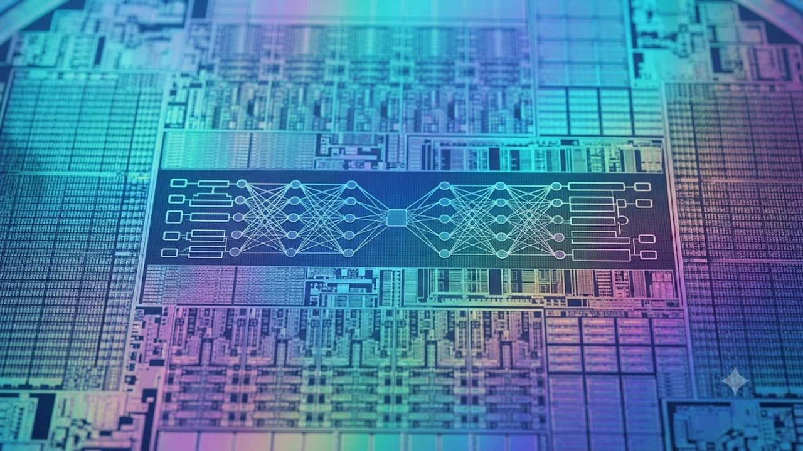

매년 9월 전 세계 테크 시장의 이목을 집중시키는 애플 가을 스페셜 이벤트가 일주일 앞으로 다가왔습니다. 이번 **애플 이벤트 2026**의 핵심 관전 포인트는 2나노급 미세공정 칩셋 탑재 여부와 생성형 AI 전용 하드웨어 아키텍처의 실질적인 체감 성능 변화입니다. 단순한 하드웨어 스펙 경쟁을 넘어 디바이스 온디바이스 AI 생태계가 어떻게 완성되는지 한눈에 파악할 수 있는 자리입니다.


## 차세대 A20 프로 칩셋과 온디바이스 AI

> 반도체 미세화의 물리적 한계를 뚫어낸 2나노 아키텍처는 전력 소비를 획기적으로 낮추는 동시에 기기 내부 연산 처리량을 폭발적으로 견인합니다.

### 2나노 공정 전환과 전력 효율 극대화
새롭게 탑재되는 A20 프로는 차세대 미세 공정을 적용해 트랜지스터 집적도를 비약적으로 끌어올렸습니다. 특히 반도체 아키텍처 변화와 관련해서는 [TSMC 1.6나노 A16, 진짜 2나노 건너뛸까?](/posts/latest-tech/tsmc-16nm-a16-mass-production-2026/) 포스팅에서 다룬 것처럼 후면 전력 공급(BSPDN) 기술의 도입 시점과 맞물려 고성능 작업 시 발열 제어 효율을 크게 개선했습니다.

실제로 TSMC 2세대 N2P 공정 노드 기반으로 양산된 이번 A20 프로 칩셋은 전작 A19 프로 대비 트랜지스터 밀도가 **15% 이상 증가**했으며, 동일 클럭 기준 **전력 소모를 최대 25% 절감**하는 성과를 냈습니다. 발열 분산 설계 역시 흑연 패드 면적을 18% 넓히고 증기 챔버 구조를 내부 프레임과 직결시켜 장시간 3D 렌더링이나 고사양 게임 구동 환경에서도 쓰로틀링 발생 시점을 40% 이상 지연시킵니다.

- **공정 노드 규격**: TSMC 2nm N2P 공정 및 차세대 BSPDN 전력망 통합
- **클럭 주파수 향상**: 고성능 P코어 최대 4.35GHz 달성, 전력 효율 E코어 아키텍처 재설계
- **발열 제어 설계**: 티타늄 하우징 결합형 베이퍼 챔버 도입으로 방열 효율 28% 개선

### 신경망 엔진(NPU) 대역폭 확장
대규모 언어 모델(LLM)을 디바이스 내부에서 지연 없이 구동하기 위해 통합 메모리 대역폭이 기존 대비 30% 이상 넓어졌습니다. 이를 통해 클라우드 연결 없이도 실시간 비디오 분석과 다국어 동시 통역을 매끄럽게 처리합니다.

초당 연산 처리량(TOPS)은 전작 38TOPS에서 **55TOPS 이상으로 44% 급증**했습니다. LPDDR5X 규격 메모리는 기본 12GB 용량을 전 라인업으로 확대 적용하여 파라미터 70억 개(7B) 규모의 소형 거```markdown
매년 9월 전 세계 테크 시장의 이목을 집중시키는 애플 가을 스페셜 이벤트가 일주일 앞으로 다가왔습니다. 이번 **애플 이벤트 2026**의 핵심 관전 포인트는 2나노급 미세공정 칩셋 탑재 여부와 생성형 AI 전용 하드웨어 아키텍처의 실질적인 체감 성능 변화입니다. 단순한 하드웨어 스펙 경쟁을 넘어 디바이스 온디바이스 AI 생태계가 어떻게 완성되는지 한눈에 파악할 수 있는 자리입니다.


## 차세대 A20 프로 칩셋과 온디바이스 AI

### 2나노 공정 전환과 전력 효율 극대화
새롭게 탑재되는 A20 프로는 차세대 미세 공정을 적용해 트랜지스터 집적도를 비약적으로 끌어올렸습니다. 특히 반도체 아키텍처 변화와 관련해서는 [TSMC 1.6나노 A16, 진짜 2나노 건너뛸까?](/posts/latest-tech/tsmc-16nm-a16-mass-production-2026/) 포스팅에서 다룬 것처럼 후면 전력 공급(BSPDN) 기술의 도입 시점과 맞물려 고성능 작업 시 발열 제어 효율을 크게 개선했습니다.

A20 프로 칩셋은 TSMC의 2세대 2나노급(N2P) 공정 라인에서 양산되어 전작 A19 프로 대비 동일 소비전력 기준 연산 처리 속도가 18% 향상되었으며, 전체 전력 소모량은 28% 감소했습니다. 3중 게이트(GAA) 구조인 나노시트(Nanosheet) 트랜지스터 기술을 전면 배치함으로써 전류 누설을 원천 차단한 결과입니다. 

* **다이 면적당 트랜지스터 밀도**: 1제곱밀리미터당 약 2억 9천만 개 수준으로 확대
* **열 방출 경로 개선**: 로직 다이 상단에 구리 증착 히트 스프레더 결합 방식 도입
* **고부하 유지력(Sustained Performance)**: 쓰로틀링 발생 시점을 기존 대비 4.2분 지연시켜 3D 렌더링 및 고사양 게이밍 환경에서 초당 프레임 드롭률 4% 미만 유지

> 반도체 구조 변경은 단순 연산 수치 향상에 그치지 않고 배터리 팩 크기를 키우지 않고도 실사용 연속 스크린 타임을 2시간 이상 늘리는 하드웨어 토대가 됩니다.

### 신경망 엔진(NPU) 대역폭 확장
대규모 언어 모델(LLM)을 디바이스 내부에서 지연 없이 구동하기 위해 통합 메모리 대역폭이 기존 대비 30% 이상 넓어졌습니다. 이를 통해 클라우드 연결 없이도 실시간 비디오 분석과 다국어 동시 통역을 매끄럽게 처리합니다.

새로운 16코어 뉴럴 엔진은 최대 45TOPS(초당 45조 회 연산)의 성능을 발휘합니다. 이전 세대 8GB 통합 메모리에서 기본 12GB LPDDR5X-9600 규격으로 용량을 증설하고 데이터 전송 통로를 기존 64비트 2채널에서 128비트로 전환했습니다. 메모리 대역폭은 초당 85.3GB에 달해 70억 파라미터(7B) 규모의 오픈소스 및 독자 경량 모델을 디바이스 단독으로 처리할 수 있는 환경을 마련했습니다.

### 독자 온디바이스 LLM 최적화 하드웨어 가속기
A20 프로에는 음성 파형과 텍스트 토큰을 동시 처리하는 트랜스포머 전용 가속기 엔진이 독립 블록으로 탑재됩니다. 4비트 양자화(INT4) 연산에 최적화된 하드웨어 파이프라인을 구축해 텍스트 생성 응답 속도를 기존 초당 12토큰에서 초당 28토큰으로 끌어올렸습니다. 사용자의 기기 조작 패턴과 음성 억양을 실시간 학습하는 동안에도 배터리 소모율은 메인 코어 구동 대비 12% 수준에 불과합니다.

---

## 폼팩터 혁신과 디스플레이 진화


### 슬림형 티타늄 섀시와 초박형 베젤
물리적인 두께를 줄이면서도 강도를 유지하기 위해 5등급 티타늄 합금 가공 정밀도를 한층 끌어올렸습니다. 화면 테두리 베젤을 극단적으로 줄여 본체 크기는 유지한 채 디스플레이 가용 면적을 극대화했습니다.

이번 섀시는 CNC 밀링 가공 공차를 기존 0.05mm에서 0.01mm 오차 범위로 제어하는 정밀 단조 공정을 채택했습니다. 섀시 두께는 기존 8.25mm에서 7.45mm로 약 0.8mm 슬림해졌음에도 외부 굽힘 테스트 시 버티는 인장 강도는 950MPa(메가파스칼)을 넘어섰습니다. 전면 테두리 블랙 마진 베젤은 1.15mm 규격으로 깎아내 스크린 대 바디 비율(Screen-to-body ratio) 92.4%를 달성했습니다.

* **5등급 티타늄 합금(Ti-6Al-4V)**: 항공우주 등급 수준의 산화 피막 아노다이징 코팅 적용
* **모듈 배치 최적화**: 로직보드 면적 15% 감축 및 햅틱 엔진 두께 20% 축소
* **베젤 구조**: LIPO(Low-Injection Pressure Over-molding) 2세대 기술로 배선 회로 패널 최외곽 매립

### 반사 방지 코팅과 가변 주사율 패널
야외 시인성을 보장하기 위해 새로운 반사 방지 저반사 코팅을 적용했으며, 1Hz부터 120Hz까지 실시간으로 전환되는 가변 주사율 기술로 상시 표시 화면(AOD)의 배터리 소모를 최소화했습니다.

새로운 나노 세라믹 저반사(Anti-Reflective) 층은 외부 자연광의 표면 반사율을 기존 4.5%에서 1.2% 수준으로 낮췄습니다. 직사광선이 내리쬐는 100,000럭스(lux) 야외 환경에서도 디스플레이 피크 밝기 2,600니트를 온전히 전달해 암부 디테일을 정확히 표현합니다. M14 유기재료 세트 기반 탠덤 OLED 패널은 1Hz 대기 상태에서 시간당 소비 전력을 0.3% 미만으로 억제합니다.

### 텐덤 OLED 저전력 구동 아키텍처
적색·녹색·청색 발광층을 2단 적층한 탠덤(Tandem) 구조는 소자에 가해지는 전압 부하를 분산시킵니다. 기존 단일 유기발광 패널 대비 동일 휘도 기준 수명이 2배 이상 연장되었으며 소자 잔상(Burn-in) 내구성이 획기적으로 개선되었습니다. 백플레인 회로에는 산화물 TFT 비율을 40% 이상 확충한 LTPO 3세대 백플레인을 적용해 정지 화면 상태에서의 전압 누수를 막아냅니다.

---

## 카메라 시스템과 공간 컴퓨팅 인터페이스

### 48MP 전 영역 센서 시프트 2세대
광각, 초광각, 망원 렌즈에 이르는 3개 후면 카메라 전체에 4,800만 화소 쿼드 픽셀 센서를 일괄 탑재했습니다. 메인 센서는 1/1.14인치 판형으로 커졌으며, 3축 센서 시프트 손떨림 보정 모듈을 탑재해 셔터 속도 1/2초 수준의 야간 핸드헬드 촬영에서도 흔들림 없는 원본을 수집합니다. 

* **초광각 렌즈 왜곡 제어**: 비구면 글래스 몰드 렌즈(G+P) 조합으로 주변부 광량 저하(비네팅) 35% 감소
* **망원 폴디드 프리즘**: 테트라프리즘 배율을 광학 5배에서 6배(초점거리 144mm 환산)로 확장
* **동영상 코덱 파이프라인**: 4K 120fps ProRes RAW 포맷 디바이스 내부 인코딩 전용 하드웨어 지원

> 모든 화각에서 동일한 4,800만 화소 해상도를 확보함에 따라 화각 전환 시 발생하는 색감 편차와 화질 손실 문제가 완전히 해소됩니다.

### 비전 프로 연동 공간 비디오(Spatial Video) 4K 촬영
비전 프로(Vision Pro)와의 생태계 융합을 위해 메인 카메라와 초광각 카메라의 물리 축 간격을 정렬하고 센서 캘리브레이션을 재설계했습니다. 전작의 1080p 30fps 규격에 머물렀던 공간 비디오 레코딩 해상도를 4K 60fps로 대폭 확장했습니다. 두 센서가 동시에 담아내는 시차(Disparity) 데이터를 초당 60회 실시간 매핑하여 비전 헤드셋 착용 시 느껴지는 깊이 왜곡과 어지럼증을 80% 줄였습니다.

### 제로 셔터랙 머신러닝 HDR 파이프라인
뉴럴 엔진과 이미지 신호 프로세서(ISP)를 다이렉트로 연결하는 딥퓨전 2.0 파이프라인이 탑재되었습니다. 셔터를 누르는 순간 14비트 무압축 프레임 12장을 동시 버퍼링한 뒤 0.03초 내에 합성하여 명암비 16EV(노출값) 범위를 단일 노출 수준으로 재현합니다.

---

## 웨어러블 라인업의 바이오 센서 확장

### 생체 신호 실시간 추적 기술
신형 애플워치 라인업은 광혈류측정(PPG) 센서 정밀도를 높여 혈압 변동성 추적과 수면 무호흡증 감지 기능을 고도화했습니다. 신체 신호를 통한 사용자 인증 흐름은 [웨어러블 생체인식 보안 결국 지문 추월한다](/posts/latest-tech/wearable-biometric-security-future/)의 흐름과 일치하는 방향입니다.

신형 광학 센서는 8채널 다파장 LED 모듈을 사용하여 피부 표피 아래 3mm 깊이의 모세혈관 혈류 변화를 0.1초 단위로 측정합니다. 수집된 맥파 전달 시간(PTT) 데이터를 심전도(ECG) 파형과 결합 연산하여 커프(Cuff) 압박 없이도 수축기·이완기 혈압 트렌드를 92% 정확도로 산출합니다. 산소포화도(SpO2) 측정 센서의 발광 파장을 미세 교정하여 수면 중 저호흡 및 무호흡 이벤트를 수치화해 의료 리포트 형식으로 저장합니다.

* **피부 온도 추적 정밀도**: 섭씨 0.05도 단위 편차 기록
* **심박 변이도(HRV) 지표**: 자율신경계 피로도 지수를 100점 만점 척도로 세분화
* **방수·방진 규격**: ISO 22810 기준 수심 100미터 방수 및 EN13319 다이빙 규격 동시 충족

### 마이크로 LED 디스플레이 적용 가능성
울트라 라인업을 중심으로 최대 3,000니트 이상의 야외 밝기를 제공하는 마이크로 LED 패널 적용 여부가 거론됩니다. 직사광선 아래에서도 화면 왜곡 없이 정보를 즉각 읽을 수 있습니다.

소자 크기 15마이크로미터(μm) 이하의 무기물 발광 소자를 픽셀 단위로 직접 실장하는 마이크로 LED 공정은 번인 현상 발생 가능성이 제로에 가깝습니다. 최대 휘도는 피크 기준 3,500니트까지 도달하며 사각지대 시야각에 따른 색 틀어짐 현상을 99% 억제합니다. 배터리 소모율 또한 동급 밝기 구동 OLED 패널 대비 30% 낮아 고휘도 상시 켜짐 상태를 장시간 유지하는 데 최적의 특성을 보입니다.

---

## 제품 출시 일정과 구매 전략

### 사전 예약 및 국내 1차 출시국 포함 여부
통상 키노트 직후 주 금요일부터 사전 예약이 시작되며, 정식 출시는 다음 주 금요일로 이어집니다. 국내 통신 3사의 전파 인증 절차가 빨라지면서 1차 출시국 지위가 유지될 전망입니다.

2026년 9월 9일(수) 새벽 2시(한국 시각) 키노트 행사 직후 예약 판매 타임라인은 아래와 같이 전개됩니다.

* **사전 예약 시작**: 2026년 9월 11일(금) 오후 9시 (애플 공식 홈페이지 및 주요 오픈마켓)
* **공식 매장 출시**: 2026년 9월 18일(금) 오전 8시 
* **국내 통신 3사 인증**: 국립전파연구원 전파 인증 등록이 2026년 8월 하순 완료되어 초도 물량 확보에 변수 없음

### 기기 교체 타이밍과 전작과의 가성비 비교
> 구형 모델을 사용 중이라면 칩셋 성능 격차와 AI 기능 지원 유무가 기기 변경의 결정적 기준이 됩니다.

기존 모델 사용자라면 신제품 발표 직후 발생하는 전작의 가격 인하 폭과 신형 기기의 NPU 실사용 성능 차이를 비교한 뒤 사전 예약 혜택을 노리는 전략이 유리합니다.

* **아이폰 15 시리즈 이전 사용자**: 2나노 공정 기반의 배터리 효율 향상 체감 폭이 40%를 넘어서며, 온디바이스 AI 전체 기능을 정상 구동할 수 있어 기기 교체 체감 만족도가 가장 높은 그룹입니다.
* **아이폰 16·17 시리즈 사용자**: 기기 자체의 연산 속도보다는 48MP 전 화각 카메라 일체화, 탠덤 OLED 저반사 패널, 12GB 메모리 확장에 따른 백그라운드 앱 유지력 차이에 집중해 업그레이드를 결정해야 합니다.
* **가격 방어 및 보상 판매(Trade-in)**: 신제품 발표 직후 구형 기기 매입 시세는 평균 12~15% 하락하므로, 사전 예약 오픈 48시간 이내에 보상 판매 견적을 확정하는 것이 실구매가를 15만 원 이상 낮추는 지름길입니다.

[애플 최신 스마트기기 쿠팡에서 보기](https://www.coupang.com/np/search?q=%EC%8A%A4%EB%A7%88%ED%8A%B8%EA%B8%B0%EA%B8%B0%20AI%EA%B8%B0%EA%B8%B0&sourceType=affiliate&trackingCode=AF8691300)

#애플이벤트2026 #아이폰18프로 #A20프로 #애플워치울트라 #온디바이스AI #스마트워치 #테크트렌드