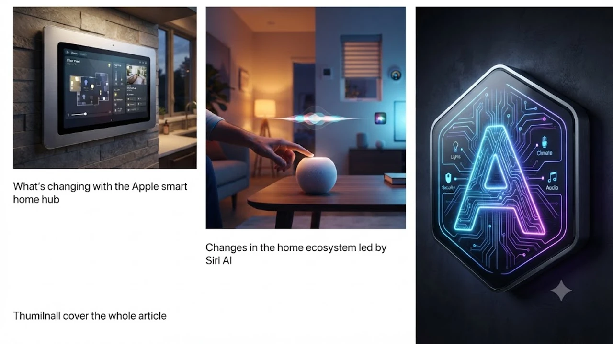

2026년 10월, 글로벌 테크 시장에서 **애플 스마트홈 허브** 출시가 가시화되면서 홈 오토메이션 생태계가 급변하고 있다. 이번에 공개되는 차세대 허브는 온디바이스 AI와 음성 인터페이스를 결합해 가전 제어의 방식을 완전히 뒤흔들 핵심 기기로 지목된다. 스마트 홈 기기 판도를 뒤흔들 신제품의 실체를 해부한다.

## 애플 스마트 홈 허브, 무엇이 달라지는가
### 10월 13일 이벤트 핵심 요약
블룸버그 및 주요 외신 보도에 따르면, 애플은 오는 10월 13일 스페셜 이벤트를 개최하고 홈킷 생태계를 통합할 신규 디바이스를 선보인다. 기존의 단순한 스피커 역할을 넘어, 화면과 고성능 칩셋을 탑재해 독립적인 연산이 가능한 점이 결정적이다. 외부 서버 연결 없이 집안의 모든 스마트 기기를 즉각 제어하는 구조다.

> "이번 신제품은 단순한 음성 인식 스피커가 아니라, 가정 내 모든 사물을 연결하는 중앙 제어 타워의 역할을 수행합니다." — 테크 전문 외신 보도 인용

### 기존 스마트 홈 기기와의 차별점
기존 아이패드 벽걸이 거치 방식이나 일반 홈팟 시리즈와 비교했을 때, 이번 허브는 온디바이스 AI 구동을 전제로 설계되었다. 반응 속도가 비약적으로 향상되었으며, 디스플레이 시야각과 터치 반응성을 강화해 주방이나 거실 벽면에 거치했을 때의 사용성을 극대화했다. 

## Siri AI가 이끄는 홈 생태계의 변화
### 온디바이스 AI 기반 가전 제어
새로운 허브에 탑재된 Siri AI는 사용자의 일상 패턴을 학습하여 조명, 온도, 보안 장치를 자동 조율한다. 사용자가 기상하는 시간에 맞춰 거실 온도를 조절하고, 외출 시 모든 전자기기의 대기 전력을 차단하는 자율형 에이전트 기능을 수행한다. 기기 내부에서 모든 연산이 처리되므로 외부 유출 우려를 원천 차단한다. 네트워크 보안 환경의 변화는 [제로 트러스트 보안, AI 시대 바뀌는 핵심은?](/posts/latest-tech/zero-trust-ai-security-future-2026/) 포스팅에서도 다룬 바와 같이, 홈 네트워크 영역에서도 핵심 과제로 부상했다.

### 홈팟 미니 및 애플 TV 연동성
차세대 홈팟 미니 및 고성능 애플 TV와의 실시간 멀티스페이스 연동 기능도 탑재된다. 집안 여러 곳에 배치된 기기들이 사용자 위치를 실시간으로 파악하여 소리나 디스플레이 인터페이스를 자연스럽게 전환한다. 가족 구성원별 음성 프로필을 자동 인식해 개별 맞춤형 음악 재생이나 일정 안내를 제공하는 점이 강점이다.

## 예상 출시일 및 국내 출시 전망
### 글로벌 예상 가격 및 출시 일정
북미 및 유럽 시장에서는 10월 이벤트 직후 예약 판매에 돌입하여 11월 초 본격적인 출하가 이루어진다. 예상 가격대는 기능과 화면 크기에 따라 200달러에서 300달러 선으로 책정될 가능성이 높으며, 기존 스마트 디스플레이 시장의 경쟁 제품들과 치열한 각축전을 예고한다.

### 국내 출시일 및 호환성 체크포인트
한국어 Siri AI의 고도화 일정에 맞춰 국내 정식 출시일은 올해 연말 혹은 내년 초가 유력하다. 국내 스마트 가전 브랜드의 사물인터넷 플랫폼 및 글로벌 표준인 Matter 프로토콜과의 호환성 확보 여부가 국내 성패를 가를 핵심 변수다.

## 애플 스마트 홈 허브, 지금 주목해야 할 이유
### 테크 업계와 스마트 홈 시장의 반응
구글 홈과 아마존 알렉사 진영이 주도해 온 스마트 홈 시장에 애플이 강력한 출사표를 던졌다. 개발자 생태계를 위한 새로운 홈OS(HomeOS) API가 공개될 것으로 알려지면서, 서드파티 가전 제조사들과의 연동성이 대폭 확장될 전망이다.

### 구매 전 최종 체크포인트 (장단점)
기존 애플 생태계를 적극적으로 활용하는 사용자라면 체감할 수 있는 편의성이 매우 크다. 다만, 고가 라인업으로 출시될 경우 초기 진입 장벽이 높고, 홈킷 지원 기기 풀이 상대적으로 제한적일 수 있다는 점은 신중히 고려해야 할 대목이다. 홈 네트워크 구축을 고민 중이라면 스마트 홈 허브 전용 [애플 스마트홈 허브 세트 구경하기](https://www.coupang.com/np/search?q=%EC%8A%A4%EB%A7%88%ED%8A%B8%ED%99%88+%ED%97%88%EB%B8%8C&sourceType=affiliate&trackingCode=AF8691300) 제품군을 참고하는 것도 방법이다.

#애플스마트홈허브 #애플스마트홈 #SiriAI #홈킷 #스마트가전제어 #애플이벤트 #스마트디스플레이 #온디바이스AI #스마트홈오토메이션