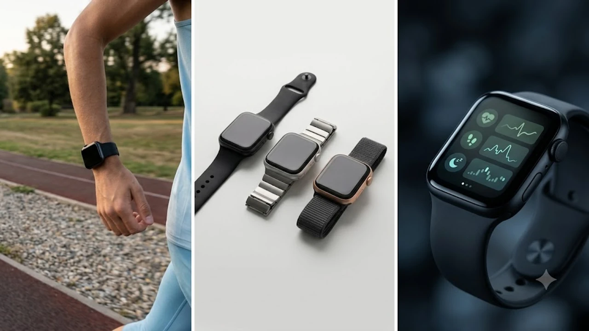

## 1. 애플워치 Series 10 하드웨어 변화와 건강 센서 진화

2024년 9월 20일 출시된 애플워치 Series 10은 알루미늄 기준 599,000원, 티타늄 기준 999,000원에 책정되었습니다. 케이스 크기는 기존 41mm/45mm 체계에서 **42mm와 46mm**로 커졌으나, 두께는 역대 모델 중 가장 얇은 **9.7mm**로 줄었습니다. Series 9의 10.7mm 대비 정확히 1.0mm(약 10%) 감소한 수치입니다. 무게 역시 알루미늄 46mm 모델 기준 36.4g으로 전작 45mm(38.7g) 대비 2.3g 가벼워졌습니다.

후면 센서 클러스터는 3세대 전기 심장 센서와 2세대 광학 심박 센서를 결합한 구조입니다. 하우징 높이가 낮아지고 곡률이 완만해지면서 피부 표면과 센서 간 접촉 면적이 넓어졌습니다. 신체 움직임에 의해 센서가 들뜨면서 발생하던 광혈류측정(PPG) 신호 간섭이 줄어 야간 생체 데이터 수집 정확도가 상승했습니다. 전력 제어 회로 개선으로 30분 만에 배터리 0%에서 80%까지 채우며, 15분 급속 충전으로 8시간 수면 추적을 완료합니다.

### 슬림해진 9.7mm 폼팩터와 와이드 OLED가 건강 측정에 미치는 영향
- **두께 1.0mm 축소**: 9.7mm 초박형 바디로 수면 중 뒤척일 때 침구류에 시계 테두리가 걸리는 간섭 현상 차단
- **광시야각 OLED 패널**: 비스듬한 시야각에서 빛 방출량을 늘려 Series 9 대비 최대 40% 밝은 측면 화면을 제공하며, 러닝 중 손목을 돌리지 않고도 심박 구간 확인
- **피부 밀착력 강화**: 평평해진 후면 하우징 덕에 척골 융기 부위 들뜸 현상이 완화되어 야간 손목 체온 측정 오차율 억제

### S10 SiP 뉴럴 엔진과 온디바이스 헬스 데이터 처리
- **4코어 뉴럴 엔진(Neural Engine)**: 머신러닝 연산을 칩 내부에서 직접 실행해 생체 신호 노이즈를 밀리초(ms) 단위로 필터링
- **로컬 보안 처리**: 심박 변이도(HRV), 이상 심박수, 호흡 주기 데이터를 외부 서버 전송 없이 기기 내부에서 암호화 보관
- **센서 전력 최적화**: 1초 간격 심박 샘플링 환경에서도 배터리 누수를 방지해 표준 18시간 구동 시간 유지

---

## 2. 수면 무호흡증 감지 기능과 고도화된 수면 추적

Series 10의 핵심 생체 측정 기능은 **가속도계 기반 수면 무호흡증 감지 알고리즘**입니다. 미국 FDA는 2024년 9월 13일 드 노보(De Novo) 분류로 해당 소프트웨어를 공식 승인했으며, 국내 식품의약품안전처 역시 인증을 완료했습니다. 가속도계 센서가 수면 중 상기도 폐쇄로 발생하는 흉벽과 손목의 미세 진동 중단을 포착해 **호흡 장애(Breathing Disturbances)** 메트릭으로 환산합니다.

> "수면 무호흡증 알림은 확정 진단 장비가 아니며, 30일 데이터 누적치 중 중등도(시간당 무호흡 15~30회)에서 중증(시간당 30회 이상) 징후가 지속 포착될 때 병원 수면다원검사를 받도록 유도하는 예방 스크리닝 기능입니다."

### 가속도계 센서 기반 '호흡 장애' 메트릭의 작동 원리
- **30일 이동 누적 분석**: 매일 밤 호흡 불안정 빈도를 수집하고 30일 단위로 알고리즘 판정 실행
- **이분법적 상태 분류**: 수치를 '상승 안 됨(Not Elevated)'과 '상승(Elevated)'으로 구분해 이상 패턴 반복 시 즉각 경고 알림 발송
- **임상 리포트 PDF 출력**: 의사 상담 시 제출할 수 있도록 30일간의 호흡 장애 추세선, 수면 지속 시간, 발생 빈도를 단일 문서로 생성

### 수면 단계 분석(REM·코어·깊은 수면)과 야간 손목 온도 측정
- **5초 간격 온도 계측**: 수면 시간 동안 5초 주기로 피부 온도를 측정해 개인 기준선 대비 **±0.01°C 단위** 편차 감지
- **수면 단계 판독**: 가속도계와 PPG 심박 센서를 연동해 렘(REM) 수면, 코어 수면, 깊은 수면, 각성 상태의 분 단위 타임라인 산출
- **활력 징후(Vitals) 앱 연동**: 안정 시 심박수, 호흡수, 손목 온도, 수면 지속 시간을 기준 범위(Typical Range)와 대조해 이상 징후 조기 포착

---

## 3. 심전도(ECG) 및 심혈관 모니터링 실사용 정확도

Series 10의 디지털 크라운(Digital Crown) 티타늄 전극과 후면 사파이어 크리스털 센서는 **1유도(Lead I) 심전도**를 기록합니다. 디지털 크라운에 검지 손가락을 30초간 접촉하면 심근 세포 탈분극 시 발생하는 미세 전류를 측정합니다. 측정치는 동리듬(Sinus Rhythm), 심방세동(AFib), 저심박수, 고심박수 4개 범주로 자동 분류됩니다. 백그라운드에서는 광학 심장 센서가 2시간 주기로 불규칙한 맥박 패턴을 감시합니다.

### 30초 심전도 측정 프로토콜과 심방세동(AFib) 감지율
- **측정 유효 범위**: 심박수 50~150BPM 구간에서 판정 알고리즘 작동(150BPM 초과 시 판독 불가 분류)
- **심방세동 기록(AFib History)**: 최소 6주 이상 착용 시 주간 단위 심방세동 발생 비율을 백분율(%)로 환산해 표시
- **의료기관 제출용 서식**: 병원 표준 25mm/s, 10mm/mV 규격의 1유도 파형 그래프를 벡터 PDF 형식으로 즉시 생성

### 운동 중 심박수 영역(HR Zones)과 유산소 피트니스(VO2 Max)
- **5단계 맞춤 심박 구간**: 예비 심박수(Karvonen 공식)를 적용해 존 1(최대 심박수의 50~60%)부터 존 5(90% 이상)까지 실시간 표시
- **VO2 Max(최대 산소 섭취량) 측정**: 평지 야외 걷기 및 달리기 20분 이상 지속 시 GPS 이동 거리와 심박 반응도를 대조해 14~65ml/kg/min 범위 내 산출
- **심박수 회복 메트릭**: 고강도 인터벌 세션 종료 직후 1분과 2분 시점의 심박수 하강 수치를 추적해 자율신경계 피로도 판단

---

## 4. 비침습 혈당 측정 루머의 진실과 대사 건강 대안

애플워치 Series 10에는 **비침습 광학 혈당 센서가 탑재되지 않았습니다.** 바늘 채혈 없는 혈당 측정을 위해 애플 탐색설계그룹(EAG)이 개발 중인 기술은 1,300~2,100nm 파장 대역의 단파장 적외선(SWIR)을 활용한 광흡수 분광법 방식입니다. 피하 간질액 내 포도당 농도를 피부 표면에서 비침습 측정하려면 피부 두께, 체온, 멜라닌 색소 차이에 따른 빛 산란 노이즈를 극복해야 합니다.

임상 허가 기준인 평균 절대 상대 오차율(MARD) 10% 미만을 확보하지 못했으며, 정밀 분광 칩과 실리콘 포토닉스 모듈을 9.7mm 두께 내부에 물리적으로 패키징하는 공학적 한계로 인해 상용화까지 최소 3~5년의 개발 기간이 더 소요될 것으로 추정됩니다. 현재 시점의 실질적 대안은 외부 혈당 센서와의 연동뿐입니다.

### 비침습 혈당 모니터링 상용화 지연 원인과 기술적 한계
- **광학 신호 간섭**: 모세혈관 깊이 차이와 수분율 변화로 인해 반사되는 분광 신호 왜곡 발생
- **MARD 기준 미달**: 미국 당뇨병학회(ADA) 권고 임상 기준치(10% 미만) 도달 실패로 FDA 승인 신청 지연
- **하드웨어 집적 난제**: 분광 레이저 발광 소자와 수광 센서 모듈 소형화 실패로 워치 내부 공간 확보 불가

### 서드파티 CGM(연속혈당측정기) 연동 및 혈중 산소 규제 현황
- **다이렉트 블루투스 통신**: 덱스콤(Dexcom) G7 및 프리스타일 리브레(FreeStyle Libre) 3 센서와 워치를 직접 연결해 아이폰 경유 없이 데이터 수신
- **워치 페이스 컴플리케이션**: 5분 주기로 자동 갱신되는 혈당 수치와 실시간 급상승·급하강 추세 화살표를 시계 화면에 배치
- **혈중 산소(SpO2) 기능 이슈**: 마시모(Masimo)사와의 펄스 옥시미터 특허 분쟁으로 미국 내 판매 기기는 혈중 산소 기능이 비활성화되었으나, 대한민국 정식 발매 모델은 70~100% 범위 SpO2 수동 측정 및 야간 백그라운드 측정 정상 작동

---

## 5. 애플워치 Series 10 건강 기능 기반 구매 가이드

기기 교체 실익은 현재 착용 중인 기종과 주력으로 관리하려는 건강 지표에 따라 분명하게 나뉩니다. Series 7 이하 기기 사용자는 폼팩터 슬림화, 충전 속도, 수면 무호흡증 감지 알고리즘 적용에서 즉각적인 체감 업그레이드를 얻습니다. 반면 Series 9 사용자는 S9/S10 칩셋 성능 차이가 미미하고 watchOS 업데이트를 통해 동일한 건강 기능을 지원받으므로 교체 실익이 크지 않습니다.

### 수면 무호흡 및 심혈관 관리가 최우선인 추천 대상
- **야간 코골이 및 만성 피로군**: 수면 무호흡증 조기 판별과 30일 누적 호흡 장애 데이터를 병원 진료 자료로 활용하려는 사용자
- **심장 질환 가족력 보유자**: 돌발적인 심계항진 증상 발생 시 즉각 30초 ECG 파형을 기록해 전문의에게 전달하려는 사용자
- **야간 워치 착용 실패자**: 이전 모델(10.7mm)의 두께와 무게 때문에 수면 중 착용을 중단했던 사용자

### 기종별 업그레이드 실익 비교
- **Series 9 사용자**: 수면 무호흡 감지와 활력 징후 앱이 동일하게 지원되므로, 9.7mm 두께와 30분 80% 급속 충전 필요성만 따져보고 결정
- **Series 7 이하 사용자**: 3세대 심장 센서 교체, 수면 무호흡 알림 추가, 15분 수면 급속 충전, 체온 센서 기반 배란일 추정 등 헬스 기능 전반의 체감 성능 향상
- **Apple Watch Ultra 2 사용자**: 100m 방수 등급과 36시간 배터리 타임을 갖춘 모델이므로, 9.7mm 두께를 확보하는 대가로 배터리 지속 시간이 절반(18시간)으로 줄어드는 점을 감수해야 함

#애플워치10 #애플워치Series10 #스마트워치건강 #수면무호흡증 #애플워치심전도 #애플워치혈당 #연속혈당측정기 #웨어러블테크 #헬스케어기기