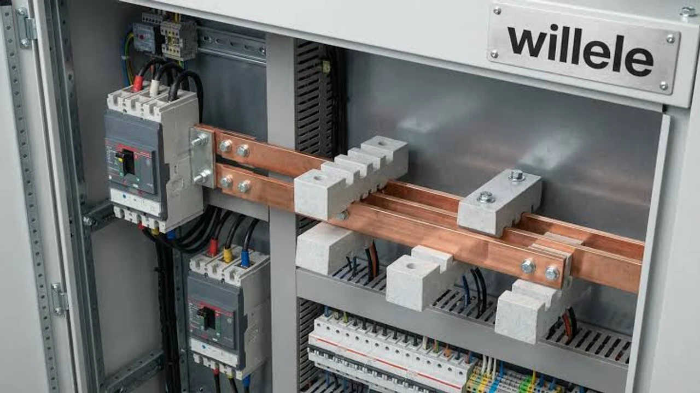
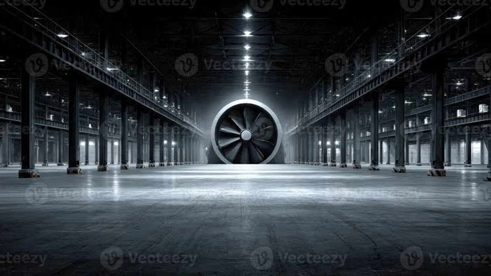

인공지능 패권 경쟁이 격화되면서 **AWS 데이터센터** 증설을 둘러싼 지역사회의 저항이 전례 없는 수준으로 거세지고 있습니다. 글로벌 클라우드 1위 아마존웹서비스가 전력망 과부하와 주민 갈등을 진화하기 위해 10억 달러라는 천문학적 상생 기금을 내놓은 배경에는 단순한 기업 이미지 개선을 넘어선 절박한 생존 셈법이 자리합니다. 차세대 인공지능 인프라 확장을 가로막는 현장 갈등의 실체와 이것이 빅테크 생태계에 미치는 파장을 분석합니다.

## AWS AI 데이터센터의 급제동과 10억 달러 기금 전격 투입

### 맷 가먼 CEO의 경고: "주민 반발이 미국 AI 패권을 위협한다"
아마존웹서비스 최고경영자 맷 가먼은 최근 공식 석상에서 거침없는 발언을 쏟아냈습니다. 최첨단 가속기 칩셋을 산더미처럼 쌓아두더라도 현지 승인을 얻지 못해 전원 플러그조차 꽂지 못하면 국가 차원의 기술 주도권이 한순간에 무너진다는 지적입니다. 과거 빅테크 기업들은 대규모 연산 용량 확보에만 골몰했으나, 이제는 착공조차 가로막는 행정 소송과 인허가 거부라는 거대한 현실 장벽에 부딪혔습니다.

### 5년간 10억 달러 투입, 어디에 어떻게 쓰이나
이번에 발표된 10억 달러(약 1조 3,500억 원) 규모의 상생 기금은 단순 선심성 지원금이 아닙니다. 향후 5년에 걸쳐 전력 인프라 확충 부담 경감, 지자체 수도망 개보수, 소음 완충 녹지 조성에 단계별로 투입됩니다.
* **지역 송전선로 보강 지원:** 송전선 증설 과정에서 발생하는 지자체 재정 부담 직접 분담
* **수자원 재순환 시설 구축:** 냉각용 공업용수가 민간 상수도 공급을 침해하지 않도록 정화 설비 기증
* **커뮤니티 환원 프로그램:** 현지 청년 기술 인력 양성과 지자체 세수 결손 보전 방안 마련

### 인프라 확충의 비밀주의에서 상생 전략으로의 피벗
그동안 빅테크들은 부동산을 비밀리에 사들이고 비공개 전력 계약을 맺은 뒤 기습 착공하는 밀실 작전을 주로 썼습니다. 주민들의 조직적 반대를 피하려던 꼼수는 오히려 거센 역풍을 불렀습니다. 불신이 극에 달하자 AWS는 사업 초기 단계부터 지역 협의체를 테이블에 앉히는 전면 공개 협상으로 노선을 급선회했습니다.

## 왜 지역사회는 빅테크 데이터센터 건립을 결사반대하나

### 일반 가정의 수천 배, 전력망 과부하와 전기요금 인상 우려
초대형 하이퍼스케일 시설 한 곳이 집어삼키는 전력은 웬만한 중소 도시 전체 소비량을 가뿐히 넘어섭니다. 전력망이 한계에 부딪히면 민간 발전사와 유틸리티 기업은 선로 확충 비용을 일반 가정의 전기요금 고지서에 고스란히 얹어 청구합니다. 결국 내 집 앞마당을 내어주고 남의 회사 서버를 돌려주면서 전기세 폭탄까지 떠안는 꼴이 되니 주민들이 들고일어날 수밖에 없습니다.

> "기술 혁신이라는 미명 아래 남는 것은 흉물스러운 고압 송전탑과 치솟는 전기요금 청구서뿐이다." — 버지니아 북부 주민대책위원회 성명서 중

### 24시간 멈추지 않는 냉각 팬 소음과 수자원 고갈 리스크
수만 대의 서버 열기를 식히는 거대한 냉각탑과 송풍 팬은 밤낮없이 묵직한 저주파 소음을 뿜어냅니다. 수 킬로미터 밖 주택가 침실까지 파고드는 기계음은 주민들의 일상을 망가뜨립니다. 여기에 하루 수백만 갤런씩 증발하는 냉각수는 가뭄에 취약한 지역의 지하수위를 바닥내며 농업용수와 식수 공급망을 직접적으로 옥죄고 있습니다.

### 버지니아부터 중서부까지 확산된 님비(NIMBY) 및 조례 제정 움직임
미국 데이터센터의 심장부로 불리던 버지니아 라우던 카운티를 넘어 오하이오, 인디애나 등 중서부 농촌 지역까지 반대 기류가 거세게 번졌습니다. 지방 의회들은 주거지와의 최소 이격 거리를 기존의 세 배 이상으로 벌리고, 주야간 소음 기준치를 대폭 강화하는 규제 조례를 연달아 통과시키며 진입을 원천 봉쇄하고 있습니다.

## 빅테크들의 데이터센터 생존 전략 비교: AWS vs MS vs 구글

### AWS의 정면 돌파: 대규모 상생기금 및 송전망 인프라 분담
아마존의 해법은 막대한 자본력을 앞세운 정면돌파입니다. 송전망 보강 비용을 직접 떠안고 지자체 기반 시설에 현금을 꽂아 넣음으로써 인허가 장벽을 통과하겠다는 계산입니다. 신규 부지 확보 속도를 유지하기 위해 천문학적 비용 지출을 감수하는 전형적인 물량 공세 노선입니다.

### 마이크로소프트의 선택: 소형 원자로(SMR) 및 자체 청정에너지 확보
마이크로소프트는 일반 전력망을 거치지 않는 기술적 우회로를 팠습니다. 가동이 멈춘 상업용 원자력 발전소를 단독 재가동하거나 차세대 소형 모듈 원자로(SMR) 스타트업에 선제 투자해 전력을 독점 공급받는 체계를 구축 중입니다. 지역 주민과의 전력 쟁탈전을 뿌리부터 피하겠다는 전략입니다. 이처럼 전력 효율성이 서버의 생명선으로 떠오르면서, [TSMC 1.6나노 A16, 진짜 2나노 건너뛸까?](/posts/latest-tech/tsmc-16nm-a16-mass-production-2026/)와 같은 첨단 초미세 반도체 공정이 인프라 경쟁의 핵심 승부처로 맞물리고 있습니다.

### 구글의 행보: 수냉식 냉각 혁신과 지하수 무영향 에코 센터
구글은 환경 규제 회피에 초점을 맞췄습니다. 수자원을 사실상 소모하지 않는 완전 밀폐형 액체 냉각(Liquid Cooling)을 빠르게 도입하고, 하수 처리장 방류수를 정화해 냉각수로 재활용하는 순환 시스템을 전면에 내세웠습니다. 친환경 인증을 방패 삼아 지자체 인허가를 매끄럽게 통과하겠다는 영리한 접근법입니다.

## AI 인프라 투자자가 주목해야 할 리스크와 시장 전망

### GPU 칩 확보를 넘어선 전력망·지자체 인허가 병목 현상
이제 클라우드 기업의 성장 속도를 결정짓는 병목 구간은 칩셋 수급이 아니라 '변전소 인입 용량'과 '지자체 건축 허가증'입니다. 아무리 값비싼 엔비디아 가속기를 확보해도 전력선 연결이 막히면 수천억 원짜리 시설이 고철 덩어리로 방치됩니다. 행정 소송으로 착공이 1~2년만 지연돼도 감당해야 할 금융 비용과 기회비용은 천문학적인 규모로 불어납니다.

### 데이터센터 리츠(REITs) 및 전력 유틸리티 주가에 미치는 영향
부동산 투자 신탁(리츠)과 민간 전력 기업의 희비도 엇갈리고 있습니다.
* 전력망 인입 권한을 사전에 따낸 기존 운영 부지의 몸값 폭등
* 지역 반발로 신규 착공이 무기한 연기된 개발 전문 리츠의 주가 변동성 심화
* 규제 리스크가 적은 산업단지 및 민간 발전소 인접 부지의 구조적 희소성 부각

### 향후 2~3년, 클라우드 확장의 성패를 가를 핵심 변수 점검
지자체와의 정치적 협상력과 독립 전력원 확보 여부가 빅테크 기업의 실제 가동률을 가르는 잣대가 됐습니다. 착공 전 갈등을 잠재우고 인허가 시계를 앞당기는 기업만이 인공지능 인프라 경쟁에서 낙오하지 않습니다. 하드웨어와 클라우드 생태계 전반의 흐름을 짚어보고 싶다면 [최신기술동향 전체 글 보기](/posts/latest-tech/)에서 확인할 수 있습니다.

[데이터센터 네트워킹 및 고성능 장비 쿠팡에서 보기](https://www.coupang.com/np/search?q=%EB%8D%B0%EC%9D%B4%ED%84%B0%EC%84%BC%ED%84%B0%20%EB%84%A4%ED%8A%B8%EC%9B%8C%ED%81%AC%EC%9E%A5%EB%B9%84&sourceType=affiliate&trackingCode=AF8691300)

#AWS데이터센터 #클라우드인프라 #AI데이터센터 #전력망과부하 #빅테크투자 #아마존웹서비스 #데이터센터갈등