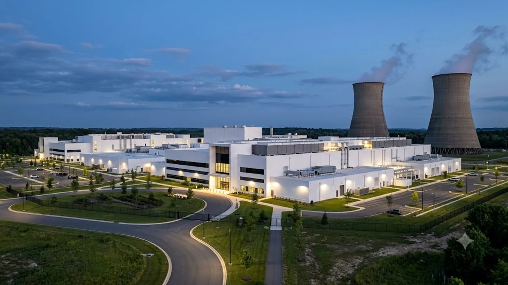

2026년 7월 31일 발표된 아마존의 2분기 실적은 테크 시장 전체에 커다란 충격을 던졌습니다. **AWS AI 투자** 규모가 당초 예상을 뛰어넘는 2,200억 달러 수준까지 폭증하면서, 빅테크의 AI 인프라 확충 경쟁과 클라우드 수익성을 둘러싼 논쟁이 다시 불붙었습니다.

## 아마존 2분기 실적 발표와 AWS의 독주

### 분기 매출 2,000억 달러 돌파와 AWS 성장률 37% 회복
아마존의 2026년 2분기 전체 매출은 전년 동기 대비 가파르게 상승하며 분기 기준 2,000억 달러 고지를 넘어섰습니다. 실적을 견인한 주역은 단연 클라우드 사업부인 AWS(Amazon Web Services)입니다. AWS는 분기 매출 2,006억 달러를 기록, 전년 대비 37%라는 가파른 성장률을 회복하며 글로벌 클라우드 시장 1위 자리를 공고히 했습니다.

### AI 및 커스텀 칩 부문 연간 매출 250억 달러 달성
이번 실적 발표에서 눈여겨볼 대목은 자체 개발 AI 반도체(Trainium, Inferentia) 기반 사업의 급성장입니다. 아마존 측은 AWS 내 AI 관련 서비스 및 커스텀 칩 부문의 런레이트(Run-rate) 기준 연간 매출이 이미 250억 달러를 넘어섰다고 밝혔습니다.

* **Trainium2 수요 폭증:** 엔비디아 GPU 의존도를 낮추려는 기업들의 비용 절감 니즈와 맞물려 자체 칩셋 채택이 빠르게 늘었습니다.
* **멀티모달 모델 엔드포인트 증대:** 자체 거대언어모델 및 파트너사 모델 호출량이 분기 대비 2배 이상 급증했습니다.

### 클라우드 백로그 4,960억 달러가 의미하는 실질 수요
AWS의 수주 잔고를 뜻하는 클라우드 백로그(Backlog)는 4,960억 달러로 집계되었습니다. 이는 기업들이 향후 몇 년간 AWS의 AI 컴퓨팅 자원을 이용하기로 확정한 장기 계약 금액입니다. 수주 잔고의 폭발적 증가세는 **AWS AI 투자**가 단기적 과열이나 거품이 아닌, 실질적인 기업 수요에 기반하고 있음을 보여줍니다.

## 2026년 CapEx 2,200억 달러 상향과 현금흐름의 반전

### 기존 2,000억 달러에서 220억 달러 추가 증액 배경
아마존 경영진은 연초 제시했던 2026년 연간 자본지출(CapEx) 가이드라인인 2,000억 달러를 2,200억 달러로 기습 상향 조정했습니다. 한 분기 만에 220억 달러(약 30조 원)를 추가 투입하기로 결정한 것입니다. 경영진은 "생성형 AI 자원에 대한 고객의 요구가 인프라 공급 속도를 크게 앞지르고 있어 데이터센터 확충을 지체할 수 없다"고 배경을 설명했습니다.

### 메모리 반도체 가격 상승과 인프라 구축 비용 압박
자본지출 증가에는 데이터센터 부지 확보와 전력망 연결 비용 외에도 핵심 부품 수급 단가 인상이 크게 작용했습니다.

> **인프라 비용 상승의 핵심 요인**
> 1. **고대역폭 메모리(HBM4) 공급 부족:** AI 서버용 핵심 메모리 가격이 상반기 대비 15% 이상 상승했습니다.
> 2. **전력 인프라 확보 경합:** 데이터센터용 변압기 및 변전 설비 납기 지연으로 인한 조기 수급 프리미엄이 발생했습니다.

### 잉여현금흐름(FCF) 적자 전환에 대한 시장의 시선
공격적인 CapEx 집행의 결과로 아마존의 잉여현금흐름(Free Cash Flow)은 2023년 이후 처음으로 마이너스로 돌아섰습니다. 대규모 현금 유출이 발생하자 월가에서는 빅테크의 AI 과잉 투자 우려를 다시 제기하고 있습니다. 주가는 발표 직후 시간 외 거래에서 요동쳤으나, 장기 성장성에 무게를 둔 기관 매수세가 유입되며 공방을 벌였습니다.

## 빅테크 AI 인프라 전쟁과 반도체 공급망 파급력

### 마이크로소프트·구글과의 AI 컴퓨팅 파워 주도권 싸움
아마존의 대규모 투자는 경쟁사인 마이크로소프트(Azure)와 구글(GCP)을 겨냥한 배수진입니다. 각국의 국가 단위 AI 프로젝트나 초대형 금융사 시스템 도입 과정에서 데이터 주권과 보안을 확보하는 기술 경쟁이 치열해지고 있습니다. 국가별 데이터 규제 환경에 맞춘 인프라 주도권 확보 문제는 [2026 소버린 AI 완전 정리: 왜 지금 진짜 바뀔까](/posts/latest-tech/sovereign-ai-data-sovereignty-2026/) 분석에서도 확인할 수 있듯, 빅테크의 설비 투자 금액을 지속해서 키우는 핵심 원인입니다.

### 고대역폭 메모리(HBM) 및 서버용 DRAM 수요 가속화
아마존의 2,200억 달러 자금 중 상당 부분은 차세대 AI 서버 구매로 직행합니다. 이는 한국의 메모리 반도체 제조업체들에게 강력한 실적 호재로 작동합니다.

* **HBM3E / HBM4 공급 계약 확대:** 주요 반도체 기업들의 2027년 물량까지 전량 선주문이 마감되는 기현상이 이어지고 있습니다.
* **서버용 CXL DRAM 수요 급증:** 대용량 데이터 처리를 위한 CXL(Compute Express Link) 메모리 모듈 도입이 본격화되었습니다.

### 2027년까지 지속될 AI 데이터센터 전력 및 메모리 병목 현상
AI 데이터센터 건설의 결정적 걸림돌은 전력망 확보입니다. 아마존은 소형모듈원자로(SMR) 전력 수급 계약과 친환경 에너지 발전소 인수를 병행하고 있으나, 2027년까지 전력 부족으로 인한 가동 지연 현상은 피하기 어려울 전망입니다.

## AI 과잉 투자 우려 속 투자자가 주목해야 할 포인트

### '투자 집행' 대비 '매출 실현'의 선순환 구조 검증
투자의 타당성을 판단하는 기준은 CapEx 증가율 대비 클라우드 매출 증가율의 추이입니다.

**함께 읽으면 좋은 글**
- [웨어러블 생체인식 보안 결국 지문 추월한다](/posts/latest-tech/wearable-biometric-security-future/)
- [제로 트러스트 보안, AI 시대 바뀌는 핵심은?](/posts/latest-tech/zero-trust-ai-security-future-2026/)

#AWS투자 #최신기술동향 #AI인프라 #클라우드주식 #빅테크 #AI데이터센터 #IT뉴스
