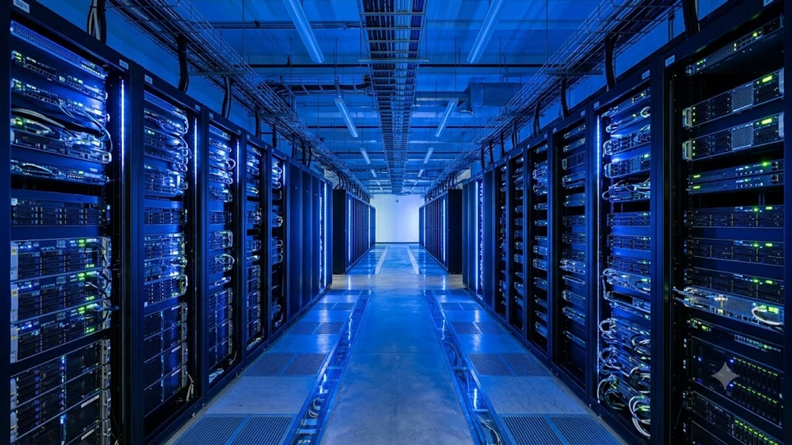

최근 ChatGPT를 필두로 한 생성형 AI 도입이 폭발적으로 늘어나면서 기업의 핵심 자산인 데이터 유출에 대한 우려가 극에 달했습니다. 이에 따라 데이터가 처리되는 순간까지 암호화를 유지하는 **기밀 컴퓨팅** 기술이 2026년 보안 시장의 가장 뜨거운 화두로 급부상하고 있습니다. 사내 지식 기반 AI 시스템을 안전하게 보호하고 강력한 데이터 주권을 확보하기 위한 핵심 솔루션의 실체를 공개합니다.

## 왜 지금 기밀 컴퓨팅인가? AI 시대의 새로운 보안 패러다임

전통적인 데이터 보안은 '저장된 데이터(Data at Rest)'와 '전송 중인 데이터(Data in Transit)'를 암호화하는 방식에 머물렀습니다. 데이터베이스에 보관할 때 암호화를 적용하고, 네트워크로 주고받을 때는 TLS/SSL 프로토콜을 사용하는 구조였습니다. 하지만 AI 모델이 데이터를 학습하거나 추론을 위해 메모리에 데이터를 올리는 '처리 중인 데이터(Data in Use)' 상태가 되면, 반드시 암호화를 해제해야만 했습니다. 이 순간 해커의 메모리 덤프 공격이나 악성코드에 무방비로 노출되는 치명적인 보안 공백이 발생합니다.

기밀 컴퓨팅은 바로 이 가동 중인 데이터마저 하드웨어 수준에서 통째로 암호화하여 보호하는 기술입니다. 기존의 소프트웨어 기반 보안 솔루션은 운영체제(OS)나 하이퍼바이저가 권한을 탈취당하면 연쇄적으로 무너지는 한계가 있었습니다. 반면 이 기술은 인프라 관리자나 클라우드 제공업체(CSP)조차 메모리 내부를 들여다볼 수 없도록 원천 차단합니다. 

가트너(Gartner)가 발표한 '2026년 10대 전략 기술 트렌드' 리포트에 따르면, 기업들이 AI 모델에 민감한 개인정보나 금융 데이터, 기업비밀을 결합하는 빈도가 전년 대비 180% 이상 증가했습니다. 가트너는 제3자 클라우드 환경에서 LLM(대형언어모델)을 안전하게 구동할 수 있는 유일한 기술적 대안으로 이 패러다임을 지목했습니다.

## 기밀 컴퓨팅의 핵심 작동 원리와 주요 하드웨어 동향

이 보안 메커니즘의 핵심은 **TEE(Trusted Execution Environment, 신뢰 실행 환경)**라는 독립 격리 구역입니다. 프로세서 내부의 특수 하드웨어 영역에 일반 OS와 완전히 격리된 보안 컨테이너를 생성하는 방식입니다. 이 구역 내부에서 연산되는 데이터는 CPU 외부로 나가는 즉시 암호화되며, 오직 하드웨어 고유 키를 통해서만 해독이 가능합니다. 

글로벌 프로세서 제조사들은 이를 구현하기 위해 치열한 기술 경쟁을 벌이고 있습니다. 인텔(Intel)은 3세대 제온 프로세서부터 적용된 **SGX(Software Guard Extensions)**를 통해 애플리케이션 단위의 세밀한 격리를 제공하며, 최근에는 가상머신(VM) 전체를 보호하는 **TDX(Trust Domain Extensions)**로 확장했습니다. 반면 AMD는 **SEV-SNP(Secure Encrypted Virtualization-Secure Nested Paging)** 기술을 앞세워 하이퍼바이저의 위협으로부터 가상머신 메모리 전체를 통째로 보호하는 직관적인 방식을 채택했습니다. 

하이브리드 클라우드 환경에서 이 기술은 매우 정교한 인증(Attestation) 과정을 거쳐 구현됩니다.
- 하드웨어가 신뢰할 수 있는 상태인지 검증하는 '원격 증명'서 발급
- 암호화된 데이터와 AI 모델을 TEE 내부로 안전하게 로드
- 메모리 내부에서만 암호 해독 후 초고속 AI 추론 연산 수행
- 연산이 끝나면 메모리를 완전히 휘발시키고 결과물만 암호화하여 반환

## 기업이 얻는 실질적 이점과 도입 시 직면하는 걸림돌

가장 직관적인 이점은 타사 클라우드 인프라를 활용하면서도 온프레미스 수준의 **강력한 데이터 주권**을 유지할 수 있다는 점입니다. 특히 의료 데이터나 유럽 GDPR, 국내 개인정보보호법 등 까다로운 규제(Compliance) 조건을 충족해야 하는 금융·의료 기업들에게 강력한 돌파구를 제공합니다. 외부 서버에 환자 기록이나 신용 정보를 올리더라도 기술적으로 유출이 불가능한 구조를 증명할 수 있기 때문입니다.

> "기밀 컴퓨팅의 도입은 클라우드 제공업체를 무조건 신뢰해야 했던 수동적 보안에서 벗어나, 기술적 하드웨어 구조를 기반으로 데이터 소유권을 완벽히 통제하는 능동적 보안으로의 대전환을 의미합니다."

그러나 완벽해 보이는 이 기술도 명확한 한계점을 가집니다. 데이터를 실시간으로 암호화하고 해독하는 과정에서 발생하는 프로세서 연산 저하(Overhead) 현상이 대표적입니다. 워크로드의 특성에 따라 최소 3%에서 많게는 15%에 달하는 시스템 성능 하락 리스크를 감수해야 합니다. 아울러 고성능 보안 칩셋이 탑재된 최신 인프라를 구독하거나 교체해야 하므로 초기 비용 부담이 만만치 않습니다.

기존 애플리케이션과의 호환성 이슈 역시 큰 걸림돌입니다. 인텔 SGX 같은 초창기 기술을 적용하려면 기존 소스코드를 완전히 뜯어고쳐 보안 구역용 API에 맞게 재설계해야 하는 엄청난 공수가 들어갑니다. 최근 가상머신(VM) 수준의 격리 기술이 발전하면서 소스 수정 부담은 대폭 줄었지만, 레거시 시스템과의 유연한 연동을 위해서는 여전히 면밀한 아키텍처 사전 검토가 요구됩니다.

## 글로벌 클라우드 3사의 기밀 컴퓨팅 인프라 실무 적용 가이드

실무 부서에서 글로벌 클라우드 플랫폼을 활용해 기술을 구현하는 방법은 명확합니다. AWS(아마존웹서비스)는 **AWS Nitro Enclaves**를 제공합니다. 이는 EC2 인스턴스에 영구 스토리지나 외부 네트워크 연결이 없는 격리된 컴퓨팅 환경을 부여하는 방식입니다. 실제 글로벌 핀테크 기업들이 민감한 개인 신용 데이터를 활용한 LLM 추론 파이프라인을 구성할 때 이 Nitro Enclaves 내부에 오픈소스 LLM 가중치를 올리는 형태로 보안 인프라를 구축하고 있습니다.

마이크로소프트 애저(MS Azure)와 구글 클라우드(Google Cloud)는 상대적으로 개발자 친화적인 **Confidential VM**에 집중하는 모양새입니다. MS 애저는 인텔 TDX 및 AMD SEV-SNP를 기반으로 기존에 사용하던 컨테이너나 가상머신 설정을 거의 바꾸지 않고 클릭 몇 번만으로 인프라 전체를 암호화 영역으로 전환할 수 있도록 지원합니다. 구글 클라우드 역시 내부 워크로드의 수정 없이 대규모 데이터 분석 도구인 BigQuery와 연동하여 프라이버시를 보존하는 분석 환경을 제공하는 장점이 있습니다.

[관련 글 보기](/posts/latest-tech/)

기업 내부의 지식 자산을 활용하는 RAG(검색 증강 생성) 시스템에 이 보안 프레임워크를 이식하려면 단계별 접근이 필요합니다. 1단계로 사내 문서를 벡터화하는 임베딩 모델과 벡터 데이터베이스 서버를 TEE 기반 가상머신으로 이전해야 합니다. 2단계로 외부 LLM API와 통신하는 프롬프트 게이트웨이 영역에 기밀 컴퓨팅 노드를 배치하여 핵심 키워드가 외부로 노출되는 경로를 차단합니다. 3단계로 원격 증명 기능을 모니터링 시스템과 연동해 인프라 변조 여부를 실시간 관제하는 파이프라인을 완성하면 안전한 사내 AI 네이티브 환경을 구축할 수 있습니다.

**함께 읽으면 좋은 글**
- [진짜 혁명? 엣지 AI 칩, 2026년 미래 5가지 변화](/posts/latest-tech/edge-ai-chip-future-2026/)
- [AI 결제 시대, 바뀌는 마케팅 핵심만](/posts/latest-tech/autonomous-economy-agentic-payments/)

#기밀컴퓨팅 #AI보안 #데이터유출방지 #가트너트렌드 #신뢰실행환경 #TEE #클라우드보안 #인텔TDX #AMDSEV #RAG보안