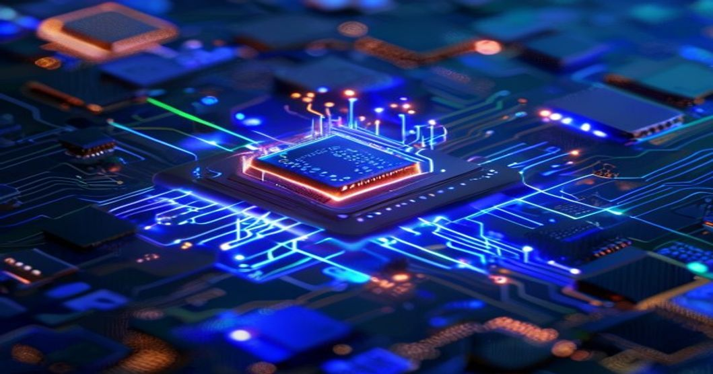
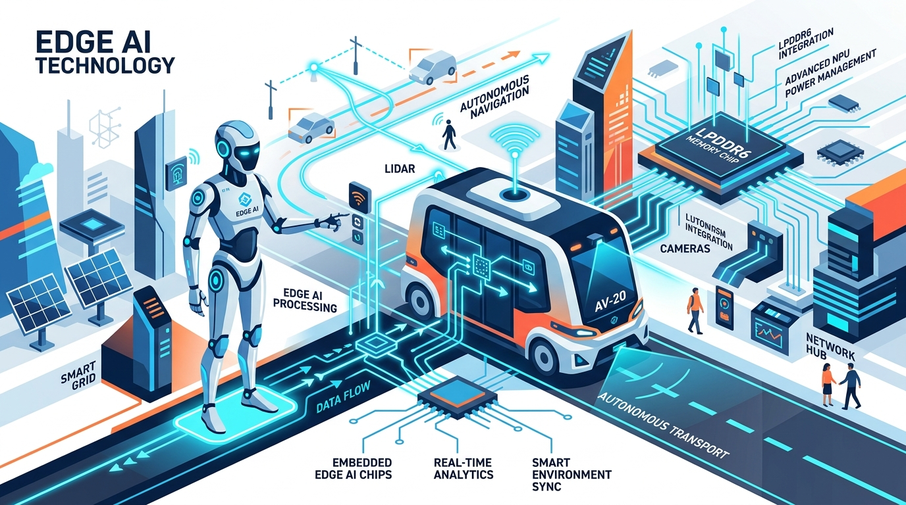

2026년, 인공지능 기술은 우리 삶의 거의 모든 영역에 스며들며 새로운 시대를 열 준비를 하고 있습니다. 특히 **엣지 AI 칩**과 **온디바이스 AI**의 발전은 클라우드 중심의 AI 시대를 넘어, 개인화되고 즉각적인 인텔리전스를 실현할 핵심 동력으로 떠오르고 있어요. 이 글에서는 **AI 반도체** 시장의 판도를 바꿀 엣지 AI 칩의 현재와 미래, 그리고 2026년에 우리가 경험하게 될 5가지 변화를 개발자 여러분의 눈높이에서 심층적으로 분석하고 미래를 전망해볼 거예요.

## 엣지 AI 칩, 왜 지금 주목해야 하는가? - 미래 시장의 변곡점

클라우드 기반 AI는 강력한 연산 능력으로 혁신을 이끌었지만, 데이터 전송에 따른 지연 시간, 프라이버시 문제, 그리고 네트워크 의존성이라는 한계도 분명히 가지고 있습니다. 하지만 이제, 엣지 AI 칩의 발전으로 이러한 한계를 극복하고 더 효율적인 AI 경험을 선사할 수 있게 되었어요.

### 클라우드를 넘어 온디바이스 AI로: 시장 변화의 핵심 동력

2026년 AI 반도체 시장은 클라우드 중심에서 온디바이스 및 엣지 AI로의 전환이 가속화되는 중요한 변곡점이 될 것입니다. 엣지 AI 지원 IoT 기기가 주류 시장에 진입하면서, 우리는 더 이상 모든 데이터를 클라우드로 보내지 않고도 기기 자체에서 AI 연산을 수행하는 시대를 맞이하게 됩니다. 이 방식은 **지연 시간을 단축**하고, **데이터 프라이버시를 강화**하며, **네트워크 의존성을 감소**시키는 등 여러 이점을 제공합니다.

개발자 관점에서 온디바이스 AI는 기기 자체에서 연산을 수행하기 때문에 지연 시간을 최소화하고 네트워크 연결 없이도 작동할 수 있다는 큰 장점이 있습니다. 특히 민감한 데이터의 프라이버시 보호에 매우 유리하죠. 일반적으로 AI 모델은 클라우드에서 학습되고, 엣지 디바이스에 최적화되어 배포되는 하이브리드 모델이 보편적으로 사용될 것으로 예상됩니다.

### NPU와 피지컬 AI: 현실 세계와 상호작용하는 지능

과거 엔비디아 GPU가 AI 반도체 시장을 독점하다시피 했지만, 이제는 구글(TPU), 아마존(Trainium) 등 빅테크 기업들이 자체 개발한 AI 반도체(ASIC) 시장이 빠르게 성장하고 있습니다. 특히 온디바이스 AI 구현의 핵심인 **NPU(신경망처리장치)**는 GPU 대비 와트당 10배에서 100배 높은 효율성을 제공하며, 전력 소모에 민감한 엣지 디바이스에 최적화된 솔루션으로 자리매김하고 있습니다.

AI가 단순히 가상 알고리즘을 넘어 현실 세계와 상호작용하는 '피지컬 AI' 시대가 로봇, 자율주행차, 산업 자동화 분야에서 본격화되면서 엣지 AI 칩의 중요성은 더욱 부각됩니다. 로봇이 주변 환경을 실시간으로 인식하고 판단하며 행동하거나, 자율주행차가 돌발 상황에 즉각적으로 반응하려면 엣지 AI 칩의 빠른 연산 능력과 저지연성이 필수적이기 때문이죠.

## 한국, 엣지 AI 칩 혁명을 주도하다 - K-반도체의 힘

글로벌 AI 반도체 시장의 판도가 바뀌는 시점에서, 한국은 메모리 반도체 분야의 압도적인 강점을 바탕으로 글로벌 AI 반도체 생태계에서 핵심적인 역할을 수행하며 기술 혁신을 주도하고 있습니다.

### 삼성전자와 SK하이닉스: 글로벌 AI 반도체 리더십의 확장

**삼성전자**는 갤럭시 S14 출시 이후 온디바이스 AI 폰 시대를 주도하며, 2026년에는 AI 탑재 스마트폰과 노트북 슈퍼사이클의 정점이 될 것으로 전망됩니다. 고성능 온디바이스 AI에 최적화된 차세대 저전력 DRAM인 LPDDR6를 선보였고, 구글 I/O 2026에서는 '안드로이드 XR' 기반 AI 글라스 2종을 공개하며 새로운 폼팩터 혁신을 이끌고 있어요. 또한, 가온칩스와 같은 국내 AI 칩 설계 전문 기업과 협력하여 삼성 파운드리 공정을 통해 맞춤형 AI 칩 생산을 지원하며 생태계를 확장하고 있습니다.

**SK하이닉스**는 고대역폭 메모리(HBM) 시장에서 압도적인 리더십을 유지하며 2026년 생산 물량이 이미 완판되는 등 AI 메모리 호황을 이끌고 있습니다. 'TSMC 테크놀로지 심포지엄 2026'에서 '메모리와 로직의 통합' 비전을 제시했고, '델 테크놀로지스 월드 2026'에서는 HBM을 중심으로 AI 인프라에 필요한 메모리 및 스토리지 전 라인업을 선보이며 AI 시대의 핵심 인프라 제공자로서의 입지를 굳히고 있습니다.

### 국내 스타트업과 정부 지원: K-AI 반도체 생태계의 성장 동력

국내 AI 반도체 스타트업들의 활약도 눈부십니다. **딥엑스**는 로봇, 자율주행차용 온디바이스 AI 반도체 설계에서 압도적인 전성비와 저발열 기술을 확보하여 삼성 5나노 공정으로 양산 중이며 현대차 및 바이두와 협력하고 있어요. **가온칩스**는 삼성 파운드리의 핵심 파트너로서 온디바이스 AI 칩 설계를 담당하고, **제주반도체**는 LPDDR 기술로 온디바이스 AI 시장에서 중요한 역할을 합니다.

정부도 이러한 흐름에 발맞춰 지원을 아끼지 않고 있습니다. 과학기술정보통신부는 2026년을 국산 AI 반도체 활약의 원년으로 삼고 9조 9천억 원 규모의 AI 투자 예산을 편성했습니다. 또한, 국내 AI 반도체 성능 평가를 위한 공동성능지표(K-Perf) 협의체를 출범시키고 향후 온디바이스 AI 분야로 확장을 계획하고 있으며, LPDDR6-PIM 기반 AI 가속기 개발을 2026년 주요 과제로 추진하여 기술 경쟁력을 강화하고 있습니다.

## 엣지 AI 칩이 가져올 5가지 미래 변화 (1): 개인화된 초지능 경험의 시작

엣지 AI 칩은 단순히 기기 성능을 높이는 것을 넘어, 우리가 AI를 경험하는 방식 자체를 근본적으로 변화시킬 것입니다. 기기에서 직접 처리되는 AI는 더욱 개인화되고 즉각적인 상호작용을 가능하게 합니다.

### AIOS와 새로운 폼팩터: 스마트 글라스부터 만물 초지능까지

디바이스 운영체제(OS) 수준에서 AI 에이전트를 통합하는 'AIOS'는 스마트홈, 웨어러블, 카메라, 로보틱스 분야의 온디바이스 AI 상용화를 가속화하고 있습니다. 여러분의 스마트폰이나 스마트 글라스가 여러분의 패턴을 학습하여 필요한 정보를 미리 제공하거나, 로봇 청소기가 집안 구조를 스스로 파악하고 최적의 경로로 움직이는 것처럼 말이죠.

이는 '만물 초지능' 시대의 도래를 알리는 신호탄입니다. 스마트 글라스나 XR 기기 등 새로운 폼팩터의 등장과 함께, AI 인프라의 지속적인 확장은 우리의 일상을 훨씬 더 지능적이고 편리하게 만들어줄 것입니다. 상상해보세요, 주변의 모든 사물이 상황을 인지하고 여러분에게 필요한 도움을 줄 수 있는 미래를요.

### 온디바이스 AI 최적화 기술: 더 빠르고 안전한 AI 경험

온디바이스 AI 환경에서는 제한된 자원에서 효율적인 AI 모델 구동이 필수적입니다. 이를 위해 BF16 같은 경량 AI 프레임워크와 양자화, 가지치기 등 모델 최적화 기술이 중요하게 활용됩니다. 이러한 기술들은 작은 기기에서도 강력한 AI 성능을 발휘할 수 있도록 돕습니다.

오픈소스 기반 엣지 배포 코드와 경량 멀티모달 모델(MiniCPM-V 4.6)의 등장은 개발자들에게 온디바이스 AI 활용의 문턱을 낮추고 있습니다. 이제 더 많은 개발자가 혁신적인 온디바이스 AI 애플리케이션을 만들 수 있게 된 것이죠. 또한, 메모리 기술은 HBM(AI 가속기 병목 해소), LPDDR(엣지 컴퓨팅, 차량용, AI PC 핵심), PIM(메모리 내 연산으로 전력 효율/속도 향상), LPCAMM/SOCAMM(AI 노트북/PC 전력/발열 문제 해결) 등으로 진화하며 온디바이스 AI의 성능을 뒷받침하고 있습니다.

[최신 AI 반도체 동향 더 알아보기](/posts/latest-tech/)

## 엣지 AI 칩이 가져올 5가지 미래 변화 (2): 지속 가능한 AI를 위한 도전

엣지 AI 칩은 엄청난 잠재력을 가지고 있지만, 동시에 새로운 도전 과제들도 제시합니다. 전력 효율성, 사이버 보안, 그리고 글로벌 공급망 재편과 같은 문제들은 엣지 AI 시대의 지속 가능한 성장을 위해 반드시 해결해야 할 과제입니다.

### 전력 효율성과 사이버 보안: 혁신의 양면성

AI 시스템 확산은 전력 수요 폭증으로 이어지고 있습니다. 2040년 우리나라의 최대 전력 수요는 40% 증가할 것으로 예상되며, 이는 AI 인프라의 지속적인 확장을 위한 전력 효율성 기술 개발과 안정적인 전력 공급망 확보가 시급하다는 것을 보여줍니다. 엣지 AI 칩은 클라우드 대비 전력 효율성 측면에서 강점을 가지지만, 수많은 엣지 디바이스의 총체적인 전력 소비는 여전히 고려해야 할 부분입니다.

또한, AI 시스템 확산은 새로운 사이버 위험을 초래합니다. '섀도우 AI'로 인한 민감 정보 유출과 같은 문제들이 발생할 수 있죠. 2026년 글로벌 사이버보안 전망 보고서에 따르면 AI 관련 취약성이 가장 빠르게 성장하는 사이버 위험으로 분류됩니다. 온디바이스 AI는 데이터를 로컬에서 처리함으로써 이러한 프라이버시 및 보안 문제를 완화하는 데 기여할 수 있지만, 엣지 디바이스 자체의 보안 강화 역시 중요합니다.

### 글로벌 공급망 재편과 인재 확보: K-반도체의 지속 가능한 성장 전략

AI 기술 발전, 지정학적 갈등, 각국의 내수 생산 투자 확대는 반도체 공급망 구조를 급격히 변화시키고 있습니다. 미국과 중국 등 주요국들의 반도체 자급 및 기술 주권 확보 전략 강화로 글로벌 경쟁 구도가 근본적으로 바뀌고 있는 상황입니다. 반도체 시장은 첨단(AI 반도체, HBM, 첨단 패키징, 선단 공정)은 여전히 부족하고 레거시(범용, 저가)는 경쟁이 심화되는 양극화가 극단적으로 심화되고 있습니다.

이러한 환경에서 AI 칩 설계에 필수적인 IP(설계 자산) 및 EDA(전자 설계 자동화) 도구의 중요성과 관련 비용이 증가하고 있으며, AI 반도체 개발 및 활용을 위한 전문 인력 확보도 중요한 과제입니다. 개발자 여러분은 온디바이스 AI 환경에 최적화된 모델 개발, 경량화 기술 적용, 다양한 하드웨어 아키텍처에 대한 이해, 그리고 보안 및 프라이버시를 고려한 설계 역량을 강화해야 합니다. 이는 K-반도체가 지속 가능한 성장을 이루고 글로벌 리더십을 유지하는 데 필수적인 요소가 될 것입니다.

**함께 읽으면 좋은 글**
- [제로 트러스트 보안, AI 시대 바뀌는 핵심은?](/posts/latest-tech/zero-trust-ai-security-future-2026/)
- [앤스로픽 IPO! AI 주식 시장 판도 바뀔까?](/posts/latest-tech/anthropic-ipo-wall-street-ai-clash/)

#엣지AI칩 #온디바이스AI #AI반도체 #AIOS #피지컬AI #HBM #LPDDR6 #K반도체 #AI미래 #기술트렌드 #개발자필수지식