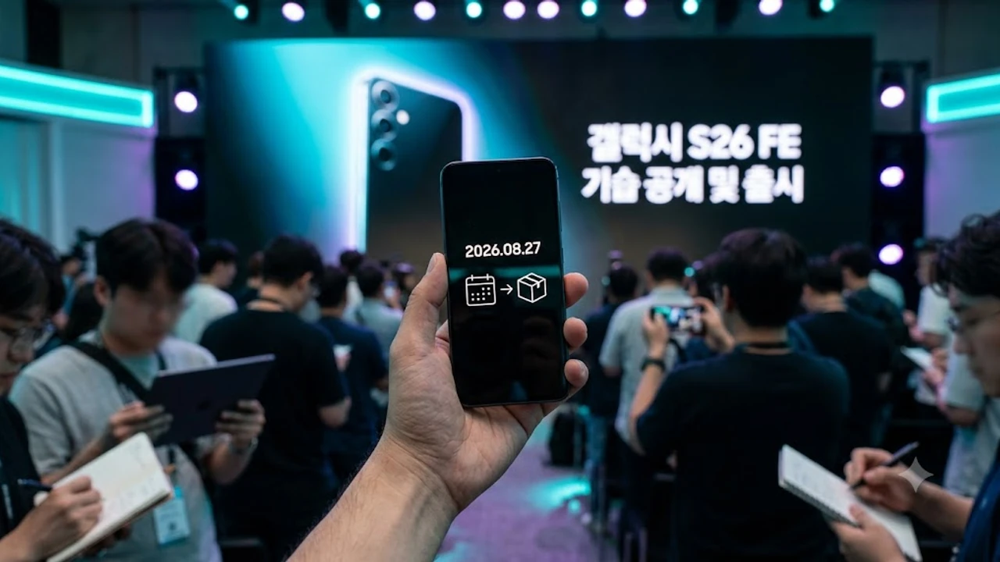

삼성전자가 하반기 플래그십 시장의 판도를 흔들 **갤럭시 S26 FE**를 2026년 8월 27일 전격 공개하며 소비자들의 이목을 집중시키고 있습니다. 통상적인 가을 출시 일정을 한 달 이상 앞당긴 이번 신제품은 준프리미엄 가격대에 최신 온디바이스 AI 성능과 강화된 하드웨어를 빈틈없이 채워 넣은 것이 특징입니다. 고물가 속에서 플래그십의 핵심 기능을 합리적인 가격에 누리고자 하는 실속파 사용자들에게 이번 모델이 어떤 체감 변화를 선사하는지 명확히 정리했습니다.

## 갤럭시 S26 FE 깜짝 조기 공개의 배경과 출시일

### 8월 기습 발표로 앞당겨진 출시 타임라인
삼성전자는 매년 9월 말이나 10월 초에 진행하던 팬에디션 공개를 8월 말로 전격 조정했습니다. 8월 27일 공개 직후 8월 29일부터 국내 통신 3사와 자급제 채널을 통해 일제히 사전 예약에 돌입하며, 9월 4일부터 공식 개통 및 일반 판매를 시작합니다. 플래그십 라인업인 기본 S26의 판매 모멘텀을 이어받으면서 가을 신제품 교체 수요를 선점하겠다는 전략적 판단이 깔려 있습니다.

### 국내외 정식 사전예약 혜택과 배송 일정
사전 예약 기간 구매자에게는 저장용량을 무상으로 2배 업그레이드해 주는 더블 스토리지(Double Storage) 혜택과 삼성케어플러스 파손보장형 1년권이 기본 제공됩니다. 공식 배송은 9월 2일부터 순차적으로 진행되므로 정식 출시일보다 이틀 먼저 기기를 수령할 수 있습니다. 

### 전작 대비 조기 출시를 선택한 시장 경쟁 요인
글로벌 스마트폰 제조사들의 중상급형 AI 단말기 공세가 거세진 점이 일정 단축의 결정적 배경입니다. 특히 [TSMC 1.6나노 A16, 진짜 2나노 건너뛸까?](/posts/latest-tech/tsmc-16nm-a16-mass-production-2026/)와 같은 차세대 파운드리 미세공정 경쟁 속에서 모바일 AP 수급 구조를 안정화하고, 하반기 프리미엄 틈새시장을 확고히 장악하려는 계산이 작용했습니다.

## 갤럭시 S26 플래그십 대비 핵심 스펙과 변경점

### 메인 칩셋(AP) 성능 벤치마크 및 발열 제어 구조
갤럭시 S26 FE에는 플래그십 모델과 동일 계열의 4나노 공정 고성능 칩셋이 탑재되었습니다. 긱벤치 6(Geekbench 6) 기준 싱글코어 약 2,150점, 멀티코어 약 6,700점을 기록하며 기본형 S26 성능의 90% 이상을 안정적으로 뽑아냅니다. 

* **베이퍼 챔버 면적 18% 확장:** 장시간 고사양 3D 게임 구동 시에도 쓰로틀링(성능 저하) 발생 시점을 대폭 늦췄습니다.
* **12GB RAM 기본화:** 다중 앱 실행과 백그라운드 AI 연산 처리를 쾌적하게 유지하도록 메모리를 여유 있게 할당했습니다.

### 디스플레이 베젤 축소와 카메라 센서 사양 분석
화면 크기는 6.4인치 다이내믹 AMOLED 2X 패널을 채택했습니다. 전작 대비 화면 테두리 베젤 두께를 1.6mm 수준으로 줄여 플래그십에 준하는 몰입감을 완성했습니다. 메인 카메라는 5,000만 화소 듀얼 픽셀 센서와 OIS(광학식 손떨림 보정)를 장착해 야간 저조도 환경에서도 선명한 결과물을 담아냅니다. 3배 광학 줌 망원 렌즈 역시 빠짐없이 들어가 일상 인물 사진 촬영에 부족함이 없습니다.

### 배터리 용량 증대 및 유무선 충전 속도 차이
배터리는 전작의 4,700mAh에서 늘어난 **4,900mAh 대용량 배터리**를 탑재했습니다. 전력 효율이 개선된 칩셋과 맞물려 완충 시 최대 22시간의 연속 동영상 재생이 가능합니다. 유선 45W 초고속 충전 2.0을 지원해 30분 만에 65%까지 충전할 수 있으며, 15W 고속 무선 충전도 온전히 지원합니다.

## 온디바이스 Galaxy AI 탑재 수준과 실사용 체감

### 플래그십과 동일하게 구동되는 오프라인 실시간 통번역
네트워크 연결 없이 기기 내부 NPU(신경망처리장치)만으로 구동되는 오프라인 실시간 통번역 기능이 플래그십과 100% 동일하게 작동합니다. 통화 중 실시간 음성 통역은 물론, 문자 메시지 자동 번역과 문맥에 맞는 톤앤매너 변경 기능까지 지연 시간 없이 매끄럽게 처리합니다.

> "네트워크 연결이 불안정한 기내나 해외 출장 환경에서도 온디바이스 AI 기능이 즉각 구동되어 플래그십과의 격차를 사실상 체감하기 어렵습니다."

### 사진·동영상 생성형 편집 기능의 연산 처리 속도
사진 속 불필요한 피사체를 지우고 빈자리를 자연스럽게 채우는 생성형 편집과 인스턴트 슬로우 모션(Instant Slow-mo) 기능을 기본 지원합니다. 플래그십 대비 약 0.5초에서 1초가량의 연산 처리 시간 차이만 존재할 뿐, 합성 품질과 해상도 복원력은 거의 동일한 완성도를 보여줍니다.

### 준프리미엄 라인업에서 제한된 AI 기능 유무 체크
삼성전자는 이번 FE 모델에 소프트웨어 급나누기를 두지 않았습니다. 서클 투 서치(Circle to Search), 음성 녹음 텍스트 변환 및 화자 구분 요약, 삼성 노트 자동 서식 생성 등 주력 기능이 누락 없이 모두 포함되어 일상적인 업무 생산성을 대폭 끌어올려 줍니다.

## 갤럭시 S26 FE 가격 책정과 가성비 구매 가이드

### 스토리지 용량별 공식 출고가 및 전작 대비 변동폭
원자재 가격 상승에도 불구하고 출고가를 공격적으로 동결했습니다.

* **256GB 모델:** 847,000원
* **512GB 모델:** 935,000원

사전 예약 더블 스토리지 프로모션을 적용받을 경우 84만 원대 가격으로 512GB 대용량을 확보할 수 있어 체감 가성비는 더욱 높아집니다.

### 자급제 사전예약 할인 vs 통신사 공시지원금 유리한 선택
알뜰폰 무제한 요금제를 조합하는 사용자라면 오픈마켓 카드 할인(약 8~10%)과 무이자 할부를 활용한 **자급제 사전 예약**이 총 통신비 면에서 가장 유리합니다. 반면 고가 5G 요금제를 필수 유지해야 하는 조건이라면 40만 원 수준으로 책정된 통신사 공시지원금을 선택하는 편이 초기 기기값 부담을 낮출 수 있습니다.

### 기본형 S26 vs S26 FE: 실제 구매 추천 대상 비교
기본형 S26(출고가 약 115만 원대)과 비교했을 때 약 30만 원 저렴한 가격 차이가 발생합니다. 초슬림 디자인이나 최상급 줌 카메라 하드웨어가 꼭 필요한 사용자가 아니라면, 대용량 배터리와 완벽한 Galaxy AI 기능을 갖춘 **갤럭시 S26 FE**가 가장 합리적인 선택지입니다.

[갤럭시 S26 FE 정품 액세서리 쿠팡에서 보기](https://www.coupang.com/np/search?q=%EA%B0%A4%EB%9F%AD%EC%8B%9C%20S26%20FE%20%EC%BC%80%EC%9D%B4%EC%8A%A4&sourceType=affiliate&trackingCode=AF8691300)

#갤럭시S26FE #갤럭시S26FE출시일 #갤럭시S26FE가격 #갤럭시S26FE스펙 #온디바이스AI #삼성갤럭시 #스마트폰가성비추천 #갤럭시사전예약