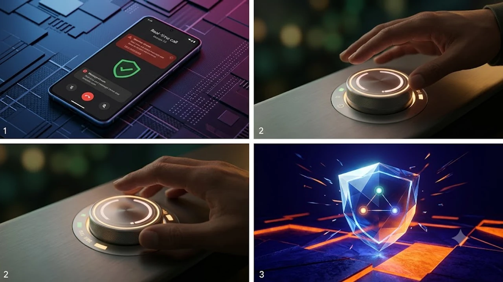

구글이 새롭게 선보인 기능 업데이트 패키지는 단순한 외형 변경을 넘어 온디바이스 AI 기반의 실체적인 보안 방어막을 구축하는 데 집중했습니다. 사용자가 매일 마주하는 피싱 위험과 스마트폰 과몰입 문제를 겨냥한 **구글 픽셀드롭** 업데이트는 소프트웨어 최적화 수준을 한 단계 끌어올렸습니다. 안드로이드 생태계 전반의 흐름을 바꾸는 기능 업데이트 흐름 속에서 이용자가 체감할 수 있는 핵심 지점만 정리했습니다.

## 픽셀드롭 배포와 온디바이스 보안 강화

### 온디바이스 기반 실시간 스캠 감지 아키텍처
이번 업데이트에서 가장 큰 폭으로 개선된 영역은 외부 통신망 없이 기기 내부 칩셋 연산만으로 작동하는 통화·메시지 스캠 탐지 시스템입니다. 텐서(Tensor) 프로세서의 NPU 자원을 활용하여 수신된 메시지의 URL 패턴, 금융 관련 사칭 문구, 비정상적 링크 유도 행위를 실시간으로 교차 검증합니다. 통화 중 의심스러운 금융 거래 요구가 발생하면 화면에 즉시 굵은 경고 배너를 띄우며, 통화 음성 데이터는 외부 서버로 일절 전송되지 않습니다.

### 서드파티 채팅 앱 연동 및 키보드 경고 시스템
기본 문자 앱뿐만 아니라 글로벌 메신저 앱으로 유입되는 사기성 링크 역시 지보드(Gboard) 입력 레이어와 맞물려 방어선을 형성합니다. 악성 도메인 목록과 대조하는 것이 아니라, 대화 문맥을 분석하여 계좌 번호나 일회용 인증번호(OTP)를 유도하는 시점을 포착하는 방식입니다. 기업 보안 관점에서 화두가 되는 [제로 트러스트 보안, AI 시대 바뀌는 핵심은?](/posts/latest-tech/zero-trust-ai-security-future-2026/) 흐름이 이제 모바일 운영체제의 최종 사용자 단말까지 그대로 스며든 셈입니다.

### 개인정보 보호를 위한 로컬 연산 처리 방식
과거 클라우드 기반 필터링은 개인의 민감한 텍스트가 외부 서버에 도달해야 한다는 근본적인 보안 취약점이 있었습니다. 구글은 경량화된 소형 언어 모델(SLM)을 시스템 파티션에 완전히 통합하여 오프라인 비행기 탑승 모드에서도 의심스러운 설치 파일(.apk)의 위험도를 분석하도록 설계했습니다.

> "네트워크 연결이 차단된 상태에서도 시스템 내부 로컬 모델이 비정상적 권한 탈취 시도를 차단할 수 있어야 모바일 프라이버시가 완성된다."

## 디지털 웰빙 포즈 포인트의 실제 효과

### 앱 실행 지연 메커니즘을 통한 도파민 루프 차단
단순히 특정 시간 동안 앱을 강제로 잠그던 기존 타이머 방식은 사용자가 손쉽게 설정을 해제해 버리는 한계가 있었습니다. 새로 도입된 '포즈 포인트(Pause Point)'는 숏폼 영상 플랫폼이나 SNS 앱을 터치했을 때 즉시 실행하는 대신, 5초에서 10초가량 호흡을 가다듬는 애니메이션 화면을 노출합니다. 무의식적인 터치 반사 작용을 심리적으로 한 번 끊어주는 완충 장치를 둔 구조입니다.

### 기존 스크린타임 제한 기능 대비 차별점
- **무조건적 차단 배제**: 업무상 급히 메신저를 확인해야 하는 상황을 고려해 완전 차단 대신 인지적 마찰(Cognitive Friction)을 생성합니다.
- **반복 실행 패턴 학습**: 사용자가 하루 중 특정 시간대에 습관적으로 앱을 반복 실행하면 지연 시간을 유동적으로 늘립니다.
- **해제 절차 복잡화**: 설정 화면에 진입하지 않고 홈 화면에서 즉시 끌 수 없도록 하여 충동적인 취소를 물리적으로 억제합니다.

### 구형 픽셀 기기 지원 확대와 하드웨어 최적화
포즈 포인트와 백그라운드 사용량 모니터링 알고리즘은 픽셀 7 및 픽셀 8 계열까지 하위 호환됩니다. 백그라운드 리소스 점유율을 1% 미만으로 억제하여 구형 기기 배터리 수명에 미치는 부하를 줄였습니다. 장시간 방치되었던 단말기에서도 버벅임 없이 자연스러운 화면 전환 프레임을 보장합니다.

## Pixel VIPs 위젯 및 사용자 편의성 업데이트

### 홈 화면 원터치 통신 허브 구조
새롭게 추가된 'Pixel VIPs'는 즐겨찾는 연락처를 최대 6명까지 홈 화면에 유기적 카드 형태로 띄워주는 다이내믹 인터페이스입니다. 각 인물의 프로필 카드를 탭하면 전화, 메시지뿐 아니라 공유된 사진 앨범이나 캘린더 약속 일정까지 한 번에 확인할 수 있는 미니 허브가 전개됩니다.

### 우선순위 알림 필터링과 플로팅 인터페이스
단말기가 방해 금지 모드에 놓여 있어도 VIP로 등록된 대상의 긴급 알림은 플로팅 형태로 상단에 부드럽게 강조됩니다. [웨어러블 생체인식 보안 결국 지문 추월한다](/posts/latest-tech/wearable-biometric-security-future/)에서 언급된 기기 간 인증 연속성처럼, 픽셀 워치를 착용한 상태라면 손목 진동 패턴을 세분화하여 발신자의 신원을 화면을 켜지 않고도 파악할 수 있습니다.

### 배터리 소모량 및 반응 속도 실측 비교
위젯이 지속적으로 상태를 갱신할 때 발생하는 전력 소모 문제는 안드로이드 저전력 API 설계를 통해 해결했습니다. 24시간 연속 구동 기준 위젯의 추가 배터리 소모율은 0.8% 수준에 머물렀으며, 연락처 전환 딜레이는 0.1초 이내로 즉각적인 조작감을 제공합니다.

## 기기별 지원 현황 및 설치 전 필수 체크리스트

### 지원 모델별 기능 편차 및 롤아웃 일정
이번 롤아웃은 북미와 유럽을 시작으로 글로벌 순차 배포가 진행 중입니다. 텐서 G3 및 G4 프로세서가 탑재된 픽셀 8, 픽셀 9 시리즈는 온디바이스 스캠 탐지 모델이 온전히 구동됩니다. 반면 텐서 G2 이전 세대는 일부 텍스트 기반 사기 패턴 탐지만 로컬로 처리되며, 복합 음성 분석 기능은 제한적으로 적용됩니다.

### 안드로이드 최신 빌드 업데이트 요구 조건
- 최소 4GB 이상의 기기 내부 여유 저장 공간 확보 필요
- 배터리 잔량 50% 이상 유지 또는 충전기 연결 상태에서 업데이트 진행 권장
- 시스템 캐시 충돌 방지를 위한 통신사 프로파일 최신 버전 동기화

### 초기 오류 방지를 위한 캐시 정리 및 설정 팁
배포 직후 일부 앱과의 호환성 충돌로 인한 일시적 발열이 보고되는 경우가 있습니다. OS 업데이트 완료 직후 복구 모드에 진입할 필요 없이, 구글 플레이 시스템 업데이트를 추가로 점검하고 기기를 1회 재부팅하면 백그라운드 인덱싱 작업이 안정화됩니다. 특히 키보드 앱 데이터 충돌을 막기 위해 지보드의 임시 캐시를 비워두는 작업이 매끄러운 타이핑 반응을 유지하는 데 유리합니다.

[픽셀 전용 고속 무선 충전기 및 스마트 액세서리 쿠팡에서 보기](https://www.coupang.com/np/search?q=%EC%8A%A4%EB%A7%88%ED%8A%B8%EA%B8%B0%EA%B8%B0%20AI%EA%B8%B0%EA%B8%B0&sourceType=affiliate&trackingCode=AF8691300)

#구글픽셀 #픽셀드롭 #온디바이스AI #스마트폰보안 #디지털웰빙 #안드로이드업데이트 #포즈포인트 #텐서프로세서