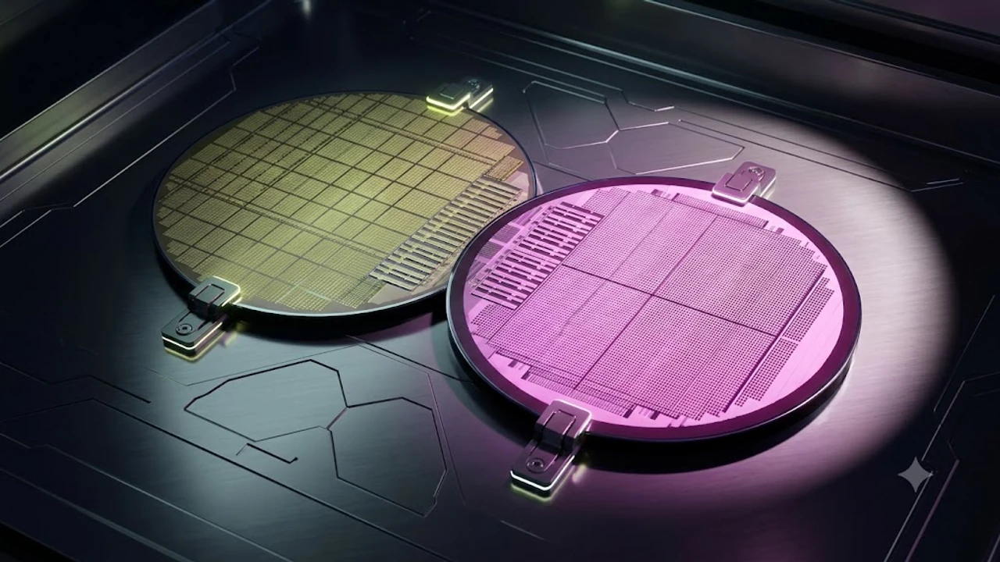

인공지능 가속기 시장의 연산 병목을 뚫어낼 열쇠로 꼽히는 **HBM4 16단** 적층 샘플 검증이 본격화되면서 차세대 고대역폭 메모리를 둘러싼 판도가 요동치고 있습니다. 단순 속도 경쟁에 머물던 D램 적층 구조가 패키징과 파운드리 공정 결합이라는 새로운 기술적 분기점을 맞이한 결과입니다.

## HBM4 16단 적층 전환이 지금 격전지가 된 이유

### 16단 고적층 구조가 AI 가속기 시장에 던진 과제
거대언어모델(LLM)의 매개변수가 수조 단위로 팽창하면서 GPU 내부 연산 유닛보다 메모리 대역폭 한계가 모델 성능을 옥죄는 메모리 월(Memory Wall) 현상이 극심해졌습니다. 기존 8단이나 12단 구조로는 단위 면적당 용량 확장에 한계가 뚜렷해 단일 스택 기준 48GB에서 64GB 이상을 안정적으로 확보하는 16단 구현이 선택이 아닌 필수가 됐습니다. 데이터 전송 통로인 I/O 수가 1,024개에서 2,048개로 두 배 늘어나는 HBM4 규격 특성상, 신호 무결성을 해치지 않고 16개 칩을 수직 적층하는 설계 난도가 급상승했습니다.

### HBM3E 수명 연장론을 뒤엎은 최신 샘플 검증 국면
불과 얼마 전까지만 해도 원가 경쟁력과 수율 안정성을 근거로 HBM3E 12단 제품의 라이프사이클이 장기화될 것이라는 전망이 지배적이었습니다. 그러나 주요 클라우드 서비스 제공자(CSP)들이 차세대 가속기 도입 시점을 앞당기며 2026년 하반기 엔지니어링 샘플 신뢰성 평가를 강하게 요구하기 시작했습니다. 16단 샘플의 수율과 방열 데이터가 가속기 공급 로드맵의 핵심 지표로 떠오르면서 메모리 업계 역시 16단 조기 상용화로 방향타를 꺾었습니다.

### 파운드리-메모리 원팀 연합의 주도권 쟁탈전
독자 설계와 생산이 가능했던 이전 세대와 달리, 6세대 규격부터는 단일 기업의 기술력만으로 완성품을 내놓기 어려워졌습니다. 대만의 글로벌 파운드리와 국내 메모리 제조사 간 결속이 강해지는 배경입니다. 초미세 로직 공정 경쟁력을 확보하기 위해 [TSMC 1.6나노 A16, 진짜 2나노 건너뛸까?](/posts/latest-tech/tsmc-16nm-a16-mass-production-2026/)와 같은 첨단 파운드리 로드맵과의 연계 논의가 속도를 내고 있습니다.

## 로직 베이스 다이 도입: 3·4나노 공정 결합의 명과 암

### 메모리 공정에서 첨단 파운드리 로직 다이로의 전환 실익
스택 최하단에서 데이터 흐름과 전력을 총괄하는 베이스 다이(Base Die)가 기존 레거시 메모리 공정에서 3나노 및 4나노 파운드리 로직 공정으로 옷을 갈아입었습니다. 로직 다이 전환을 통해 표준 컨트롤러는 물론 고객사별 맞춤형 연산 유닛이나 자체 전력 관리 회로를 직접 탑재할 여지가 생겼습니다.

> "베이스 다이의 첨단 로직 공정화는 D램을 단순 저장장치에서 가속기와 직접 맞물리는 보조 프로세서 영역으로 진화시키는 분기점이다."

### 전력 효율 향상과 초미세 공정 적용에 따른 단가 급증
누설 전류를 잡고 클록 속도를 끌어올릴 수 있어 전체 스택의 와트당 데이터 처리 효율은 20% 이상 개선됩니다. 반면 최첨단 로직 웨이퍼 비용과 포토마스크 제작비가 고스란히 제품 원가에 반영되는 단점도 뚜렷합니다. 16단 고적층으로 인해 불량 칩 하나가 스택 전체 폐기로 이어지는 복합 수율 손실 위험까지 겹치면서 생산 단가가 기존 HBM3E 대비 가파르게 치솟는 부담을 안게 됐습니다.

### 파운드리 협력 구조에서 발생하는 제조 리스크와 수율 격차
서로 다른 공정과 팹에서 생산된 웨이퍼를 한곳에 모아 붙이는 턴키(Turn-key) 프로세스는 복잡성을 가중시킵니다. 메모리 원판 제조와 로직 다이 가공, 최종 어드밴스드 패키징까지 이어지는 공급망 단계마다 수율 책임 소재가 갈릴 수밖에 없습니다. 완제품 품질을 담보하기 위한 테스트 단계가 대폭 늘어나면서 생산 리드타임 역시 길어지는 실정입니다.

## 16단 패키징을 둘러싼 기술적 딜레마와 발열 제어

### 하이브리드 본딩 도입 시점과 어드밴스드 MR-MUF의 충돌
업계의 시선은 마이크로 범프(Bump) 없이 구리와 구리를 직접 맞붙이는 하이브리드 본딩(Hybrid Bonding)의 조기 적용 여부에 쏠려 있습니다. 기존 액체 보호재를 주입해 굳히는 어드밴스드 MR-MUF(Mass Reflow-Molded Underfill) 기술이 여전히 16단 두께 제어에 대응 가능함을 증명하고 있지만, 범프 간격(피치)이 극단적으로 좁아지는 구간에서는 물리적 한계가 찾아옵니다.

- **어드밴스드 MR-MUF**: 생산 라인 전환 비용이 적고 기존 장비를 재활용할 수 있으나 미세 피치 대응에 한계
- **하이브리드 본딩**: 칩 사이 간격을 나노미터 단위로 줄여 전송 손실을 없애지만 초기 설비 투자비가 막대함

### 칩 두께 한계치 775마이크로미터 내 고적층 구현
JEDEC(국제반도체표준협의기구)이 규정한 HBM 패키지 표준 두께 한계인 775㎛(마이크로미터)를 지키는 일은 극도의 물리적 연마 기술을 요구합니다. 16개 D램 칩과 베이스 다이, 상단 방열판까지 모두 포개 넣으려면 개별 D램 웨이퍼를 수십 마이크로미터 두께로 깎아내야 합니다. 종잇장처럼 얇아진 웨이퍼는 미세한 열 충격에도 휘어지는 휨(Warpage) 현상이 발생하기 쉽습니다.

### 핫스팟 제거를 위한 방열 소재 혁신
16단 집적 구조 내부 중앙부에서 발생하는 열은 바깥으로 쉽게 빠져나가지 못해 치명적인 성능 저하를 유발합니다. 이를 해결하기 위해 열전도율이 월등한 차세대 EMC(에폭시 몰딩 컴파운드) 소재와 다이렉트 칩 쿨링 설계가 결합되는 추세입니다. 방열 설계 실패는 가속기 자체의 스로틀링으로 직결되므로 패키징 소재 선정은 공정 수율만큼이나 결정적인 변수로 작용합니다.

## HBM4 공급망 재편이 완성형 AI 인프라에 미칠 파장

### 빅테크 커스텀 칩 전략과의 결합 양상
주요 클라우드 서비스 기업들은 엔비디아 의존도를 낮추기 위해 독자 NPU(신경망처리장치) 개발에 열을 올리고 있습니다. HBM4 규격부터는 로직 베이스 다이에 고객사 고유의 인터커넥트 IP를 새겨 넣을 수 있어 주문형 반도체(ASIC)와의 밀착도가 한층 높아집니다. 고객 맞춤형 다이 설계 역량이 공급 업체의 수주 실적을 가르는 핵심 잣대로 자리잡았습니다.

### 차세대 서버 인프라 구축을 위한 장비 투자 방향
메모리 구조 변화는 데이터센터 랙(Rack) 단위 전력 공급과 냉각 시스템 설계까지 통째로 바꾸고 있습니다. 고대역폭 메모리의 전력 소모가 킬로와트급으로 늘어남에 따라 기존 공랭식 서버는 한계에 봉착했고, 액체 냉각(Liquid Cooling) 기술이 표준 인프라로 안착하는 추세입니다. 안정적인 고성능 컴퓨팅 환경 구축을 위해서는 모듈 단위의 호환성과 열 관리 최적화가 필수 요건입니다.

[스마트 디바이스 및 최신 IT 기기 쿠팡에서 보기](https://www.coupang.com/np/search?q=%EC%8A%A4%EB%A7%88%ED%8A%B8%EA%B8%B0%EA%B8%B0%20AI%EA%B8%B0%EA%B8%B0&sourceType=affiliate&trackingCode=AF8691300)

#HBM4 #고대역폭메모리 #16단적층 #패키징기술 #차세대반도체 #AI가속기 #베이스다이