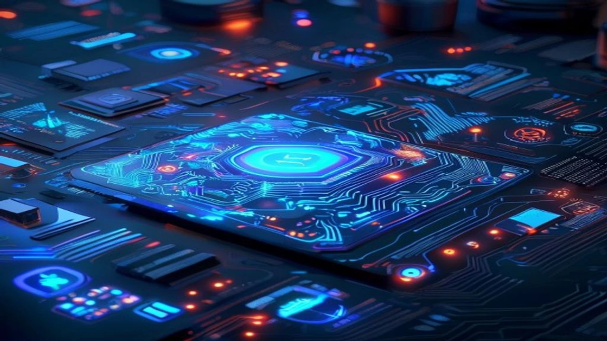
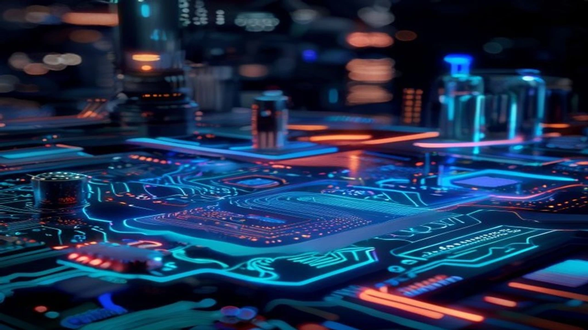

스마트폰 화면을 가득 채운 수십 개의 앱 아이콘 사이를 지치도록 오가며 음식을 주문하고 캘린더를 켜서 약속을 잡던 비효율의 시대가 저물고 있습니다. 사용자가 일일이 메뉴를 조작하지 않아도 말 한마디에 담긴 의도를 파악해 결과까지 단번에 제공하는 **인텐트 기반 UI** 기술이 차세대 디지털 모바일 생태계의 판도를 완전히 뒤바꾸고 있습니다. 

## 앱 스위칭의 종말: 인텐트 기반 UI란 무엇인가?

### 사용자가 겪던 기존 '앱 노마다' 방식의 한계
기존의 모바일 환경은 사용자가 목적을 달성하기 위해 여러 개의 애플리케이션을 유랑해야 하는 구조적 피로감을 안고 있었습니다. 예컨대 친구들과의 모임을 잡으려면 메신저에서 의견을 모으고, 포털 앱에서 맛집을 검색한 뒤, 예약 앱으로 자리를 잡고, 최종적으로 토스나 카카오페이 같은 금융 앱을 켜서 더치페이를 송금해야 했습니다. 이러한 파편화된 앱 스위칭 과정은 이탈률을 높이고 사용자의 인지적 과부하를 유발하는 고질적인 걸림돌이었습니다.

### 의도 중심 인터페이스(Intent-Driven)의 정의
인텐트 기반 UI는 사용자가 특정 인터페이스나 메뉴 조작법을 학습할 필요 없이, 오직 자신의 **'의도(Intent)'**만을 자연어로 입력하면 시스템이 이를 알아서 해석해 최종 태스크를 수행하는 패러다임입니다. 
> **"이번 주말에 친구들과 갈 만한 강남역 주변 맛집 예약하고 일정 캘린더에 등록해줘"**

위와 같이 복잡한 명령을 내렸을 때, 백엔드에서 검색·예약·스케줄링 API가 유기적으로 연동되어 단일 텍스트나 보이스 인터페이스 내에서 모든 프로세스가 완결되는 구조를 뜻합니다.

### 온디바이스 AI 및 거대행동모델(LAM)과의 기술적 연계성
이러한 혁신이 가능해진 배경에는 기기 자체적으로 연산을 처리하는 온디바이스 AI의 고도화와 인간의 복잡한 행동 프로세스를 모방하는 거대행동모델(LAM, Large Action Model)의 등이 자리합니다. 단순히 텍스트를 이해하는 수준(LLM)을 넘어, 스마트폰 운영체제(OS) 수준에서 각 앱의 기능을 API 단위로 호출하고 실행할 수 있는 에이전트 능력이 갖춰지면서 의도 중심 인터페이스는 완전한 현실로 도래했습니다.

## 기존 GUI vs 인텐트 기반 UI 비교분석

### 화면 중심(GUI)과 태스크 중심(Intent-Native)의 구조적 차이점
기존의 그래픽 사용자 인터페이스(GUI)는 철저히 시각적인 버튼과 메뉴 구조에 의존합니다. 개발자가 설계해 둔 트리 구조의 메뉴를 사용자가 역추적하며 원하는 기능을 찾아가야 하는 방식입니다. 반면 인텐트 기반 인터페이스는 철저히 목적과 태스크 중심으로 구동됩니다. 사용자가 시각적 요소를 탐색하는 과정 자체가 생략되거나 AI가 동적으로 생성한 일회성 UI 레이아웃을 통해 결과만 즉시 확인하게 됩니다.

### 사용자 경험(UX) 측면에서의 입력 피로도 및 전환율 비교
서비스 전환 관점에서 두 패러다임은 극명한 차이를 보입니다. 
- **기존 GUI 환경:** 회원가입, 로그인, 본인인증, 장바구니 담기 등 최종 목적지에 도달하기까지 평균 5\~7단계의 스크린 전환이 발생하며, 각 단계마다 사용자가 이탈할 위험성이 존재합니다.
- **인텐트 기반 환경:** 단 한 번의 자연어 명령으로 결제 직전 단계까지 진입하므로 입력 피로도가 제로에 가깝게 수렴하며, 결과적으로 비즈니스의 최종 전환율이 폭발적으로 상승합니다.

### 프라이버시 보안과 데이터 통제권 관점에서의 두 기술 비교
개인정보 보호 측면에서는 새로운 쟁점이 부각됩니다. 기존 GUI 환경에서는 사용자가 어떤 앱에 어떤 정보를 입력할지 스스로 선택하고 통제할 수 있었습니다. 하지만 AI 에이전트가 중심이 되는 의도 기반 환경에서는 사용자의 금융 정보, 위치 데이터, 스케줄 정보가 하나의 거대한 AI 레이어에 집중됩니다. 데이터 유출 시 발생하는 리스크가 기존보다 훨씬 치명적일 수 있다는 기술적 명암이 존재합니다.

## 차세대 인터페이스 도입의 빛과 그림자

### 장점: 극대화된 개인화, 앱 다운로드 장벽 제거, 비즈니스 효율성
가장 큰 이점은 개별 애플리케이션을 다운로드하고 업데이트해야 하는 물리적 장벽이 완벽히 허물어진다는 점입니다. 사용자는 특정 브랜드의 전용 앱을 설치하지 않고도 통합 AI 인터페이스를 통해 해당 브랜드의 서비스를 즉시 소비할 수 있습니다. 기업 입장에서는 신규 고객을 유치하기 위해 천문학적인 앱 마케팅 비용을 쏟아붓지 않아도 되며, 오직 서비스 본질과 API 퀄리티만으로 정당한 승부를 겨굴 수 있는 생태계가 열립니다.

### 단점: AI 오작동으로 인한 결제 사고 위험 및 플랫폼 종속성 심화
반면 치명적인 리스크도 상존합니다. 거대행동모델의 환각(Hallucination) 현상이나 오작동으로 인해 사용자가 의도하지 않은 엉뚱한 식당이 예약되거나, 원치 않는 금액이 자동 결제되는 사고가 발생할 수 있습니다. 아울러 이 모든 인텐트를 독점하는 최상위 운영체제(OS) 플랫폼이나 빅테크 AI 기업에 대한 종속성이 심화되어, 개별 중소 서비스 공급자들은 플랫폼의 API 규격에 종속되는 하청 기지로 전락할 위험성을 배제하기 어렵습니다.

### UI/UX 디자이너와 개발자가 마주한 새로운 직무적 도전 과제
디지털 제품을 만드는 메이커들의 역할도 급격하게 변화하는 추세입니다. 고정된 레이아웃과 컴포넌트를 예쁘게 배치하던 시각 디자이너의 영역은 축소되는 반면, 사용자의 발화 목적을 정확히 분류하고 시스템 아키텍처에 매핑하는 인터랙션 기획자와 API 엔지니어의 몸값이 치솟고 있습니다. 정적 화면 설계가 아닌, 동적으로 생성되는 가변형 컴포넌트를 제어하는 프론트엔드 기술력이 핵심 경쟁력으로 부각됩니다.

[관련 글 보기](/posts/latest-tech/)

## 2026년 이후 비즈니스를 바꾸는 AI 에이전트 연동 가이드

### 기존 서비스에 인텐트 기반 API를 연동하는 3단계 프로세스
기존 웹/앱 서비스를 보유한 기업이 이 거대한 흐름에 합류하기 위해서는 비즈니스 아키텍처의 전면 수정이 요구됩니다. 
* **1단계(스키마 표준화):** 서비스의 모든 핵심 기능을 거대모델이 이해할 수 있도록 명확한 JSON 스키마 형태로 명세화하고 표준 API로 개방해야 합니다.
* **2단계(인텐트 분류기 구축):** 사용자의 모호한 발화에서 자사 서비스로 연결될 수 있는 정확한 파라미터를 추출하는 경량화된 분류 모델을 연동합니다.
* **3단계(샌드박스 검증):** 결제나 개인정보 변경처럼 민감한 트랜잭션이 일어나기 전 반드시 사용자에게 명시적 확답을 요구하는 안전장치(Human-in-the-loop) 인터페이스를 설계합니다.

### '앱스토어' 몰락 시나리오와 새로운 트래픽 확보 전략(GEO/SEO)
애플과 구글이 지배하던 기존 앱스토어 중심의 생태계가 붕괴되면서 트래픽 유입의 공식이 통째로 바뀌고 있습니다. 이제 독자들은 앱스토어 검색창에 검색어를 입력하지 않고 AI 검색 결과 내에서 서비스를 추천받아 곧바로 소비합니다. 따라서 전통적인 검색엔진 최적화(SEO)를 넘어, 생성형 AI 에이전트가 자사 서비스를 신뢰할 수 있는 최적의 답변 후보군으로 채택하도록 만드는 생성엔진 최적화(GEO) 전략이 기업 생존의 유일한 돌파구로 확립되었습니다.

### 향후 3년 내 주류가 될 오픈 인터페이스 생태계 전망
앞으로 다가올 디지털 생태계는 하드웨어와 소프트웨어의 경계가 무너지는 오픈 인터페이스가 주도하게 됩니다. 스마트폰뿐만 아니라 스마트 글래스, 웨어러블 디바이스, 커넥티드 카 등 어떤 디바이스를 사용하든 사용자의 목소리와 시선이라는 인텐트를 중심으로 모든 서비스가 실시간으로 직조되는 세상입니다. 이러한 흐름을 선제적으로 파악하고 자사의 핵심 역량을 API 기반으로 경량화하는 기업만이 다가올 인텐트 네이티브 시대의 진정한 승리자가 될 확률이 높습니다.

#인텐트기반UI #인터페이스혁신 #생성형AI #거대행동모델 #온디바이스AI #UX디자인 #미래기술트렌드