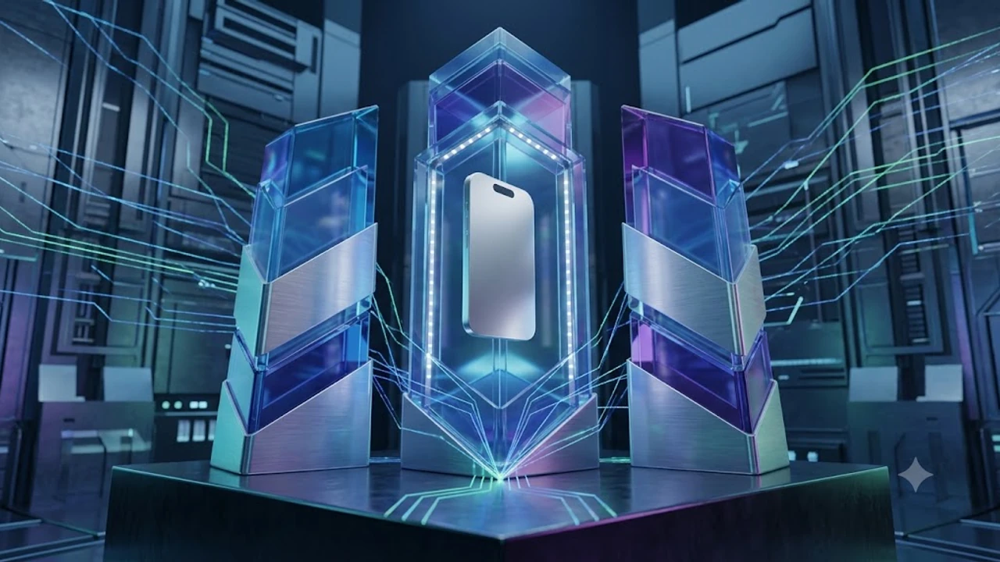

2026년 가을 애플 키노트 발표 직후 많은 실구매자의 관심이 **아이폰18 사전예약** 일정과 플랫폼별 실질 할인율에 쏠리고 있습니다. 이번 신제품은 2나노 공정 기반 차세대 뉴럴 엔진과 온디바이스 AI 구동 능력을 전면에 내세운 만큼 초기 초도 물량을 선점하려는 자급제 및 통신사 수요가 거세게 부딪히는 상황입니다. 결제 직전 불필요한 지출을 줄이려면 유통 채널별 카드 청구 할인과 실질 요금제 결합 구조를 꼼꼼히 대조해야 합니다.

## 아이폰18 사전예약 일정 및 출시 라인업 확인

### 1차 출시국 확정과 공식 사전예약 시작일

한국 시장은 1차 출시국 지위를 유지하며 글로벌 무대와 동일한 타임라인으로 예약을 개시합니다.

- **공식 사전예약 오픈**: 2026년 9월 11일(금) 오후 9시 정각
- **정식 매장 수령 및 택배 배송**: 2026년 9월 18일(금) 오전 8시 순차 개통

서버 오픈 직후 불과 3분 이내에 1차 수령 물량이 소진되는 패턴이 반복되므로, 본인 인증 수단과 결제 카드 세팅을 사전에 끝내두어야 초기 발송 순번을 확보할 수 있습니다.

### 기본형부터 프로 맥스까지 변경된 핵심 스펙

라인업은 일반형, 플러스, 프로, 프로 맥스 4종 체제를 그대로 이어갑니다.

- **A20 프로 칩셋 탑재**: 차세대 2나노 공정을 거쳐 전력 효율이 25%가량 향상되었고, 로컬 환경에서의 대형 언어 모델 추론 속도가 눈에 띄게 개선되었습니다. 반도체 미세 공정 경쟁의 구체적 배경은 [TSMC 1.6나노 A16, 진짜 2나노 건너뛸까?](/posts/latest-tech/tsmc-16nm-a16-mass-production-2026/) 분석에서 자세히 확인할 수 있습니다.
- **다이내믹 아일랜드 면적 축소**: 디스플레이 하단 센서 통합 기술을 확장 적용해 화면을 가리는 면적을 30%가량 줄였습니다.
- **광학 5배 폴디드 줌 전면 도입**: 최상위 모델 전유물이던 잠망경 카메라 모듈이 프로 기본형 모델까지 빠짐없이 들어갔습니다.

### 전작 대비 출고가 변동 폭과 체감 가격

부품 원가 상승 요인이 반영되면서 출고 시작 가격은 소폭 상향 조정되었습니다.

> **용량별 기준 출고가 (기본 용량 256GB 통일 기준)**
> - 기본형: 130만 원
> - 플러스: 140만 원
> - 프로: 160만 원
> - 프로 맥스: 195만 원

최저 용량이 128GB에서 256GB로 단일화되었기 때문에 동일 저장 용량 기준으로 따져보면 실제 체감 가격 인상 폭은 5만 원 선에 그칩니다.

## 통신 3사 사전예약 혜택과 조건 비교

### SKT·KT·LGU+ 공시지원금 및 요금 할인율

아이폰 라인업은 통신사 불문 초반 공시지원금이 매우 박하게 책정되는 특성이 있습니다.

* 월 10만 원대 고가 요금제를 6개월 유지하는 조건을 걸어도 공시지원금은 최대 15만~20만 원 수준에 불과합니다.
* 24개월 유지 총비용을 따지면 기기값 할인 대신 **선택약정 25% 요금 할인**을 택하는 쪽이 최소 30만 원 이상 이득입니다.

### 번호이동 vs 기기변경 사은품 혜택 비교

기존 통신사를 유지하는 기기변경 고객보다 타사 가입자를 뺏어오는 번호이동 고객에게 마케팅 지원이 몰립니다.

* **번호이동**: OTT 1년 구독권 지원, 정품 맥세이프 고속 충전 액세서리 패키지 지급, 전환지원금 최대 10만 원 혜택이 주어집니다.
* **기기변경**: 장기 결합 가입자 이탈을 막기 위한 5만 원권 기기 변경 쿠폰이나 제휴 멤버십 포인트 적립 위주로 혜택이 제한됩니다.

### 통신사 전용 제휴 카드 결합 조건 분석

단말기 대금과 통신 요금을 통합 청구 할인해 주는 제휴 카드는 전월 실적 기준을 엄격히 따져야 합니다. 월 40만 원 실적 충족 시 매달 1만 5,000원에서 2만 원이 차감되지만, 통신사 분할상환 수수료 연 5.9%가 기기값에 별도로 얹혀 청구된다는 점을 잊지 말아야 합니다.

## 자급제 구매와 오픈마켓 즉시할인 공략법

### 쿠팡·11번가·SSG 카드 즉시할인율 비교

약정 없이 알뜰폰과 묶어 쓰려면 오픈마켓 자급제 사전예약 페이지 오픈 타이밍을 노리는 것이 유리합니다.

* **쿠팡(로켓와우 가입자)**: 신한·국민·삼성 카드 결제 시 8~10% 즉시할인 적용
* **11번가**: 신한·현대카드 결제 연계 시 7% 즉시할인 및 SK pay point 추가 적립
* **SSG닷컴**: SSG페이 등록 카드 8% 청구할인 및 신세계포인트 페이백

### 무이자 할부 개월 수 및 추가 적립 포인트

고가 플래그십 기기를 결제할 때 현금 흐름을 지키려면 무이자 할부 혜택을 챙겨야 합니다. 대형 이커머스 채널은 주요 카드사와 제휴해 100만 원 이상 결제 건에 대해 최장 16개월에서 22개월 무이자 할부를 지원합니다. 통신사 단말기 할부 수수료 연 5.9%를 고려하면 2년 동안 10만 원이 넘는 금융 비용을 절약하는 셈입니다.

### 알뜰폰 LTE/5G 요금제 조합 시 월 절감액

자급제 공기계와 알뜰폰(MVNO) 요금제를 결합하는 방식은 2년 기준 가계 통신비를 가장 확실히 줄여줍니다.

- **이통 3사 5G 무제한 요금제(월 85,000원 기준)**: 24개월 납부액 약 2,040,000원 (선택약정 25% 적용 시 1,530,000원)
- **알뜰폰 데이터 무제한 요금제(월 25,000원 기준)**: 24개월 납부액 약 600,000원

> **24개월 총 통신 지출 계산 결과**  
> 자급제 카드로 기기값을 8~10% 깎아 사고 알뜰폰 무제한 요금제를 조합하면, 통신사 공시지원금 약정 대비 총지출을 최소 70만 원에서 90만 원 가까이 덜어낼 수 있습니다.

## 실패 없는 사전예약 결제 성공 실전 팁

### 결제 수단 사전 등록과 원클릭 세팅법

초 단위로 잔여 수량이 빠지는 사전예약 특성상 결제 단계에서 비밀번호나 생체인증을 일일이 누르고 있으면 순번에서 밀립니다. 생체인식 기술의 최근 보안 발전 추세는 [웨어러블 생체인식 보안 결국 지문 추월한다](/posts/latest-tech/wearable-biometric-security-future/) 포스팅에서 깊이 있게 다루고 있습니다.

- 오픈마켓 앱 내 원터치 결제(지문·비밀번호 인증 생략) 사전 활성화
- 기본 배송지 주소를 1순위로 확정 등록
- 할인 적용 대상 제휴 카드를 기본 결제 수단으로 최우선 배치

### PC와 모바일 동시 접속 최적화 노하우

서버 병목 현상을 뚫어내려면 단일 기기보다는 모바일과 PC 환경을 동시에 띄워두어야 합니다.

- 모바일 기기는 Wi-Fi 간섭을 피하기 위해 5G 직접 접속망을 켭니다.
- PC 웹 브라우저는 사전예약 10분 전 캐시와 쿠키를 지우고 결제 팝업 차단 설정을 반드시 해제합니다.

### 취소표 발생 시간대와 2차 수량 공략 가이드

1차 오픈 5분 만에 품절 메시지를 보았더라도 곧바로 포기할 이유는 없습니다. 한도 초과나 단순 변심, 중복 결제로 튕겨 나간 물량이 주기적으로 재고 풀에 회수됩니다.

* **오픈 당일 심야**: 예약 오픈 1~2시간 뒤인 오후 10시부터 11시 사이에 카드 한도 초과 자동 취소 물량이 대거 풀립니다.
* **익일 오전**: 다음 날 오전 8시에서 10시 사이에 중복 결제자들이 주문을 정리하면서 취소 수량이 다시 잡힙니다.

초고속 온디바이스 연산을 쾌적하게 활용하려면 기기 수령 일정에 맞춰 안정적인 고속 무선 충전 액세서리를 함께 챙겨두는 편이 좋습니다.
[관련상품 쿠팡에서 보기](https://www.coupang.com/np/search?q=%EC%8A%A4%EB%A7%88%ED%8A%B8%EA%B8%B0%EA%B8%B0%20AI%EA%B8%B0%EA%B8%B0&sourceType=affiliate&trackingCode=AF8691300)

#아이폰18 #아이폰18사전예약 #자급제사전예약 #아이폰출시일 #알뜰폰요금제 #카드즉시할인 #무이자할부 #공시지원금비교