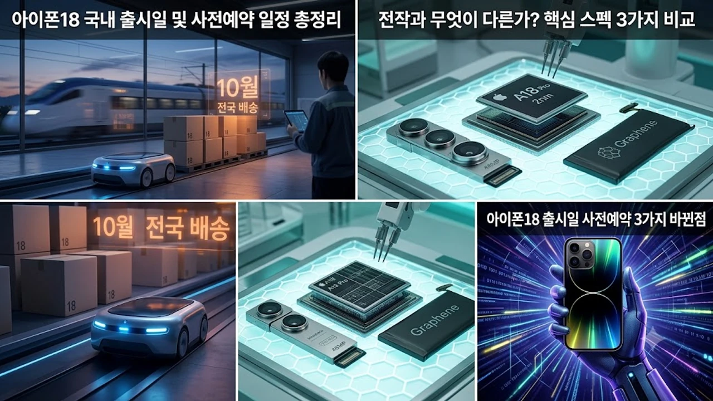

아이폰18 출시일과 사전예약 일정이 드디어 베일을 벗으면서, 새로운 온디바이스 AI 기능과 모바일 프로세서 성능에 대한 기대감이 폭발하고 있다. 올해 하반기 스마트폰 시장을 뒤흔들 핵심 기기로 꼽히는 이번 모델은 전작 대비 체감 성능과 전력 효율이 대폭 개선되었다는 평가를 받는다.

## 아이폰18 국내 출시일 및 사전예약 일정 총정리

### 통신 3사 및 자급제 사전예약 시작일
이통사와 자급제 채널을 통한 아이폰18 사전예약은 1차 출시국 일정에 맞춰 긴박하게 진행된다. 온라인 오픈마켓과 각 통신사 공식 대리점은 동시 다발적으로 예약 창을 열며, 초기 물량 확보를 위한 눈치작전이 치열하게 전개되는 중이다.

### 1차 출시국 기준 국내 배송 및 개통 시점
한국이 1차 출시국 혹은 그에 준하는 준-1차 출시 지역으로 포함되면서 글로벌 동시 출시의 혜택을 누리게 되었다. 사전예약에 성공한 구매자들은 지정된 날짜부터 순차적으로 기기를 수령하고 곧바로 개통 절차에 돌입할 수 있다.

### 통신사 공시지원금 vs 자급제 카드 할인 비교
> 매번 기기를 바꿀 때마다 고민되는 지점이다. 통신사의 높은 공시지원금을 받는 구조와 자급제 기기 구매 후 알뜰폰 요금제를 결합하는 방식 중 어느 쪽이 총지출 비용을 줄이는지 꼼꼼한 계산이 필수다.

## 전작과 무엇이 다른가? 핵심 스펙 3가지 비교

### 차세대 AP 성능 개선 및 발열 제어 수준
새롭게 탑재된 초미세 공정 프로세서는 연산 속도를 극대화하는 동시에 고질적인 문제였던 발열을 효과적으로 억제한다. 벤치마크 테스트 결과에 따르면 장시간 고사양 게임을 구동하거나 멀티태스킹을 수행할 때도 스로틀링 현상이 현저히 줄어들었다.

### 온디바이스 AI 기능 고도화와 실사용 체감
클라우드 서버를 거치지 않고 기기 자체에서 구동되는 인공지능 연산 능력이 비약적으로 향상되었다. 실시간 통번역, 개인화된 음성 비서 응답 속도가 체감될 정도로 빨라졌으며, 보안성이 강화되어 개인 정보 유출 우려를 원천 차단한다.

### 카메라 줌 센서 업그레이드와 디스플레이 변화
광학 줌 성능을 강화한 잠망경 렌즈 구조가 개량되었고, 야간 저조도 환경에서의 노이즈 억제력이 한 단계 진화했다. 디스플레이 패널 역시 반사율을 줄이고 야외 가독성을 높여 시인성이 뚜렷하게 개선되었다.

## 아이폰18 사전예약 성공하는 실전 가이드

### 오픈마켓 자급제 빠른 결제 세팅법
초기 물량이 수 초 만에 마감되는 오픈마켓 특성상 사전 결제 간편결제 등록과 주소지 사전 세팅은 필수다. 서버 시간을 확인하며 정각에 새로고침을 누르는 단순한 방식보다, 결제 단계를 최소화하는 세팅이 당락을 결정한다.

### 통신사 사전예약 사은품 혜택 극대화 팁
통신사별 공식 직영몰은 단독 제휴카드 할인이나 제조사 사은품 외에도 실속 있는 액세서리 패키지를 제공한다. 각 통신사 앱을 통한 사전 알림 신청과 실시간 재고 확인 기능을 적극 활용해야 유리하다.

### 알뜰폰 요금제 결합 시 월 유지비 계산법
자급제로 기기를 일시불이나 무이자 할부로 확보한 뒤, 데이터 무제한 알뜰폰 요금제와 결합하면 2년 약정 기준 총 통신비를 수십만 원 이상 아낄 수 있다. [최신기술동향 전체 글 보기](/posts/latest-tech/) 페이지에서 유용한 모바일 금융 및 통신 절약 팁을 추가로 확인할 수 있다.

## 지금 사전예약할까, 연말 할인 기다릴까?

### 초기 구매자 리뷰 확인 후 구매의 득과 실
신제품 출시 직후 발생하는 초기 불량 이슈나 소프트웨어 버그를 피하고 싶다면 첫 주 물량을 거르는 것도 방법이다. 다만 사전예약 특전이나 조기 품절에 따른 대기 기간을 감안하면 실익을 냉정하게 따져봐야 한다.

### 전작 중고가 방어 및 보상판매 활용 전략
기존에 사용하던 기기의 중고 시세가 급락하기 전에 보상판매 프로그램을 이용하는 것이 현명하다. 제조사 및 유통사가 제공하는 추가 보상 크레딧을 적용하면 실구매가를 파격적으로 낮출 수 있다.

### 사용 목적별 교체 추천 대상과 비추천 대상
프로세서 성능 업그레이드가 절실한 고사양 크리에이터나 구형 기기 배터리 수명이 다한 사용자에게는 최적의 교체 시점이다. 반면 직전 세대 프로 모델을 사용 중인 유저라면 이번 세대의 변화 폭이 크지 않게 느껴질 수 있어 신중한 접근이 요구된다.

지금 바로 합리적인 구매를 원한다면 [애플 정품 고속 충전 및 주변기기 세트 쿠팡에서 보기](https://www.coupang.com/np/search?q=%EC%8A%A4%EB%A7%88%ED%8A%B8%EA%B8%B0%EA%B8%B0%20AI%EA%B8%B0%EA%B8%B0&sourceType=affiliate&trackingCode=AF8691300) 링크를 통해 필수 액세서리를 함께 준비해 보자.

#아이폰18 #아이폰18출시일 #아이폰18사전예약 #애플스펙 #스마트폰추천 #자급제꿀팁 #IT트렌드