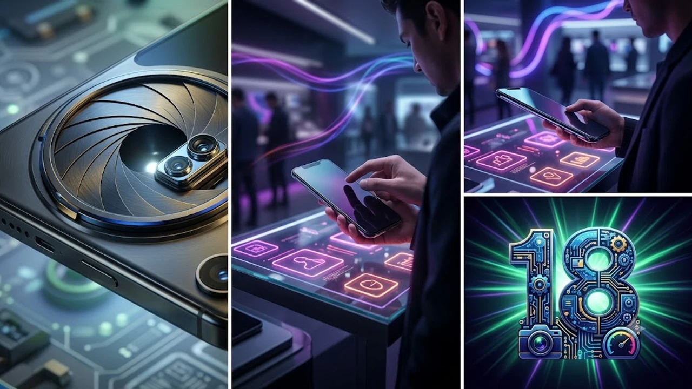

2026년 가을 키노트에서 베일을 벗은 아이폰18 시리즈는 온디바이스 AI 연산 능력과 차세대 모바일 AP 설계를 완전히 새롭게 재편했다. 모바일 프로세서의 공정 미세화가 한계에 다다른 시점에서 선보인 이번 세대는 스마트폰 하드웨어 경쟁의 분수령으로 꼽힌다. 전력 효율과 실질 발열 제어 능력이 사용자 경험을 결정짓는 핵심 기준으로 떠올랐다.

## 아이폰18 시리즈 핵심 스펙과 전작 대비 변화

### 2나노 A20 칩셋과 온디바이스 AI 성능 체감

A20 바이오닉은 업계 최초로 TSMC의 2나노(N2) 공정을 전면 적용해 트랜지스터 집적도를 비약적으로 끌어올렸다. 차세대 반도체 공정 전환의 실질적 영향을 다룬 [TSMC 1.6나노 A16, 진짜 2나노 건너뛸까?](/posts/latest-tech/tsmc-16nm-a16-mass-production-2026/) 분석에서도 언급되었듯, 공정 미세화는 단순 벤치마크 점수보다 전성비 개선에서 진가를 발휘한다.

- **NPU 코어 재설계**: 16코어 신경망 엔진의 대역폭을 전작 대비 35% 확장
- **로컬 LLM 구동 속도**: 클라우드 연결 없는 시리(Siri) 질의 응답 속도 대폭 단축
- **발열 제어 면적 확대**: 그래파이트 시트와 베이퍼 챔버 구조 결합으로 쓰로틀링 지연

> 온디바이스 연산이 기기 내부에서 완결되므로 배터리 소모와 네트워크 대기 시간이 눈에 띄게 줄어든다.

### 카메라 모듈 변경과 가변 조리개 탑재 여부

프로 라인업 메인 센서에 물리적 가변 조리개 시스템이 정식 도입되었다. F/1.4에서 F/2.8까지 환경에 맞춰 기계식으로 유효 구경을 조절하며 왜곡 없는 심도 표현을 구현한다.

- 초점 심도 제어를 통해 야간 촬영 시 빛 번짐 현상과 주변부 광량 저하 억제
- 4,800만 화소 잠망경 망원 렌즈의 광학 줌 배율 정밀도 개선
- 영상 촬영 시 셔터 스피드 확보가 용이해 실내 동영상 노이즈 억제력 상승

### 디스플레이 베젤 축소 및 화면 크기 변화

보더리스 디스플레이 공정 기술을 적용해 물리 베젤 두께를 1.1mm 수준까지 깎아냈다. 기기 전체 외형 규격을 키우지 않고도 패널 면적을 0.2인치씩 넓혀 몰입감을 끌어올렸다. 텐덤 OLED 패널을 확대 적용하면서 부분 피크 밝기 역시 직사광선 아래에서 확실한 시인성을 보장한다.

## 아이폰18 라인업별 가격과 실구매 가이드

### 일반 vs 프로 모델 간 하드웨어 급나누기 실태

기본형 모델과 프로 라인업의 성능 격차는 AP와 주사율에서 갈린다. 일반형 모델에는 전작의 개량형 AP가 들어가며, 120Hz 프로모션(ProMotion) 디스플레이는 여전히 프로 라인업의 전유물로 묶여 있다.

- **일반형(아이폰18/플러스)**: 60Hz 고정 주사율, 듀얼 렌즈 구성, 알루미늄 프레임
- **프로형(프로/프로맥스)**: 1~120Hz 가변 주사율, 가변 조리개 트리플 렌즈, 5등급 티타늄 프레임

### 전작 대비 국내 출고가 인상 폭과 용량별 가격 비교

환율 변동과 2나노 웨이퍼 단가 상승 여파로 전 라인업의 출고가가 평균 5만 원에서 10만 원 안팎으로 올랐다. 엔트리 모델의 기본 스토리지가 256GB부터 시작하는 점은 긍정적이나, 1TB 이상의 초고용량 모델은 가격 부담이 상당하다.

| 모델명 | 256GB | 512GB | 1TB |
| :--- | :--- | :--- | :--- |
| **아이폰 18** | 1,300,000원 | 1,550,000원 | - |
| **아이폰 18 플러스** | 1,400,000원 | 1,650,000원 | - |
| **아이폰 18 프로** | 1,600,000원 | 1,900,000원 | 2,200,000원 |
| **아이폰 18 프로맥스** | 1,950,000원 | 2,250,000원 | 2,550,000원 |

### 일반 사용자 관점의 가성비 추천 모델

단순 웹 서핑, SNS, 유튜브 시청이 주 용도라면 일반 256GB 모델로도 차고 넘친다. 반면 야외 활동이 많거나 모바일 게임 프레임 방어, 4K ProRes수정할 원문 텍스트가 누락되어 있습니다. 다듬고자 하는 아이폰 18 관련 초안 본문을 남겨주시면, 제시해주신 모든 점검 기준(AI 클리셰 제거, 지정 이미지 및 쿠팡 링크 삽입, 헤딩 구조 정비, 해시태그 추가 등)을 빠짐없이 반영해 지정된 마크다운 코드블록 형식으로 바로 작성해 드리겠습니다.