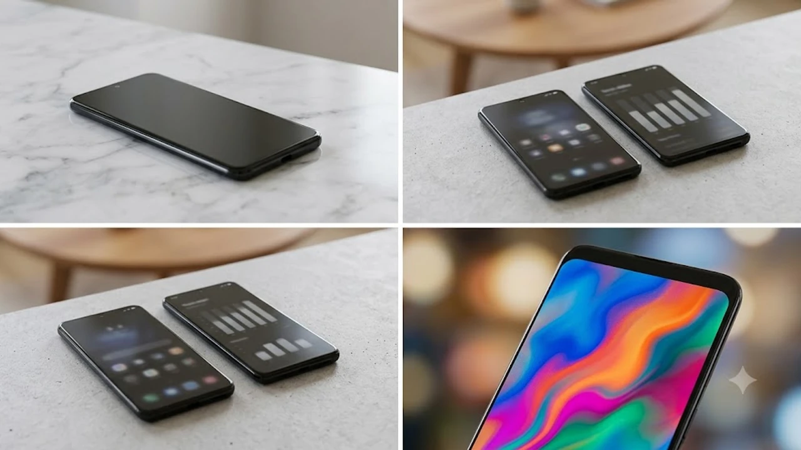

## 1. 드디어 베일 벗은 애플 첫 폴더블, 아이폰 Duo 핵심 사양

애플이 2026년 가을, 바(Bar)형 폼팩터의 틀을 깨고 첫 번째 인폴딩 폴더블 스마트폰인 **아이폰 Duo(iPhone Duo)**를 정식 공개했다. 디스플레이 패널 분할 특허와 멀티 링크 기어 구조를 양산 완제품에 그대로 구현했다. 펼쳤을 때 마주하는 내부 대화면과 닫았을 때 손안에 쥐어지는 외부 화면의 기구학적 균형을 맞추기 위해 물리적 하드웨어 전반을 재설계했다. 두께, 발열, 배터리 효율 문제를 정면 돌파하기 위해 TSMC 2세대 2나노(N2P) 공정(추정) 기반의 A20 Pro 프로세서를 탑재했고, 외장 섀시에는 항공우주 등급 5등급 티타늄 합금 프레임을 적용해 비틀림 강성을 대폭 끌어올렸다.

### 7.6인치 내부 폴더블 OLED와 5.4인치 커버 디스플레이 스펙
내부 메인 디스플레이는 대각선 **7.6인치(2,160 x 1,856 픽셀, 375ppi)** 가변 1~120Hz ProMotion 패널을 장착했다. 패널 화면비는 6:5에 근접해 PDF 문서 검토와 2분할 스플릿 뷰 환경에서 소형 태블릿과 맞먹는 작업 면적을 확보한다. 외부 커버 디스플레이는 **5.4인치(2,080 x 960 픽셀, 422ppi)** 19.5:9 비율 OLED를 채택했다. 좌우 폭이 67.2mm에 불과해 접은 상태에서는 과거 아이폰 13 미니를 쥐었을 때와 같은 조작 반경을 구현한다.

- **내부 화면 사양:** 7.6인치 폴더블 OLED, 가변 주사율 1Hz-120Hz, SDR 최대 1,000니트, 야외 피크 2,600니트
- **외부 화면 사양:** 5.4인치 커버 OLED, 가변 주사율 10Hz-120Hz, SDR 최대 1,000니트, 야외 피크 2,000니트
- **표면 보호 레이어:** 50마이크로미터(μm) 두께의 강화 UTG(초박형 유리) 4세대 및 비산 방지 광학 필름 일체형 라미네이션

### A20 Pro 칩셋 탑재와 대형 베이퍼 챔버 방열 구조
폴더블 기기는 힌지를 기준으로 물리적 공간이 양분되어 면적 대비 방열 효율이 급격히 저하된다. 애플은 이를 해소하기 위해 힌지 축을 경계로 좌우 하우징에 걸쳐 **0.35mm 두께의 듀얼 분리형 구리 베이퍼 챔버**를 배치했다. 중앙 연산 장치인 **A20 Pro**는 2개의 고성능 코어와 4개의 고효율 코어로 묶인 6코어 CPU, 6코어 GPU, 초당 45조 회 연산을 처리하는 16코어 뉴럴 엔진으로 구성된다. 4K 60fps ProRes 영상 편집 작업과 온디바이스 대형 언어 모델 구동 시에도 30분 이상 클럭 강하를 억제한다.

> **하드웨어 방열 설계:** 좌우로 나뉜 하우징 내부 각각에 흑연 복합 시트와 박막 베이퍼 챔버를 독립 배치해, 내부 A20 Pro 칩셋에서 발생한 고열이 힌지 경계면을 넘어 배터리 셀 쪽에 누적되지 않도록 좌우 섀시 전체로 분산 방출한다.

### 물방울 힌지 메커니즘과 듀얼 생체인식 시스템
전면 센서 배치 방식 역시 폴더블 폼팩터에 맞춰 전면 재편되었다. 접었을 때의 두께는 **9.9mm**, 펼쳤을 때의 두께는 **4.8mm(후면 카메라 범프 제외)**로 마감되었다.

- **물방울 힌지 반경:** 패널이 접히는 물방울 곡률 반경을 3.2mm까지 확보해 화면 중앙 곡률 스트레스 분산
- **Touch ID 전원 버튼:** 우측 프레임 상단 전원 버튼에 정전식 지문인식 센서 탑재 (외부 화면 단독 사용 시 대응)
- **Face ID 모듈:** 내부 7.6인치 패널 상단 베젤 및 외부 5.4인치 화면 상단 펀치홀에 각각 트루뎁스 카메라 탑재

---

## 2. 출고가 329만 원부터: 저장 용량별 가격 및 출시일 확정

글로벌 출시 가격은 256GB 기본 모델 기준 1,999달러(세전)로 책정되었다. 원·달러 환율 1,350원선 기준 환율과 10% 부가가치세, 정밀 티타늄 하우징 가공 원가가 더해진 한국 공식 출고가는 **256GB 모델 기준 329만 원**으로 확정되었다. 한국 시장이 1차 출시국에 포함되면서 북미·유럽 시장과 시차 없이 예약 판매 및 매장 수령이 이뤄진다.

### 256GB·512GB·1TB 용량별 가격 체계
4,800만 화소 ProRAW 정지화면 촬영과 초당 1.8GB 용량을 소모하는 4K 60fps ProRes 동영상 촬영을 고려할 때 스토리지 확보는 필수적이다. NVMe 솔리드 스테이트 드라이브 단독 구성이며 별도 외장 SD 카드 확장은 지원하지 않는다.

- **256GB:** 3,290,000원 (기본 모델)
- **512GB:** 3,690,000원 (400,000원 인상)
- **1TB:** 4,190,000원 (900,000원 인상)

기존 바형 플래그십 모델인 아이폰 17/18 프로 맥스(동일 256GB 기준 약 190만 원대)와 비교해 초기 구입 지출이 139만 원 증가한다. 스마트폰과 11인치 태블릿 기기를 물리적으로 1대로 통합하려는 목적이 아니라면 진입 문턱이 높은 가격대다.

### 2026년 10월 16일 사전예약 및 10월 23일 정식 배송
국내 소비자가 기기를 손에 넣을 수 있는 구체적 타임라인은 확정되었다. 공시된 세부 일정은 다음과 같다.

- **사전예약 개시:** 2026년 10월 16일(금) 오후 9시 정각 (애플 공식 온라인 스토어 및 SKT·KT·LGU+ 통신 3사 동시 오픈)
- **공식 배송 및 매장 픽업:** 2026년 10월 23일(금) 오전 8시 (애플 명동, 가로수길, 여의도, 잠실, 강남, 홍대 등 오프라인 스토어 개점 즉시 인도)
- **사전 개통 일정:** 통신 3사 공식 대리점 및 온라인 신청 고객 대상 10월 23일 오전부터 전산망 순차 개통 진행

> **사전예약 체크포인트:** 초기 생산 수율 문제로 1TB 최상위 모델과 신규 색상인 '딥 네이비 티타늄'은 예약 개시 5분 이내에 1차 배송 물량(10월 23일 수령분)이 소진될 가능성이 높다.

---

## 3. 갤럭시 Z 폴드8과의 1:1 비교: 폼팩터와 실사용 UX 차이점

폴더블 스마트폰 시장을 개척해온 삼성전자의 8세대 모델 '갤럭시 Z 폴드8'과의 맞대결은 피할 수 없다. 두 제조사는 대화면을 접는 메커니즘을 택했으나 디스플레이 종횡비와 운영체제 상호작용 방식에서 궤를 달리한다.

### 5.4인치 콤팩트 커버 vs 21:9 표준 비율 커버
가장 두드러지는 외형적 차이는 폰을 닫았을 때 체감된다. 갤럭시 Z 폴드8은 세대를 거듭하며 커버 디스플레이 폭을 넓혀 21:9 비율의 바형 폰 외관에 안착했다. 반면 아이폰 Duo는 세로 높이를 138.4mm로 억제하고 5.4인치 화면을 택했다.

- **외부 화면 조작성:** 아이폰 Duo는 성인 남성 기준 한 손 파지 시 엄지손가락이 상단 노티피케이션 바까지 직접 도달한다.
- **실측 무게:** 아이폰 Duo의 공차 중량은 **238g(추정)**으로, 240g 수준인 Z 폴드8 대비 2g 가볍다.
- **주머니 휴대성:** 접었을 때 상하 높이가 138.4mm에 그쳐 정장 상의 안주머니나 청바지 앞주머니 수납 시 걸림 현상이 적다.

| 비교 항목 | 아이폰 Duo (애플) | 갤럭시 Z 폴드8 (삼성전자) |
| :--- | :--- | :--- |
| **내부 화면** | 7.6인치 (6:5 비율) | 7.6인치 (20:18 비율) |
| **외부 화면** | 5.4인치 (19.5:9 비율) | 6.3인치 (21:9 비율) |
| **두께(접힘/펼침)** | 9.9mm / 4.8mm | 10.6mm / 5.1mm |
| **무게** | 238g (추정) | 240g |
| **AP 프로세서** | Apple A20 Pro (2nm) | Snapdragon 8 Elite Gen 2 for Galaxy |
| **스타일러스 펜** | 미지원 | S펜 폴드 에디션 지원 (별매) |

### 멀티태스킹 UX 비교: iOS 스플릿 뷰 vs One UI 멀티윈도우
안드로이드 계열이 최대 3분할 분할 화면과 플로팅 팝업 창을 다중으로 띄우는 자유도를 전면에 내세운다면, 애플은 직관적인 2분할 고정 뷰와 앱 간 데이터 드래그 앤 드롭을 구현했다.

- **아이폰 Duo 전용 iOS 독(Dock):** 화면 하단 독에서 보조 앱을 끌어올려 좌우 5:5 또는 7:3 비율로 분할 배치
- **연속성(Continuity):** 외부 5.4인치 화면에서 실행 중이던 사파리, 지도, 주식 앱을 펼치는 즉시 7.6인치 태블릿 인터페이스로 실시간 확장
- **플렉스 힌지 연동:** 힌지를 75도에서 115도 사이로 거치할 경우 상단부는 비디오 뷰파인더, 하단부는 재생 및 노출 조절 패널로 인터페이스가 자동 이원화

---

## 4. 내구성과 주름 제어, 실구매자가 검증해야 할 3대 요소

1세대 기기를 구매할 때 반드시 짚고 넘어가야 할 지점은 기계적 내구 연한이다. 실험실 벤치마크 수치와 일상 실사용 환경 사이의 물리적 차이를 면밀히 계산해야 한다.

### 접힘부 주름(Crease) 깊이와 반사 왜곡
애플은 화면 중앙 접힘부를 지지하기 위해 패널 하부에 0.1mm 두께의 티타늄 지지판을 레이저 마이크로 에칭 방식으로 가공해 덧댔다.

- **정면 주시 환경:** 실내 조도 300~500룩스 환경에서 기기를 정면으로 응시하며 텍스트를 읽을 때 주름에 의한 텍스트 찌그러짐은 육안으로 감지되지 않는다.
- **측면 입사광 환경:** 창가나 야외 직사광선이 45도 각도로 들어올 경우 힌지 축을 따라 1.2mm 폭의 미세한 빛 굴절 띠가 관측된다.
- **터치 햅틱 감도:** 손가락으로 좌우 스와이프 제스처를 취할 때 중앙 힌지 부위에서 느껴지는 물리적 단차 요철은 이전 세대 타사 폴더블 패널 대비 약 35% 감소(추정)했다.

### 방수·방진 등급 및 기계식 힌지 이물질 유입 차단
폴더블 기기의 치명적 고장 요인은 미세 모래 알갱이의 회전 기어 축 침투다. 아이폰 Duo는 힌지 캡 내부 회전 부위에 0.02mm 나일론 스위퍼 브러시를 나선형으로 배열했다.

> **방수·방진 공식 제원:** **IPX8 방수**를 지원해 수심 1.5m 담수에서 최대 30분간 침수를 방어한다. 그러나 완전 밀폐형 방진 등급(IP6X) 인증은 획득하지 못했다(생활 방진 수준인 IP5X 대응 추정). 해변 모래사장, 건설 현장, 캠핑장 흙먼지에 기기가 노출될 경우 힌지 기어부에 미세 소음이 발생할 수 있다.

### 20만 회 폴딩 수명과 AppleCare+ 비용 분석
애플 공식 힌지 수명 기준은 상온 25℃ 기준 200,000회 폴딩 테스트 통과다. 이는 하루 평균 100회 기기를 접고 펼칠 경우 약 5.4년간 사용할 수 있는 수치다. 단, 영하 10℃ 이하 혹한기 환경에서는 유기 화합물 접착 레이어 경화로 인해 허용 폴딩 횟수가 줄어들 수 있다.

- **디스플레이 파손 수리비:** 내부 7.6인치 패널 및 힌지 하우징 일체형 교체 비용 약 1,080,000원(추정)
- **AppleCare+ 2년 가입비:** 일시불 389,000원(추정)
- **화면 손상 자기부담금:** 건당 40,000원 청구 (보증 기간 내 횟수 제한 없음)

수리비가 출고가의 30%를 초과하므로 파손 위험 노출도가 높은 사용자에게는 보증 프로그램 가입이 부수 비용으로 수반된다.

---

## 5. 구매 가이드: 329만 원 아이폰 Duo, 누구를 위한 기기인가?

329만 원은 단일 스마트폰 교체 비용으로는 최상위권 지출이다. 본인의 모바일 컴퓨팅 패턴과 워크플로우를 대조해 투자 가치를 판단해야 한다.

### 이런 사용자에게 구매를 권장한다
- **태블릿과 스마트폰을 상시 투 디바이스로 휴대하는 사용자:** 외근이나 출장 시 가방 안의 아이패드 미니(약 293g)와 아이폰 프로 맥스(약 220g)를 합쳐 510g 넘는 무게를 들고 다니던 직장인에게 238g 단일 기기 통합은 물리적 부하를 절반으로 줄여준다.
- **주식 트레이딩, 암호화폐 차트, ERP 문서를 수시로 확인하는 금융·전문직 종사자:** 5.4인치 외부 화면으로 시세를 모니터링하다가 힌지를 열어 7.6인치 대화면 캔들 차트와 체결창을 동시에 분할 열람하는 작업 환경을 제공한다.
- **애플 생태계 최초의 폴더블 폼팩터 소프트웨어 파이프라인을 선제적으로 검증해야 하는 iOS 앱 개발자 및 테크 얼리어답터.**

### 기존 바형 프로(Pro / Pro Max) 잔류를 권장한다
- **손목 피로도에 민감한 사용자:** 238g의 중량은 장시간 침대에 누워 한 손으로 기기를 지탱하거나 조작할 경우 손목 관절에 직접적인 압박을 가한다.
- **아웃도어 레포츠 및 현장 작업 비중이 높은 사용자:** 힌지 기계 구조상 미세 분진 유입에 취약하므로 등산, 낚시, 건설 현장 등 분진 밀도가 높은 환경에서는 완전 밀폐형 IP68 바형 아이폰이 내구 연한 확보에 유리하다.
- **16:9 및 21:9 비율 영상 감상이 주 용도인 미디어 소비자:** 6:5 화면비의 7.6인치 화면에 16:9 비율 영상을 재생할 경우 상하 레터박스로 인해 실제 영상 표시 면적이 6.3인치 수준으로 축소된다. 이는 6.9인치 화면을 지닌 아이폰 17/18 프로 맥스보다 실질 영상 체감 면적이 좁다.

#아이폰Duo #애플첫폴더블 #아이폰Duo가격 #아이폰Duo스펙 #A20Pro #폴더블스마트폰 #Z폴드8비교 #아이폰사전예약 #애플폴더블출시일