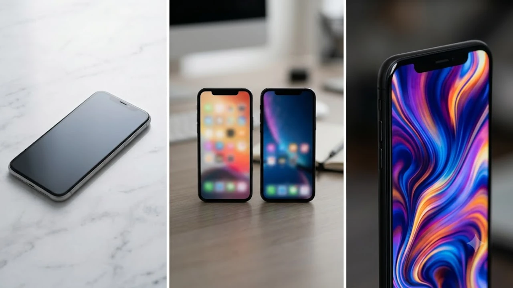
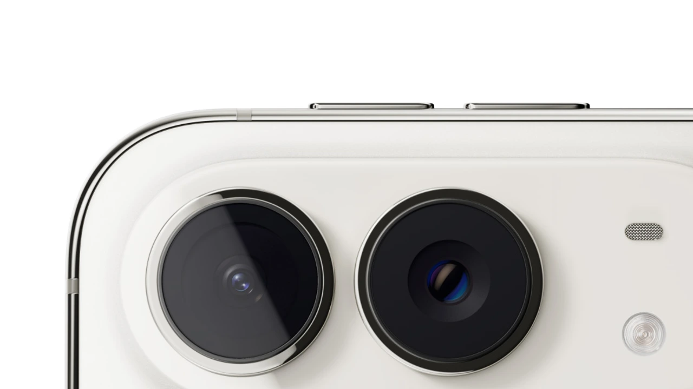

2026년 9월, 애플이 공식 홈페이지에 **iPhone Duo** 제품 페이지를 공개했습니다. 16년 만에 처음 바뀌는 아이폰 폼팩터 — 폴더블입니다. 10월 16일 오후 9시 사전 주문, 10월 23일 출시, 시작가 **329만 원**. 이 글은 애플 공식 스펙과 FAQ를 바탕으로, 실구매 결정에 직접 영향을 주는 정보만 추렸습니다.

## 펼치면 달라지는 것들: 19.3cm 내부 디스플레이의 실제 체감

### iPhone 18 Pro Max보다 50% 더 큰 화면이 만드는 차이

iPhone Duo의 내부 디스플레이는 **19.3cm Super Retina XDR**입니다. iPhone 18 Pro Max(17.4cm)보다 화면 면적 기준 50% 더 크고, 닫힌 상태의 외부 디스플레이(13.6cm)조차 iPhone 18 Pro 화면 영역의 90% 이상을 커버합니다.

단순히 크기만 큰 게 아닙니다. 내부와 외부 디스플레이 모두 **동일한 종횡비**를 유지해, 앱을 열었을 때 레이아웃이 자동으로 재배치됩니다. Split View 멀티태스킹으로 두 앱을 나란히 띄울 수 있고, 동영상을 상단에 고정한 채 아래에서 다른 앱을 사용하는 것도 iOS 27에서 기본 지원합니다.

접었을 때의 외부 화면 면적은 갤럭시 Z 폴드7 커버 디스플레이(약 14.8cm)보다 좁지만, 앱 레이아웃 연속성 — 열었을 때와 닫았을 때 콘텐츠가 끊기지 않고 이어지는 경험 — 은 iOS 27의 핵심 설계 목표로 언급됩니다.

### Nano-texture 코팅과 3000니트 — 야외 가시성의 실질적 수치

내부 디스플레이에는 맞춤형 **Nano-texture 마감**이 적용됐습니다. 일반 OLED 패널이 직사광선 아래에서 반사로 내용을 읽기 어렵다는 단점을 미세 요철 구조로 완화한 기술로, 애플이 MacBook Pro 디스플레이 옵션에서 먼저 도입한 방식입니다.

밝기는 **최대 3000니트(부분 최대)**로, 야외 햇빛 아래에서 HDR 콘텐츠를 시청할 때 실질적으로 의미 있는 수치입니다. ProMotion(최대 120Hz)도 내부·외부 디스플레이 모두 지원합니다. 주름(크리즈)에 대해 애플 공식 FAQ는 "광학 투명 접착제가 디스플레이 레이어를 매끄럽게 미끄러지게 해 주름을 최소화한다"고 명시했습니다.

언더 디스플레이 FaceTime 카메라를 내부에 탑재해 전면 카메라 홀이 없는 구성도 주목할 만합니다. 화면 면적 손실 없이 셀프 촬영과 FaceTime이 가능합니다.

## A20 Pro + iPhone 최초 듀얼 배터리: 성능과 지속 시간 동시 해결

### 베이퍼 쿨링 A20 Pro — 실제 성능 수치

iPhone Duo와 iPhone 18 Pro 모두 동일한 **A20 Pro 칩**을 탑재합니다. 전작 A19 Pro 대비 6코어 CPU 최대 20% 향상, 메모리 대역폭 최대 50% 증가입니다. 여기에 게임·고사양 앱 구동 시 발열을 제어하는 **베이퍼 챔버(Vapor Chamber)** 냉각 시스템이 처음 적용됐습니다.

듀얼 16코어 Neural Engine은 온디바이스 AI 워크로드 전용으로 설계됐습니다. Siri AI의 개인 맥락 이해, 이미지 생성, 스마트 포착(자동 촬영 감지) 등이 이 Neural Engine에서 처리됩니다. 단, Siri AI 한국어 지원은 "연내 출시 예정"으로 영어 우선 출시입니다.

### iPhone 최초 듀얼 배터리 시스템 — 외부 디스플레이로 44시간

iPhone Duo가 다른 폴더블 폰과 가장 다른 점 중 하나가 **듀얼 배터리 아키텍처**입니다. 폴더블 특성상 기기 내부 공간 효율이 낮아 배터리 용량이 희생되는 문제를 두 개의 배터리 셀을 지능적으로 관리하는 방식으로 보완했습니다. eSIM 전용 설계(물리 SIM 트레이 제거)도 배터리 공간 확보에 기여합니다.

공식 수치는 내부 디스플레이 사용 시 **최대 31시간**, 외부 디스플레이 사용 시 **최대 44시간** 동영상 재생입니다. 비교 기준인 iPhone 17 Pro Max의 최대 33시간보다 외부 디스플레이 모드에서 현저히 깁니다. 급속 유선 충전으로 약 20분에 최대 50%까지 충전 가능하며 MagSafe 무선 충전도 지원합니다.

내구성은 **IP68 생활 방수·방진**, 5등급 티타늄 프레임과 힌지 커버, 전후면 Ceramic Shield 구성입니다. 색상은 스타 화이트와 나이트 스카이 두 가지입니다.

관련 글: [아이폰18 사전예약 혜택 비교 핵심만](/posts/latest-tech/iphone-18-preorder-benefits-comparison/)

## 카메라 시스템: 48MP 듀얼 Fusion과 폴더블만의 독점 기능 4가지

### 스마트 포착·Duo Preview·아이 시선·Duo FaceTime

iPhone Duo 카메라 구성은 **48MP Fusion 메인 + 48MP Fusion 울트라와이드 + 12MP Center Stage 전면 카메라 + 언더 디스플레이 FaceTime 카메라**입니다. iPhone 18 Pro와 달리 **망원 렌즈는 없습니다**. 광학 줌은 0.5배·1배·2배(광학 퀄리티) 세 단계입니다.

폴더블 디자인이 가능하게 한 4가지 독점 카메라 기능이 차별점입니다.

- **스마트 포착**: 피사체가 포즈를 취하면 온디바이스 AI가 이를 감지해 자동 촬영. 셀카봉·타이머 없이 단체 사진 가능
- **Duo Preview**: 사진 찍히는 사람이 외부 디스플레이로 실시간 미리보기 확인. 구도 수정이 촬영자 없이 가능
- **아이 시선**: 아이들의 시선이 렌즈를 향하도록 외부 디스플레이에 애니메이션 재생
- **Duo FaceTime**: 근처에 있는 여러 사람이 외부 화면을 공유하며 그룹 통화 참여. 폰을 돌려가며 건네는 방식 불필요

4K 120fps Dolby Vision, 시네마틱 모드(사후 편집 포함), 사진 스타일 3(텍스처·그레인 조절), '공간 프레임 재설정'(이미 찍은 사진 구도 변경) 등은 iPhone 18 Pro와 공통 기능입니다.

### 48MP 망원이 빠진 이유와 실제 영향

폴더블 기기 특성상 힌지와 듀얼 디스플레이로 내부 공간이 제한됩니다. 애플은 망원 렌즈 대신 두 개의 Fusion 카메라(메인+울트라와이드)를 선택했습니다. 2배 광학 퀄리티 줌은 48MP 메인 카메라의 고해상도 센서를 활용한 크롭 방식입니다.

사진 현장 촬영, 스포츠, 야생동물 등 망원이 필수인 용도라면 iPhone 18 Pro의 최대 8배 광학 퀄리티 줌(48MP Fusion 망원)이 확실히 유리합니다. 일상·여행·SNS 위주라면 Duo의 듀얼 Fusion 구성이 실사용에서 충분한 수준입니다.

관련 글: [아이폰18 출시일과 진짜 스펙 3가지](/posts/entertainment/iphone-18-release-date-specs-summary/)

## 구매 결정 전 체크리스트: 가격·용량·바뀐 두 가지

### ₩3,290,000부터 — 용량별 가격과 경쟁 폴더블 비교

애플 공식 시작가는 **₩3,290,000(256GB)**입니다. 용량 옵션은 256GB·512GB·1TB·2TB 네 가지입니다. 삼성 갤럭시 Z 폴드7 256GB 출시가(약 256만 원)보다 약 73만 원 높고, 구글 Pixel Fold 2(약 210만 원대)보다는 크게 높은 포지셔닝입니다.

가격 차이를 어떻게 볼 것이냐는 결국 iOS 생태계 잠금 효과 — iMessage, FaceTime, AirDrop, Apple Watch 연동, iPhone 미러링 등 — 를 어느 정도 가치 있게 보느냐에 달려 있습니다. 기존 아이폰 사용자라면 갤럭시로 이동하는 전환 비용이 상당하기 때문에 현실적 비교 선택지는 iPhone 18 Pro(국내 출시가 약 175만 원대 시작)와의 차이가 됩니다.

보상 판매(Apple Trade In)를 활용하면 기존 기기 금액만큼 크레딧을 받을 수 있습니다. 10월 16일 오후 9시 사전 주문 시작이므로, 통신사별 사전 예약 혜택도 비교 후 선택하는 것이 좋습니다.

### eSIM 전용·Touch ID — 익숙한 아이폰과 달라진 두 가지

iPhone Duo는 전 세계적으로 **eSIM 전용**입니다. 물리 SIM 트레이가 없습니다. 국내 이동통신 3사는 eSIM을 지원하지만, 알뜰폰(MVNO) 일부는 eSIM 전환이 불가능하거나 별도 수수료가 발생합니다. 구매 전 현재 가입 통신사의 eSIM 지원 여부를 반드시 확인하세요.

생체 인증은 Face ID가 아닌 **측면 버튼 통합 Touch ID**입니다. 기기가 닫혀 있을 때도 열려 있을 때도 일관된 방식으로 잠금을 해제할 수 있도록 설계된 선택입니다. Face ID는 폴더블 구조에서 내부·외부 카메라 배치가 복잡해지는 문제가 있어 Touch ID 방식을 채택한 것으로 보입니다.

Apple Pencil(USB-C) 호환은 "연내 사용 가능" 예정으로, 출시 시점에는 지원되지 않을 수 있습니다.

> **핵심 요약**: 10월 23일 출시 / 시작가 329만 원 / 19.3cm 내부 + 13.6cm 외부 / A20 Pro + 듀얼 배터리(최대 44시간) / 48MP 듀얼 Fusion(망원 없음) / eSIM 전용 / Touch ID

#아이폰듀오 #iPhoneDuo #폴더블아이폰 #애플신제품 #iPhone폴더블 #A20Pro #애플2026 #최신기술동향
