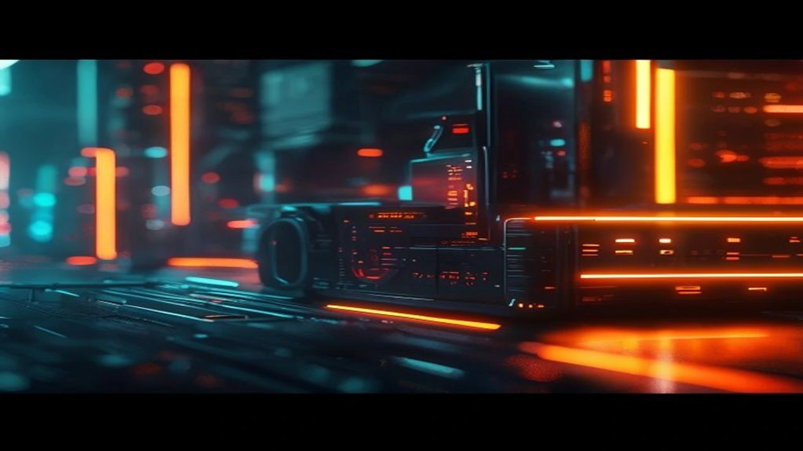

**키미 K3**는 최근 중국 문샷 AI가 기습 발표하며 글로벌 AI 생태계에 판도 변화를 일으킨 오픈웨이트 모델입니다. 거대언어모델(LLM) 시장을 점유하던 고비용 프런티어 모델의 독주를 저지하며, 실질적인 가성비 AI 시대를 열었습니다.

## 키미 K3 등장 배경 및 시장 충격

### 미국 프런티어 모델 추격하는 3조 매개변수 오픈 웨이트
중국 AI 스타트업 문샷 AI(Moonshot AI)가 공개한 **키미 K3(Kimi K3)**는 약 2조 8,000억 개의 매개변수를 보유한 거대 오픈웨이트 모델입니다. 빅테크가 구축한 폐쇄형 API 중심 독점 구조에 균열을 냈으며, 글로벌 AI 주권 전선에도 커다란 파장을 일으켰습니다. 자체 데이터 통제권을 확보하려는 시장 흐름은 [2026 소버린 AI 완전 정리: 왜 지금 진짜 바뀔까](/posts/latest-tech/sovereign-ai-data-sovereignty-2026/)와도 맞닿아 있습니다.

### API 비용 반토막 선언과 '가성비 AI' 패러다임 전환
키미 K3의 진짜 무기는 파격적인 비용 효율입니다. 기존 GPT-4급 모델 대비 추론 및 API 연산 단가를 10분의 1 수준까지 떨어뜨렸습니다. 

> "AI 모델은 무작정 성능만 높이는 단계를 지났다. 같은 수준의 추론 능력을 최소한의 전력과 비용으로 짜내는 효율성이 승패를 가른다." — 테크 분석 보고서 중

### 트래픽 폭주와 서버 일시 중단 사태의 실체
공개 직후 전 세계 개발자가 몰리면서 서비스 서버가 완전히 뻗어버렸습니다. 문샷 AI 측은 신규 가입자 유입을 일시 차단하고 긴급 인프라 증설에 나섰습니다. 현장 엔지니어들이 고성능·저비용 인프라에 얼마나 목말라 있었는지를 단적으로 보여준 사건입니다.

## 키미 K3 기술적 스펙 및 주요 성능 비교

### Claude 5 및 GPT-5 대항마로서의 실전 벤치마크
실전 연산 테스트에서 키미 K3는 수학적 추론, 코딩, 복합 문맥 이해 영역 모두 미국 최상위 프런티어 모델과 팽팽한 점수를 기록했습니다. 특히 고난도 알고리즘을 처리할 때 가성비가 빛을 발했습니다.

* **수학 추론 (GSM8K):** 미국 최첨단 프런티어 모델 대비 98.2% 수준 기록
* **복합 코딩 (HumanEval):** 상위 1% 개발자급 코드 자동 생성 및 디버깅
* **추론 비용:** 1,000토큰당 연산 비용 기존 대비 약 90% 절감

### 자율 엔지니어링 세션 및 시각적 추론 능력
멀티모달 시각 추론과 코드 리팩토링 능력이 돋보입니다. 복잡한 시스템 아키텍처 구조도를 이미지로 넣으면 불과 몇 초 만에 백엔드 코드와 인프라 설정값을 산출합니다. 실무에서 [2026년 바뀌는 AI 동료와 진짜 일 잘하는 법 완전 정리](/posts/latest-tech/silicon-workforce-process-redesign/)를 고민하는 팀이라면 당장 도입을 검토할 만한 성능입니다.

### 7월 27일 모델 가중치 전체 공개 일정과 의미
문샷 AI는 모델 가중치(Model Weights) 전면 개방을 앞두고 있습니다. 자체 데이터센터를 보유한 기업이 외부 유출 걱정 없이 온프레미스 환경으로 인프라를 구축할 수 있게 된다는 뜻입니다.

## 키미 K3의 장단점 및 명암 분석

### 압도적인 인프라 비용 절감 효용
기업 운영자 입장에서 키미 K3는 고정 운영비(OpEx)를 직격으로 줄여주는 카드입니다. 막대한 API 비용 부담 때문에 AI 도입을 주저하던 스타트업이나 중소 테크 기업에는 단비와 같습니다.

### 글로벌 보안 지표 기준과 데이터 프라이버시 우려
다만 오픈웨이트 구조상 보안 허점과 프라이버시 유출 위험을 짚고 넘어가야 합니다. 자체 서버에 모델을 올릴 때 발생하는 취약점 관리와 허위 데이터 유포 방지책 마련은 과제로 남습니다.

### 고가 AI 서버 구축 기업에 미치는 실질적 타격
엔비디아 서버를 싹쓸이해 고가 구독 모델을 팔던 기존 클라우드 공룡 기업들의 수익 모델에 비상이 걸렸습니다. 꼭 최고 사양 칩셋을 쓰지 않더라도 소프트웨어 단의 알고리즘 최적화로 비용을 대폭 낮출 수 있음이 증명됐기 때문입니다.

## 국내외 IT 산업 및 AI 테크 시장 영향

### 엔비디아 고성능 GPU 독점 체제에 대한 도전
키미 K3의 흥행은 고성능 AI 반도체 쏠림 현상에 제동을 걸었습니다. 추론 구간을 효율화하는 기술이 대세가 될수록 무거운 하드웨어 스펙에 의존하는 경향은 줄어듭니다.

### 국내 독자 AI 모델 보유 기업들의 대응 전략
국내 주요 IT 기업들 역시 비상이 걸렸습니다. 프런티어급 성능을 유지하면서 추론 단가를 획기적으로 낮추지 못하면 순식간에 시장에서 외면받을 수 있습니다.

### 오픈소스 AI 생태계 지형 변화 전망
키미 K3를 기점으로 폐쇄형 AI 진영에서 오픈소스 및 오픈웨이트 체제로 주도권이 빠르게 넘어가는 모양새입니다. 글로벌 테크 시장은 당분간 '가성비 최적화'를 둘러싼 무한 경쟁에 돌입할 전망입니다.

#키미K3 #KimiK3 #문샷AI #가성비AI #오픈웨이트 #AI반도체 #인공지능트렌드 #LLM비용절감 #AI추론성능