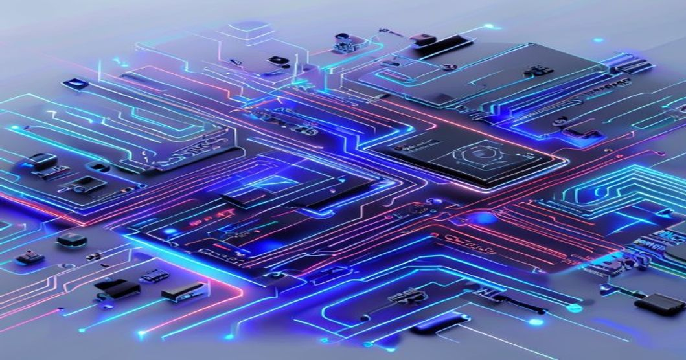
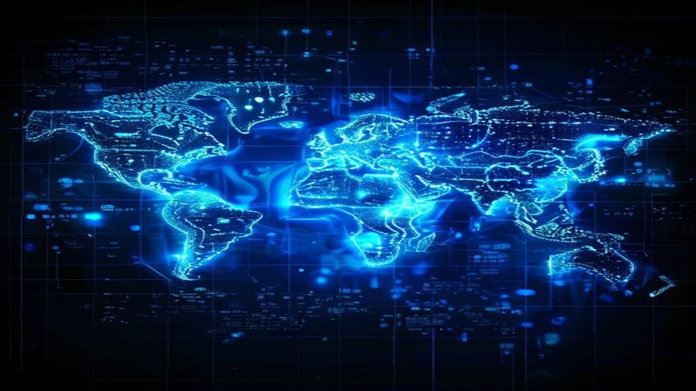

2026년 현재 글로벌 빅테크 기업들이 앞다퉈 '소버린 클라우드(Sovereign Cloud)' 전용 존을 출시하면서 데이터 주권 경쟁이 본격화되고 있습니다. 단순한 클라우드 서비스를 넘어 국가 안보와 산업 경쟁력이 걸린 전략적 인프라로 부상한 소버린 클라우드는, AI 시대 데이터를 누가 소유하고 통제하느냐의 문제와 직결됩니다.

## 소버린 클라우드란 무엇인가? 개념과 등장 배경

### 기존 퍼블릭 클라우드와 결정적으로 다른 3가지 차이점

소버린 클라우드는 특정 국가의 법률·규제 체계 안에서 데이터가 저장·처리·전송되도록 설계된 클라우드 인프라입니다. 일반 퍼블릭 클라우드(AWS, Azure, GCP)가 미국 법률의 적용을 받는 글로벌 공용 인프라라면, 소버린 클라우드는 해당 국가의 사법권이 온전히 미치는 독립적인 공간입니다.

핵심 차이를 간단히 정리하면 다음과 같습니다.

- **데이터 거주지(Data Residency)**: 데이터가 물리적으로 해당 국가 영토 내 서버에만 존재합니다.
- **운영 주권(Operational Sovereignty)**: 외국 정부의 법률(예: 미국 클라우드법)이 개입할 수 없습니다.
- **공급망 독립(Supply Chain Independence)**: 핵심 소프트웨어와 하드웨어를 현지 기업이 공급합니다.

### GDPR과 미국 클라우드법(CLOUD Act)이 불씨를 당기다

소버린 클라우드 수요가 폭발한 직접적인 계기는 두 개의 상충하는 법률입니다. EU의 GDPR은 유럽 시민의 개인정보를 역외로 반출하지 못하도록 강력하게 규제합니다. 반면 2018년 제정된 미국의 클라우드법(CLOUD Act)은 미국 기업이 운영하는 서버에 저장된 데이터라면 물리적 위치와 무관하게 미국 사법기관이 접근할 수 있다고 규정합니다. 두 법이 정면으로 충돌하자 유럽 정부와 기업들은 미국 빅테크 클라우드 의존도를 줄이는 소버린 클라우드 전환을 서두르기 시작했습니다.

### AI 시대 데이터 주권이 곧 산업 경쟁력인 이유

AI 모델을 학습시키는 핵심 자산은 데이터입니다. 의료, 금융, 국방 분야의 민감한 데이터를 해외 클라우드에 올린다는 것은 사실상 자국의 AI 경쟁력을 외부에 맡기는 셈입니다. 2026년 현재 각국 정부가 AI 국가 전략을 발표하면서 소버린 클라우드를 AI 인프라의 근간으로 채택하는 흐름이 뚜렷해지고 있습니다. 데이터 주권이 곧 AI 주권이라는 공식이 성립하기 시작한 것입니다.

## 글로벌 소버린 클라우드 경쟁 최전선

### EU의 GAIA-X와 프랑스 SecNumCloud의 선도 사례

유럽연합은 2020년 GAIA-X 프로젝트를 출범시키며 소버린 클라우드 생태계 구축에 가장 먼저 나섰습니다. 프랑스 국가정보시스템보안청(ANSSI)이 운영하는 SecNumCloud 인증 제도는 EU 역내에서 가장 까다로운 소버린 클라우드 기준을 제시합니다. 이 인증을 받으려면 클라우드 운영 주체가 EU 법인이어야 하고, 비EU 국가 법률의 영향을 받을 수 없으며, 데이터 처리 전 과정이 EU 영토 내에서 이루어져야 합니다. AWS, Azure, GCP 같은 미국 빅테크는 구조적으로 이 인증을 취득할 수 없어 유럽 기업과의 합작 방식을 택하고 있습니다.

### AWS·Azure·Google의 소버린 클라우드 전략

미국 빅테크 3사는 소버린 클라우드 수요를 외면할 수 없게 되자 각기 다른 전략으로 시장에 대응하고 있습니다.

- **AWS**: 독일 통신사 Deutsche Telekom과 합작법인을 세워 'AWS 유럽 소버린 클라우드'를 운영합니다. 미국 본사 직원의 데이터 접근을 기술적·법적으로 차단하는 구조가 핵심입니다.
- **Microsoft Azure**: 'Azure Sovereign' 브랜드 아래 각국 파트너사와 협력하는 방식을 채택했습니다. 한국에서도 클라우드법 준수 여부를 검토 중입니다.
- **Google Cloud**: '클라우드 소버린 솔루션'을 발표하며 암호화 키를 고객이 직접 보유하는 '클라이언트 측 암호화' 방식을 전면에 내세웁니다.

### 중국·러시아의 자국 클라우드 폐쇄 전략

중국은 일찌감치 만리방화벽(Great Firewall)을 통해 자국 내 클라우드 시장을 알리바바 클라우드, 텐센트 클라우드 등 자국 기업이 독점하도록 설계했습니다. 러시아 역시 우크라이나 전쟁 이후 서방 제재에 맞서 데이터 현지화 법안을 강화하며 국가 주도 클라우드 전환을 가속하고 있습니다. 이처럼 소버린 클라우드는 민주주의 진영의 데이터 보호 수단이자 권위주의 국가의 인터넷 통제 도구라는 두 가지 얼굴을 동시에 가집니다.

## 한국의 소버린 클라우드 현황과 기업 대응 전략

### 공공 클라우드 보안 인증(CSAP)과 민감 정보 보호 체계

한국 정부는 공공기관이 클라우드 서비스를 이용할 때 과학기술정보통신부의 클라우드 보안 인증(CSAP)을 받은 제품만 사용하도록 규정하고 있습니다. 이 인증 체계는 소버린 클라우드 개념의 한국판 적용이라 볼 수 있습니다. 네이버클라우드, KT클라우드, NHN클라우드 등 국내 사업자들이 CSAP 인증을 보유하고 있으며, 외국계 빅테크는 별도의 보안 심사를 거쳐야 공공 시장에 진입할 수 있습니다.

### 금융·의료·국방 분야 기업이 지금 당장 해야 할 준비

소버린 클라우드 전환은 더 이상 정부 기관만의 이슈가 아닙니다. 금융감독원은 금융사의 클라우드 이용 시 데이터 현지화 요건을 강화하고 있으며, 의료기관은 개인 건강정보를 국외로 반출하는 행위 자체가 법적 위험 요소가 됩니다.

실무적으로 기업이 지금 해야 할 준비는 다음과 같습니다.

- **데이터 지도 작성**: 어떤 데이터가 어느 클라우드 서버에 저장되는지 전수 조사합니다.
- **규제 리스크 평가**: 적용받는 법령(개인정보보호법, 금융보안법, 의료법 등)이 데이터 반출을 금지하는지 확인합니다.
- **멀티클라우드 전략 수립**: 소버린 요건이 있는 데이터는 국내 인증 클라우드에, 나머지는 글로벌 클라우드에 배치하는 혼합 전략이 현실적입니다.

### 소버린 클라우드 도입이 가져오는 비용·성능 트레이드오프

소버린 클라우드는 글로벌 퍼블릭 클라우드 대비 인프라 규모가 작아 단위당 비용이 높고, 글로벌 엣지 네트워크를 활용하기 어려워 일부 서비스에서 성능 저하가 발생할 수 있습니다. 그러나 데이터 유출이나 규제 위반으로 인한 과징금, 소송 비용, 브랜드 손상을 감안하면 소버린 클라우드 도입은 리스크 관리 차원의 투자로 봐야 합니다. 특히 AI 모델 학습에 사용되는 민감 데이터를 보호해야 하는 산업에서는 추가 비용을 감수할 전략적 이유가 충분합니다.

## 2026 소버린 클라우드 트렌드 전망과 기술 혁신 포인트

### 기밀 컴퓨팅(Confidential Computing)이 소버린 클라우드를 재정의한다

소버린 클라우드의 가장 큰 기술적 혁신은 **기밀 컴퓨팅(Confidential Computing)**입니다. 기존 암호화가 저장 중이거나 전송 중인 데이터를 보호했다면, 기밀 컴퓨팅은 데이터가 처리되는 순간(메모리 상에 올라간 상태)에도 암호화 상태를 유지합니다. 인텔 TDX, AMD SEV-SNP 같은 하드웨어 기반 신뢰 실행 환경(TEE)이 이를 구현합니다. 클라우드 제공자 측의 관리자조차 고객 데이터를 볼 수 없어, 진정한 의미의 소버린 환경 구현이 가능해졌습니다.

### 양자 암호화와 소버린 클라우드의 결합

2026년을 기점으로 양자 컴퓨팅이 현재 암호화 체계를 위협할 수 있다는 경고가 현실화되면서, 양자 내성 암호(Post-Quantum Cryptography)를 적용한 소버린 클라우드 인프라 구축이 화두로 떠올랐습니다. 미국 NIST가 2024년 최종 확정한 양자 내성 알고리즘 표준을 선제적으로 적용하는 기업이 향후 글로벌 소버린 클라우드 시장의 패권을 쥘 가능성이 높습니다.

### 국내 기업이 선점해야 할 소버린 클라우드 비즈니스 기회

소버린 클라우드 전환은 빅테크만의 영역이 아닙니다. 국내 기업들이 선점할 수 있는 기회 영역은 분명합니다.

- **클라우드 이전(Migration) 컨설팅**: 기존 레거시 시스템을 소버린 요건에 맞는 클라우드로 전환하는 컨설팅 수요가 폭발적으로 증가합니다.
- **규제 준수(Compliance) 자동화 솔루션**: 어떤 데이터가 어느 국경을 넘었는지 실시간으로 모니터링하고 리포트하는 소프트웨어 시장이 열립니다.
- **소버린 AI 플랫폼**: 데이터를 외부로 보내지 않고 자체 인프라에서 AI 모델을 파인튜닝하는 온프레미스형 AI 플랫폼 수요가 의료·금융 산업을 중심으로 급성장합니다.

[관련 글 보기](/posts/latest-tech/)

**함께 읽으면 좋은 글**
- [키미 K3 진짜 성능 가성비 AI 반토막 혁명일까?](/posts/latest-tech/kimi-k3-moonshot-ai-shock-2026/)
- [AI 결제 시대, 바뀌는 마케팅 핵심만](/posts/latest-tech/autonomous-economy-agentic-payments/)

#소버린클라우드 #데이터주권 #클라우드보안 #GAIAX #디지털주권 #기밀컴퓨팅 #CSAP #AI인프라 #클라우드전략 #2026기술트렌드
