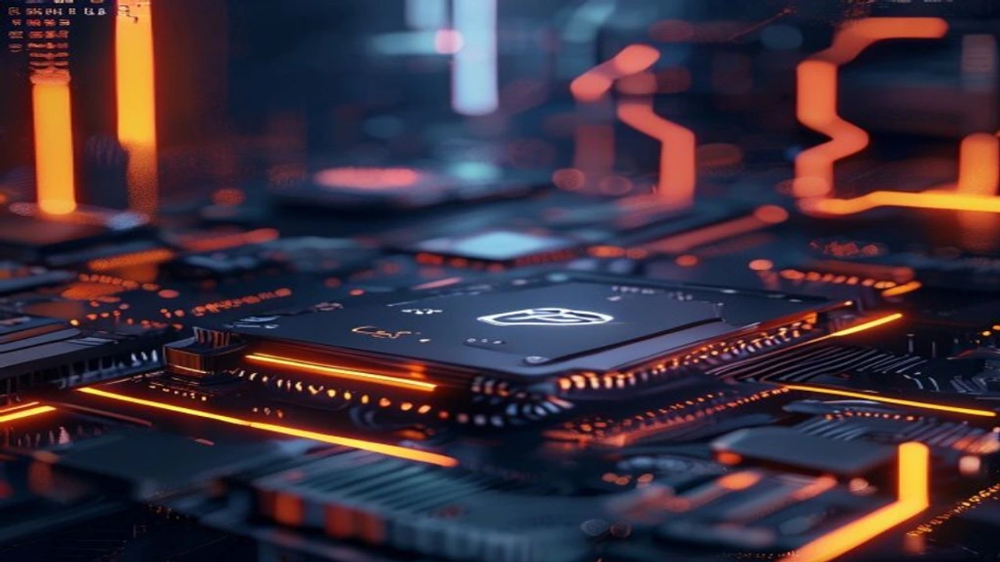

2026년 7월 27일, 메타(Meta)가 자사 데이터센터에 쌓아둔 고성능 **메타 잉여 GPU** 자원을 외부 개발사와 기업에 직접 임대·판매한다는 전격 발표를 내놓았습니다. 이번 조치로 AI 인프라를 독점 공급하던 클라우드 파트너 생태계에 균열이 생기며 글로벌 AI 컴퓨팅 및 클라우드 시장 전체가 극심한 가격 파괴 압력을 받는 분위기입니다.

## 메타의 잉여 GPU 직접 판매, 시장 충격의 배경

### Meta Compute 프로젝트의 공식화 과정
메타는 차세대 거대언어모델(LLM) 및 멀티모달 AI 훈련을 위해 수십만 대의 최신 GPU 파워를 확보했습니다. 그러나 내부 연구·개발 주기상 발생하는 컴퓨팅 유휴 시간(Idle time)을 방치하는 대신, 이를 외부 API 및 인프라 연동망 형태(가칭 Meta Compute)로 전환해 수익화하는 전략을 택했습니다. 내부 자원 효율성을 100%에 가깝게 끌어올리려는 움직임이 시장 상용 서비스로 직결된 셈입니다.

### 코어위브 등 네오클라우드 주가 폭락 원인
이번 메타의 자원 개방 발표 직후, GPU 전용 임대 서비스를 전문으로 제공하던 코어위브(CoreWeave) 등 이른바 네오클라우드 기업들의 주가는 당일 11.37% 급락했습니다. 거대 IT 기업의 압도적인 자본력과 인프라 물량이 순식간에 시중에 풀릴 경우, 중소 전문 임대업체들이 유지하던 프리미엄 가격선이 붕괴할 수밖에 없다는 우려가 크게 작용한 결과입니다.

### 글로벌 IT 기업들의 빅테크 의존도 변화
그동안 자체 데이터센터 구축이 어려운 수많은 엔터프라이즈와 AI 스타트업은 천문학적인 임대 비용을 부담하며 제3자 클라우드에 의존했습니다. 하지만 메타가 직접 잉여 연산 자원을 저렴하게 공급하기 시작함에 따라, 기업들의 자원 수급 다변화 속도는 한층 빨라질 전망입니다. 이는 엔터프라이즈의 비용 부담을 낮추는 동시에, 데이터 주권 확보 측면에서도 새로운 변수로 작용합니다. 관련하여 국가 및 기업 차원의 독자적 데이터 주권 전략이 궁금하다면 [2026 소버린 AI 완전 정리: 왜 지금 진짜 바뀔까](/posts/latest-tech/sovereign-ai-data-sovereignty-2026/) 글을 참고하기 바랍니다.

## AI 서버 인프라 가격 파괴 및 수혜 대상

### 단기 GPU 임대 단가 변동 수치 비교
메타의 공급 개시 발표 이후 주요 AI 클라우드 인프라의 시간당 H100/B200급 GPU 임대 평균 시세는 즉각 반응을 보였습니다.

| 구분 | 발표 전 평균 단가 (시간당) | 메타 공급 후 예상 단가 (시간당) | 변동률 |
| :--- | :--- | :--- | :--- |
| **기존 네오클라우드** | $4.20 | $3.10 | **-26.2%** |
| **3대 대형 클라우드(AWS/GCP/Azure)** | $4.80 | $4.10 | **-14.6%** |
| **메타 잉여 자원(Meta Compute)** | - | **$2.30** | **신규 진입** |

### 중소 스타트업과 개발사들이 얻는 실질적 이득
가장 직접적인 수혜를 입는 곳은 자본력이 부족한 AI 스타트업 연구진입니다. 연산 비용 문제로 모델 파인튜닝과 대규모 추론 실험을 미루던 팀들이 기존 대비 절반 가까운 비용으로 고성능 컴퓨팅 리소스에 접근할 수 있게 되었습니다. 이는 시장 전반의 AI 서비스 상용화 속도를 대폭 앞당길 동력으로 평가받습니다.

### 기존 AWS·GCP·아주르 3대 빅테크의 대응 전략
기존 클라우드 시장을 과점하던 빅테크 3사는 가격 경쟁에 직접 대응하기보다, 보안성과 고도화된 관리형 서비스(Managed Services)를 강조하며 방어선 구축에 나섰습니다. 단순 연산 자원 임대 가격이 하락함에 따라, 엔터프라이즈 고객을 묶어두기 위한 보안 프레임워크와 결합 상품 개편이 신속하게 이루어지는 양상입니다.

## 실제 메타 잉여 GPU 활용 및 컴퓨팅 비용 절감 튜토리얼

### Meta Compute 파워 접근 및 연동 절차
메타의 잉여 자원을 활용하려면 전용 개발자 콘솔을 통한 사전 인증 과정이 필요합니다.

1. **개발자 계정 연동:** Meta for Developers 콘솔에 접속해 조직 인증을 완료합니다.
2. **API 및 자원 할당 신청:** 필요한 최소 TFLOPS 규모와 사용 예정 기간(Spot/Reserved)을 지정합니다.
3. **클러스터 엔드포인트 수령:** 할당된 GPU 클러스터의 SSH 접근 키 및 PyTorch 연동 엔드포인트를 발급받습니다.

### 기존 클라우드 인프라 파이프라인 이전 체크리스트
기존 AWS S3나 Google Cloud Storage에서 관리하던 학습 데이터셋과 모델 체크포인트를 메타의 자원 환경으로 이전할 때는 데이터 전송 연동성을 우선 점검해야 합니다.

> **인프라 이전 시 필수 점검 3가지**
> - **네트워크 Egress 비용:** 기존 클라우드에서 메타 컴퓨팅 노드로 데이터를 보낼 때 발생하는 네트워크 출차 비용 사전 계산
> - **보안 인증 표준:** 기업 내부 보안 가이드라인에 부합하는 데이터 암호화 통신 적용 여부
> - **자동 스케일링 스크립트:** 잉여 자원 특성상 발생할 수 있는 노드 회수(Preemption) 현상에 대비한 자동 체크포인트 저장 로직 구현

### 비용 효율성을 극대화하는 자원 배분 팁
모든 작업에 메타의 잉여 GPU를 투입하는 방식은 효율적이지 않습니다. **실시간 서비스 배포(Inference)**는 안정성이 높은 기존 클라우드를 유지하고, **대규모 배치 파인튜닝(Batch Training)**이나 **자연어 데이터 전처리**처럼 단발성 고성능 연산이 필요한 작업에 메타의 잉여 자원을 집중 배치하는 하이브리드 전략이 비용을 최소화하는 핵심입니다.

## 향후 AI 인프라 시장 전망 및 장단점 분석

### 빅테크 자원 독점에 따른 리스크와 한계점
메타의 시장 참여는 단기적으로 가격 하락이라는 긍정적 효과를 가져오지만, 장기적으로는 AI 인프라 생태계가 일부 빅테크 자본에 완벽히 예속될 수 있다는 우려도 공존합니다. 빅테크 기업이 자사 유휴 자원 사정에 따라 임대 가격과 공급량을 임의로 조절할 경우, 이에 의존하던 중소 IT 기업들이 운용 리스크를 그대로 안게 되기 때문입니다.

### 독자적 AI 데이터센터 보유 기업 대 빌려쓰는 기업의 미래
컴퓨팅 자원의 자급자족 여부가 기업 경쟁력을 가르는 핵심 지표로 자리 잡았습니다. 인프라를 직접 소유한 기업은 자체 수요 처리 후 잉여 자원으로 부가 수익을 창출하는 반면, 빌려 쓰는 기업은 초기 비용을 아끼는 대신 지속적인 인프라 변동성에 노출됩니다. 효율적인 조직 및 프로세스 재설계를 원한다면 [2026년 바뀌는 AI 동료와 진짜 일 잘하는 법 완전 정리](/posts/latest-tech/silicon-workforce-process-redesign/) 콘텐츠가 도움을 줄 수 있습니다.

### 메타의 클라우드 시장 안착 가능성 총평
메타의 이번 결정은 단순한 잉여 자원 재활용을 넘어, 클라우드 시장 전체의 판도를 흔드는 위협적인 카드입니다. 압도적인 가격 경쟁력을 앞세운 메타의 인프라 공세가 지속될 경우, 기존 클라우드 솔루션 시장의 수익 구조 개편과 가격 파괴 현상은 불가피한 흐름입니다.

#메타잉여GPU #AI컴퓨팅 #클라우드시장 #코어위브 #GPU가격하락 #빅테크인프라 #MetaCompute