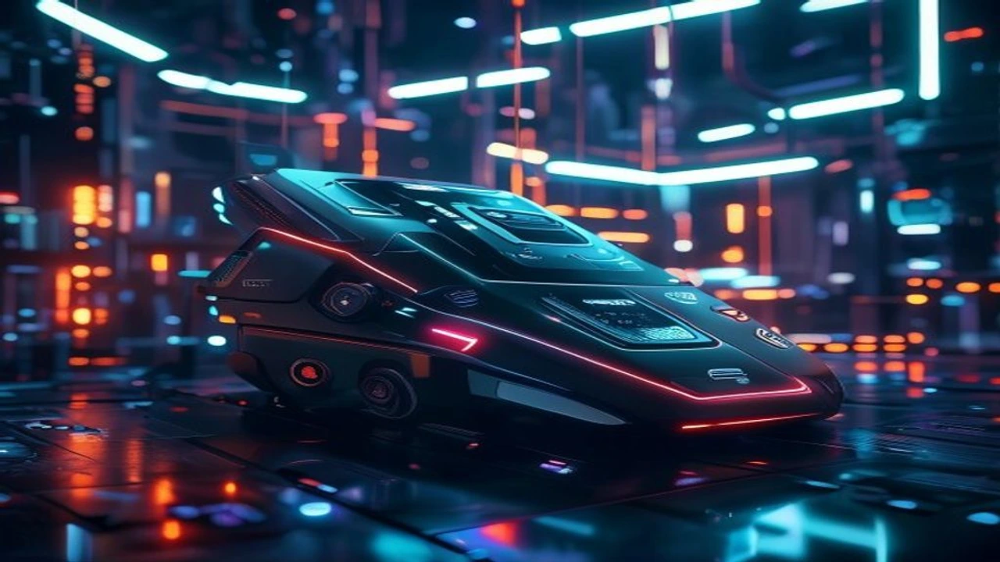

2026년 글로벌 테크 시장의 가장 강력한 화두는 단연 **멀티모달 AI**입니다. 기존의 텍스트 중심 모델이 가졌던 한계를 깨부수고 이미지, 오디오, 비디오를 동시에 실시간으로 이해하는 이 혁신적인 기술은 이미 우리 업무 환경 깊숙이 자리 잡았습니다. 단순한 기술적 진보를 넘어 산업 생태계 자체를 뒤흔드는 멀티모달 AI 핵심 기술의 변화와 실무 적용 방안을 명확한 사실 기반으로 제시합니다.

## 멀티모달 AI 시장의 급격한 변화와 트렌드

### 텍스트 LLM 시대의 종말과 멀티모달 패러다임 시프트
글자만 입력하고 글자로 답을 얻는 챗봇의 시대는 완전히 끝났습니다. 인간이 세상을 인지할 때 오감을 모두 활용하듯, 인공지능 역시 시각과 청각 정보를 동시에 처리하는 방향으로 진화했습니다. 이러한 패러다임 시프트는 단일 데이터 처리 방식에서 발생하던 맥락 정보의 손실을 방지하고, 인간과 컴퓨터 간의 상호작용을 더욱 자연스럽게 정착시키는 기폭제가 되었습니다.

### 글로벌 빅테크 기업들의 실시간 오디오 및 비디오 AI 경쟁 구도
구글, 오픈AI, 앤스로픽 등 실리콘밸리 거대 기업들은 거대한 자본을 바탕으로 실시간 반응성에 초점을 맞춘 모델을 연이어 쏟아내고 있습니다. 0.3초 미만의 지연 시간(Latency)을 달성하여 인간의 대화 속도와 차이가 없는 실시간 음성 인터랙션을 구현한 것이 특징입니다. 카메라 렌즈를 통해 사용자가 보는 화면을 실시간으로 공유하며 물리적 공간의 문제를 해결하는 기술 경쟁이 치열하게 전개되고 있습니다.

### 온디바이스 환경으로 확장되는 멀티모달 생태계
클라우드 서버의 의존도를 낮추고 스마트폰, 노트북, 스마트 웨어러블 기기 자체에서 멀티모달 연산을 처리하는 기술이 급성장했습니다. 네트워크 연결이 불가능한 극한의 상황이나 보안이 고도로 요구되는 비즈니스 환경에서도 개별 기기가 이미지를 분석하고 음성을 처리합니다. 이는 개인정보 유출 리스크를 원천 차단하는 동시에, 서버 비용을 획기적으로 절감하는 대안으로 평가받습니다.

## 멀티모달 AI의 핵심 기술 스택 및 작동 원리 파헤치기

### 이미지 음성 텍스트를 하나로 융합하는 크로스모달 임베딩 기술
서로 다른 형태의 데이터를 동일한 벡터 공간에 매핑하는 과정이 핵심 원리입니다. 사진 속 고양이의 모습과 '고양이'라는 문자, 그리고 고양이의 울음소리 주파수가 컴퓨터가 이해하는 하나의 수학적 공간 안에서 매우 가까운 거리에 위치하도록 학습시킵니다. 데이터의 형태가 달라도 본질적인 개념이 같다면 동일하게 정렬되므로, 텍스트 입력만으로 고품질 영상을 정교하게 찾아내거나 생성하는 원동력이 됩니다.

### 실시간 영상 인식 및 양방향 음성 인터랙션의 처리 메커니즘
동영상 데이터를 처리할 때 프레임별 압축 기술과 시계열 데이터 분석 알고리즘이 동시에 작동합니다. 초당 30프레임 이상으로 유입되는 비디오 스트리밍에서 의미 있는 객체의 변화만을 추적하여 연산 과부하를 막는 방식입니다. 음성 신호 역시 텍스트 변환 과정을 거치지 않고 오디오 파형 자체를 직접 엔코딩하여 처리하기 때문에 지연 시간이 획기적으로 단축됩니다.

### 할루시네이션 극복을 위한 고도화된 정렬 알고리즘
멀티모달 환경에서 발생하는 그릇된 정보 생성을 방지하기 위해 상호 검증 알고리즘이 쓰입니다. 생성된 비디오 콘텐츠의 프레임이 초기 입력된 텍스트 프롬프트의 맥락과 일치하는지 논리적 모순을 실시간 추적합니다. 시각 데이터의 물리적 법칙 위배 여부를 자체 검증하는 보조 신경망을 배치함으로써 왜곡 현상을 제어합니다.

> **기술 핵심 요약**
> 크로스모달 임베딩과 오디오 파형 직접 연산은 멀티모달 시스템의 속도와 정확도를 결정짓는 양대 축입니다. 클라우드 비용 최적화를 위해서도 이 두 가지 알고리즘의 효율화가 전제되어야 합니다.

## 주요 멀티모달 AI 서비스 장단점 및 비즈니스 활용 사례

### 대표적인 오픈소스 제품군과 상용 솔루션의 성능 및 비용 장단점
오픈소스 멀티모달 모델은 인프라 내부 구축이 가능해 강력한 보안성을 지니지만, 고성능 GPU 장비 구축을 위한 초기 자본 투자가 필수적입니다. 반면 빅테크 기업들의 상용 API 솔루션은 초기 비용 없이 API 호출당 과금 체계로 유연하게 시작할 수 있으나, 데이터 유출 우려와 지속적인 운영 비용 누적이라는 단점이 뚜렷합니다. 

| 구분 | 오픈소스 모델 (자체 구축) | 상용 API 솔루션 (구독형) |
| :--- | :--- | :--- |
| **초기 비용** | GPU 서버 도입으로 매우 높음 | API 사용량 기반으로 매우 낮음 |
| **데이터 보안** | 기업 내부망 유지로 완벽한 통제 가능 | 외부 서버 전송으로 유출 리스크 존재 |
| **업데이트 속도** | 자체 튜닝 필요, 트렌드 반영 대응 느림 | 클라우드 기반 자동 업데이트로 매우 빠름 |

### 마케팅 콘텐츠 제작 및 디자인 자동화 워크플로우 적용 실제 사례
글로벌 커머스 기업들은 신제품의 사진 한 장만을 활용해 수십 가지의 연출 컷และ 배경 영상을 30초 만에 제작하여 마케팅에 활용합니다. 제품의 고유한 형태와 질감을 그대로 유지하면서 주변 환경, 조명, 계절감을 텍스트 프롬프트로 자유롭게 변경하는 방식입니다. 실제 마케팅 대행사들의 콘텐츠 제작 공정이 기존 대비 약 70%가량 단축되는 혁신적인 성과를 거두었습니다.

### 고객 인카운터 센터 및 실시간 AI 번역 도입 시 주의점과 한계
텍스트만으로 판단하기 어려웠던 화자의 감정 상태나 억양의 미묘한 변화를 파악하여 민원 상담 업무의 효율성을 대폭 끌어올렸습니다. 그러나 각 국가의 문화적 배경이나 은어, 비언어적 표현을 잘못 해석할 경우 심각한 오번역이나 결례를 범할 위험성이 잔존합니다. 시스템 전면에 AI를 무조건 배치하기보다 상담원의 업무를 보조하는 융합형 아키처 구성이 안전합니다.

[관련 글 보기](/posts/latest-tech/)

## 멀티모달 AI 도입을 위한 실무 가이드 및 향후 전망

### 기업 맞춤형 멀티모달 API 연동 및 파이프라인 구축 3단계 수칙
- **데이터 전처리 환경 표준화** — 이미지의 해상도와 음성 파일의 샘플링 레이트를 통일하는 파이프라인을 먼저 설계해야 연산 오류를 줄입니다.
- **하이브리드 라우팅 적용** — 가벼운 처리는 온디바이스나 소형 모델로, 고해상도 비디오 분석은 대형 클라우드 모델로 분산 처리해 비용을 최적화합니다.
- **지속적인 피드백 루프 생성** — 현장 실무자가 수정한 결과물을 다시 학습 데이터셋으로 정제하여 모델의 특화 성능을 주기적으로 보정합니다.

### 데이터 저작권 이슈 및 프라이버시 침해 방지를 위한 보안 가이드라인
멀티모달 모델 학습에 수많은 이미지와 비디오가 무분별하게 사용되면서 저작권 분쟁 소지가 날로 커집니다. 상용 서비스를 배포할 때는 반드시 라이선스가 확보된 상업용 데이터셋만을 활용했는지 검증해야 합니다. 사용자의 얼굴이나 음성 정보가 입력될 경우 시스템 내부에서 즉시 익명화 및 비식별화 처리를 거치도록 프라이버시 필터를 구축하는 구조 설계가 필수적입니다.

### 자율주행 로보틱스 공학과 결합되는 멀티모달 AI의 최종 진화 형태
단순한 화면 분석을 넘어 현실 세계의 물리 법칙을 완벽히 이해하는 공간 컴퓨팅 지능으로의 진화가 이루어지고 있습니다. 로봇이 카메라로 공장의 복잡한 라인을 보고 가해지는 압력을 센서로 느끼며 텍스트 명령을 수행하는 제조 혁신이 가시화되었습니다. 자율주행 차량 역시 도로 위의 돌발 상황을 시각 정보뿐 아니라 소리와 주변 맥락까지 복합 판별하여 안전성을 극대화합니다.

#멀티모달AI #인공지능트렌드 #공간컴퓨팅 #온디바이스AI #테크트렌드2026 #빅테크기술 #AI비즈니스 #디지털혁신