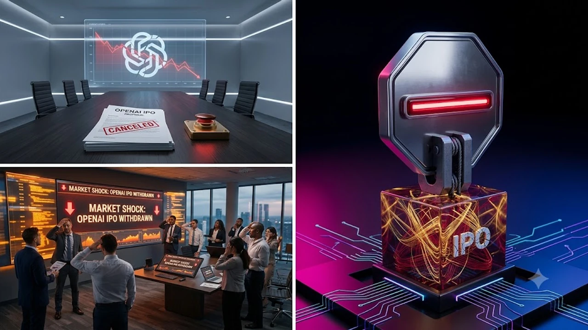

오픈AI IPO 추진이 급제동에 걸리며 실리콘밸리와 월가에 거대한 파장을 일으키고 있다. 생성형 인공지능 시장을 이끌던 선두 주자가 기업공개 로드맵을 전면 재검토하면서, 자본 시장의 유동성 흐름과 AI 반도체 생태계 전반이 일대 변곡점을 맞았다.

## 오픈AI 2026년 IPO 전격 철회, 왜 지금 멈춰 섰나

상장을 눈앞에 둔 시점에서 전격적으로 브레이크가 걸린 배경에는 화려한 매출 성장 뒤에 숨겨진 구조적 균열이 존재한다. 단순한 시장 변동성 탓이 아니라, 내부 지배구조 개편과 차세대 모델 개발 현장에서 터져 나온 기술적 한계가 상장 추진 동력을 한순간에 꺾어놓았다.

### 샘 올트먼의 폭탄 발언과 AGI 안전성 경고

샘 올트먼 최고경영자는 최근 콘퍼런스 현장에서 인류 멸종 리스크와 초지능 안전 통제 문제를 직접 거론하며 상장 일정을 공식적으로 보류했다. 기술이 통제 범위를 벗어날 위험이 남아 있는 상황에서 분기별 실적 압박에 시달리는 상장사 구조로 편입되는 것은 자멸에 가깝다는 논리다. 이는 수익 극대화만을 좇던 시장 참여자들에게 찬물을 끼얹는 동시에, 오픈AI 경영진 내부의 고뇌를 드러낸 결정적인 순간이었다.

### 'GPT-6 아스트라' 공개 직후 터져 나온 내부 잡음

새로운 플래그십 아키텍처 'GPT-6 아스트라' 테스트 버전이 사내에 공유된 직후, 레드팀과 정렬 연구진 사이에서는 심각한 환각 및 제어 불가 현상에 대한 경고가 쏟아졌다. 모델의 자율적 추론 능력이 비약적으로 상승한 반면, 치명적인 보안 허점을 제어할 안전망이 충분히 검증되지 않았다는 내부 보고서가 유출되면서 개발팀 내부 갈등은 극에 달했다. 결국 안전성 기준을 통과하지 못한 상태에서 무리한 상용화와 상장을 밀어붙일 수 없다는 판단이 굳어졌다.

### 영리 법인 전환 작업의 지연과 이사회 갈등

비영리 이사회의 통제권을 축소하고 완전한 영리 지주회사로 전환하려던 계획은 규제 기관과 초기 투자자들의 거센 반발에 부딪혔다. 캘리포니아주 법무장관실을 비롯한 당국이 비영리 자산의 공익적 가치 훼손 여부를 조사하기 시작했고, 지분 배분 비율을 둘러싼 초기 공신들의 법적 대응 가능성까지 제기되었다. 복잡하게 얽힌 지배구조 리스크를 해소하지 않고서는 기업공개 증권신고서를 제출하는 것 자체가 불가능한 상황이다.

## 월가와 실리콘밸리가 받은 충격과 주주 반응

오픈AI의 상장 철회 결정은 즉각 비상장 주식 시장과 글로벌 테크 투자 펀드들에 심각한 충격파를 던졌다. 수천억 달러 기업가치를 기준으로 밸류에이션을 책정했던 벤처캐피털들은 출구 전략이 막히자 당혹감을 감추지 못하고 있다.

### 마이크로소프트와 벤처캐피털(VC)의 엇갈린 셈법

마이크로소프트는 장기 기술 독점 라이선스를 보호하고 클라우드 인프라 파트너십을 안정적으로 유지할 수 있다는 점에서 표면적으로는 차분한 태도를 취하고 있다. 반면, 막대한 자금을 쏟아부었던 대형 사모펀드와 벤처캐피털들은 펀드 만기 도래와 차익 실현 기회 상실로 인해 극심한 유동성 압박에 직면했다. 이사회 내에서도 조기 현금화를 원하던 재무적 투자자들과 기술 통제권을 지키려는 초기 창립 멤버들 간의 균열이 걷잡을 수 없이 벌어졌다.

### 장외 시장 가치 폭락과 유동성 경색

세컨더리 마켓(장외 비상장 주식 시장)에서 거래되던 오픈AI 지분 가치는 철회 발표 직후 30% 이상 폭락했다. 기업공개를 기정사실로 보고 높은 프리미엄을 얹어 매수했던 기관 투자자들이 앞다투어 물량을 던지면서 매수 호가가 실종되는 사태가 벌어졌다. 비상장 테크 기업 전체에 대한 거품 논란이 재점화되며 벤처 투자 시장 전반의 유동성이 급속도로 얼어붙고 있다.

### IPO 대기 중이던 AI 유니콘 기업들의 연쇄 보류 사태

선두 주자의 발걸음이 멈추자 상장을 준비하던 데이터 라벨링, 생성형 미디어 솔루션 스타트업들도 잇따라 일정을 연기하고 있다. 하드웨어와 인프라 중심의 [유니트리 상장, 진짜 돈 될까?](/posts/latest-tech/unitree-ipo-humanoid-profitability-2026/) 같은 피지컬 컴퓨팅 기업들과 달리, 막대한 추론 비용을 감당해야 하는 순수 소프트웨어 기업들은 기업가치 재평가라는 암초를 만났다. 기술 패권 경쟁의 잣대가 장밋빛 비전에서 실제 흑자 창출 능력으로 급격히 전환되는 계기가 마련된 셈이다.

## 기술 패권 경쟁에서 속도 조절이 불러올 나비효과

오픈AI가 안전성 검증을 이유로 브레이크를 밟으면서 경쟁 빅테크 진영의 지각 변동이 가속화되고 있다. 추격자들에게는 격차를 좁힐 절호의 기회가 열린 반면, 천문학적인 인프라 투자를 감행하던 반도체 및 하드웨어 밸류체인에는 불확실성의 먹구름이 드리웠다.

### 오픈AI 개발 지연과 앤트로픽·구글의 반사이익

안전성을 창립 이념으로 내세웠던 앤트로픽과 자체 칩 생태계로 무장한 구글은 이번 사태를 통해 강력한 반사이익을 누리고 있다. 특히 오픈AI의 급진적 행보에 피로감을 느낀 엔터프라이즈 기업 고객들이 대거 경쟁사 모델로 갈아타는 이탈 현상이 포착된다. 신뢰성과 일관성을 중시하는 금융 및 헬스케어 영역에서 오픈AI의 독점적 지위가 흔들리며 다극 체제로의 재편이 빨라지고 있다.

### 거대 데이터센터 투자 및 엔비디아 GPU 수요 변화

모델 출시 속도 조절은 곧바로 하이퍼스케일러들의 데이터센터 가속기 구매 계획에 영향을 미친다. 초지능 학습용으로 예약되었던 최신 GPU 및 전력 인프라 계약 중 일부가 추론 최적화 장비로 전환되거나 도입 일정이 재조정되고 있다. 이 같은 흐름은 [TSMC 1.6나노 A16, 진짜 2나노 건너뛸까?](/posts/latest-tech/tsmc-16nm-a16-mass-production-2026/) 논의처럼 차세대 미세공정 칩셋을 둘러싼 반도체 파운드리와 빅테크 간의 수주 계약 협상 테이블에도 적잖은 긴장감을 불어넣고 있다.

### 글로벌 정부의 초지능(ASI) 규제와 라이선스 압박 강화

각국 정부 규제 당국은 오픈AI의 자체 속도 조절을 계기로 AI 통제 정책 수위를 한층 끌어올릴 채비를 마쳤다. 안전성이 담보되지 않은 차세대 파운데이션 모델에 대해 정부 차원의 사전 인허가제를 도입하려는 움직임이 가시화되고 있다. 민간 기업의 자율 규제에만 의존하던 시대는 끝났으며, 향후 고도화된 모델을 배포하기 위해서는 국가 안보 기준에 부합하는 엄격한 감사 절차를 통과해야 할 전망이다.

## 테크 투자자가 지금 즉시 점검해야 할 핵심 대응책

시장 지형도가 급변하는 격변기에는 기존의 성장주 투자 공식을 전면적으로 재수정해야 한다. 단순한 기대감에 기댄 소프트웨어 종목에서 벗어나 실질적인 진입장벽과 현금 창출력을 갖춘 인프라 중심으로 시선을 돌릴 시점이다.

### AI 소프트웨어 중심에서 인프라·전력 섹터로의 포트폴리오 점검

모델 개발 경쟁의 속도가 조절되더라도 이미 구축 중인 전력망과 데이터센터 인프라 수요는 꺾이지 않는다. 오히려 거품이 걷히는 국면에서는 원자력, 송배전망, 냉각 솔루션처럼 대체 불가능한 물리적 실체를 쥔 인프라 기업들이 강력한 방어력을 발휘한다. 소프트웨어의 화려한 기능보다 인공지능 구동에 필수적인 기초 체력 분야에 자산을 집중 배치하는 전략이 유효하다.

### 빅테크 파트너십 종목의 단기 변동성 관리 방안

오픈AI 연계 테마로 급등했던 파트너사 주식들의 단기 변동성 확대는 불가피하다. 실적 뒷받침 없이 파트너십 발표 하나만으로 치솟았던 종목들은 포트폴리오 내 비중을 대폭 줄여 리스크를 제한해야 한다. 반면, 독자적인 온디바이스 기술이나 특화형 보안 솔루션을 보유해 특정 플랫폼 의존도가 낮은 기업들은 조정 국면을 분할 매수의 기회로 삼을 만하다.

### 차세대 AI 모델 공개 로드맵과 2027년 전망 가늠하기

상장은 멈췄으나 기술 진화 자체가 중단된 것은 아니다. 오픈AI는 연구 조직을 재정비하며 통제 가능한 형태의 에이전트 인터페이스 고도화에 연구 역량을 집중하고 있다. 기술 개발의 방향타가 거대 모델의 단순 팽창에서 신뢰도와 비용 효율성을 확보한 실용적 시스템 구축으로 옮겨가는 만큼, 변화하는 테크 사이클의 주도주를 선점하는 혜안이 절실하다. 최신 테크 환경을 직접 체험하고 스마트한 업무 생산성을 구축하고 싶다면 [관련상품 쿠팡에서 보기](https://www.coupang.com/np/search?q=%EC%8A%A4%EB%A7%88%ED%8A%B8%EA%B8%B0%EA%B8%B0%20AI%EA%B8%B0%EA%B8%B0&sourceType=affiliate&trackingCode=AF8691300)를 통해 실무에 필요한 하드웨어를 미리 마련해 두는 것도 실질적인 대안이다.

#오픈AI #오픈AI_IPO #샘올트먼 #GPT6 #AI안전성 #인공지능투자 #테크트렌드 #실리콘밸리