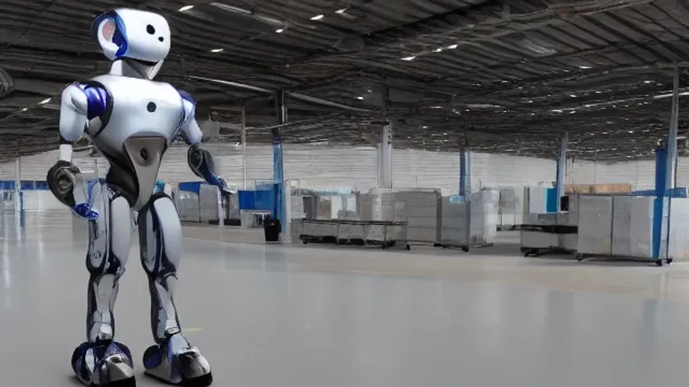
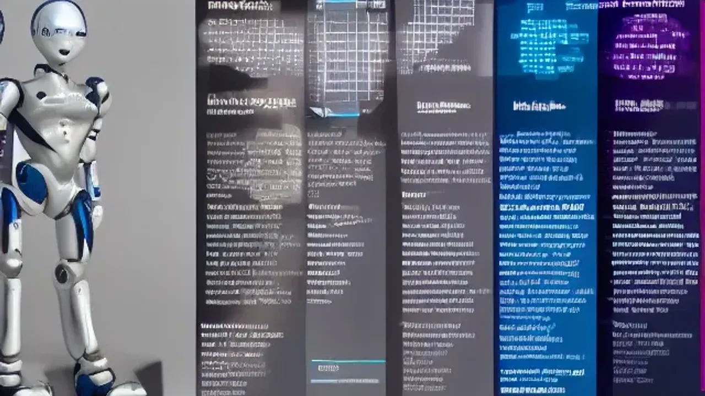

최근 AI 생태계의 중심축이 소프트웨어에서 하드웨어로 급격히 이동하면서 **피지컬 AI** 기술이 시장의 판도를 완전히 바꾸고 있습니다. 화면 속 텍스트나 가상 공간에만 머물던 인공지능이 실제 물리적 신체를 얻고 인간의 일상과 산업 현장으로 직접 걸어 들어오기 시작한 것입니다. 2026년 현재 가장 뜨거운 감자로 떠오른 이 기술이 우리의 삶을 어떻게 바꿀지 그 실체를 명확히 분석합니다.

## 화면 밖으로 나온 피지컬 AI, 왜 지금 열광하는가?

### 챗GPT와의 결별: 텍스트 봇에서 육체를 가진 로봇으로
기존 거대언어모델(LLM) 기반의 AI는 디지털 스크린 안에서 문장을 생성하거나 이미지를 그려내는 등 비물리적 영역에 갇혀 있었습니다. 반면 **피지컬 AI**는 현실 세계의 센서 데이터(시각, 촉각, 공간 인지)를 실시간으로 받아들이고, 자신의 물리적 관절과 모터를 제어해 능동적으로 행동합니다. 이는 단순히 명령에 답하는 인공지능을 넘어, 스스로 판단하고 물체를 움직이는 '행동하는 인공지능'의 등장을 의미합니다.

### 디지털 트윈 기술이 당겨온 피지컬 AI의 학습 속도 혁신
로봇이 현실에서 수만 번 넘어지며 걷기를 배우는 방식은 시간과 비용 소모가 극심했습니다. 빅테크 기업들은 현실 세계를 고스란히 복제한 시뮬레이션 공간, 즉 **디지털 트윈** 환경에서 AI 로봇을 초고속으로 가상 학습시키는 방식을 도입했습니다. 가상 공간에서 수억 번의 시행착오를 수 시간 만에 겪은 AI 두뇌를 실제 로봇 몸체에 그대로 다운로드하는 '심투리얼(Sim-to-Real)' 기술 덕분에 로봇의 진화 속도가 기하급수적으로 빨라졌습니다.

## 글로벌 빅테크의 현장 도입 사례와 현실적인 장단점

### 아마존 물류창고와 BMW 생산라인이 증명한 비용 절감 효과
물류 거인 아마존은 자사 물류센터에 휴머노이드 로봇 '디지(Digit)'를 대량 배치해 단순 반복적인 토트백 이동 업무를 자동화했습니다. BMW 역시 사우스캐롤라이나 공장의 조립 라인에 피지컬 AI 기반의 휴머노이드 로봇을 투입해 차체 부품을 정밀하게 잡아서 옮기는 공정을 성공적으로 수행 중입니다. 이처럼 정형화된 고반복 작업 환경에서 AI 로봇은 지치지 않는 연속 작업 능력을 보여주며 초기 투자 비용 대비 장기적인 운영 지출(OPEX)을 혁신적으로 절감하고 있습니다.

### 현장 도입의 걸림돌: 배터리 수명 문제와 고가의 초기 세팅 비용
장점만 존재하는 것은 아닙니다. 현재 기술 수준에서 대부분의 족형 휴머노이드 로봇은 한 번 충전으로 가동할 수 있는 시간이 2\~4시간 내외에 불과해 가동 효율이 떨어집니다. 게다가 대당 수천만 원에서 수억 원을 호가하는 로봇 몸체 가격과 공장 내 정밀 센서 인프라 구축 비용은 중소기업이 선뜻 피지컬 AI를 도입하기 어렵게 만드는 높은 장벽으로 작용합니다.

### 인간 근로자와의 협업 과정에서 발생한 뜻밖의 안전 이슈
로봇이 인간과 같은 공간에서 밀접하게 일하기 시작하면서 예기치 못한 안전사고 우려가 제기됩니다. 아무리 고성능 비전 센서를 탑재했더라도 현장의 돌발적인 인간 근로자의 움직임을 감지하는 반응 속도에 미세한 지연이 발생할 수 있습니다. 산업계에서는 로봇의 오작동이나 충돌 사고를 미연에 방지하기 위해 작업 구역을 물리적으로 분리하거나 엄격한 안전 펜스 프로토콜을 재정립하는 과제를 안고 있습니다.

## 내 업무 환경에 피지컬 AI 도입 시나리오 가이드

### 단계 1: 우리 비즈니스에서 '반복적 물리 행동' 영역 데이터화하기
피지컬 AI 솔루션을 현업에 적용하기 위한 첫걸음은 자동화가 필요한 물리적 업무를 철저히 분해하는 것입니다. 
- 택배 상자 분류, 정형화된 조리 과정, 매장 내 재고 진열 등 육체적 노동이 반복되는 구간을 선별합니다.
- 해당 작업을 수행할 때 필요한 물체의 크기, 무게, 이동 동선을 수치화하여 AI가 학습할 수 있는 기초 데이터 형태로 정리해야 합니다.

### 단계 2: 맞춤형 AI 로봇 구독 서비스(RaaS) 플랫폼 비교 및 선택 가이드
초기 도입 비용이 부담스럽다면 로봇을 직접 구매하는 대신 **RaaS(Robotics as a Service, 서비스형 로봇)** 모델을 적극 검토해야 합니다. 
> **RaaS 모델의 핵심 핵심 요소**
> 월 단위 구독료만 지불하면 하드웨어 렌탈부터 AI 소프트웨어 업데이트, 원격 유지보수까지 일괄 제공받을 수 있어 초기 자본 리스크를 최소화할 수 있습니다.

국내외 공급사들의 솔루션을 비교할 때 우리 작업장에 맞는 형태(바퀴형, 다관절 암 형태, 휴머노이드 형태)와 AI 제어 OS의 안정성을 기준으로 선택해야 후회가 없습니다.

[관련 글 보기](/posts/latest-tech/)

### 단계 3: 초기 인프라 매핑과 직원 대상 안전·협업 교육 프로토콜
선택한 로봇이 현장에 배치되면 로봇의 고성능 카메라와 라이다(LiDAR) 센서가 공간을 정확히 인지할 수 있도록 작업장 환경을 매핑하는 작업을 수행합니다. 동시에 현장 직원들에게 로봇의 비상 정지 버튼 위치, 협업 시 주의해야 할 사각지대, 돌발 상황 발생 시 대응 요령을 담은 안전 가이드를 철저히 교육하여 현장 혼란을 방지합니다.

## 테크 시장의 관점에서 본 피지컬 AI의 향후 전망

### 반도체에서 로보틱스로: AI 투자 자금이 이동하는 흐름 읽기
지난 수년간 글로벌 자본은 엔비디아를 필두로 한 AI 학습용 반도체와 클라우드 인프라에 집중되었습니다. 그러나 LLM 시장이 포화 상태에 이르면서 자금의 흐름이 현실 세계의 가치를 창출하는 로보틱스와 하드웨어 밸류체인으로 거세게 이동하고 있습니다. AI의 두뇌 개발이 어느 정도 궤도에 오른 만큼, 이제는 그 두뇌를 탑재할 '신체(Hardware)'를 쥐고 있는 기업들이 향후 테크 주도권을 쥘 가능성이 큽니다.

### 스마트 홈과 서비스업까지 확장될 '1인 1피지컬 AI' 시대의 타이밍
제조 공장에서 시작된 이 혁신은 머지않아 식당, 카페, 병원을 거쳐 일반 가정집까지 침투할 전망입니다. 고령화 사회로 인한 노동력 부족 문제를 해결하기 위해 돌봄 로봇, 청소 및 가사 보조 로봇의 형태로 피지컬 AI가 빠르게 보급되고 있습니다. 배터리 밀도 개선과 대량 생산에 따른 하드웨어 단가 하락이 맞물리는 향후 수년 내에 스마트폰처럼 누구나 개인용 AI 로봇을 소유하는 시대가 도래합니다.

### 독자분들이 주목해야 할 국내외 핵심 밸류체인 기업 리스트 분석
피지컬 AI 시장의 성장에 따라 수혜를 입을 핵심 기술 분야를 선제적으로 파악하는 행동이 필요합니다. 로봇의 눈 역할을 하는 3D 비전 센서 기업, 정밀한 움직임을 가능하게 만드는 핵심 부품인 감속기 및 액추에이터 제조업체, 그리고 이 모든 이종 하드웨어를 통합 제어하는 AI 로봇 운영체제(OS) 개발사들이 향후 글로벌 테크 시장에서 독보적인 존재감을 드러낼 주역들입니다.

#피지컬AI #휴머노이드 #로보틱스 #테크트렌드 #미래기술 #아마존로봇 #RaaS #인공지능로봇 #디지털트윈 #하드웨어혁신