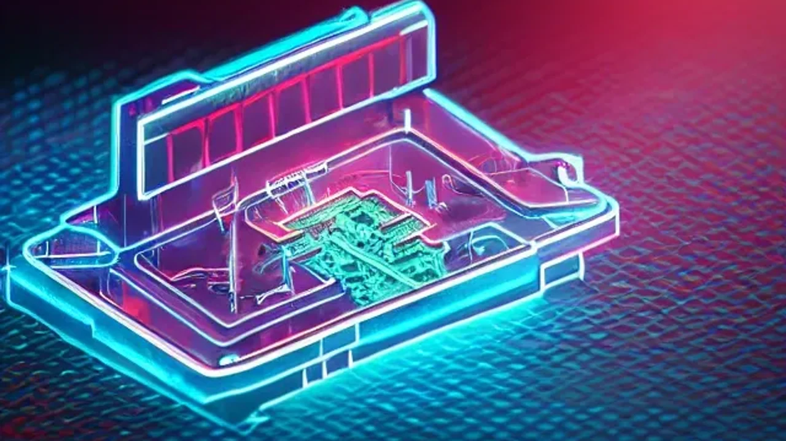
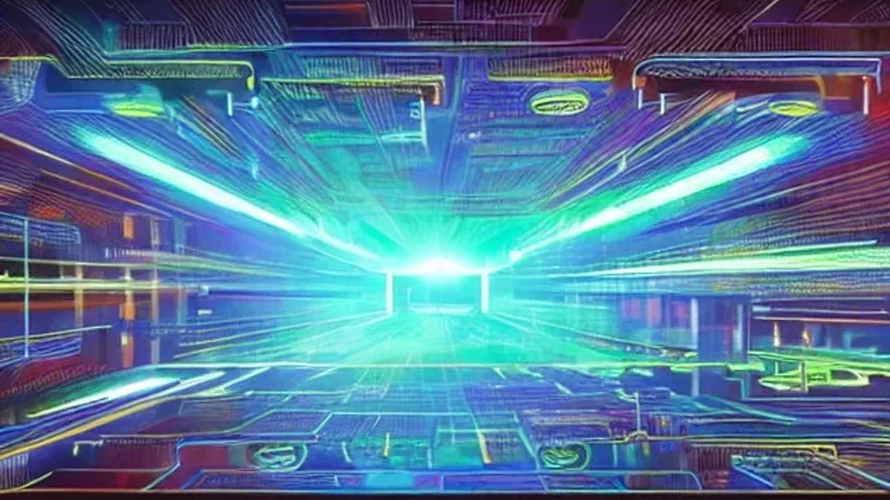

최근 양자 컴퓨팅 기술이 급격히 발전하면서 기존 금융 시스템의 근간을 흔드는 보안 위협이 현실로 다가왔습니다. 이에 따라 기존 암호 체계를 전면적으로 개편하는 **양자 암호 보안** 패러다임으로의 전환은 선택이 아닌 생존을 위한 필수 과제가 되었습니다. 2026년 현재 글로벌 테크 지형과 금융 인프라가 어떤 방식으로 이 거대한 변화에 대응하고 있는지 실질적인 전략을 공유합니다.

## Q-Day의 공포: 양자 컴퓨터가 금융 암호를 깨는 진짜 이유

### 기존 RSA 암호 체계 vs 양자 컴퓨터의 해독 메커니즘
우리가 현재 사용하는 인터넷 뱅킹, 전자상거래, 인증서의 99%는 RSA와 ECC(타원곡선암호) 알고리즘을 기반으로 작동합니다. 이 암호 체계는 '거대한 소인수분해'나 '이산로그' 문제를 푸는 데 슈퍼컴퓨터로도 수백 년이 걸린다는 수학적 복잡성에 의존합니다. 하지만 양자 컴퓨터의 '쇼어 알고리즘(Shor's Algorithm)'은 이 연산을 단 몇 초 만에 해결합니다. 큐비트(Qubit)의 중첩과 얽힘 현상을 이용해 모든 가능성을 동시에 계산하기 때문에 기존 암호 장벽이 순식간에 무력화됩니다.

### 금융권과 가상자산 시장이 먼저 비상에 걸린 숨은 배경
가장 무서운 시나리오는 '지금 저장하고 나중에 해독하기(Harvest Now, Decrypt Later)' 전략입니다. 적대적 해커 조직이나 일부 국가 기관들이 현재 해독할 수 없는 금융 거래 데이터와 국가 기밀을 미리 통째로 수집하고 있습니다. 고성능 양자 컴퓨터가 상용화되는 순간, 과거의 모든 금융 기록과 자산 데이터가 한 번에 열람될 수 있다는 뜻입니다. 특히 블록체인 기반 가상자산은 개인키가 노출되면 자산을 즉시 탈취당하므로 즉각적인 프로토콜 변경이 요구됩니다.

### 2026년 현재 가시화된 Q-Day 타임라인과 글로벌 리스크
보안 업계는 양자 컴퓨터가 기존 암호를 완전히 무력화하는 시점을 'Q-Day'로 명명했습니다. 당초 2030년 이후로 예상되었던 Q-Day는 1,000 큐비트 이상의 논리 큐비트 제어 기술이 확보되면서 그 시기가 극적으로 앞당겨졌습니다. 국제결제은행(BIS)은 최근 보고서를 통해 글로벌 금융 기관의 80% 이상이 3년 이내에 데이터 마이그레이션을 시작하지 않으면 자산 폭락과 시스템 마비라는 초유의 뱅크런 사태를 맞이할 수 있다고 경고했습니다.

## 양자 내성 암호(PQC)란 무엇인가? 장단점 완벽 비교

### 격자 기반 암호 등 PQC 핵심 알고리즘의 작동 원리
양자 내성 암호(Post-Quantum Cryptography, PQC)는 양자 컴퓨터의 강력한 연산 능력으로도 풀 수 없는 복잡한 수학적 구조를 도입한 새로운 암호 기술입니다. 대표적인 예가 '격자 기반 암호(Lattice-based Cryptography)'입니다. 이는 고차원 공간에서 수억 개의 격자 점들 사이의 최단 거리를 찾는 문제로, 양자 컴퓨터조차 폰노이만 구조의 한계에 부딪혀 계산이 불가능합니다. 미국 국립표준기술연구소(NIST)는 이러한 격자 구조를 가진 크리스탈-키버(CRYSTALS-Kyber) 등을 표준 알고리즘으로 채택했습니다.

### PQC 도입 시 기대되는 강력한 보안 효과와 안정성
PQC의 가장 큰 매력은 별도의 고가 양자 하드웨어를 새로 구입할 필요가 없다는 점입니다. 현재 사용 중인 일반 서버와 PC, 스마트폰의 소프트웨어 및 펌웨어 업데이트만으로도 양자 컴퓨터의 공격을 막아낼 수 있습니다. 하드웨어 전면 교체 없이 소프트웨어 아키처 변경만으로 엔터프라이즈급 보안 시스템을 전 세계에 신속하게 배포할 수 있다는 원가 절감 효율성을 지닙니다.

### 기존 인프라 전환 비용과 시스템 오버헤드라는 현실적 단점
모든 기술이 그렇듯 단점도 명확합니다. PQC 알고리즘은 기존 RSA에 비해 암호키의 크기가 수십 배에서 수백 배까지 큽니다. 데이터 패킷이 커지기 때문에 네트워크 트래픽이 폭증하고, 암복호화 과정에서 CPU 연산 부담이 늘어납니다. 구형 IoT 기기나 저성능 금융 단말기에서는 시스템 과부하로 인해 통신 지연이 발생하거나 아예 작동하지 않는 호환성 문제가 단점으로 지적됩니다.

[관련 글 보기](/posts/latest-tech/)

## 글로벌 빅테크와 각국 정부의 양자 암호 전환 가이드라인

### 미국 NIST 표준 가이드로 보는 엔터프라이즈 보안 마이그레이션 단계
미국 NIST는 공공기관과 핵심 인프라 기업들을 대상으로 3단계 보안 마이그레이션 로드맵을 제시했습니다. 1단계는 조직 내에서 어떤 데이터가 RSA 기반으로 암호화되어 있는지 전수 조사하는 '자산 발견(Discovery)'입니다. 2단계는 시스템 마비를 방지하기 위해 기존 암호와 PQC를 동시에 적용하는 '하이브리드 운영'입니다. 최종 3단계는 완전히 검증된 PQC 단독 아키텍처로 완전히 전환하는 것입니다.

### 국내외 주요 은행 및 금융 기관의 양자 내성 암호 도입 사례
이미 체계적인 움직임이 포착되고 있습니다. 미국 JP모건 체이스는 통신망 전체에 PQC 아키텍처를 시범 적용하여 실시간 대량 송금 테스트를 마쳤습니다. 국내 제1금융권 은행들 역시 모바일 뱅킹 앱의 로그인 및 인증 섹션에 격자 기반 암호 모듈을 탑재하기 시작했습니다. 자산의 안전성을 대외적으로 증명하는 것이 곧 은행의 신뢰도와 직결되기 때문입니다.

> **글로벌 금융 보안 기관 관계자 제언**
> "지금 인프라를 바꾸지 않는 기업은 3년 뒤 양자 컴퓨터가 상용화되었을 때 고객의 자산을 단 1초도 방어할 수 없을 것입니다. 보안 마이그레이션은 점진적으로 진행해야 하므로 당장 시작해야 합니다."

### 일반 기업이 지금 당장 시작해야 할 시스템 취약점 점검 프로토콜
대기업이 아니더라도 자체 회원 데이터나 결제 시스템을 운영하는 기업이라면 보안 프로토콜을 점검해야 합니다. 현재 활용 중인 오픈소스 라이브러리와 외부 API 연동 구간 중 RSA 2048 비트 이하의 취약한 암호화 방식을 사용하는 곳이 있는지 파악하는 것이 급선무입니다. 최신 TLS 1.3 표준을 준수하고 있는지 확인하고, 향후 공급업체가 PQC 패치를 제공하는지 계약 조건을 검토해야 안전합니다.

## 내 자산은 안전할까? 개인이 대비하는 양자 암호 보안 수칙

### 하드웨어 월렛과 2차 인증(MFA) 고도화로 해킹 차단하기
개인 투자자라면 가상자산이나 주권 자산을 거래소에만 방치하는 행위는 위험합니다. 펌웨어 업데이트가 지속적으로 지원되는 메이저 브랜드의 하드웨어 월렛(Cold Wallet)을 활용하는 것이 바람직합니다. 더불어 일반 비밀번호 로그인 방식을 버리고, 생체 인증(FIDO2)이나 하드웨어 보안키(YubiKey) 기반의 다중 요소 인증(MFA)을 전면 도입하여 계정 탈취 리스크를 원천 봉쇄해야 합니다.

### 서비스 이용 시 양자 보안 적용 여부를 확인해야 하는 진짜 이유
향후 은행, 증권사, 가상자산 거래소를 선택할 때 '양자 내성 보안 알고리즘 적용' 여부가 핵심 기준이 되어야 합니다. 보안 투자를 게을리하는 플랫폼은 순식간에 해커들의 타겟이 되어 뱅크런나 자산 동결 사태를 겪을 확률이 높습니다. 가입한 금융 서비스의 공지사항과 보안 가이드라인을 수시로 체크하여 선제적으로 대응하는 플랫폼으로 자산을 이동시키는 자산 배분 전략이 유효합니다.

### 보안 패러다임 전환기 피싱 및 사회공학적 금융 사기 대처법
기술 격변기에는 항상 "양자 컴퓨터 해킹 대비 보안 업데이트"를 사칭하는 신종 피싱 메일과 스미싱 문자가 기승을 부립니다. 특정 링크를 눌러 인증서를 갱신하라거나 개인키를 입력하라는 요구는 100% 사기입니다. 금융 기관은 절대로 이메일이나 문자로 개인의 민감한 보안 정보를 요구하지 않는다는 사실을 명심하고, 반드시 공식 앱이나 웹사이트를 통해서만 보안 설정을 변경해야 자산을 지킬 수 있습니다.

**함께 읽으면 좋은 글**
- [2026년 바뀌는 AI 동료와 진짜 일 잘하는 법 완전 정리](/posts/latest-tech/silicon-workforce-process-redesign/)
- [챗봇의 시대는 끝났다, 2026년 자율형 AI 에이전트가 바꾸는 일상](/posts/latest-tech/ai-agent-autonomous-2026/)

#양자암호보안 #QDay #양자내성암호 #금융보안 #PQC #보안마이그레이션 #가상자산보안 #디지털자산보호 #사이버보안트렌드 #미래테크