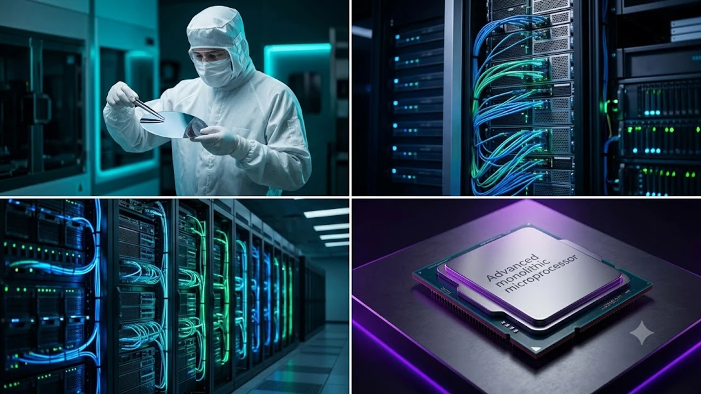

글로벌 반도체 파운드리 시장의 기술 경쟁이 2나노 단계를 넘어 초미세 공정의 최종 승부처로 직행하고 있습니다. 글로벌 1위 파운드리 기업 TSMC가 차세대 1.6나노급 공정인 'A16' 개발 검증을 완료하고 조기 양산 로드맵을 확정하면서 빅테크 업계의 판도가 요동치고 있습니다. 이번 **TSMC 1.6나노** 공정 조기 투입은 AI 반도체 칩셋의 물리적 한계를 정면 돌파하고 차세대 가속기 시장의 주도권을 굳히기 위한 결정적인 한 수가 될 전망입니다.

## TSMC 1.6나노(A16) 공정 조기 양산 전격 선언

### A16 공정 검증 완료 배경과 2026년 양산 로드맵
TSMC는 당초 2026년 하반기 시험 생산 후 2027년 양산을 계획했던 1.6나노(A16) 공정의 신뢰성 검증을 최근 성공적으로 마쳤습니다. 대만 타이난 팹 라인에서 진행된 수율 테스트 결과가 내부 기준치를 조기에 충족하면서, 올해 4분기 파일럿 라인 가동과 함께 2026년 말부터 대량 양산 체제로 전환한다는 방침을 확정했습니다.

### 기존 2나노(N2) 공정과의 핵심 차이점과 일정 단축 이유
2나노(N2) 공정이 나노시트 기반의 게이트올어라운드(GAA) 트랜지스터 도입에 집중했다면, A16은 전력 공급 체계 자체를 완전히 뜯어고친 구조입니다. N2 공정 대비 동일 전력에서 연산 속도가 8~10% 향상되고, 동일 속도 기준 전력 소모는 15~20% 줄어듭니다. 칩 밀도 역시 최대 1.10배 증가하여 한정된 다이 면적에 더 많은 연산 유닛을 집적할 수 있습니다. 

- **공정 성숙 속도**: N2 공정의 안정적인 수율 확보가 A16 라인업 가속화의 탄탄한 발판 마련
- **고객사 요구**: 거대언어모델(LLM) 학습·추론 비용을 낮추기 위한 초고효율 칩 수요 폭증

## A16 공정의 핵심 기술: 후면 전력 공급망(BSPDN)의 파급력

### Super Power Rail(SPR) 구조가 가져온 전력 효율 혁신
A16 공정의 핵심은 'Super Power Rail(SPR)'로 불리는 후면 전력 공급(BSPDN) 기술입니다. 기존 반도체는 웨이퍼 앞면에 신호선과 전력선을 함께 배치해 전력 손실과 전압 강하(IR Drop) 현상이 빈번했습니다. 

> **핵심 기술 원리**: 웨이퍼 뒷면으로 전력선을 완전히 분리 배치함으로써 전압 강하를 대폭 줄이고 신호 배선 공간을 획기적으로 확보합니다.

이 기술을 통해 신호 배선의 복잡도가 줄어들며 칩 내부의 전력 효율이 극대화되고 발열 억제 능력이 눈에 띄게 좋아집니다.

### 고발열·고집적 차세대 AI 가속기 칩셋 성능의 비약적 도약
복잡한 연산을 쉼 없이 처리하는 차세대 AI 가속기는 고열로 인한 스로틀링 현상이 고질적인 골칫거리였습니다. A16 공정을 적용하면 배선 저항이 획기적으로 줄어들어 전원 공급이 안정화되고 최대 동작 클록을 안정적으로 유지할 수 있습니다. 데이터센터 서버 랙 단위에서 전력 인입 효율을 끌어올려 데이터센터 PUE(전력효율지수) 개선에도 직결됩니다.

## 글로벌 파운드리 경쟁 구도와 빅테크 수주 전망

### 애플·엔비디아의 차세대 칩셋 조기 도입 시나리오
애플과 엔비디아는 이미 TSMC A16 공정의 초기 생산 물량(Capa)을 확보하기 위해 치열한 물밑 협상을 벌이고 있습니다. 애플은 차세대 M시리즈 및 A시리즈 칩셋에 A16 적용을 검토 중이며, 엔비디아 역시 차세대 초거대 AI 가속기 아키텍처에 해당 공정을 채택해 전력 대 성능비를 극대화할 계획입니다. [2026 소버린 AI 완전 정리: 왜 지금 진짜 바뀔까](/posts/latest-tech/sovereign-ai-data-sovereignty-2026/) 흐름에서 확인되듯 각국의 독자 인프라 구축 수요가 급증하는 만큼, 최고 성능 칩을 선점하려는 빅테크의 속도전은 한층 격화되고 있습니다.

### 삼성전자 및 인텔 파운드리와의 초미세 공정 격차 분석
삼성전자는 SF2P 공정에 BSPDN 기술을 적용해 반격을 꾀하고 있으며, 인텔은 18A 공정의 파워비아(PowerVia) 기술을 앞세워 고객사 확보에 총력을 기울이고 있습니다. 

| 기업명 | 핵심 공정 | 전력 공급 기술 | 양산 목표 시점 |
| :--- | :--- | :--- | :--- |
| **TSMC** | A16 (1.6나노) | Super Power Rail (SPR) | 2026년 4분기 조기 양산 |
| **삼성전자** | SF2P / SF1.4 | Backside Power Delivery | 2027년 상반기 |
| **인텔** | 18A (1.8나노급) | PowerVia | 2026년 하반기 본격 전개 |

초미세 공정 시장은 단순한 물리적 선폭 줄이기 경쟁을 넘어, 후면 배선 기술의 수율 안정화와 양산 속도 싸움으로 전환되었습니다.

## 1.6나노 도입이 AI 하드웨어 생태계에 미칠 실질적 영향

### 차세대 데이터센터 전력 소비 절감과 인프라 TCO 개선
초거대 AI 모델의 추론 비용에서 가장 무거운 비중을 차지하는 항목은 전기 요금과 냉각 인프라 운영비입니다. A16 공정 칩셋을 데이터센터에 전면 배치할 경우 서버 랙당 전력 소모를 15% 이상 줄일 수 있어 총소유비용(TCO) 절감 효과가 뚜렷합니다. 인프라 운영사 입장에서는 동일한 전력 한도 안에서 훨씬 높은 연산 처리량을 뽑아낼 수 있습니다.

### 2026년 하반기 반도체 공급망 재편 및 시장 투자 관전 포인트
TSMC의 A16 조기 양산은 파운드리 장비 및 첨단 패키징 생태계 전반의 지형을 흔들어 놓습니다. 후면 전력 공급 공정을 완성하려면 극자외선(EUV) 노광 장비뿐만 아니라 초정밀 웨이퍼 본딩 및 화학적 기계적 연마(CMP) 장비 수요가 폭발적으로 늘어납니다. 고성능 AI 반도체 밸류체인에 속한 핵심 장비·소재 공급망 기업들의 실적 재평가가 가속화될 전망입니다.

[최신 AI 하드웨어 장비 쿠팡에서 보기](https://www.coupang.com/np/search?q=%EC%8A%A4%EB%A7%88%ED%8A%B8%EA%B8%B0%EA%B8%B0%20AI%EA%B8%B0%EA%B8%B0&sourceType=affiliate&trackingCode=AF8691300)

#TSMC #1점6나노 #A16공정 #파운드리 #후면전력공급 #BSPDN #반도체공정 #AI가속기 #엔비디아