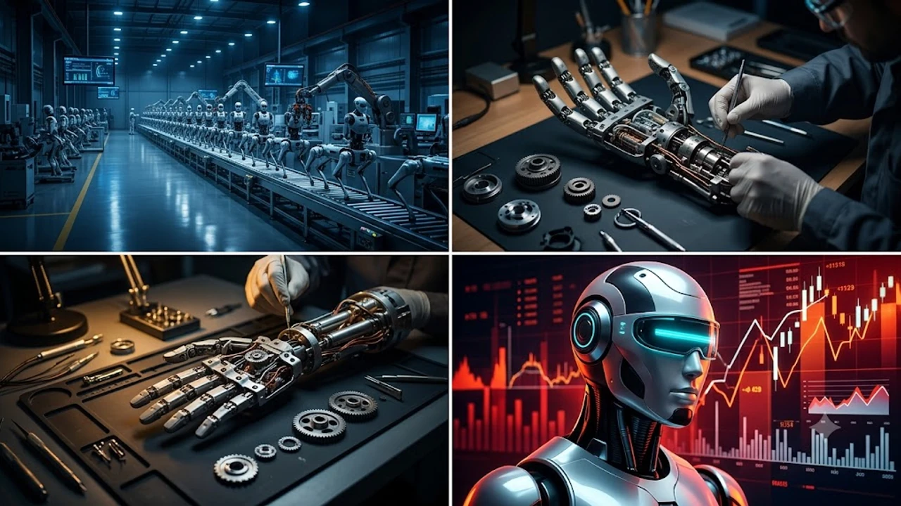

유니트리 상하이 커촹반 입성과 2026 세계로봇콘퍼런스(WRC 2026) 개막이 맞물리며 **유니트리 상장** 이슈가 글로벌 테크 시장의 최대 화두로 부상했습니다. 기록적인 출하량 증가와 휴머노이드 로봇 상용화 열풍 속에서도, 실제 제조 라인 투입에 따른 수익성 검증 논쟁은 한층 격화되는 추세입니다. 양산 체제 돌입이라는 성과 이면에 숨겨진 원가 구조와 현장 생산성의 실체를 면밀히 짚어볼 때입니다.

## 유니트리 상장과 휴머노이드 양산 경쟁의 서막

### 커촹반 상장 첫날 시총 폭등과 시장의 기대치
유니트리(Unitree)는 상하이 커촹반(STAR Market) 입성 첫날 공모가를 훌쩍 뛰어넘는 폭발적 매수세를 끌어냈습니다. 사족보행 로봇 분야에서 입증한 대량 양산 능력이 이족보행 휴머노이드 시장에서도 재현될 것이라는 기대감이 주가를 견인했습니다. 증시에 유입된 대규모 기관 자금은 단순 하드웨어 제조사를 넘어 차세대 피지컬 AI(Physical AI) 플랫폼으로 도약할 가능성에 베팅한 셈입니다.

### WRC 2026에서 입증된 4만 대 양산 체제와 단가 인하
WRC 2026 현장에서 유니트리는 연간 4만 대 규모의 조립 설비와 신형 휴머노이드 G1의 구동력을 과시했습니다. 기기당 1만 6,000달러(약 2,200만 원) 선까지 단가를 낮추며 연구실을 벗어나 일반 공장 테스트베드 진입 장벽을 완전히 허물었습니다.

- **자체 액추에이터 생산**: 모터와 감속기 직접 설계로 조달 원가 절감
- **오픈소스 생태계 흡수**: 글로벌 로봇 개발자 풀을 플랫폼 안으로 유치
- **조립 공정 모듈화**: 오차 범위 축소와 납기 주기 대폭 단축

### 테슬라 옵티머스·보스턴 다이내믹스와의 기술 격차 비교
테슬라 옵티머스가 기가팩토리 자체 투입과 AI 칩셋 기반 통합 제어에 주력하고 보스턴 다이내믹스가 전동화 전환을 거쳐 고난도 산업 작업을 타깃하는 반면, 유니트리는 파격적인 가격과 빠른 양산 속도를 무기로 삼습니다. 정밀 토크 제어와 복합 관절 반응성에서는 플래그십 모델 대비 일부 타협이 따르지만, 보급형 생태계를 선점하겠다는 전략적 승부수가 돋보입니다. 초미세 반도체 공정이 하드웨어 시장의 판도를 뒤흔들듯, 차세대 연산 아키텍처의 혁신 흐름은 [TSMC 1.6나노 A16, 진짜 2나노 건너뛸까?](/posts/latest-tech/tsmc-16nm-a16-mass-production-2026/) 분석에서도 명확하게 드러납니다.

## 화려한 출하량 뒤에 숨은 적자 구조와 마진 압박

### 1분기 순이익 50% 급감의 진짜 원인 분석
외형적 성장세와 달리 상장 직전 분기 순이익은 전년 동기 대비 반토막 났습니다. 시장 점유율 확대를 위한 공격적인 저가 정책으로 매출총이익률(Gross Margin)이 훼손된 데다, 지능형 신경망 제어 연구 인력 확충에 따른 R&D 고정비가 급증했기 때문입니다.

> "로봇을 팔수록 대당 마진이 깎이는 구조에서는 출하량 기록 경신이 오히려 현금 흐름을 옥죄는 자가당착에 빠질 수 있다." — 테크 전문 금융 애널리스트 리포트

### 하드웨어 부품 내재화율과 원가 절감의 한계선
기본 관절 모듈은 내재화했으나, 고신뢰성이 요구되는 6축 힘/토크 센서와 정밀 유성 기어는 여전히 글로벌 서플라이어 의존도가 절대적입니다. 조립 물량이 늘어날수록 핵심 특수 부품 조달 비용이 마진 개선의 발목을 잡는 구조적 한계에 부딪히고 있습니다.

### 글로벌 공급망 병목 현상과 AS 유지보수 비용 리스크
수출 대수가 급증하면서 현지 기술진 파견, 파손 관절 모듈 항공 배송 등 사후 관리(A/S) 지출이 가파르게 상승했습니다. 국가별 공인 정비 거점이 턱없이 부족한 상태에서 밀어내기식 확장을 진행한 여파가 실적에 고스란히 반영되고 있습니다.

## 기업 현장 도입 시 체감하는 실제 ROI와 생산성

### 제조·물류 라인 투입 시 인건비 대체 효과 팩트체크
완성차 조립 라인과 대형 물류 허브 현장 검증 결과, 단순 반복 피킹 공정에서조차 휴머노이드의 작업 속도는 숙련공의 60~70% 수준에 머뭅니다. 작업자가 8시간 내내 처리하는 물량을 감당하려면 공정당 로봇 1.5~2대를 중복 배치해야 하는 병목이 생깁니다.

### 배터리 지속 시간과 작업 전환 속도가 부른 현실적 한계
- **실가동 한계**: 고하중 적재 작업 기준 완충 시 실작동 시간은 2시간 내외
- **충전 공백**: 핫스왑(배터리 탈부착) 인프라 부재 시 3교대 라인 투입 차질
- **센서 간섭**: 바닥 단차나 조도 변화 발생 시 재인식 딜레이 발생

### 초기 도입 비용 대비 유지관리비(TCO) 손익분기점 계산
기기 본체 가격이 2,000만 원 선이라도 공정 맞춤형 시스템 통합(SI), 안전 펜스 구축, 5.5G 산업용 통신망 연동 비용이 기기값의 2~3배를 웃돕니다. 연간 소모성 부품 교체와 감가상각을 반영한 총소유비용(TCO) 기준 손익분기점(BEP)은 최소 3.5년 이상 소요됩니다.

## 휴머노이드 로봇 테마주 투자자가 꼭 확인해야 할 체크포인트

### '출하 대수'보다 중요한 B2B 장기 계약 수주 잔고
단순 테스트용 실증 기기 납품 수량에 매몰되지 않고, 글로벌 엔터프라이즈와의 장기 서비스 수준 협약(SLA) 및 유지보수 연간 계약(AMC) 잔고를 확인해야 합니다. 하드웨어 일시불 판매에만 의존하는 모델은 재무 변동성을 통제하기 어렵습니다.

### 로봇 OS 및 파운데이션 모델 생태계 락인 여부
하드웨어 양산 능력을 넘어 엔드투엔드(E2E) 물리 AI 제어 소프트웨어 플랫폼을 독점할 수 있는지가 장기 기업가치를 가릅니다. 자체적인 로봇 파운데이션 모델과 클라우드 관제 생태계를 쥐지 못한 제조사는 장기적으로 박리다매형 위탁 생산업체로 전락할 위험이 큽니다.

### 차세대 실적 반등을 가를 3가지 핵심 트리거 지표
- **자율 작업 성공률(Success Rate)**: 물리적 사람 개입 없는 작업 완수율 99.5% 상회 여부
- **모듈 규격화 비율**: 현장에서 10분 내 핫플러그 교체 가능한 관절 모듈 적용률
- **구독형 소프트웨어 매출**: 기기 판매 후 분기별 발생하는 관제 솔루션 과금 비중

스마트 팩토리 자동화 라인과 현장 제어 인프라 구축에 쓰이는 핵심 장비 정보는 아래 링크에서 확인할 수 있습니다.
[산업용 스마트 로봇 제어 기기 쿠팡에서 보기](https://www.coupang.com/np/search?q=%EC%8A%A4%EB%A7%88%ED%8A%B8%EA%B8%B0%EA%B8%B0%20AI%EA%B8%B0%EA%B8%B0&sourceType=affiliate&trackingCode=AF8691300)

#유니트리상장 #휴머노이드로봇 #피지컬AI #WRC2026 #유니트리G1 #로봇관련주 #스마트팩토리 #로봇양산 #테슬라옵티머스 #하드웨어스타트업