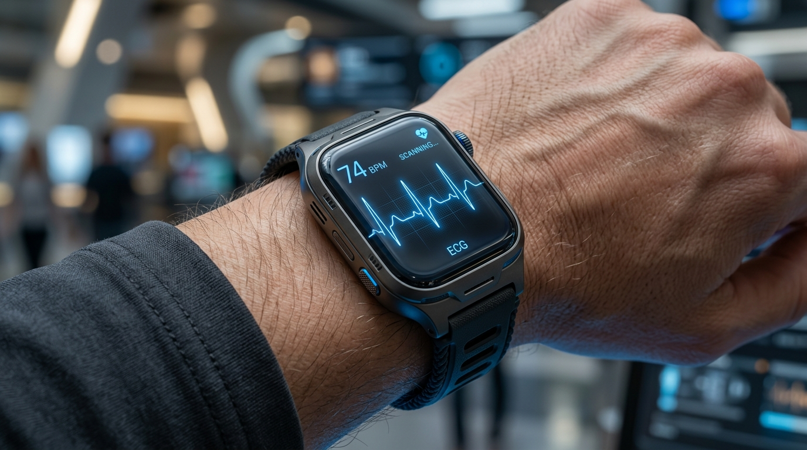
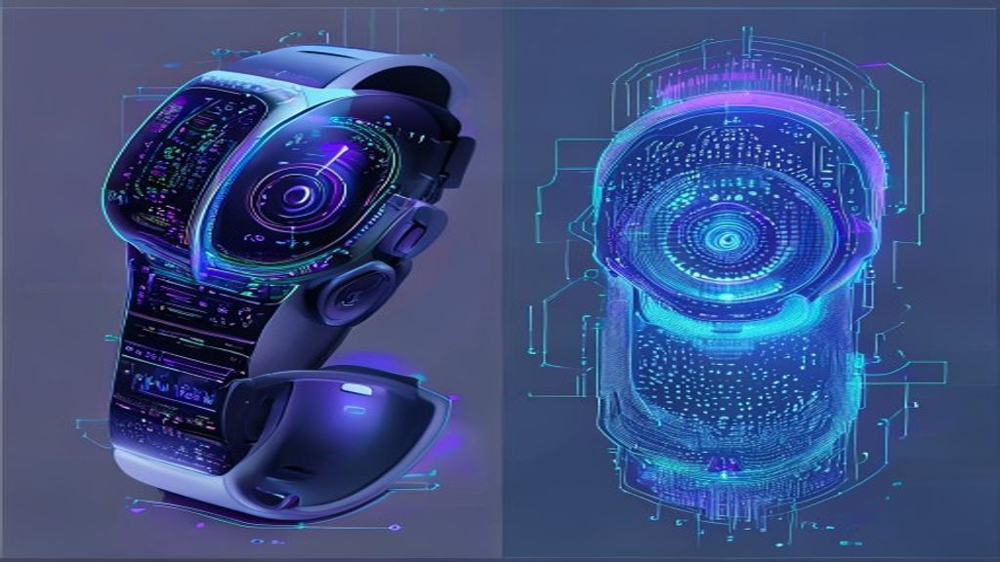

스마트워치를 손목에 차는 순간 사용자의 독특한 심장 박동 패턴을 감지해 자동으로 금융 결제까지 마치는 시대가 열렸습니다. 기존의 비밀번호나 지문 인식을 넘어선 웨어러블 생체인식 보안 기술은 이제 우리 일상 속 안전을 책임지는 핵심 축으로 자리 잡았습니다. 매번 번거롭게 화면을 터치하지 않아도 몸에 지니고 있는 것만으로 신원을 완벽하게 증명하는 이 기술의 진화 방향을 날카롭게 파헤쳐 봅니다.

## 지문 다음 단계로 진화하는 신체 신호

### 심전도 기반 인증의 독창적 가치

사람마다 손가락 지문이 다르듯, 심장이 뛰는 고유한 파형인 심전도 역시 완벽하게 독립적인 형태를 지닙니다. 스마트워치 뒷면에 닿는 센서가 미세한 전기 신호를 읽어내어 사용자를 식별하는 방식입니다. 사진이나 위조 지문으로 뚫리기 쉬운 기존 시스템과 달리, 살아 있는 사람의 활성화된 생체 신호만을 수집하므로 보안 등급이 비약적으로 상승합니다. 실제로 물이 묻거나 장갑을 낀 상태에서도 손목에 기기를 차고만 있으면 즉시 인증이 풀려 무척 편리합니다.

### 혈류 분석 센서의 놀라운 정확도

피부 아래 흐르는 혈관의 분포와 혈류량의 변화를 적외선 센서로 추적하는 기술도 주목받고 있습니다. 개인마다 혈관 구조가 겉으로 드러나지 않는 미세한 미로처럼 얽혀 있기 때문에 복제 자체가 원천적으로 불가능에 가깝습니다. 손목의 미세한 움직임이나 체온 변화까지 실시간으로 함께 측정하므로 가짜 생체 정보를 감지하는 능력이 매우 탁월합니다.

## 시장을 주도하는 두 가지 핵심 기술 비교

### 연속성 인증과 단발성 인증의 차이

과거에는 스마트폰에 손가락을 대는 그 순간에만 신원을 확인하는 단발성 구조였습니다. 반면 스마트워치나 스마트반지를 활용한 방식은 기기를 착용하고 있는 내내 실시간으로 사용자를 검증하는 연속성 인증을 자랑합니다. 운전을 하거나 업무를 보는 도중에도 기기가 알아서 주인을 인증하므로, 금융 앱을 켤 때마다 다시 로그인해야 하는 번거로움이 완전히 사라집니다.

### 센서 소형화가 가져온 하드웨어 혁신

아무리 뛰어난 기술이라도 무겁고 거대하다면 일상에서 쓰기 어렵습니다. 최근 등장한 초소형 바이오 센서들은 쌀알 크기보다 작아지면서도 측정 오차율을 획기적으로 낮췄습니다. 스마트반지 내부에 탑재되어 손가락 마디의 미세혈관을 감지하거나, 무선 이어폰에 들어가 귀 내부의 이도 구조를 소리로 분석하는 등 기기 형태의 한계를 시원하게 깨뜨렸습니다.

## 보안 업계가 직면한 현실적인 걸림돌

### 신체 컨디션 변화에 따른 오작동 우려

인간의 생체 신호는 고정되어 있지 않고 주변 환경이나 건강 상태에 영향을 받습니다. 격렬한 운동 직후나 극심한 스트레스 상황에서 혈압이 일시적으로 크게 변하면 시스템이 주인을 알아보지 못하는 현상이 발생하기도 합니다. 이러한 오인식률을 낮추기 위해 인공지능이 사용자의 평소 생활 패턴을 학습하여 유연하게 대처하는 고도화 작업이 한창 진행 중입니다.

### 민감한 개인 정보의 유출 리스크

내 몸의 고유한 신호가 외부 서버에 그대로 저장된다면 해킹당했을 때 돌이킬 수 없는 피해를 입게 됩니다. 비밀번호는 털리면 바꾸면 그만이지만, 심장 박동 패턴이나 혈관 구조는 평생 변경할 수 없기 때문입니다. 기기 내부의 독립된 보안 영역에서만 데이터를 암호화하여 처리하고 외부 유출을 원천 차단하는 온디바이스 보안 아키텍처가 필수로 요구되는 이유입니다.

## 일상을 완전히 바꾸는 미래 시나리오

### 금융과 모빌리티의 경계가 무너지는 순간

완벽한 보안을 갖춘 웨어러블 기기는 단순히 문을 열거나 결제하는 수준을 뛰어넘습니다. 손목에 스마트워치를 찬 채로 공유 차량의 운전대를 잡으면 문이 자동으로 열리고 개인 맞춤형 시트 조절까지 한 번에 완료됩니다. 상가나 마트에서 지갑이나 스마트폰을 꺼낼 필요도 없이, 진열대 상품을 들고 나오기만 해도 결제가 즉시 이뤄지는 진정한 비접촉 라이프가 완성됩니다.

### 차세대 기기로 이어지는 기술의 흐름

컴퓨팅 환경의 변화에 맞춰 보안 체계도 한 단계 더 진화하고 있습니다. 가상 현실 기기나 스마트 글래스를 착용했을 때 사용자의 눈동자 움직임과 홍채를 실시간으로 분석하는 기술이 대표적입니다. 메타버스 공간 안에서의 안전한 경제 활동을 위한 필수 요건으로 꼽히며, [엣지 AI 칩의 발전 방향](/posts/latest-tech/edge-ai-chip-future-2026/)과도 깊은 연관성을 맺고 있습니다. 기기가 고도화될수록 보안은 더 가볍고 강력해집니다.

**함께 읽으면 좋은 글**
- [AI데이터센터 전력 600배 폭증? 바뀌는 3가지](/posts/latest-tech/ai-datacenter-power-surge-2026/)
- [AI 비용 진짜 줄이는 2026 인프라 핵심만](/posts/latest-tech/inference-economics-hybrid-ai-infrastructure/)

#웨어러블생체인식보안 #스마트워치인증 #심전도보안 #온디바이스보안 #미래기술 #바이오센서 #디지털보안