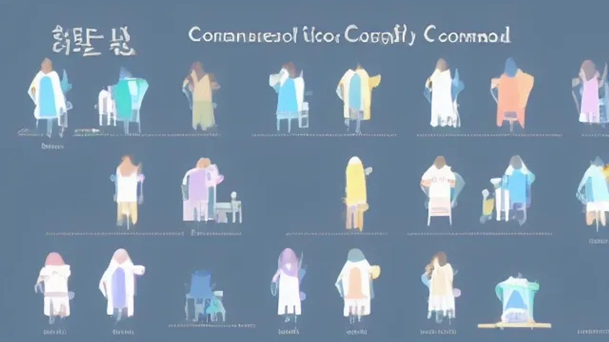

인공지능이 일상에 깊숙이 침투한 지금, 기술의 결과물을 최종 판단하고 제어하는 휴먼인더루프(Human-in-the-loop, HITL) 방식이 생존을 위한 필수 역량으로 자리 잡았습니다. 단순한 자동화를 넘어 인간이 어떤 관점에서 AI의 결과물을 검수하고 수정하느냐에 따라 업무의 가치가 결정됩니다.

## 휴먼인더루프(HITL)란 무엇인가? (비교분석)

### AI 자동화와 인간 개입의 결정적 차이
AI 자동화는 입력 데이터에 대해 시스템이 사전에 학습된 로직으로 결과값을 즉시 도출합니다. 반면, 휴먼인더루프는 **기계의 판단이 반드시 인간의 검토를 거치는 구조**입니다. AI는 방대한 정보 처리에서 압도적이지만, 맥락 파악이나 윤리적 판단에서는 여전히 구멍을 보입니다. 인간이 개입하여 결과물을 교정할 때 비로소 AI의 신뢰도는 실전 투입 가능한 수준으로 올라갑니다.

### 왜 2026년 지금 가장 주목받는 기술인가
2026년 현재, 생성형 AI가 쏟아내는 콘텐츠는 인간이 감당할 범위를 넘어섰습니다. 기업들은 데이터 속 환각(Hallucination) 현상을 차단하고, 브랜드 고유의 결을 유지하기 위해 의도적으로 인간의 개입을 시스템 설계에 녹여냅니다. 기술 중심 사고에서 **인간의 판단력이 중심이 되는 가치 창출**로 패러다임이 완전히 뒤바뀌었습니다.

### AI 모델 성능을 결정하는 인간의 판단력
데이터를 라벨링하거나 AI의 출력값을 피드백하는 인간의 숙련도는 모델의 성능을 결정짓는 핵심 상수입니다. 단순히 AI가 내놓은 답을 수용하는 태도를 버리고, 결과물이 논리적으로 타당한지, 데이터 편향성은 없는지 식별하는 **비판적 사고**가 기계 학습의 완성도를 좌우합니다.
[관련 글 보기](/posts/society/)

## 휴먼인더루프 도입의 장단점 분석 (장단점)

### 작업 정확도를 극대화하는 인간의 피드백
AI가 90%의 업무를 처리하더라도 나머지 10%의 오류를 솎아내는 작업은 인간의 몫입니다. 법률 검토나 전문 의료 진단처럼 정밀도가 생명인 영역에서 인간의 개입은 **오류율을 0.1% 미만으로 억제하는 방어선** 역할을 수행합니다.

### 비용과 시간적 효율성 측면의 현실적 한계
휴먼인더루프는 분명 비용이 발생합니다. 전문가가 AI의 결과물을 일일이 검토하는 과정은 적지 않은 시간 자원을 소모합니다. 따라서 모든 프로세스에 적용하기보다, **치명적인 오류가 발생할 수 있는 핵심 경로**에 집중하는 선별적 전략이 실무의 정석입니다.

### 잘못된 데이터 학습이 초래하는 치명적 오류
인간 검수자가 틀린 판단 기준을 제공하거나 편향된 데이터를 입력할 경우, AI는 그 오류를 그대로 학습하여 재생산합니다. 시스템 전체를 오염시키는 결과를 낳으며, 오염된 모델을 복구하는 비용은 초기 구축보다 훨씬 큽니다.

## 실무에서 직접 활용하는 AI 협업 경험담 (경험담)

### 마케팅 자동화 과정에서의 인간 검수 루틴
광고 카피를 생성할 때 AI가 초안 5개를 만들면, 그중 브랜드 가이드라인과 고객 정서에 부합하는 하나를 인간이 골라냅니다. **'생성은 AI에게, 선택과 최적화는 인간이'**라는 단순한 분업 원칙이 업무 속도와 퀄리티를 동시에 잡아냈습니다. 

### AI와 협업하며 겪은 시행착오와 해결법
초기에는 AI가 작성한 글을 무비판적으로 게시했다가 사실관계 오류로 큰 대가를 치렀습니다. 이후로는 모든 AI 결과물에 **최소 두 가지 이상의 신뢰할 수 있는 소스를 대조하는 검증 필터**를 고정했습니다. AI를 똑똑하지만 가끔 거짓말을 섞는 '비서'로 다루는 것이 정답입니다.

### 나만의 효율적인 'AI-휴먼' 협업 프로세스 구축하기
> "기계에게는 지루한 반복을, 인간에게는 가치 있는 통찰을 맡겨라."

매일 아침 AI가 시장 동향 리포트를 만들면, 저는 그 안에서 현재 마케팅 전략에 바로 꽂아 넣을 **'한 방의 인사이트'**를 도출하는 것에만 에너지를 씁니다. 이런 분업은 업무 시간을 단축하면서도 결과의 밀도를 높이는 핵심 동력입니다.

## AI 시대에 살아남는 전문가가 되는 법 (튜토리얼)

### 나만의 고유한 도메인 지식 구축 전략
범용 지식은 AI가 모두 제공하는 시대입니다. 경쟁력은 특정 분야에 대한 **'현장의 맥락'**에서 나옵니다. 실무 현장에서 발생하는 수많은 변수를 직접 겪어본 경험이야말로 AI가 절대 모방할 수 없는 개인의 강력한 무기입니다.

### AI 결과물을 비판적으로 사고하는 훈련법
AI가 도출한 결론에 끊임없이 의심의 눈초리를 보내세요. 논리적 근거가 부족하거나 설명이 모호하다면 즉시 파고드십시오. 결과물을 '정답'이 아닌 '참조물'로 인식하는 순간, 당신의 **분석적 사고력**은 독보적인 위치에 올라섭니다.

### 미래 고용 시장에서 살아남는 휴먼인더루프 역량 키우기
기술의 변화 속도는 통제할 수 없지만, 기술을 다루는 태도는 선택할 수 있습니다. AI 도구들을 적극적으로 개인의 업무 루프에 강제 편입시키십시오. **기계와 협업하며 자신의 날카로운 판단력을 증명하는 과정** 자체가 미래 커리어의 가장 큰 자산이 될 것입니다.

**함께 읽으면 좋은 글**
- [무빈소 장례 진짜 확산, 장단점 비용 완전 정리](/posts/society/no-parlor-funeral-trend/)
- [813대책 결혼페널티 폐지 조건 진짜 바뀔까?](/posts/society/813-real-estate-marriage-penalty-2026/)

#휴먼인더루프 #AI협업 #업무효율화 #디지털역량 #비판적사고 #실무AI #커리어전략