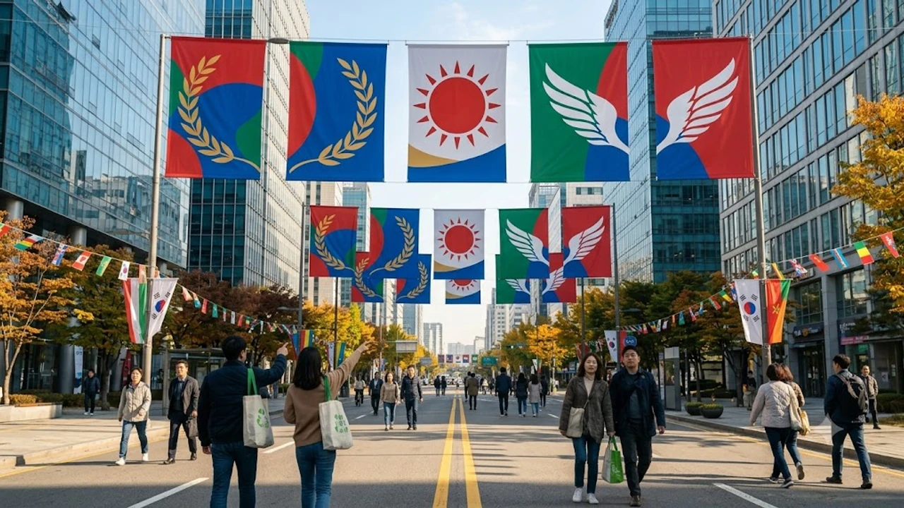

10월 1일 국군의 날이 임시공휴일로 최종 확정되면서 직장인과 자영업자 사이에서 희비가 엇갈리고 있다. 갑작스러운 빨간 날 지정으로 유급휴일 혜택을 챙기려는 근로자가 있는 반면, 대체공휴일 적용 여부와 당일 수당 계산법을 몰라 혼란을 겪는 이들도 적지 않다. 이번 국군의 날 임시공휴일 지정에 따른 핵심 권리와 필수 생활 정보, 놓치기 아까운 혜택을 빠짐없이 짚어본다.

## 국군의 날 임시공휴일 지정 배경과 적용 대상

### 10월 1일 국군의 날 지정 취지와 법적 근거
정부는 국가 안보의 핵심 주체인 국군의 사기를 진작하고, 내수 경제 활성화를 도모한다는 취지로 10월 1일을 '관공서의 공휴일에 관한 규정'에 따른 임시공휴일로 국무회의에서 의결했다. 단순한 군사 행사를 넘어 소비 진작 효과를 노린 결정이지만, 사업장 규모에 따라 체감하는 현실은 극명하게 갈린다.

### 근로기준법상 5인 이상 사업장 유급휴일 적용 기준
상시 근로자 5인 이상 사업장은 근로기준법 제55조 제2항에 따라 관공서 공휴일이 법정 유급휴일로 강제 적용된다. 
- 회사가 취업규칙이나 단체협약에 별도 공휴일 규정을 두지 않았더라도 법적 유급휴일 효력이 발생한다.
- 이날 출근하지 않고 쉬더라도 하루 치 통상임금(기본급)은 전액 보장된다.
- 연차휴가를 강제로 대체해 소진시키는 관행은 명백한 근로기준법 위반이다.

### 공무원·학교·어린이집 등 주요 공공·교육기관 운영 현황
관공서와 초·중·고등학교, 국공립 및 민간 어린이집은 원칙적으로 모두 문을 닫는다. 다만 맞벌이 부부의 돌봄 공백을 방지하기 위해 각 초등학교 돌봄교실과 어린이집 긴급보육 서비스는 사전 수요조사를 거쳐 정상 운영된다.

## 휴일근로수당 계산법과 미지급 시 대처법

### 통상임금 기준 1.5배 및 2배 가산수당 기준
> "빨간 날 일했으니 2.5배를 줘야 맞지 않나?"라며 혼동하기 쉽지만, 정확한 법정 계산법은 근로시간에 따라 명확히 나뉜다.

8시간 이내 근무는 기본 유급휴일 수당(100%) 외에 **근로시간 × 통상시급 × 1.5배**의 휴일근로수당이 지급된다. 만약 8시간을 초과해 연장근무를 했다면 초과분부터는 **2배(통상시급 × 200%)**가 가산된다. 즉, 하루 8시간을 꼬박 채워 일했다면 당일 일당은 통상임금의 2.5배가 되는 셈이다.

### 대체휴무(보상휴가제) 부여 조건 및 합의 절차
회사에서 수당 대신 대체휴무를 주겠다고 일방적으로 통보하는 것은 위법이다. 근로기준법 제57조에 따라 **근로자대표와의 서면 합의**가 필수적이며, 보상휴가를 줄 때도 1:1 대체가 아닌 **1.5배에 해당하는 유급휴가(8시간 근무 시 12시간 휴가)**를 부여해야 법적 효력이 발생한다.

### 5인 미만 사업장 및 특수고용·프리랜서 적용 제외 규정
솔직히 말하면 가장 뼈아픈 사각지대는 5인 미만 영세 사업장이다. 근로기준법상 공휴일 유급휴가 규정이 적용되지 않아 당일 일하더라도 1.5배 가산수당이 발생하지 않고 평일 기본 시급만 지급된다. 사회 구조적 불평등과 노동 현장의 현실을 다룬 [사회 전체 글 보기](/posts/society/)를 통해 사각지대 문제를 함께 짚어볼 필요가 있다.

## 병원·약국·은행 등 필수 생활 서비스 이용 안내

### 응급의료포털(E-Gen) 및 달빛어린이병원 당직 운영
대부분의 동네 병·의원은 휴진하지만, 대형병원 응급실과 지자체 지정 당직 의료기관은 24시간 정상 가동된다. 야간·휴일 소아 외래 진료가 가능한 전국 달빛어린이병원 역시 문을 열며, 방문 전 반드시 국립중앙의료원 응급의료포털(E-Gen) 웹사이트나 모바일 앱을 통해 진료 여부를 실시간 조회해야 헛걸음을 막을 수 있다.

### 은행 영업점 휴무와 비대면 금융 거래 수수료 면제 범위
시중은행 본점 및 모든 영업점 창구는 휴무에 들어간다. ATM 기기를 이용한 현금 입출금 및 계좌이체는 공휴일 수수료 기준이 적용되지만, 모바일 뱅킹과 인터넷 뱅킹을 통한 비대면 이체 서비스는 24시간 평소와 동일하게 무료로 이용할 수 있다.

### 관공서 무인민원발급기 및 정부24 온라인 민원 처리
주민센터와 구청 등 관공서 창구 업무는 중단되지만, 전국 지하철역과 대형 마트에 설치된 무인민원발급기는 정상 가동된다. 전자 주민등록등본, 가족관계증명서 등 필수 민원 서류는 정부24 모바일 앱을 통해 24시간 즉시 발급받아 전자문서지갑으로 저장할 수 있다.

## 10월 1일 당일 무료 개방 및 주요 생활 할인 혜택

### 국립고궁·자연휴양림 및 박물관 무료 입장 현황
문화재청과 산림청은 임시공휴일을 맞아 경복궁, 창덕궁, 덕수궁, 창경궁 등 4대 궁궐과 종묘, 조선왕릉을 전면 무료 개방한다. 국립현대미술관 및 국립중앙박물관 기획전시 역시 무료 관람이 가능하며, 전국 국립자연휴양림의 당일 입장료도 면제된다.

### 지자체 공영주차장 개방 및 고속도로 통행료 정책
서울시와 수도권 주요 지자체는 관할 공영주차장을 일제히 무료 개방해 주차난 해소에 나선다. 다만 한국도로공사가 관할하는 고속도로 통행료 면제 조치는 설·추석 명절과 달리 이번 국군의 날에는 적용되지 않으므로 일반 요금이 부과된다는 점을 주의해야 한다.

### 군 장병 및 동반 가족 전용 문화·식음료 제휴 프로모션
군 사기 진작이라는 지정 목적에 걸맞게 현역 병사 및 직업군인, 동반 직계가족을 위한 혜택이 집중된다. 주요 영화관(CGV·롯데시네마·메가박스)에서는 관람료 50% 할인 혜택을 제공하며, 테마파크(에버랜드·롯데월드) 무료 입장 및 호텔·외식 프랜차이즈의 특별 할인 프로모션이 당일 대대적으로 진행된다. 휴일 나들이나 실생활 필수품 준비가 필요하다면 [관련 생필품 쿠팡에서 보기](https://www.coupang.com/np/search?q=%EC%83%9D%ED%95%84%ED%92%88&sourceType=affiliate&trackingCode=AF8691300)를 통해 간편하게 살펴볼 수 있다.

#국군의날 #임시공휴일 #휴일근로수당 #대체휴무 #달빛어린이병원 #은행휴무 #임시공휴일혜택